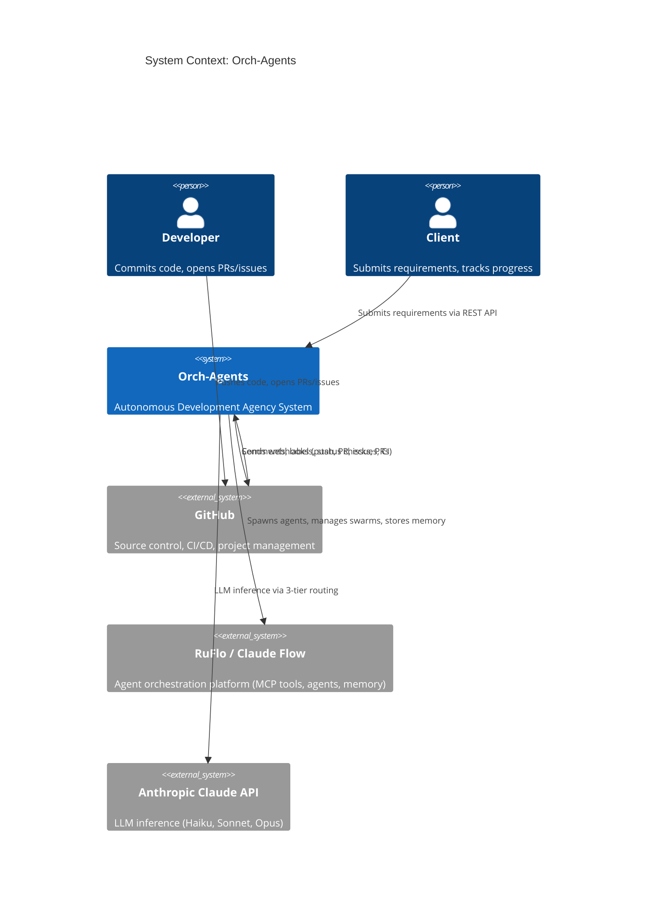
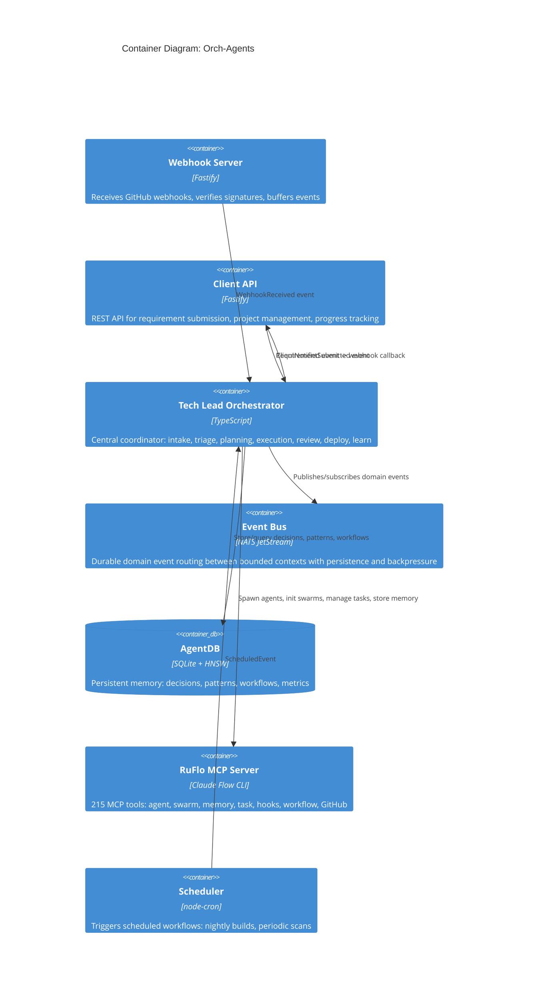
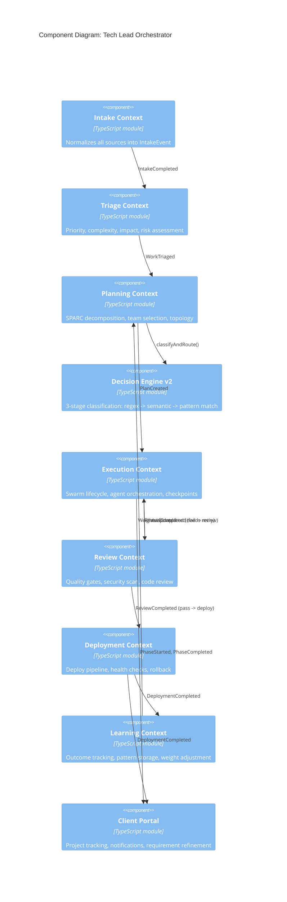

# Orch-Agents: Autonomous Development Agency System

## System Architecture Document

**Version:** 1.0.0
**Date:** 2026-03-09
**Status:** Proposed
**Authors:** System Architecture Designer
**Supersedes:** ADR-052 (incorporated and extended)

---

## Table of Contents

1. [Executive Summary](#1-executive-summary)
2. [System Overview and Goals](#2-system-overview-and-goals)
3. [Architecture Principles](#3-architecture-principles)
4. [Bounded Contexts and Domain Model](#4-bounded-contexts-and-domain-model)
5. [Component Architecture (C4)](#5-component-architecture-c4)
6. [Data Flow](#6-data-flow)
7. [Technology Stack](#7-technology-stack)
8. [API Design](#8-api-design)
9. [Directory Structure](#9-directory-structure)
10. [Integration Points (RuFlo/Claude Flow)](#10-integration-points)
11. [Non-Functional Requirements](#11-non-functional-requirements)
12. [Implementation Plan](#12-implementation-plan)
13. [Risk Register](#13-risk-register)
14. [Architecture Decision Records](#14-architecture-decision-records)

---

## 1. Executive Summary

Orch-Agents is an autonomous development agency system that transforms GitHub events and client requirements into completed software deliverables. It operates as a virtual development team led by a Tech Lead Agent (central orchestrator) that decomposes work using the SPARC methodology (Specification, Pseudocode, Architecture, Refinement, Completion), coordinates specialized agent swarms via RuFlo/Claude Flow, and manages the full software development lifecycle from intake through deployment.

The system is an **event-driven modular monolith** deployed as a single Node.js process. It comprises nine bounded contexts communicating through a NATS message bus (JetStream) with event-sourced state. It leverages RuFlo's 215 MCP tools, 60+ agent types, 7-layer governance control plane, and AgentDB memory system.

### Key Capabilities

- Receive and process GitHub webhooks (push, PR, issues, reviews, CI, releases)
- Accept client requirements via REST API with AI-powered refinement
- Decompose all work into SPARC phases with quality gates
- Spawn and coordinate specialized agent swarms per task
- Learn from outcomes and optimize routing over time
- Enforce governance, security, and quality policies autonomously

---

## 2. System Overview and Goals

### 2.1 Problem Statement

Development teams spend significant time on coordination overhead: triaging issues, assigning reviewers, managing CI failures, translating requirements into tasks, and ensuring quality gates. These activities are largely deterministic or semi-deterministic and can be automated by an intelligent orchestration layer.

### 2.2 Goals

| ID | Goal | Measure of Success |
|----|------|--------------------|
| G1 | Autonomous GitHub response | All webhook events processed within 30s of receipt |
| G2 | Client requirements intake | Requirements submitted via API reach SPARC Specification phase without manual intervention |
| G3 | SPARC lifecycle management | Every unit of work passes through appropriate SPARC phases with quality gates |
| G4 | Cost-optimized execution | 3-tier model routing keeps average cost per task below $0.05 |
| G5 | Learning feedback loop | Routing accuracy improves measurably over 100+ decisions |
| G6 | Production safety | No deployment without passing security scan, code review, and test suite |

### 2.3 Non-Goals

- Replacing human decision-making for architectural choices (humans remain in the loop for high-risk decisions)
- Serving as a general-purpose CI/CD platform (delegates to GitHub Actions)
- Multi-tenant SaaS deployment (single-tenant, single-organization scope)

---

## 3. Architecture Principles

| # | Principle | Rationale |
|---|-----------|-----------|
| AP-1 | **Event-sourced state** | Every state transition is a domain event. State is reconstructable from the event log. Enables audit, replay, and debugging. |
| AP-2 | **Bounded contexts with typed contracts** | Nine contexts communicate only through events on the internal bus. No cross-context direct imports. Prevents coupling. |
| AP-3 | **Multi-input, single pipeline** | GitHub webhooks, client API, scheduled events, and system alerts all normalize into a canonical `IntakeEvent` before entering the pipeline. |
| AP-4 | **SPARC-native phases** | All work decomposes into Specification, Pseudocode, Architecture, Refinement, Completion. Phases can be skipped when inapplicable. |
| AP-5 | **3-tier cost optimization** | Every agent task is routed to the cheapest capable model tier: WASM booster, Haiku, or Sonnet/Opus. |
| AP-6 | **Defense in depth** | GitHub webhook signature verification, input validation at boundaries, governance control plane enforcement, security scanning at review phase. |
| AP-7 | **Files under 500 lines** | Each source file stays under 500 lines. Bounded contexts enforce this naturally through decomposition. |
| AP-8 | **Fail-safe defaults** | On AgentDB unavailability, degrade to regex classification. On swarm exhaustion, queue work. On deploy failure, auto-rollback. |

---

## 4. Bounded Contexts and Domain Model

### 4.1 Context Map

```
+------------------------------------------------------------------+
|                        Orch-Agents System                         |
|                                                                   |
|  +-----------+  +----------+  +----------+  +-----------+        |
|  |  Webhook  |  |  Client  |  | Schedule |  |  System   |        |
|  |  Gateway  |  |  Intake  |  |  Trigger |  |  Monitor  |        |
|  +-----+-----+  +----+-----+  +----+-----+  +-----+-----+       |
|        |              |             |              |               |
|        +--------------+------+------+--------------+               |
|                              |                                    |
|                    +---------v---------+                          |
|                    |  Intake Context   |                          |
|                    +--------+----------+                          |
|                             |                                     |
|                    +--------v----------+                          |
|                    |  Triage Context   |                          |
|                    +--------+----------+                          |
|                             |                                     |
|                    +--------v----------+                          |
|                    | Planning Context  |                          |
|                    |  (SPARC Decomp)   |                          |
|                    +--------+----------+                          |
|                             |                                     |
|                    +--------v----------+                          |
|                    | Execution Context |                          |
|                    |  (Swarm Mgmt)     |                          |
|                    +--------+----------+                          |
|                             |                                     |
|                    +--------v----------+                          |
|                    |  Review Context   |                          |
|                    +--------+----------+                          |
|                             |                                     |
|                    +--------v----------+                          |
|                    | Deployment Ctxt   |                          |
|                    +--------+----------+                          |
|                             |                                     |
|  +-----------+     +--------v----------+     +------------+      |
|  |  Client   |<----|  Learning Context |     |  AgentDB   |      |
|  |  Portal   |     +-------------------+     |  Memory    |      |
|  +-----------+                               +------------+      |
+------------------------------------------------------------------+
```

### 4.2 Bounded Context Responsibilities

| # | Context | Responsibility | Owns |
|---|---------|---------------|------|
| 1 | **Webhook Gateway** | Receive, verify, and buffer GitHub webhook events | Webhook verification secrets, event buffer |
| 2 | **Client Intake** | Accept client requirements, refine via AI, manage client projects | Client profiles, requirements, projects |
| 3 | **Intake** | Normalize all input sources into canonical `IntakeEvent` | Event normalization rules, source adapters |
| 4 | **Triage** | Assess urgency, priority, complexity, impact, risk | Priority rules, SLA definitions |
| 5 | **Planning** | Decompose into SPARC phases, select methodology, compose teams | Templates, phase sequences, methodology rules |
| 6 | **Execution** | Orchestrate agent swarms, manage phase transitions, checkpoints | Swarm state, agent assignments, phase artifacts |
| 7 | **Review** | Quality gates: code review, security scan, test coverage | Quality policies, review verdicts |
| 8 | **Deployment** | Staging, production deployment, rollback | Deployment state, health check results |
| 9 | **Learning** | Track outcomes, update routing weights, store patterns | Decision records, pattern weights, metrics |

### 4.3 Domain Model

#### Core Aggregates

```
+-------------------+       +-------------------+       +-------------------+
|  ClientProject    |       |    Requirement    |       |    WorkItem       |
+-------------------+       +-------------------+       +-------------------+
| id: UUID          |1    * | id: UUID          |1    1 | id: UUID          |
| clientId: string  |------>| projectId: UUID   |------>| requirementId?    |
| name: string      |       | title: string     |       | githubEventId?    |
| status: enum      |       | description: text |       | source: enum      |
| createdAt: Date   |       | priority: enum    |       | intent: string    |
| config: Config    |       | status: enum      |       | priority: enum    |
+-------------------+       | refinementLog: [] |       | status: enum      |
                             | sparcPhase: enum  |       | sparcPhase: enum  |
                             +-------------------+       | workflowPlanId    |
                                                         +-------------------+
                                                                |
                                                         +------v------------+
                                                         |  WorkflowPlan     |
                                                         +-------------------+
                                                         | id: UUID          |
                                                         | workItemId: UUID  |
                                                         | methodology: enum |
                                                         | template: string  |
                                                         | topology: enum    |
                                                         | phases: Phase[]   |
                                                         | agentTeam: Agent[]|
                                                         | status: enum      |
                                                         +-------------------+
                                                                |
                                                         +------v------------+
                                                         |  Phase            |
                                                         +-------------------+
                                                         | id: UUID          |
                                                         | planId: UUID      |
                                                         | type: SPARCPhase  |
                                                         | status: enum      |
                                                         | agents: string[]  |
                                                         | artifacts: []     |
                                                         | startedAt?: Date  |
                                                         | completedAt?: Date|
                                                         | verdict?: Verdict |
                                                         +-------------------+
```

#### Value Objects

| Value Object | Fields | Used By |
|-------------|--------|---------|
| `IntakeEvent` | id, timestamp, source, sourceMetadata, intent, entities, rawText | Intake, Triage |
| `TriageResult` | priority, complexity, impact, risk, recommendedPhases, requiresApproval | Triage, Planning |
| `ReviewVerdict` | status (pass/fail/conditional), findings[], securityScore, coveragePercent | Review, Execution |
| `DeploymentResult` | status, environment, healthChecks[], rollbackTriggered | Deployment, Learning |
| `DecisionRecord` | id, inputSignature, classification, templateSelected, agentTeam, outcome, duration | Learning |
| `ClientConfig` | notificationUrl, preferredMethodology, qualityThresholds, repos[] | Client Intake |
| `SPARCPhase` | enum: specification, pseudocode, architecture, refinement, completion | Planning, Execution |

#### Domain Events

| Event | Producer | Consumer(s) | Payload |
|-------|----------|-------------|---------|
| `WebhookReceived` | Webhook Gateway | Intake | raw GitHub payload, event type, delivery ID |
| `RequirementSubmitted` | Client Intake | Intake | requirement details, client config |
| `RequirementRefined` | Client Intake | Client Portal | refined requirement, clarification Q&A |
| `IntakeCompleted` | Intake | Triage | canonical IntakeEvent |
| `WorkTriaged` | Triage | Planning | TriageResult + IntakeEvent |
| `PlanCreated` | Planning | Execution | WorkflowPlan |
| `PhaseStarted` | Execution | Learning, Client Portal | phase type, assigned agents |
| `PhaseCompleted` | Execution | Review or next Phase | phase artifacts, metrics |
| `ReviewCompleted` | Review | Execution (fail) or Deployment (pass) | ReviewVerdict |
| `DeploymentCompleted` | Deployment | Learning, Client Portal | DeploymentResult |
| `OutcomeRecorded` | Learning | (stored) | DecisionRecord |
| `WeightsUpdated` | Learning | Planning | updated pattern weights |
| `ClientNotified` | Client Portal | (external) | status update payload |

---

## 5. Component Architecture (C4)

### 5.1 System Context (C4 Level 1)



### 5.2 Container Diagram (C4 Level 2)



### 5.3 Component Diagram (C4 Level 3) -- Orchestrator Internal



---

## 6. Data Flow

### 6.1 GitHub Webhook Flow

```
Developer pushes code to GitHub
        |
        v
GitHub sends POST /webhooks/github
        |
        v
+-------------------+
| Webhook Gateway   |
| 1. Verify HMAC    |
|    signature       |
| 2. Parse event    |
|    type + action   |
| 3. Deduplicate    |
|    (30s window)    |
| 4. Buffer if at   |
|    capacity        |
+--------+----------+
         |
         v  WebhookReceived
+--------+----------+
| Intake Context    |
| Map event type to |
| normalized intent |
| Extract entities  |
| (repo, PR#, files)|
+--------+----------+
         |
         v  IntakeCompleted
+--------+----------+
| Triage Context    |
| Apply urgency     |
| rules per event   |
| type table        |
+--------+----------+
         |
         v  WorkTriaged
+--------+----------+
| Planning Context  |
| GitHub events use |
| deterministic     |
| routing table     |
| (no AI needed)    |
| Select SPARC      |
| phases per event  |
+--------+----------+
         |
         v  PlanCreated
+--------+----------+
| Execution Context |
| Init swarm via    |
| RuFlo MCP         |
| Spawn agents per  |
| template          |
| Run SPARC phases  |
| sequentially      |
+--------+----------+
         |
    per phase
         |
         v  PhaseCompleted
+--------+----------+
| Review Context    |
| Code review swarm |
| Security scan     |
| Test coverage     |
| Quality gate      |
+--------+----------+
     |           |
     | pass      | fail
     v           v
  Deploy    Back to Execution
  Context   with feedback
     |
     v  DeploymentCompleted
+--------+----------+
| Learning Context  |
| Record outcome    |
| Update pattern    |
| weights           |
+-------------------+
```

### 6.2 Client Requirement Flow

```
Client submits requirement via POST /api/v1/requirements
        |
        v
+--------------------+
| Client API         |
| 1. Validate input  |
| 2. Create project  |
|    (if new)         |
| 3. Store raw req   |
+--------+-----------+
         |
         v  RequirementSubmitted
+--------+-----------+
| Client Intake Ctx  |
| 1. AI-powered      |
|    refinement       |
|    - Scope analysis |
|    - Clarification  |
|      questions      |
|    - Effort est.    |
| 2. Priority score   |
| 3. Sprint placement |
+--------+-----------+
         |
    if clarification needed
         |
         v  RequirementRefined (with questions)
+--------+-----------+
| Client API         |
| Callback to client |
| with clarification |
| questions          |
+--------+-----------+
         |
    client responds
         |
         v  (re-enters Client Intake)
+--------+-----------+
| Client Intake Ctx  |
| Incorporate answers|
| Finalize req       |
+--------+-----------+
         |
         v  IntakeCompleted (source: 'client')
+--------+-----------+
| Standard pipeline  |
| Triage -> Plan ->  |
| Execute -> Review  |
| -> Deploy -> Learn |
+--------------------+
         |
    at each phase transition
         |
         v  ClientNotified
+--------+-----------+
| Client API         |
| POST to client's   |
| notification URL   |
| with status update |
+--------------------+
```

### 6.3 SPARC Phase Flow (within Execution Context)

```
WorkflowPlan received
        |
        v
+-------+--------+     For each phase in plan.phases:
|                 |
|  +-----------+  |     +-- Specification Phase ---------+
|  | Phase     |  |     | Agents: specification, sparc-  |
|  | Sequencer |--+---->|   coord, researcher            |
|  |           |  |     | Output: spec document, scope   |
|  +-----------+  |     |   boundaries, acceptance crit  |
|                 |     | Gate: spec review by architect |
|                 |     +------+-------------------------+
|                 |            |
|                 |     +------v-------------------------+
|                 |     | Pseudocode Phase               |
|                 |     | Agents: pseudocode, planner    |
|                 |     | Output: algorithm outlines,    |
|                 |     |   interface definitions, data  |
|                 |     |   flow descriptions            |
|                 |     | Gate: pseudocode review        |
|                 |     +------+-------------------------+
|                 |            |
|                 |     +------v-------------------------+
|                 |     | Architecture Phase             |
|                 |     | Agents: architecture, system-  |
|                 |     |   architect, security-architect|
|                 |     | Output: component design, ADR, |
|                 |     |   dependency graph, API design |
|                 |     | Gate: architecture review      |
|                 |     +------+-------------------------+
|                 |            |
|                 |     +------v-------------------------+
|                 |     | Refinement Phase               |
|                 |     | Agents: coder, tester,         |
|                 |     |   reviewer                     |
|                 |     | Output: implemented code,      |
|                 |     |   tests, refactored artifacts  |
|                 |     | Gate: code review + test pass  |
|                 |     +------+-------------------------+
|                 |            |
|                 |     +------v-------------------------+
|                 |     | Completion Phase               |
|                 |     | Agents: reviewer, release-     |
|                 |     |   manager, tester              |
|                 |     | Output: final review, docs,    |
|                 |     |   changelog, release prep      |
|                 |     | Gate: quality gate pass        |
+-----------------+     +--------------------------------+

Phase gate failure -> retry with feedback (max 3 retries)
                   -> escalate to human after 3 failures
```

---

## 7. Technology Stack

### 7.1 Runtime and Framework

| Layer | Technology | Rationale |
|-------|-----------|-----------|
| **Runtime** | Node.js 22 LTS | Matches RuFlo ecosystem (TypeScript/JavaScript). Async I/O suited for webhook server and event processing. |
| **Language** | TypeScript 5.x (strict mode) | Type safety for domain models and event contracts. Matches RuFlo codebase. |
| **HTTP Server** | Fastify 5.x | Faster than Express (60K req/s vs 15K). Built-in schema validation via JSON Schema. Plugin architecture for clean separation of webhook and client API routes. |
| **Event Bus** | NATS + JetStream | External message bus with durable streams. Provides backpressure, consumer groups, deduplication, and replay. nats.js client. Enables future multi-process scaling. |
| **Scheduler** | node-cron | Lightweight cron scheduling for periodic workflows (nightly builds, scans). |
| **Validation** | Zod | Runtime type validation at system boundaries (webhook payloads, API requests). Generates TypeScript types. |
| **GitHub API** | Octokit | Official GitHub REST/GraphQL client. Webhook signature verification via `@octokit/webhooks`. |

### 7.2 Data and Memory

| Layer | Technology | Rationale |
|-------|-----------|-----------|
| **Primary Store** | AgentDB (via RuFlo MCP) | Already integrated. HNSW vector search for pattern matching. Namespace isolation per context. |
| **Event Store** | AgentDB `events` namespace | Event sourcing storage. Append-only. Used for audit and replay. |
| **Pattern Store** | AgentDB `patterns` namespace + HNSW | Sub-10ms similarity search for decision engine Stage 3. |
| **Client Data** | AgentDB `clients` namespace | Client profiles, projects, requirements. Structured key-value. |
| **Caching** | In-process LRU (lru-cache) | Cache template definitions, routing tables, frequently accessed patterns. |

### 7.3 Agent Orchestration

| Layer | Technology | Rationale |
|-------|-----------|-----------|
| **Agent Spawning** | RuFlo MCP: `agent_spawn`, `agent_pool` | 60+ agent types available. Pool for reuse. |
| **Swarm Management** | RuFlo MCP: `swarm_init`, `swarm_status`, `swarm_health` | Topology selection (hierarchical, mesh, ring, star, adaptive). |
| **Task Assignment** | RuFlo MCP: `task_create`, `task_assign`, `task_status` | Task lifecycle with assignment to agents. |
| **Claims** | RuFlo MCP: `claims_claim`, `claims_handoff`, `claims_rebalance` | Task ownership and handoff between agents. |
| **Workflow Engine** | RuFlo MCP: `workflow_create`, `workflow_execute`, `workflow_pause` | SPARC phase sequences as executable workflows. |
| **Hooks** | RuFlo MCP: `hooks_pre-task`, `hooks_post-task`, `hooks_intelligence` | Automated triggers at phase boundaries. |
| **Memory** | RuFlo MCP: `memory_store`, `memory_search`, `memory_retrieve` | Cross-session context persistence. |

### 7.4 Infrastructure

| Layer | Technology | Rationale |
|-------|-----------|-----------|
| **Process Manager** | PM2 or systemd | Keep the server running, restart on crash, log management. |
| **Reverse Proxy** | Caddy or nginx | HTTPS termination, webhook endpoint exposure. Auto-TLS with Caddy. |
| **CI/CD** | GitHub Actions | Already in use. Orch-Agents triggers and monitors GH Actions workflows. |
| **Monitoring** | RuFlo MCP: `performance_metrics`, `system_health` | Built-in metrics. Optionally export to Prometheus/Grafana. |
| **Message Bus** | NATS Server 2.10+ | Lightweight, high-performance message broker. JetStream for persistence. Single binary, ~15MB. Runs as container or systemd service. |
| **Containerization** | Docker + Docker Compose | Multi-container development and deployment. Compose orchestrates orch-agents app + NATS server. |
| **Secrets** | Environment variables (`.env`) | Webhook secret, GitHub token, API keys. Never committed. |

### 7.5 Technology Evaluation Matrix

| Criterion | Fastify | Express | Hono | Decision |
|-----------|---------|---------|------|----------|
| Performance | 60K rps | 15K rps | 70K rps | -- |
| TypeScript support | Native | @types pkg | Native | -- |
| Schema validation | Built-in (JSON Schema) | Middleware | Built-in (Zod) | -- |
| Plugin ecosystem | Mature | Largest | Growing | -- |
| RuFlo compatibility | Full | Full | Full | -- |
| **Selected** | **Yes** | No | No | Fastify: best balance of performance, maturity, and built-in validation |

| Criterion | Octokit | Probot | Decision |
|-----------|---------|--------|----------|
| Webhook handling | `@octokit/webhooks` | Built-in | -- |
| API coverage | Complete REST + GraphQL | Via Octokit internally | -- |
| Framework coupling | Library (no opinions) | Opinionated framework | -- |
| Flexibility | Full control | Convention-driven | -- |
| **Selected** | **Yes** | No | Octokit: more flexibility, no framework lock-in, same underlying library |

---

## 8. API Design

### 8.1 Webhook Server Endpoints

#### POST /webhooks/github

Receives GitHub webhook events. Verified via HMAC-SHA256 signature.

```
Headers:
  X-GitHub-Event: <event-type>
  X-GitHub-Delivery: <delivery-id>
  X-Hub-Signature-256: sha256=<hmac>
  Content-Type: application/json

Body: <GitHub webhook payload>

Response:
  202 Accepted  { "id": "<delivery-id>", "status": "queued" }
  401 Unauthorized  { "error": "Invalid signature" }
  429 Too Many Requests  { "error": "Rate limited", "retryAfter": 30 }
```

**Supported event types:**

| Event | Actions | Mapped Intent |
|-------|---------|---------------|
| `push` | (all) | `validate-main` (if default branch), `validate-branch` (otherwise) |
| `pull_request` | opened, synchronize, closed/merged, ready_for_review | `review-pr`, `re-review-pr`, `post-merge`, `review-pr` |
| `issues` | opened, labeled, assigned, closed | `triage-issue`, `classify-issue`, `assign-issue`, `close-issue` |
| `issue_comment` | created | `respond-comment` (if mentions bot) |
| `pull_request_review` | submitted | `process-review` |
| `workflow_run` | completed (failure) | `debug-ci` |
| `release` | published | `deploy-release` |
| `deployment_status` | (failure) | `incident-response` |

#### GET /webhooks/health

Health check endpoint for the webhook server.

```
Response:
  200 OK  { "status": "healthy", "uptime": 3600, "eventsProcessed": 142 }
```

### 8.2 Client API Endpoints

#### POST /api/v1/projects

Create a new client project.

```
Body:
{
  "clientId": "acme-corp",
  "name": "Payment Gateway Redesign",
  "repos": ["acme/payments-api", "acme/payments-ui"],
  "notificationUrl": "https://acme.com/hooks/orch-agents",
  "preferredMethodology": "sparc-full",
  "qualityThresholds": {
    "testCoverage": 80,
    "securityScanPass": true,
    "codeReviewApproval": true
  }
}

Response:
  201 Created  { "id": "<project-uuid>", "status": "active" }
```

#### POST /api/v1/requirements

Submit a new requirement for a project.

```
Body:
{
  "projectId": "<project-uuid>",
  "title": "Add Stripe webhook handler for payment confirmations",
  "description": "When Stripe sends a payment_intent.succeeded webhook, update the order status and send confirmation email...",
  "priority": "high",
  "acceptanceCriteria": [
    "Webhook signature verified",
    "Order status updated atomically",
    "Confirmation email sent within 5s"
  ],
  "constraints": ["Must use existing email service", "No new dependencies > 100KB"]
}

Response:
  201 Created
  {
    "id": "<requirement-uuid>",
    "status": "submitted",
    "estimatedPhases": ["specification", "architecture", "refinement", "completion"],
    "estimatedEffort": "medium"
  }
```

#### POST /api/v1/requirements/:id/clarify

Respond to clarification questions from the system.

```
Body:
{
  "answers": [
    { "questionId": "q1", "answer": "Use idempotency keys based on payment_intent.id" },
    { "questionId": "q2", "answer": "Retry failed emails up to 3 times with exponential backoff" }
  ]
}

Response:
  200 OK  { "status": "refined", "sparcPhase": "specification" }
```

#### GET /api/v1/requirements/:id/status

Get current status of a requirement through the SPARC pipeline.

```
Response:
  200 OK
  {
    "id": "<requirement-uuid>",
    "status": "in-progress",
    "currentPhase": "refinement",
    "phases": [
      { "type": "specification", "status": "completed", "completedAt": "..." },
      { "type": "pseudocode", "status": "completed", "completedAt": "..." },
      { "type": "architecture", "status": "completed", "completedAt": "..." },
      { "type": "refinement", "status": "in-progress", "startedAt": "...", "agents": ["coder", "tester"] },
      { "type": "completion", "status": "pending" }
    ],
    "artifacts": {
      "specification": { "url": "/api/v1/artifacts/spec-xxx" },
      "architecture": { "url": "/api/v1/artifacts/arch-xxx" }
    }
  }
```

#### GET /api/v1/projects/:id/dashboard

Project-level dashboard data.

```
Response:
  200 OK
  {
    "projectId": "<project-uuid>",
    "activeRequirements": 3,
    "completedRequirements": 12,
    "inProgress": [
      { "id": "...", "title": "...", "phase": "refinement", "priority": "high" }
    ],
    "recentActivity": [...],
    "metrics": {
      "avgCompletionTime": "4.2h",
      "successRate": 0.94,
      "costToDate": "$12.50"
    }
  }
```

### 8.3 Internal Orchestration API

These are TypeScript interfaces used internally between bounded contexts via the event bus. They are not HTTP endpoints.

```typescript
// Intake -> Triage
interface IntakeEvent {
  id: string;
  timestamp: string;
  source: 'github' | 'client' | 'schedule' | 'system';
  sourceMetadata: Record<string, unknown>;
  intent: string;
  entities: {
    repo?: string;
    branch?: string;
    prNumber?: number;
    issueNumber?: number;
    requirementId?: string;
    projectId?: string;
    files?: string[];
    labels?: string[];
    author?: string;
    severity?: 'low' | 'medium' | 'high' | 'critical';
  };
  rawText?: string;
}

// Triage -> Planning
interface TriageResult {
  intakeEventId: string;
  priority: 'P0-immediate' | 'P1-high' | 'P2-standard' | 'P3-backlog';
  complexity: { level: 'low' | 'medium' | 'high'; score: number };
  impact: 'isolated' | 'module' | 'cross-cutting' | 'system-wide';
  risk: 'low' | 'medium' | 'high' | 'critical';
  recommendedPhases: SPARCPhase[];
  requiresApproval: boolean;
  skipTriage: boolean;
}

// Planning -> Execution
interface WorkflowPlan {
  id: string;
  workItemId: string;
  methodology: 'sparc-full' | 'sparc-partial' | 'tdd' | 'adhoc';
  template: string;
  topology: 'mesh' | 'hierarchical' | 'hierarchical-mesh' | 'ring' | 'star' | 'adaptive';
  phases: PlannedPhase[];
  agentTeam: PlannedAgent[];
  estimatedDuration: number;
  estimatedCost: number;
}

// Execution -> Review
interface PhaseResult {
  phaseId: string;
  planId: string;
  phaseType: SPARCPhase;
  status: 'completed' | 'failed' | 'skipped';
  artifacts: Artifact[];
  metrics: { duration: number; agentUtilization: number; modelCost: number };
}

// Review -> Execution/Deployment
interface ReviewVerdict {
  phaseResultId: string;
  status: 'pass' | 'fail' | 'conditional';
  findings: Finding[];
  securityScore: number;
  testCoveragePercent: number;
  codeReviewApproval: boolean;
  feedback?: string;
}

type SPARCPhase = 'specification' | 'pseudocode' | 'architecture' | 'refinement' | 'completion';
```

---

## 9. Directory Structure

```
/Users/senior/.superset/worktrees/orch-agents/espinozasenior/luis-j.-espinoza/auto/
|
+-- .claude/                    # Claude Code configuration (existing)
|   +-- helpers/                # Hook handlers, router (existing)
|   +-- skills/                 # Skill definitions (existing)
|   +-- settings.json           # Claude settings (existing)
|
+-- .claude-flow/               # Claude Flow configuration (existing)
+-- .swarm/                     # Swarm state (existing)
+-- .mcp.json                   # MCP server configuration (existing)
+-- CLAUDE.md                   # Project instructions (existing)
|
+-- src/                        # Source code (DDD bounded contexts)
|   +-- index.ts                # Application entry point
|   +-- server.ts               # Fastify server setup (webhook + client API)
|   +-- types.ts                # Shared type definitions (domain-wide)
|   |
|   +-- webhook-gateway/        # Bounded Context 1: Webhook Gateway
|   |   +-- webhook-router.ts       # Fastify route handler for /webhooks/github
|   |   +-- signature-verifier.ts   # HMAC-SHA256 verification
|   |   +-- event-buffer.ts         # Deduplication and rate limiting
|   |   +-- event-parser.ts         # GitHub payload parsing
|   |
|   +-- client-intake/          # Bounded Context 2: Client Intake
|   |   +-- client-api-router.ts    # Fastify routes for /api/v1/*
|   |   +-- requirement-handler.ts  # Requirement submission and refinement
|   |   +-- refinement-engine.ts    # AI-powered clarification questions
|   |   +-- project-manager.ts      # Client project lifecycle
|   |   +-- notification-sender.ts  # Webhook callbacks to client
|   |
|   +-- intake/                 # Bounded Context 3: Intake Normalization
|   |   +-- intake-handler.ts       # Main intake coordinator
|   |   +-- github-normalizer.ts    # GitHub event -> IntakeEvent
|   |   +-- client-normalizer.ts    # Requirement -> IntakeEvent
|   |   +-- schedule-normalizer.ts  # Cron event -> IntakeEvent
|   |   +-- alert-normalizer.ts     # System alert -> IntakeEvent
|   |
|   +-- triage/                 # Bounded Context 4: Triage
|   |   +-- triage-engine.ts        # Priority, complexity, impact, risk
|   |   +-- urgency-rules.ts        # Source-specific urgency rules
|   |   +-- sla-evaluator.ts        # SLA-based priority escalation
|   |
|   +-- planning/               # Bounded Context 5: Planning
|   |   +-- planning-engine.ts      # Workflow plan generation
|   |   +-- decision-engine-v2.ts   # 3-stage classification pipeline
|   |   +-- sparc-decomposer.ts     # SPARC phase decomposition
|   |   +-- template-library.ts     # 15 team templates
|   |   +-- topology-selector.ts    # Swarm topology selection
|   |   +-- methodology-selector.ts # SPARC/TDD/adhoc selection
|   |   +-- cost-estimator.ts       # Agent count, duration, cost estimation
|   |
|   +-- execution/              # Bounded Context 6: Execution
|   |   +-- execution-coordinator.ts  # Swarm lifecycle, phase transitions
|   |   +-- swarm-manager.ts          # RuFlo swarm init/health/teardown
|   |   +-- agent-orchestrator.ts     # Agent spawn, assign, monitor
|   |   +-- phase-runner.ts           # Individual phase execution
|   |   +-- checkpoint-manager.ts     # Phase artifacts and checkpoints
|   |   +-- retry-handler.ts          # Phase failure retry logic
|   |
|   +-- review/                 # Bounded Context 7: Review
|   |   +-- review-pipeline.ts       # Orchestrate all review steps
|   |   +-- code-review-gate.ts      # Code review swarm coordination
|   |   +-- security-gate.ts         # Security scanning
|   |   +-- test-coverage-gate.ts    # Test coverage threshold
|   |   +-- quality-aggregator.ts    # Aggregate gates into verdict
|   |
|   +-- deployment/             # Bounded Context 8: Deployment
|   |   +-- deployment-manager.ts    # Deploy pipeline orchestration
|   |   +-- github-actions-trigger.ts # Trigger GH Actions workflows
|   |   +-- health-checker.ts        # Post-deploy health verification
|   |   +-- rollback-handler.ts      # Automated rollback
|   |
|   +-- learning/               # Bounded Context 9: Learning
|   |   +-- outcome-tracker.ts       # Record decision outcomes
|   |   +-- pattern-store.ts         # HNSW pattern storage/retrieval
|   |   +-- weight-adjuster.ts       # Routing weight updates
|   |   +-- trajectory-recorder.ts   # ReasoningBank integration
|   |   +-- exploration-sampler.ts   # 10% exploration rate for anti-bias
|   |
|   +-- shared/                 # Shared kernel (cross-cutting)
|       +-- event-bus.ts             # NATS-backed typed event bus (nats.js client wrapper)
|       +-- event-types.ts           # All domain event definitions
|       +-- errors.ts                # Domain error types
|       +-- validation.ts            # Zod schemas for boundaries
|       +-- logger.ts                # Structured logging
|       +-- config.ts                # Environment configuration
|       +-- agentdb-client.ts        # AgentDB access wrapper
|       +-- ruflo-client.ts          # RuFlo MCP tool wrapper
|
+-- tests/                      # Test files (mirrors src/ structure)
|   +-- webhook-gateway/
|   |   +-- webhook-router.test.ts
|   |   +-- signature-verifier.test.ts
|   |   +-- event-buffer.test.ts
|   +-- client-intake/
|   |   +-- requirement-handler.test.ts
|   |   +-- refinement-engine.test.ts
|   +-- intake/
|   |   +-- github-normalizer.test.ts
|   |   +-- client-normalizer.test.ts
|   +-- triage/
|   |   +-- triage-engine.test.ts
|   |   +-- urgency-rules.test.ts
|   +-- planning/
|   |   +-- decision-engine-v2.test.ts
|   |   +-- sparc-decomposer.test.ts
|   |   +-- template-library.test.ts
|   +-- execution/
|   |   +-- execution-coordinator.test.ts
|   |   +-- phase-runner.test.ts
|   +-- review/
|   |   +-- review-pipeline.test.ts
|   |   +-- quality-aggregator.test.ts
|   +-- learning/
|   |   +-- pattern-store.test.ts
|   |   +-- weight-adjuster.test.ts
|   +-- integration/
|       +-- github-webhook-e2e.test.ts
|       +-- client-api-e2e.test.ts
|       +-- full-pipeline-e2e.test.ts
|
+-- config/                     # Configuration files
|   +-- templates.json              # Team template definitions (runtime-extensible)
|   +-- github-routing.json         # GitHub event -> intent mapping table
|   +-- triage-rules.json           # Priority/urgency rule definitions
|   +-- sparc-phases.json           # SPARC phase definitions and gate criteria
|
+-- scripts/                    # Utility scripts
|   +-- seed-patterns.ts            # Seed AgentDB with initial patterns
|   +-- webhook-test.ts             # Send test webhook payloads locally
|   +-- migrate-v1.ts               # Migrate v1 decision data to v2
|
+-- docs/                       # Documentation
|   +-- adr/                        # Architecture Decision Records (existing)
|   +-- api/                        # API documentation (generated)
|   +-- diagrams/                   # Architecture diagrams
|
+-- examples/                   # Example payloads and configurations
|   +-- webhook-payloads/           # Sample GitHub webhook payloads
|   +-- client-requirements/        # Sample requirement submissions
|
+-- Dockerfile                 # Multi-stage build for orch-agents
+-- docker-compose.yml         # Development: app + NATS server
+-- docker-compose.prod.yml    # Production overrides (resource limits, volumes, health checks)
+-- package.json
+-- tsconfig.json
+-- vitest.config.ts
+-- .env.example
+-- .gitignore
```

---

## 10. Integration Points (RuFlo/Claude Flow)

### 10.1 MCP Tool Usage by Context

| Context | MCP Tools Used | Purpose |
|---------|---------------|---------|
| **Webhook Gateway** | `github_repo_analyze` | Enrich webhook events with repo metadata |
| **Client Intake** | `memory_store`, `memory_retrieve` | Store/retrieve client profiles and requirements |
| **Intake** | `task_create` | Create work items from normalized events |
| **Triage** | `memory_search` (HNSW) | Find similar past events for priority calibration |
| **Planning** | `agentdb_pattern-search`, `agentdb_hierarchical-recall` | Stage 3 pattern matching in decision engine |
| **Planning** | `hooks_model-route` | 3-tier model routing for agent tier selection |
| **Execution** | `swarm_init`, `swarm_status`, `swarm_health` | Swarm lifecycle management |
| **Execution** | `agent_spawn`, `agent_pool`, `agent_status`, `agent_health` | Agent lifecycle management |
| **Execution** | `task_assign`, `task_status`, `task_complete` | Task assignment to agents |
| **Execution** | `claims_claim`, `claims_handoff`, `claims_rebalance` | Task ownership management |
| **Execution** | `workflow_create`, `workflow_execute`, `workflow_pause`, `workflow_resume` | SPARC workflow execution |
| **Execution** | `hooks_pre-task`, `hooks_post-task` | Phase boundary triggers |
| **Execution** | `memory_store` | Store phase artifacts and checkpoints |
| **Review** | `agent_spawn` (code-review-swarm, security-auditor) | Spawn review agents |
| **Review** | `github_pr_manage` | Post review comments, request changes, approve |
| **Review** | `aidefence_scan`, `aidefence_is_safe` | Security scanning |
| **Deployment** | `github_workflow` | Trigger GitHub Actions deployment workflows |
| **Deployment** | `performance_metrics` | Post-deploy health metrics |
| **Learning** | `agentdb_pattern-store`, `agentdb_hierarchical-store` | Store decision patterns |
| **Learning** | `hooks_intelligence_trajectory-start`, `_step`, `_end` | Track decision trajectories |
| **Learning** | `hooks_intelligence_learn`, `hooks_intelligence_pattern-store` | Train on outcomes |
| **Learning** | `memory_store`, `memory_search` | Decision record persistence |
| **Cross-cutting** | `system_health`, `system_metrics` | System health monitoring |
| **Cross-cutting** | `coordination_metrics`, `coordination_sync` | Multi-agent coordination |

### 10.2 Agent Types Used by SPARC Phase

| SPARC Phase | Primary Agents | Tier | Template(s) |
|-------------|---------------|------|-------------|
| **Specification** | `specification`, `sparc-coord`, `researcher` | 3 (Opus) | sparc-full-cycle, sparc-planning |
| **Pseudocode** | `pseudocode`, `planner` | 3 (Sonnet) | sparc-full-cycle |
| **Architecture** | `architecture`, `system-architect`, `security-architect` | 3 (Opus) | sparc-full-cycle, sparc-planning |
| **Refinement** | `coder`, `tester`, `reviewer` | 2-3 | sparc-full-cycle, feature-build, tdd-workflow |
| **Completion** | `reviewer`, `release-manager`, `tester` | 2 | sparc-full-cycle, release-pipeline |

### 10.3 Hooks Integration

| Hook | Trigger Point | Action |
|------|--------------|--------|
| `hooks_pre-task` | Before each SPARC phase starts | Validate prerequisites, load context from memory |
| `hooks_post-task` | After each SPARC phase completes | Store artifacts, update metrics, trigger next phase |
| `hooks_pre-edit` | Before code modifications | Validate against architecture constraints |
| `hooks_post-edit` | After code modifications | Run linting, security scan |
| `hooks_session-start` | Webhook server starts | Restore active workflows from AgentDB |
| `hooks_session-end` | Webhook server stops | Checkpoint all active workflows |
| `hooks_intelligence_learn` | After Learning context processes outcome | Train pattern recognition |
| `hooks_intelligence_trajectory-start` | When new workflow begins | Start trajectory recording |
| `hooks_intelligence_trajectory-step` | At each phase transition | Record trajectory step |
| `hooks_intelligence_trajectory-end` | When workflow completes | Finalize and store trajectory |

### 10.4 Memory Namespace Architecture

| Namespace | Key Pattern | Content | TTL |
|-----------|------------|---------|-----|
| `decisions` | `decision:{uuid}` | Full decision record with classification, template, outcome | 90d |
| `patterns` | `pattern:{inputHash}` | Routing pattern with weight, success rate, last used | none |
| `workflows` | `workflow:{uuid}` | Active workflow state, current phase, agent assignments | 30d |
| `clients` | `client:{clientId}` | Client profile, preferences, project list | none |
| `projects` | `project:{uuid}` | Project config, repos, quality thresholds | none |
| `requirements` | `requirement:{uuid}` | Requirement details, refinement log, SPARC phase | 180d |
| `events` | `event:{source}:{deliveryId}` | Raw intake events for audit trail | 30d |
| `metrics` | `metric:{context}:{date}` | Daily aggregated metrics per context | 90d |
| `artifacts` | `artifact:{phaseId}:{type}` | Phase output artifacts (specs, designs, reviews) | 180d |
| `templates` | `template:{key}` | Template definitions (allows runtime extension) | none |

---

## 11. Non-Functional Requirements

### 11.1 Performance

| Metric | Target | Measurement |
|--------|--------|-------------|
| Webhook response time | < 200ms (202 Accepted) | Time from HTTP request to response |
| Event processing latency | < 30s from receipt to agent spawn | End-to-end through intake/triage/planning |
| GitHub event routing | < 5ms | Deterministic routing, no AI |
| User input classification | < 600ms (worst case: 3-stage pipeline) | Including Haiku semantic + HNSW pattern |
| Pattern search (HNSW) | < 10ms | Sub-linear similarity search |
| Concurrent workflows | Up to 5 simultaneous | Limited by 15-agent maximum |

### 11.2 Reliability

| Metric | Target | Strategy |
|--------|--------|----------|
| Webhook delivery | At-least-once processing | Idempotent event handlers, deduplication buffer |
| Phase failure recovery | Max 3 retries, then human escalation | Retry with feedback, checkpoint before retry |
| Data durability | All decisions and outcomes persisted | AgentDB write-through, event sourcing |
| Process recovery | Resume active workflows on restart | Session hooks restore from AgentDB |

### 11.3 Security

| Concern | Control |
|---------|---------|
| Webhook authenticity | HMAC-SHA256 signature verification on every request |
| API authentication | API key in `Authorization: Bearer` header for client API |
| Secret management | Environment variables only; `.env` denied in Claude read permissions |
| Input validation | Zod schemas at all system boundaries (webhook payloads, API requests) |
| Code security | `security-auditor` agent at Review phase; `aidefence_scan` MCP tool |
| Governance | 7-layer governance control plane enforced via RuFlo hooks |
| Path traversal | Sanitize all file paths in requirements and artifacts |
| Rate limiting | 100 webhooks/minute per repo, 50 API requests/minute per client |

### 11.4 Observability

| Signal | Implementation |
|--------|---------------|
| Structured logging | Pino (Fastify default) with JSON output, correlation IDs per workflow |
| Metrics | RuFlo `performance_metrics` + optional Prometheus export |
| Event audit trail | All domain events stored in `events` namespace with full payload |
| Decision tracking | Every routing decision stored with outcome for retrospective analysis |
| Health endpoint | `GET /webhooks/health` and `GET /api/v1/health` |

---

## 12. Implementation Plan

### Phase 0: Project Setup (P0 -- Days 1-2)

**Goal:** Initialize project, install dependencies, configure build tooling.

| Task | Files | Exit Criteria |
|------|-------|---------------|
| Initialize npm project with TypeScript | `package.json`, `tsconfig.json` | `npm run build` succeeds |
| Configure Vitest | `vitest.config.ts` | `npm test` runs (0 tests) |
| Set up Fastify server skeleton | `src/server.ts`, `src/index.ts` | Server starts on configured port |
| Create shared kernel | `src/shared/event-bus.ts`, `event-types.ts`, `errors.ts`, `config.ts`, `logger.ts` | NATS-backed event bus publishes/subscribes typed events |
| Create Dockerfile | `Dockerfile` | Multi-stage build succeeds, image < 200MB |
| Create docker-compose.yml | `docker-compose.yml` | `docker compose up` starts app + NATS |
| NATS JetStream config | `config/nats-server.conf` | JetStream enabled with file storage |
| Create domain types | `src/types.ts` | All core interfaces defined |
| Environment config | `.env.example`, `src/shared/config.ts` | Config loads from env vars with defaults |
| Linting and formatting | `.eslintrc.json`, `.prettierrc` | `npm run lint` passes |

### Phase 1: Webhook Gateway + Intake (P0 -- Days 3-7)

**Goal:** Receive GitHub webhooks, verify signatures, normalize into IntakeEvents.

| Task | Files | Exit Criteria |
|------|-------|---------------|
| Webhook route handler | `src/webhook-gateway/webhook-router.ts` | Accepts POST, returns 202 |
| Signature verification | `src/webhook-gateway/signature-verifier.ts` | Rejects invalid signatures with 401 |
| Event deduplication | `src/webhook-gateway/event-buffer.ts` | Same delivery ID within 30s is dropped |
| GitHub event parser | `src/webhook-gateway/event-parser.ts` | Extracts event type, action, entities |
| GitHub normalizer | `src/intake/github-normalizer.ts` | All 10 event types produce correct IntakeEvent |
| Tests | `tests/webhook-gateway/*.test.ts`, `tests/intake/github-normalizer.test.ts` | 100% coverage on normalizer |

**RuFlo integration:** None required at this phase. Pure HTTP + event handling.

### Phase 2: Triage + Planning + Decision Engine (P0 -- Days 8-14)

**Goal:** Triage incoming events and produce WorkflowPlans with SPARC phase decomposition.

| Task | Files | Exit Criteria |
|------|-------|---------------|
| Triage engine | `src/triage/triage-engine.ts`, `urgency-rules.ts` | Correct priority for all GitHub event types |
| Decision engine v2 (Stage 1: regex) | `src/planning/decision-engine-v2.ts` | All v1 regression tests pass |
| SPARC decomposer | `src/planning/sparc-decomposer.ts` | Correct phase sequences for each methodology |
| Template library (15 templates) | `src/planning/template-library.ts` | All templates return correct agent compositions |
| Topology selector | `src/planning/topology-selector.ts` | Correct topology for agent count ranges |
| Planning engine | `src/planning/planning-engine.ts` | Produces complete WorkflowPlan |
| GitHub routing table | `config/github-routing.json` | Deterministic mapping for all 10 events |
| Tests | `tests/triage/*.test.ts`, `tests/planning/*.test.ts` | Full coverage on decision engine, templates |

**RuFlo integration:** `hooks_model-route` for tier selection. `agentdb_pattern-search` for Stage 3 (initially no patterns, so falls through).

### Phase 3: Execution Context (P1 -- Days 15-21)

**Goal:** Execute WorkflowPlans by spawning swarms, running SPARC phases, managing checkpoints.

| Task | Files | Exit Criteria |
|------|-------|---------------|
| Execution coordinator | `src/execution/execution-coordinator.ts` | Receives PlanCreated, orchestrates phases |
| Swarm manager | `src/execution/swarm-manager.ts` | Inits swarm via RuFlo MCP, tracks health |
| Agent orchestrator | `src/execution/agent-orchestrator.ts` | Spawns agents per template, assigns tasks |
| Phase runner | `src/execution/phase-runner.ts` | Executes individual SPARC phase with agents |
| Checkpoint manager | `src/execution/checkpoint-manager.ts` | Stores phase artifacts in AgentDB |
| Retry handler | `src/execution/retry-handler.ts` | Retries failed phases up to 3 times |
| Tests | `tests/execution/*.test.ts` | Mock-based tests for swarm/agent interaction |

**RuFlo integration:** Heavy. `swarm_init`, `agent_spawn`, `agent_pool`, `task_create`, `task_assign`, `claims_claim`, `workflow_create`, `workflow_execute`, `hooks_pre-task`, `hooks_post-task`, `memory_store`.

### Phase 4: Review + Deployment (P1 -- Days 22-28)

**Goal:** Quality gates at review phase, deployment pipeline with rollback.

| Task | Files | Exit Criteria |
|------|-------|---------------|
| Review pipeline | `src/review/review-pipeline.ts` | Orchestrates all review gates |
| Code review gate | `src/review/code-review-gate.ts` | Spawns code-review-swarm agents |
| Security gate | `src/review/security-gate.ts` | Runs aidefence_scan, reports findings |
| Test coverage gate | `src/review/test-coverage-gate.ts` | Checks coverage threshold from client config |
| Quality aggregator | `src/review/quality-aggregator.ts` | Produces ReviewVerdict |
| Deployment manager | `src/deployment/deployment-manager.ts` | Triggers GH Actions deploy workflow |
| Health checker | `src/deployment/health-checker.ts` | Post-deploy health verification |
| Rollback handler | `src/deployment/rollback-handler.ts` | Auto-rollback on health check failure |
| Tests | `tests/review/*.test.ts`, `tests/deployment/*.test.ts` | Full coverage on quality aggregation |

**RuFlo integration:** `agent_spawn` (review agents), `github_pr_manage` (post comments), `aidefence_scan`, `github_workflow` (trigger deploy), `performance_metrics` (health).

### Phase 5: Client Intake API (P1 -- Days 29-35)

**Goal:** REST API for client requirement submission, AI refinement, progress tracking.

| Task | Files | Exit Criteria |
|------|-------|---------------|
| Client API routes | `src/client-intake/client-api-router.ts` | All CRUD endpoints functional |
| Requirement handler | `src/client-intake/requirement-handler.ts` | Submit, clarify, track requirements |
| Refinement engine | `src/client-intake/refinement-engine.ts` | AI generates targeted clarification questions |
| Project manager | `src/client-intake/project-manager.ts` | Create/manage client projects |
| Notification sender | `src/client-intake/notification-sender.ts` | POST status updates to client webhook URL |
| Client normalizer | `src/intake/client-normalizer.ts` | Requirement -> IntakeEvent |
| Tests | `tests/client-intake/*.test.ts` | Full coverage on refinement engine |

**RuFlo integration:** `memory_store`/`memory_retrieve` (client data), `hooks_model-route` (tier selection for refinement AI).

### Phase 6: Learning + Decision Engine v2 Stages 2-3 (P2 -- Days 36-42)

**Goal:** Complete the learning feedback loop. Enable semantic classification and pattern matching.

| Task | Files | Exit Criteria |
|------|-------|---------------|
| Outcome tracker | `src/learning/outcome-tracker.ts` | Records every workflow outcome in AgentDB |
| Pattern store | `src/learning/pattern-store.ts` | HNSW-backed storage and retrieval |
| Weight adjuster | `src/learning/weight-adjuster.ts` | Updates routing weights from outcomes |
| Trajectory recorder | `src/learning/trajectory-recorder.ts` | ReasoningBank integration |
| Exploration sampler | `src/learning/exploration-sampler.ts` | 10% exploration rate |
| Decision Engine Stage 2 | `src/planning/decision-engine-v2.ts` (extend) | Haiku semantic classification |
| Decision Engine Stage 3 | `src/planning/decision-engine-v2.ts` (extend) | HNSW pattern matching |
| Seed patterns | `scripts/seed-patterns.ts` | Cold-start mitigation |
| Tests | `tests/learning/*.test.ts` | Weight adjustment verified with simulated outcomes |

**RuFlo integration:** `agentdb_pattern-store`, `agentdb_pattern-search`, `agentdb_hierarchical-store`, `hooks_intelligence_*`, `memory_search`.

### Phase 7: Integration Testing + Hardening (P2 -- Days 43-49)

**Goal:** End-to-end testing, error handling hardening, documentation.

| Task | Files | Exit Criteria |
|------|-------|---------------|
| GitHub webhook E2E tests | `tests/integration/github-webhook-e2e.test.ts` | Full pipeline: webhook -> deploy |
| Client API E2E tests | `tests/integration/client-api-e2e.test.ts` | Full pipeline: requirement -> completion |
| Full pipeline E2E | `tests/integration/full-pipeline-e2e.test.ts` | Both sources running concurrently |
| Error handling audit | All `src/` files | No unhandled promise rejections |
| Rate limiting | `src/webhook-gateway/event-buffer.ts` | 100/min per repo enforced |
| API documentation | `docs/api/` | OpenAPI spec generated |
| Webhook test script | `scripts/webhook-test.ts` | Sends sample payloads for local testing |

### Phase Summary

| Phase | Priority | Duration | Key Deliverable |
|-------|----------|----------|-----------------|
| 0: Project Setup | P0 | 2 days | Build tooling, server skeleton, shared kernel |
| 1: Webhook Gateway + Intake | P0 | 5 days | GitHub webhooks received and normalized |
| 2: Triage + Planning | P0 | 7 days | Decision engine, SPARC decomposition, team selection |
| 3: Execution | P1 | 7 days | Swarm orchestration, SPARC phase execution |
| 4: Review + Deployment | P1 | 7 days | Quality gates, deployment pipeline, rollback |
| 5: Client Intake API | P1 | 7 days | Client requirement submission and tracking |
| 6: Learning | P2 | 7 days | Feedback loop, pattern matching, weight adjustment |
| 7: Integration + Hardening | P2 | 7 days | E2E tests, error handling, documentation |
| **Total** | | **49 days** | |

---

## 13. Risk Register

| # | Risk | Probability | Impact | Mitigation |
|---|------|------------|--------|------------|
| R1 | **Swarm resource exhaustion** -- GitHub webhook bursts trigger more concurrent workflows than 15-agent limit supports | High | High | Triage context implements priority queue with admission control. Max 5 concurrent workflows. Lower-priority work queues until capacity available. NATS consumer groups provide natural backpressure. Webhook events queued in JetStream when capacity exceeded. |
| R2 | **Webhook volume spike** -- Force-push or mass-label generates dozens of events in seconds | Medium | Medium | Deduplication buffer (30s window per PR/issue). Rate limit at 100/min per repo. Backpressure response (429 with Retry-After). NATS JetStream deduplication (by message ID). Pull-based consumers control intake rate. |
| R3 | **Cold start problem** -- Pattern store empty on initial deployment, no learning benefit | High | Low | Seed pattern store with synthetic patterns from 15 templates (`scripts/seed-patterns.ts`). Degrade gracefully to Stage 1+2 classification. |
| R4 | **Learning feedback bias** -- Early decisions reinforce suboptimal templates | Medium | Medium | 10% exploration rate randomly varies template selection. Track counterfactual outcomes. Monthly weight decay (10% toward uniform). |
| R5 | **AgentDB unavailability** -- Memory system down, breaks Stage 3 and learning | Low | Medium | Fail-safe: degrade to Stage 1+2 classification. Queue outcome records for later write. In-process LRU cache for hot patterns. |
| R6 | **GitHub API rate limits** -- Excessive API calls during PR management | Medium | Medium | Octokit throttle plugin with automatic retry. Batch status updates. Cache repo metadata. |
| R7 | **LLM cost overrun** -- Complex requirements trigger Opus-tier agents frequently | Medium | Medium | Cost estimator in Planning phase. Budget cap per client project. 3-tier routing enforced: use Haiku where sufficient. Dashboard shows cost-to-date. |
| R8 | **Phase gate false failures** -- Overly strict quality gates block legitimate work | Medium | Medium | Configurable thresholds per client project. `conditional` verdict allows proceeding with noted risks. Human override capability. |
| R9 | **Circular webhook loops** -- Orch-Agents creates PR, GitHub sends webhook, triggers more work | High | High | Bot user identification: ignore events authored by the Orch-Agents GitHub App. `X-Triggered-By` header on outbound API calls. |
| R10 | **Single process failure** -- Monolith crash loses all in-flight state | Low | High | JetStream persists all domain events externally. Process restart reconnects and resumes from last acknowledged message. No event loss. PM2 auto-restart. Session hooks checkpoint active workflows to AgentDB on shutdown. |

---

## 14. Architecture Decision Records

### ADR-053: Orch-Agents System Architecture

**Status:** Proposed
**Decision:** Event-driven modular monolith with 9 bounded contexts, Fastify HTTP server, AgentDB persistence, RuFlo agent orchestration.
**Rationale:** See this document in full. Extends ADR-052 with client intake, SPARC-native phases, and production deployment pipeline.

### ADR-054: Fastify over Express

**Status:** Proposed
**Decision:** Use Fastify 5.x as the HTTP server framework.
**Rationale:** 4x performance over Express, built-in JSON Schema validation, plugin architecture for clean route separation, native TypeScript support. See Technology Evaluation Matrix in Section 7.5.

### ADR-055: Octokit over Probot

**Status:** Proposed
**Decision:** Use Octokit for GitHub API interaction instead of Probot.
**Rationale:** More flexibility, no framework lock-in, same underlying library. Orch-Agents needs full control over webhook processing pipeline. Probot's opinionated framework would conflict with our bounded context architecture. See Technology Evaluation Matrix in Section 7.5.

### ADR-056: SPARC-Native Phase Model

**Status:** Proposed
**Decision:** All work items decompose into SPARC phases (Specification, Pseudocode, Architecture, Refinement, Completion) with per-phase quality gates. Phases can be skipped when inapplicable.
**Rationale:** SPARC provides a structured methodology that maps cleanly to agent specializations. Phase gates prevent quality regression. Skip rules (e.g., simple bug fix skips Specification and Pseudocode) prevent overhead for straightforward tasks.

### ADR-057: Client Intake as Bounded Context

**Status:** Proposed
**Decision:** Client requirement management is a separate bounded context from the core orchestration pipeline, connected via IntakeEvent normalization.
**Rationale:** Client-facing concerns (authentication, refinement UX, project management, billing) are distinct from orchestration concerns. Separation prevents client-specific logic from polluting the core pipeline. The normalization step ensures all sources enter the same pipeline regardless of origin.

### ADR-058: Webhook Loop Prevention

**Status:** Proposed
**Decision:** Prevent circular webhook loops via bot user identification and event origin tracking.
**Rationale:** When Orch-Agents creates PRs or posts comments via the GitHub API, GitHub sends webhooks for those actions. Without loop prevention, this creates infinite cycles. The system identifies events authored by its own GitHub App installation and filters them at the Webhook Gateway level before they enter the pipeline.

### ADR-059: NATS JetStream over EventEmitter3

**Status:** Proposed
**Decision:** Replace in-process EventEmitter3 with NATS + JetStream for domain event routing between bounded contexts.
**Rationale:** EventEmitter3 is adequate for single-process but provides no persistence, backpressure, or multi-consumer support. NATS JetStream adds: (1) durable message streams surviving process crashes (eliminates R10 reconstruction complexity), (2) server-side deduplication and rate limiting (strengthens R2 mitigation), (3) consumer groups with pull-based consumption (strengthens R1 mitigation), (4) path to horizontal scaling without architecture change. NATS server is lightweight (~15MB single binary), adds minimal operational complexity. The nats.js client maintains the same pub/sub API pattern, so bounded context code changes are minimal -- only the event-bus.ts shared kernel module changes.

### ADR-060: Docker Compose for Development and Deployment

**Status:** Proposed
**Decision:** Use Docker Compose to orchestrate the orch-agents application and its NATS dependency for both development and production deployment.
**Rationale:** Docker Compose provides reproducible environments, simplifies onboarding (single `docker compose up` command), and ensures NATS is always available alongside the application. Production compose file adds resource limits, persistent volumes for JetStream data, and health checks. Aligns with industry standard for multi-container Node.js applications.

---

## Appendix A: GitHub Event Routing Table (Complete)

| GitHub Event | Action | Intent | Template | SPARC Phases | Priority | Skip Triage |
|-------------|--------|--------|----------|-------------|----------|-------------|
| `push` | (default branch) | `validate-main` | cicd-pipeline | refinement, completion | P1-high | no |
| `push` | (other branch) | `validate-branch` | quick-fix | refinement | P3-backlog | yes |
| `pull_request` | opened | `review-pr` | github-ops | refinement (review) | P2-standard | no |
| `pull_request` | synchronize | `re-review-pr` | github-ops | refinement (review) | P2-standard | yes |
| `pull_request` | closed (merged) | `post-merge` | release-pipeline | completion | P1-high | no |
| `pull_request` | ready_for_review | `review-pr` | github-ops | refinement (review) | P2-standard | no |
| `issues` | opened | `triage-issue` | github-ops | specification (triage) | P2-standard | no |
| `issues` | labeled (bug) | `fix-bug` | tdd-workflow | specification, refinement, completion | P2-standard | no |
| `issues` | labeled (enhancement) | `build-feature` | feature-build | specification, pseudocode, architecture, refinement, completion | P2-standard | no |
| `issue_comment` | created (mentions bot) | `respond-comment` | quick-fix | refinement | P3-backlog | yes |
| `pull_request_review` | submitted (changes_requested) | `address-review` | quick-fix | refinement | P2-standard | yes |
| `workflow_run` | completed (failure) | `debug-ci` | quick-fix | specification (analysis), refinement | P1-high | yes |
| `release` | published | `deploy-release` | release-pipeline | completion | P0-immediate | yes |
| `deployment_status` | failure | `incident-response` | monitoring-alerting | refinement (fix), completion (rollback) | P0-immediate | yes |

## Appendix B: Template-to-Agent Mapping (All 15 Templates)

| Template | Lead Agent (Tier) | Supporting Agents (Tier) | Max Agents |
|----------|------------------|-------------------------|------------|
| quick-fix | coder (2) | reviewer (2) | 2 |
| research-sprint | researcher (2) | planner (2), coder (2) | 3 |
| feature-build | sparc-coord (3) | coder (3), tester (2), reviewer (2), architect (3) | 5 |
| sparc-full-cycle | sparc-coord (3) | specification (3), pseudocode (3), architecture (3), coder (3), tester (2), reviewer (2), release-manager (2) | 8 |
| security-audit | security-architect (3) | security-auditor (2), coder (2), reviewer (2), tester (2) | 5 |
| performance-sprint | performance-engineer (3) | coder (2), tester (2), researcher (2) | 4 |
| release-pipeline | release-manager (2) | cicd-engineer (2), tester (2), security-auditor (2), production-validator (2), coder (2) | 6 |
| fullstack-swarm | sparc-coord (3) | architect (3), coder (3) x2, tester (2), reviewer (2), security-auditor (2), cicd-engineer (2) | 8 |
| tdd-workflow | tester (3) | coder (3), reviewer (2), security-auditor (2), planner (2) | 5 |
| github-ops | pr-manager (2) | code-review-swarm (2), issue-tracker (2), release-manager (2), researcher (2) | 5 |
| sparc-planning | sparc-coord (3) | specification (3), architecture (3) | 3 |
| pair-programming | coder (3) | reviewer (3) | 2 |
| docs-generation | researcher (2) | coder (2), planner (2) | 3 |
| cicd-pipeline | cicd-engineer (2) | tester (2), security-auditor (2), production-validator (2), coder (2) | 5 |
| monitoring-alerting | performance-engineer (2) | production-validator (2), coder (2), researcher (2) | 4 |

## Appendix C: Configuration Schema

### Environment Variables

| Variable | Required | Default | Description |
|----------|----------|---------|-------------|
| `PORT` | No | 3000 | HTTP server port |
| `GITHUB_WEBHOOK_SECRET` | Yes | -- | HMAC secret for webhook verification |
| `GITHUB_APP_ID` | Yes | -- | GitHub App ID for API authentication |
| `GITHUB_PRIVATE_KEY` | Yes | -- | GitHub App private key (PEM) |
| `GITHUB_INSTALLATION_ID` | Yes | -- | GitHub App installation ID |
| `GITHUB_BOT_USER_ID` | Yes | -- | Bot user ID for loop prevention |
| `CLIENT_API_KEY` | Yes | -- | API key for client API authentication |
| `AGENTDB_PATH` | No | `.swarm/memory.db` | Path to AgentDB SQLite database |
| `LOG_LEVEL` | No | `info` | Pino log level |
| `MAX_CONCURRENT_WORKFLOWS` | No | 5 | Maximum simultaneous workflows |
| `MAX_AGENTS` | No | 15 | Maximum concurrent agents |
| `WEBHOOK_RATE_LIMIT` | No | 100 | Webhooks per minute per repo |
| `CLIENT_RATE_LIMIT` | No | 50 | API requests per minute per client |
| `EXPLORATION_RATE` | No | 0.10 | Learning exploration rate (0.0-1.0) |
| `NOTIFICATION_TIMEOUT_MS` | No | 5000 | Client notification webhook timeout |
| `NATS_URL` | No | `nats://localhost:4222` | NATS server connection URL |
| `NATS_CREDS_PATH` | No | -- | Path to NATS credentials file (production) |
