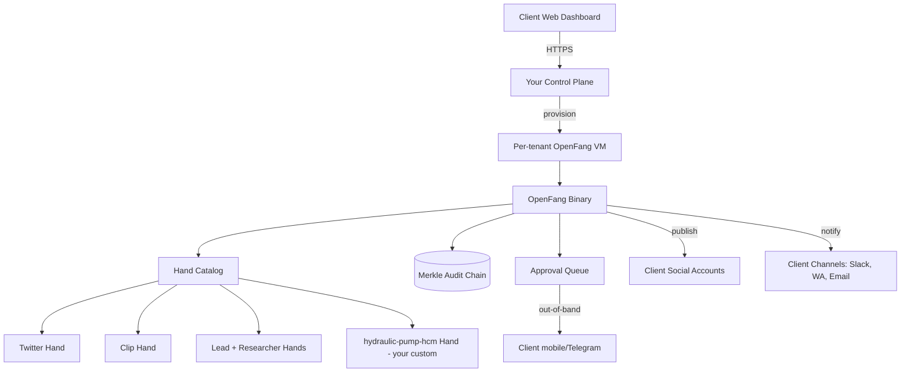

# Productizing an Agentic Framework: Which Base to Pick

## TL;DR

**Recommendation: OpenFang** as the primary base, with **Hermes Agent** as the strong fallback if per‑tenant serverless economics dominate.

| Rank | Framework | Why |
|------|-----------|-----|
| 1 | **RightNow-AI/openfang** | Its "Hands" architecture (HAND.toml + multi‑phase playbooks + approval gates + cron) is a near‑direct match for all three pipelines. Rust single binary, built‑in Twitter / Clip / Lead / Researcher Hands cover most of UC1 and UC3 out of the box. |
| 2 | **NousResearch/hermes-agent** | Best if you need cheap multi‑tenant SaaS. Serverless Daytona/Modal backends hibernate when idle. Self‑improving skills + cron + messaging gateways. Most flexible, but more to build. |
| 3 | **aaif-goose/goose** | Best if your GTM is *white‑label client installs*. Linux Foundation governance, explicit "Custom Distros" support, 15+ providers, 70+ MCP extensions, desktop + CLI + API. Weakest "pipeline" primitives — too general. |
| 4 | **qwibitai/nanoclaw** | Minimalist, single‑user personal assistant. Strong per‑group container isolation but "fork‑and‑modify" philosophy does not scale as a SaaS product. Use as *inspiration*, not a base. |

---

## 1. Project Snapshot (GitHub API, 2026-04-10)

| Repo | Stars | Forks | Language | License | Created | Latest release | Contributors |
|------|------:|------:|----------|---------|---------|----------------|-------------:|
| NousResearch/hermes-agent | 57,969 | 7,681 | Python | MIT | 2025-07-22 | v2026.4.8 (2d ago) | 100+ |
| aaif-goose/goose | 41,152 | 4,093 | Rust | Apache‑2.0 | 2024-08-23 | v1.30.0 (2d ago) | 100+ |
| qwibitai/nanoclaw | 27,117 | 11,642 | TypeScript | MIT | 2026-01-31 | (no releases, commits 3d ago) | 57 |
| RightNow-AI/openfang | 16,544 | 2,075 | Rust | MIT | 2026-02-24 | v0.5.9 (today) | 53 |

All four are actively maintained. Goose is the oldest/most mature (Linux Foundation, AAIF governance). OpenFang is the youngest (< 2 months old) and still pre‑1.0 (v0.3.30 marked as "Security Hardening Release").

> ⚠️ **Naming confusion to watch for.** Openfang, Hermes Agent, NanoClaw and several of the benchmark lines reference "OpenClaw" / "ZeroClaw". These are all part of the same post‑OpenClaw ecosystem of Claude‑Agent‑SDK derivatives. If you choose OpenFang or NanoClaw you are effectively picking a side in that ecosystem split.

---

## 2. Mapping Use Cases to Built‑in Capabilities

### UC1 — Social distribution pipeline
> Given trending topics + client voice, produce articles / videos / flyers and post to client socials.

| Capability needed | OpenFang | Hermes | Goose | NanoClaw |
|---|:-:|:-:|:-:|:-:|
| Trending ingest | Researcher Hand + Collector Hand (built‑in) | Skill + MCP | MCP extension | Custom skill |
| Taste/ICP building | Lead Hand builds ICP profiles over time | Honcho user modeling + agent‑curated memory | Per‑distro context files | Per‑group `CLAUDE.md` |
| **Video generation** | **Clip Hand: YT → vertical shorts, captions, TTS, 8‑phase pipeline, FFmpeg + yt‑dlp** | Build it | Build it | Build it |
| Social posting w/ approval | **Twitter Hand with approval queue (built‑in)** | Build via skills | Build via MCP | Build via skills |
| Scheduling | Cron on every Hand | Built‑in cron | Build it | Task scheduler |

**Winner: OpenFang.** Clip + Twitter + Researcher + Lead cover ~70% of UC1 as pre‑built Hands. Nobody else has a video pipeline built in.

### UC2 — Domain‑specialized diagnostic agent (e.g. hydraulic pump HCM)
> Intake user reports → apply formulas/scripts in a standard pipeline → persist → notify on channels.

| Capability needed | OpenFang | Hermes | Goose | NanoClaw |
|---|:-:|:-:|:-:|:-:|
| Structured multi‑phase pipeline | **HAND.toml + "500+ word expert procedure"** is literally designed for this | Skill with steps | Freeform via MCP | Freeform via skills |
| Deterministic formula/script step | Tool calls inside Hand phase | Skill RPC tools | MCP tool | Bash inside container |
| Persistent domain memory | SQLite + vector | Agent‑curated memory + FTS5 search | Context files | Per‑group SQLite |
| Multi‑channel notify | 40 channel adapters | 6 messaging gateways | via MCP only | 5 channels |
| **Auditability (regulated domains)** | **Merkle hash‑chain audit trail, 16 security layers** | Standard logs | Standard logs | Standard logs |

**Winner: OpenFang** — the HAND.toml schema (manifest + system prompt + SKILL.md + guardrails) is *exactly* the shape of "standard pipeline with formulas, persistence, approval gates." The Merkle audit trail is a real differentiator if you sell into industrial/regulated clients.

### UC3 — Scheduled influencer discovery → tailored content → approval → distribute
> Runs on a schedule, finds targets, drafts content in customer voice, proposes for approval, then distributes.

| Capability needed | OpenFang | Hermes | Goose | NanoClaw |
|---|:-:|:-:|:-:|:-:|
| Scheduled autonomous run | **Core design tenet** ("runs at 6 AM without prompting") | `hermes gateway` + cron | Build it | Task scheduler |
| Influencer discovery | **Lead Hand (daily, enriches, scores 0‑100)** | Build it | Build it | Build it |
| Tailored drafting | Researcher + Twitter Hand | Skills + memory | MCP extension | Custom skill |
| **Human approval gate before posting** | **Built‑in approval queue on Twitter/Browser Hands** | Build it | Build it | Build it |
| Delivery | Hand‑level channel adapters | Messaging gateway | MCP | Channel registry |

**Winner: OpenFang.** UC3 is almost the Lead Hand's description verbatim.

---

## 3. Productization Dimensions (B2B SaaS fit)

This is where OpenFang's lead narrows.

| Dimension | OpenFang | Hermes | Goose | NanoClaw |
|---|---|---|---|---|
| **Multi‑tenancy model** | Single binary, dashboard at :4200 — *unclear how to run N clients in one process*; safest path is 1 VM per client | **Serverless Daytona/Modal = hibernates when idle, near‑zero cost per idle tenant** ← best SaaS economics | One per user (desktop‑first) | Per‑group container (good isolation, but whole instance is single user) |
| **Per‑client customization** | Hands compiled into binary — extending per client means maintaining N binaries or shipping a Hand loader you build | Skills + memory are per‑user data → per‑tenant customization is native | **"Custom Distros": official, documented white‑label with branded providers/extensions** | Fork‑and‑modify per user (does not scale) |
| **License / governance** | MIT, single vendor (RightNow‑AI), pre‑1.0, v0.5.x | MIT, Nous Research | **Apache‑2.0, Linux Foundation / Agentic AI Foundation** ← safest for enterprise procurement | MIT, single maintainer |
| **Maturity** | Young (Feb 2026), pre‑1.0, "may break between minor versions" | 8 months, v0.8.0, 57k stars but < 1 year | **20 months, v1.30.0, Linux Foundation** | < 3 months, no releases |
| **Enterprise story** | 16 security layers, WASM sandbox, Merkle audit trail, Tauri dashboard | Container isolation, command approval | LF‑backed, API embeddable, Custom Distros | Container isolation |
| **Build‑out required for UC1‑3** | Lowest — 70% covered by Hands | Medium — must build Hands equivalents as skills | High — must build pipelines and many tools | High + rewrite to be multi‑tenant |
| **Ecosystem / extensibility** | 53 built‑in tools + MCP + A2A, 40 channel adapters | 40+ tools, MCP, Skills Hub (agentskills.io) | 70+ MCP extensions, 15+ providers | Minimal, skills‑only |

---

## 4. The Decision

### Pick OpenFang if…
- Your near‑term goal is to **ship UC1 + UC3 fast** with minimal custom code, and UC2 as a custom Hand.
- You can live with **1 OpenFang instance per client** (deployed as a single Rust binary on their VM or your per‑tenant VM) for the first N customers.
- You want **industrial/regulated credibility** (Merkle audit trail, WASM sandbox, 16 security layers) — strong for the hydraulic‑pump diagnostic use case.
- You accept pre‑1.0 risk and will pin to a commit.

**Product shape:** "OpenFang‑as‑a‑Service." You host a managed OpenFang per client, you curate a catalog of Hands (including a `hydraulic‑pump‑hcm` Hand you ship), and you charge for Hand authoring + operations. The dashboard at :4200 becomes your customer control panel (possibly reskinned via Tauri).

### Pick Hermes Agent if…
- You want **true multi‑tenant SaaS** where idle tenants cost ~$0 (Daytona/Modal serverless backends).
- You're comfortable building the "pipeline" primitive yourself on top of its skill + cron + delegation system.
- You value the **self‑improving skill loop** (skills that improve during use) as a moat — each client's agent genuinely gets better the more they use it.
- You expect most clients to interact via **Telegram/WhatsApp/Slack** rather than a dashboard.

**Product shape:** "Hermes per customer, one Modal project per tenant, skills/memory/SOUL.md as the per‑tenant state." You sell "a Hermes that knows your business" + curated skill packs. Lower CapEx per tenant, but you must build UC1's video pipeline and UC3's approval flow from scratch.

### Pick Goose if…
- Your GTM is **white‑label client installs**, not SaaS — customers run goose on their own machines branded as your product.
- You care about **enterprise procurement friction** (Apache‑2.0, Linux Foundation, named governance).
- You want the broadest LLM + MCP ecosystem and are okay that goose gives you primitives, not pipelines.

**Product shape:** "Your‑brand‑Agent powered by goose Custom Distros." You ship a branded desktop app + CLI to each client, pre‑configured with your MCP extensions implementing each pipeline. Highest build cost but cleanest commercial/legal story.

### Do NOT pick NanoClaw as your base
It's explicitly designed against the SaaS/productization model you're describing:
- "Built for the individual user" / "fork and have Claude Code modify it to match your needs."
- "No configuration files, customization = code changes."
- No releases, single maintainer, fork count (11.6k) > half the stars — signaling people treat it as a template, not a platform.

It is useful as a **reference implementation** for per‑group container isolation if you end up building tenant isolation on top of Hermes or Goose.

---

## 5. Architecture sketch — OpenFang path

**What you build:**
1. Control plane for provisioning / billing / per‑tenant VM lifecycle.
2. A **Hand catalog service** (upload, version, distribute your proprietary Hands — especially `hydraulic-pump-hcm`).
3. A **reviewer UI** that hooks the approval queue so non‑technical clients can approve social posts from their phone.
4. **Taste capture** workflow that turns the ICP‑builder pattern used by Lead Hand into a "voice of brand" feedback loop for UC1.

**What you get for free:** scheduling, 40 channel adapters, 27 LLM providers, MCP + A2A, audit trail, dashboard, 1,767+ tests, sandbox, 7 pre‑built Hands.

---

## 6. Risks & Mitigations

| Risk | Mitigation |
|---|---|
| OpenFang pre‑1.0 breaking changes | Pin to a commit. Maintain an internal fork. Budget ongoing merge work. |
| OpenFang single‑vendor risk (RightNow‑AI) | Abstract your custom Hands behind an interface you own; be ready to port to Hermes if the project stalls. |
| Multi‑tenancy unproven on OpenFang | Start with 1 VM per client. Revisit once you have 20+ clients. |
| OpenClaw / naming ecosystem drama | Don't market using "openclaw/claw/fang" lineage to clients. Brand independently. |
| UC1's "develop its own taste" requirement is fuzzy | Pilot with one vertical (e.g. hydraulic pumps) where taste = technical correctness, not aesthetics. Use UC1 in a second wave. |

---

## 7. Sources

- **GitHub API** (via `github_api.py summary / readme / releases / commits`) for all four repos, 2026-04-10
- `https://github.com/aaif-goose/goose` — README, GOVERNANCE.md, CUSTOM_DISTROS.md references
- `https://github.com/NousResearch/hermes-agent` — README, feature table, architecture/docs links
- `https://github.com/qwibitai/nanoclaw` — README, architecture section
- `https://github.com/RightNow-AI/openfang` — README, Hands catalog, benchmarks table (author‑published)

Benchmark numbers (cold start, memory, install size, security layers, channel adapters) are from OpenFang's own README and should be treated as **vendor‑published**, not independently verified. Confidence on raw benchmark values: **Medium**. Confidence on the qualitative feature mapping in sections 2‑4: **High**.

---

## 8. Confidence Assessment

| Claim | Confidence |
|---|---|
| OpenFang has 7 bundled Hands including Clip, Lead, Researcher, Twitter with approval queue | **High** — README is explicit |
| OpenFang's HAND.toml schema fits UC2's "standard pipeline with formulas + notifications" pattern | **High** |
| Hermes serverless Daytona/Modal backends enable low‑cost multi‑tenant SaaS | **High** — README is explicit |
| Goose's Custom Distros are the right vehicle for white‑label | **High** — linked GOVERNANCE.md / CUSTOM_DISTROS.md |
| OpenFang can run as a proper multi‑tenant SaaS inside one process | **Low** — not verified, docs silent |
| OpenFang benchmark numbers vs competitors | **Medium** — vendor‑published, not independent |
| NanoClaw is unsuited as a SaaS base | **High** — explicit in its philosophy section |

---

## 9. Next Step

If you agree with OpenFang‑first, the concrete next action is a **2‑day spike**:

1. `curl -fsSL https://openfang.sh/install | sh && openfang init && openfang start`
2. Activate Researcher + Twitter Hands, wire to a throwaway Twitter test account, run a full approval‑queue cycle end‑to‑end.
3. Write a stub `hydraulic-pump-hcm` HAND.toml with 3 phases (intake → formula apply → notify) to validate UC2's pipeline primitive.
4. Attempt to run a *second* tenant alongside the first to validate (or invalidate) in‑process multi‑tenancy.

Output of the spike is a go/no‑go on OpenFang vs the Hermes fallback plan.
