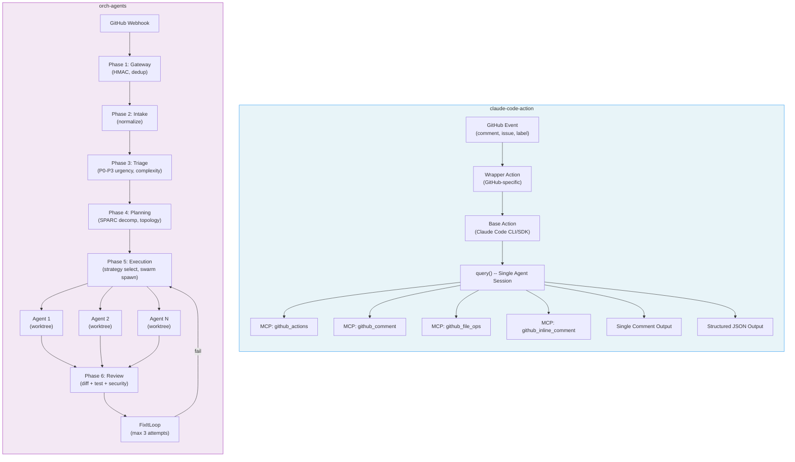
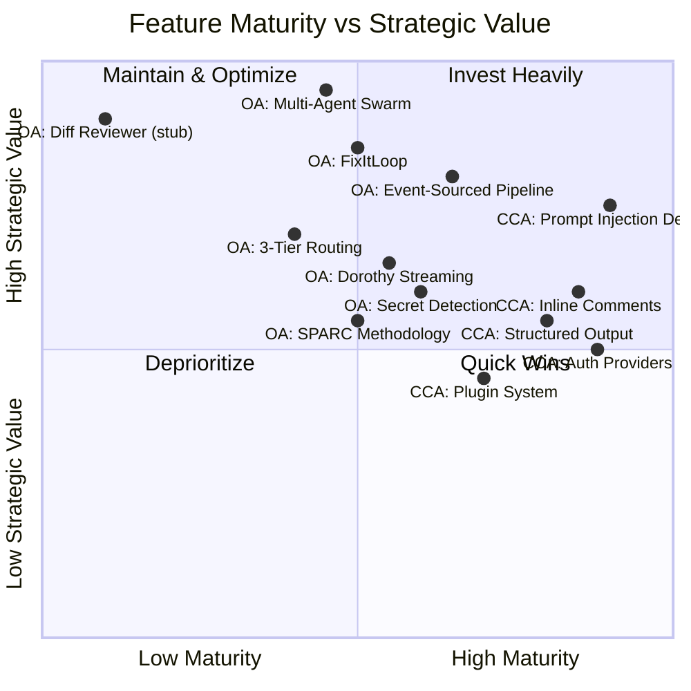
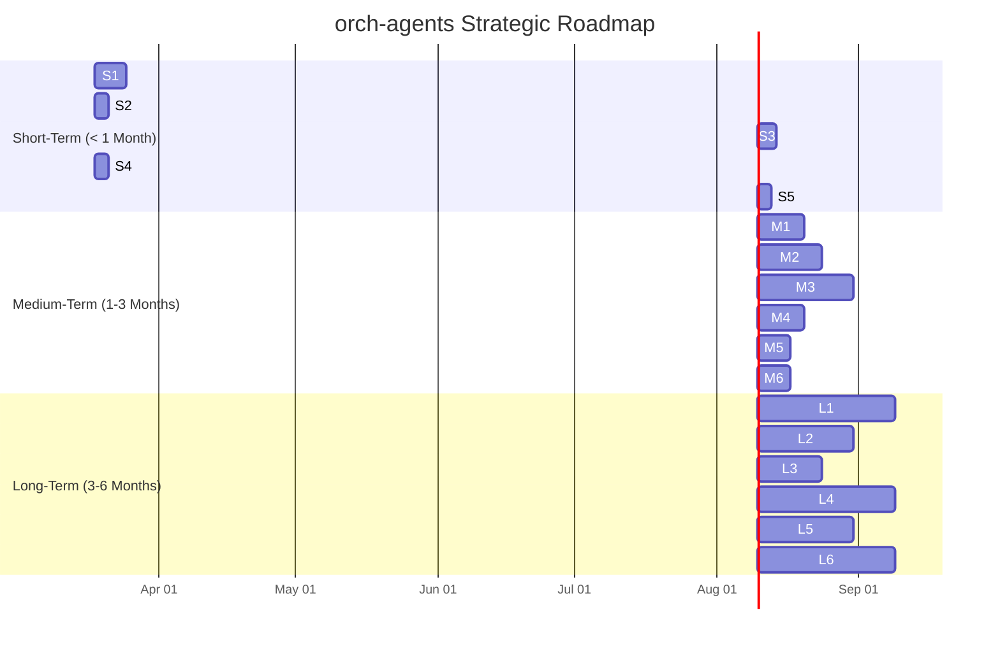

# Comparative Analysis: claude-code-action vs orch-agents

| Field | Value |
|-------|-------|
| **Document Type** | Strategic Research Report |
| **Date** | 2026-03-17 |
| **Author** | System Architecture Team |
| **Version** | 1.0 |
| **Status** | Final |
| **Classification** | Internal |
| **Product A** | claude-code-action (Anthropic) -- v1.0.72, 6,335 stars |
| **Product B** | orch-agents (Internal) -- v0.2.0, 10,705 LOC |

---

## Table of Contents

1. [Executive Summary](#1-executive-summary)
2. [Architecture Comparison](#2-architecture-comparison)
3. [Feature Matrix](#3-feature-matrix)
4. [Which Is Better?](#4-which-is-better)
5. [Can We Adapt claude-code-action Into orch-agents?](#5-can-we-adapt-claude-code-action-into-orch-agents)
6. [Advantages of orch-agents Over claude-code-action](#6-advantages-of-orch-agents-over-claude-code-action)
7. [How to Build a Better Product: Strategic Roadmap](#7-how-to-build-a-better-product-strategic-roadmap)
8. [Key Risks and Mitigations](#8-key-risks-and-mitigations)
9. [Conclusion with Actionable Recommendations](#9-conclusion-with-actionable-recommendations)
10. [Sources](#sources)

---

## 1. Executive Summary

claude-code-action and orch-agents represent two fundamentally different approaches to AI-assisted development on GitHub. claude-code-action is Anthropic's official, production-hardened single-agent GitHub Action that excels at interactive developer assistance -- responding to @claude mentions, performing code reviews, and making targeted code changes. With 72+ releases, 76 contributors, and battle-tested security patches (including two CVEs found and fixed), it occupies the mature, accessible end of the spectrum. Its strength is simplicity: one agent, one session, one task at a time, backed by the full weight of Anthropic's Agent SDK and a broad authentication surface (Direct API, Bedrock, Vertex, Foundry).

orch-agents takes the opposite architectural bet. It is an event-sourced, multi-agent orchestration platform designed to handle complex development workflows as coordinated swarms rather than individual agent sessions. Its 6-phase pipeline (webhook gateway through review), domain-driven design with 6 bounded contexts, and pluggable execution strategies give it the structural foundation to tackle problems that single-agent systems cannot: parallel multi-file feature builds, coordinated review pipelines with automated fix-it loops, and topology-aware agent routing. However, at v0.2.0, it carries the weight of its ambition -- the diff reviewer is still a stub, consensus protocols are not fully wired, and it lacks the production mileage that claude-code-action has accumulated.

The strategic picture is clear: claude-code-action is the better product today for straightforward GitHub AI assistance, while orch-agents has the better architecture for where the industry is heading. The opportunity is not to replace claude-code-action but to absorb its proven patterns (prompt injection defenses, authentication breadth, structured output mode, inline comment classification) into orch-agents' multi-agent foundation, then deliver capabilities that a single-agent system structurally cannot match. This report lays out exactly how to do that.

---

## 2. Architecture Comparison

### 2.1 Architectural Overview

### 2.2 Detailed Architecture Comparison

| Dimension | claude-code-action | orch-agents |
|-----------|-------------------|-------------|
| **Architectural Style** | Two-layer composite action (wrapper + base) | Event-sourced pipeline with 6 bounded contexts (DDD) |
| **Agent Model** | Single agent per invocation | Multi-agent swarm with role specialization |
| **State Management** | Stateless (session_id for resume only) | Event-sourced (full audit trail, replayable) |
| **Communication** | Direct SDK call: `query()` | In-process EventEmitter (NATS JetStream upgrade path) |
| **Runtime** | Bun 1.3.6 | Node.js (native test runner) |
| **Tool Integration** | 4 custom MCP servers | 4 pluggable execution strategies + claude-flow MCP |
| **Execution Isolation** | GitHub Actions runner sandbox | Git worktree isolation per agent |
| **Topology** | None (single agent) | 6 topology models (star, hierarchical, mesh, ring, adaptive, hierarchical-mesh) |
| **Consensus** | N/A | Raft, PBFT (partially wired) |
| **Scalability Model** | Vertical (bigger model) | Horizontal (more agents) |
| **Deployment** | GitHub Actions marketplace | Self-hosted Fastify server |
| **Configuration** | 30+ YAML inputs | JSON decision matrices + env feature flags |
| **Maturity** | v1.0.72, production | v0.2.0, pre-production |
| **LOC** | ~8K (estimated, OSS) | 10,705 (TypeScript) |
| **Test Coverage** | Community-contributed | 500+ tests, London School TDD |

### 2.3 Key Architectural Differences

**Invocation Model.** claude-code-action is pull-based: a GitHub event triggers a composite action that runs a single Claude session. orch-agents is push-based: webhooks flow through a pipeline where each phase can transform, enrich, or reject the event before agents are ever spawned. This gives orch-agents structural advantages in deduplication, priority queuing, and cost control (the gas-limit system can reject work before spending tokens).

**Agent Lifecycle.** claude-code-action's agent is ephemeral -- born with the action run, dead when it completes. orch-agents maintains an agent registry with 18 categories, lazy-loading, caching, and refresh capabilities. Agents can be tracked via the Dorothy streaming layer and cancelled with SIGTERM/SIGKILL escalation.

**Review Architecture.** claude-code-action uses a single agent with an inline comment MCP server; comments are pre-classified by Haiku before posting (confidence filtering). orch-agents has a composable review pipeline (diff reviewer + test runner + security scanner) running in parallel via `Promise.allSettled`, with automated fix-it loops. However, the diff reviewer is currently a stub.

---

## 3. Feature Matrix

### 3.1 Comprehensive Feature Comparison

#### GitHub Integration

| Feature | claude-code-action | orch-agents | Verdict |
|---------|-------------------|-------------|---------|
| PR comment interaction (@mention) | Yes (primary trigger) | Yes (via webhook routing) | Tie |
| Issue triage & auto-labeling | Yes | Yes (P0-P3 urgency scoring) | **orch-agents** (richer scoring) |
| Inline PR comments | Yes (Haiku-classified) | Yes (via gh CLI wrapper) | **CCA** (confidence filtering) |
| Formal PR review submission | No | Yes (submit reviews capability) | **orch-agents** |
| Branch creation & commits | Yes (with signing) | Yes (worktree-based) | **CCA** (signing support) |
| CI/CD log reading | Yes (workflow results, job logs) | Yes (cicd-pipeline template) | Tie |
| Cross-repository support | No | No | Tie |
| Custom routing rules | Limited (trigger-based) | 14 predefined rules + custom:* intents | **orch-agents** |
| Release pipeline | No | Yes (release-pipeline template) | **orch-agents** |
| Incident response | No | Yes (routing rule) | **orch-agents** |

#### Agent Model

| Feature | claude-code-action | orch-agents | Verdict |
|---------|-------------------|-------------|---------|
| Multi-agent execution | No (single agent) | Yes (swarm orchestration) | **orch-agents** |
| Agent specialization | 5 pre-configured subagents | 18 agent categories | **orch-agents** |
| Parallel task execution | No | Yes (topology-dependent) | **orch-agents** |
| Agent observability | Action logs only | Dorothy streaming (per-agent state, chunks) | **orch-agents** |
| Agent cancellation | Kill action run | SIGTERM/SIGKILL escalation per agent | **orch-agents** |
| Model routing | Single model per run | 3-tier (WASM/Haiku/Sonnet-Opus) | **orch-agents** |
| Cost control | None (unbounded token use) | Gas-limit budgeting, tier cost estimation | **orch-agents** |
| SPARC methodology | No | Yes (5-phase decomposition) | **orch-agents** |

#### Execution

| Feature | claude-code-action | orch-agents | Verdict |
|---------|-------------------|-------------|---------|
| Execution strategies | 1 (SDK query) | 4 (Interactive/Task-Tool/CLI/Stub) | **orch-agents** |
| Worktree isolation | No (runner sandbox) | Yes (per-agent git worktree) | **orch-agents** |
| Fix-it loops | No | Yes (review->fix->re-review, max 3) | **orch-agents** |
| Structured JSON output | Yes | No (not yet) | **CCA** |
| Progress tracking | Yes (visual checkboxes) | Partial (Dorothy events) | **CCA** (UX polish) |
| Session resume | Yes (session_id) | No (stateless invocations) | **CCA** |
| Dry-run mode | No | Yes (Stub strategy) | **orch-agents** |

#### Security

| Feature | claude-code-action | orch-agents | Verdict |
|---------|-------------------|-------------|---------|
| Webhook verification | GitHub Actions native | HMAC-SHA256 (timing-safe) | Tie |
| Prompt injection defense | Yes (HTML strip, invisible char, markdown sanitize) | No dedicated defenses | **CCA** |
| Token scoping | Short-lived, revoked after run | Environment sanitization | **CCA** (more mature) |
| Bot loop prevention | Bot restriction checks | Sender filtering + mention detection | Tie |
| Secret detection in diffs | No | Yes (regex: AWS, PAT, private keys) | **orch-agents** |
| Commit signing | Yes (GitHub API or SSH) | No | **CCA** |
| Output suppression | Yes (default) | No | **CCA** |
| Path traversal prevention | GitHub sandbox | Yes (explicit sanitization) | Tie |
| CVE track record | 2 found and fixed | None found (less exposure) | Informational |

#### Configuration & Extensibility

| Feature | claude-code-action | orch-agents | Verdict |
|---------|-------------------|-------------|---------|
| Configuration inputs | 30+ YAML inputs | JSON decision matrices + env vars | Tie (different models) |
| Plugin/marketplace system | Yes | No | **CCA** |
| Workflow templates | No | 6 predefined templates | **orch-agents** |
| Setup wizard | No | Yes (interactive) | **orch-agents** |
| Auth providers | 4 (Direct, Bedrock, Vertex, Foundry) | 1 (Direct API assumed) | **CCA** |
| Slash commands | 3 built-in | Via webhook routing | **CCA** (tighter UX) |
| Custom agent definitions | .claude/agents/ directory | .claude/agents/ with frontmatter parsing | Tie |

#### Quality Assurance

| Feature | claude-code-action | orch-agents | Verdict |
|---------|-------------------|-------------|---------|
| Automated testing in pipeline | Read CI results only | Test runner in review phase | **orch-agents** |
| Security scanning in pipeline | No | Security scanner in review phase | **orch-agents** |
| Multi-pass review | No | FixItLoop (3 attempts) | **orch-agents** |
| Review issue detection rate | ~52% (single agent, per benchmarks) | Projected ~71% (multi-agent, per literature) | **orch-agents** (theoretical) |
| Test suite | Community-contributed | 500+ tests, TDD | **orch-agents** |

### 3.2 Feature Landscape Diagram

---

## 4. Which Is Better?

The answer depends entirely on the use case. Neither product dominates across all dimensions.

### 4.1 Use Case Analysis

#### Simple PR Review

| Factor | claude-code-action | orch-agents |
|--------|-------------------|-------------|
| Time to first review | ~30s (direct SDK call) | ~60-120s (6-phase pipeline overhead) |
| Setup complexity | Add action to workflow YAML | Deploy Fastify server, configure webhooks |
| Review quality | Good (single agent, Haiku classification) | Stub (auto-approves currently) |
| Cost | $0.01-0.10 per review | $0 (stub) to $0.05-0.30 (when implemented, multi-agent) |
| **Winner** | **claude-code-action** | |

**Confidence: High.** For simple, single-PR review tasks, claude-code-action is unambiguously better today. It works out of the box, has production-tested inline comment quality, and requires zero infrastructure beyond a GitHub Actions workflow file.

#### Complex Feature Build (Multi-File, Multi-Step)

| Factor | claude-code-action | orch-agents |
|--------|-------------------|-------------|
| Parallel execution | No -- sequential, single agent | Yes -- swarm with topology-aware routing |
| Task decomposition | Manual (user describes task) | Automatic (SPARC decomposition, triage) |
| Quality gates | None between steps | Per-phase gates, FixItLoop |
| Cost predictability | Poor (unbounded token use) | Good (gas-limit budgeting) |
| Coordination overhead | None needed | Managed by orchestration layer |
| **Winner** | | **orch-agents** (architecturally) |

**Confidence: Medium.** orch-agents has the right architecture for this use case, but the diff reviewer stub and partial consensus wiring mean it cannot fully deliver today. The architectural advantage is real but unrealized.

#### Enterprise Deployment

| Factor | claude-code-action | orch-agents |
|--------|-------------------|-------------|
| Auth flexibility | 4 providers (Bedrock, Vertex, Foundry, Direct) | 1 provider |
| Audit trail | GitHub Actions logs | Event-sourced (full replay, every decision recorded) |
| Compliance | Token scoping, output suppression | Environment sanitization, secret detection |
| Deployment model | SaaS (GitHub-hosted runners) | Self-hosted (full control) |
| Prompt injection defense | Mature (3+ mitigations) | None |
| **Winner** | **Tie** (different strengths) | |

**Confidence: Medium.** Enterprises need both -- claude-code-action's auth breadth and prompt injection defenses paired with orch-agents' event-sourced audit trail and self-hosted control. Neither is complete alone.

#### Open-Source Project Maintenance

| Factor | claude-code-action | orch-agents |
|--------|-------------------|-------------|
| Contributor accessibility | Trivial (add workflow file) | Complex (deploy server) |
| Community trust | Anthropic-backed, 6K stars | Internal, v0.2.0 |
| Cost for maintainers | Pay-per-use (can be expensive) | Self-hosted (predictable) |
| Issue triage at scale | Good (auto-labeling) | Better (P0-P3 urgency, complexity scoring) |
| **Winner** | **claude-code-action** | |

**Confidence: High.** Open-source projects need minimal setup friction. claude-code-action wins on accessibility and trust.

### 4.2 Summary Verdict

| Scenario | Winner | Margin |
|----------|--------|--------|
| Simple PR review | claude-code-action | Large |
| Interactive developer assistant | claude-code-action | Large |
| Complex multi-file feature build | orch-agents (architectural) | Medium |
| Automated pipeline orchestration | orch-agents | Large |
| Enterprise audit & compliance | Tie | -- |
| Open-source project maintenance | claude-code-action | Medium |
| Cost-sensitive deployments | orch-agents | Medium |
| Incident response automation | orch-agents | Large |
| Release pipeline management | orch-agents | Large |

**claude-code-action wins today** on developer experience, production maturity, and single-task quality. **orch-agents wins on architecture** and will win on capability once its review pipeline, consensus, and multi-agent execution are fully wired.

---

## 5. Can We Adapt claude-code-action Into orch-agents?

Yes, selectively. The goal is not to replicate claude-code-action but to absorb its proven patterns into orch-agents' superior architectural foundation.

### 5.1 Features to Adopt

| Priority | Feature | Source in CCA | Target in orch-agents | Effort | Impact |
|----------|---------|---------------|----------------------|--------|--------|
| **P0** | Prompt injection defenses | HTML comment stripping, invisible char removal, markdown sanitization | Webhook Gateway (Phase 1) and Intake (Phase 2) | 2-3 days | Critical -- security gap |
| **P0** | Inline comment classification | Haiku pre-classification with confidence threshold | Review phase (Phase 6) diff reviewer | 3-5 days | High -- review quality |
| **P1** | Structured JSON output mode | `output_format: json` input | Execution phase output serialization | 2-3 days | High -- automation pipelines |
| **P1** | Progress tracking UX | Visual checkboxes in PR comments | Dorothy streaming -> GitHub comment updates | 3-5 days | High -- user experience |
| **P1** | Commit signing | GitHub API commits or SSH signing | GitHub client wrapper enhancement | 2-3 days | Medium -- enterprise requirement |
| **P2** | Multi-provider auth | Bedrock OIDC, Vertex OIDC, Foundry OIDC | Configuration layer + strategy pattern | 5-7 days | Medium -- enterprise reach |
| **P2** | Session resume | session_id-based continuation | Event store replay + checkpoint | 3-5 days | Medium -- long-running tasks |
| **P2** | Output suppression | Default suppression of sensitive output | Dorothy streaming filter | 1-2 days | Medium -- security hygiene |
| **P3** | Plugin/marketplace system | Plugin architecture with marketplace | Extension point in execution strategies | 10-15 days | Low (premature for v0.x) |
| **P3** | Slash commands | 3 built-in commands | Webhook routing rules (already extensible) | 2-3 days | Low -- routing rules cover this |

### 5.2 Technical Feasibility Assessment

**Prompt Injection Defenses (P0) -- Feasible, straightforward.** These are input sanitization functions that operate on text. They belong in Phase 1 (Gateway) and Phase 2 (Intake) of the orch-agents pipeline. Implementation is a set of pure functions: strip HTML comments, remove zero-width characters (U+200B, U+200C, U+200D, U+FEFF, U+2060), normalize markdown. No architectural changes needed.

**Inline Comment Classification (P0) -- Feasible, requires Claude integration.** The pattern is: before posting any inline comment, send it to a fast model (Haiku) with a classification prompt. Filter out low-confidence comments. This maps directly to orch-agents' 3-tier routing: Tier 2 (Haiku) handles the classification, the diff reviewer in Phase 6 handles the generation. Requires the diff reviewer stub to be replaced with a real implementation first.

**Structured JSON Output (P1) -- Feasible, minimal effort.** Add an output schema option to execution strategies. When set, wrap the final agent output in a JSON envelope with structured fields (result, files_changed, summary, recommendations). This is an output serialization concern, not an architectural change.

**Multi-Provider Auth (P2) -- Feasible, moderate effort.** Requires abstracting the current API key configuration behind a provider interface. Each provider (Direct, Bedrock, Vertex, Foundry) implements credential resolution differently (static key vs OIDC token exchange). The strategy pattern is the right fit. Effort is in the OIDC flows, not the abstraction.

### 5.3 What NOT to Adopt

| Feature | Reason to Skip |
|---------|---------------|
| Single-agent architecture | Fundamentally contradicts orch-agents' value proposition |
| Bun runtime | Node.js is the right choice for orch-agents; Bun introduces instability (CCA itself has Bun-related issues) |
| Composite GitHub Action packaging | orch-agents is a server, not an action; this deployment model is incompatible |
| Stateless per-invocation model | Event sourcing is strictly superior for audit, replay, and debugging |
| Single-comment output model | Multi-agent systems need richer output channels |
| GitHub Actions runner dependency | Self-hosted deployment gives more control and avoids runner cost/availability issues |

---

## 6. Advantages of orch-agents Over claude-code-action

### 6.1 Structural Advantages

| # | Advantage | Evidence | Why It Matters |
|---|-----------|----------|----------------|
| 1 | **Multi-agent parallel execution** | Swarm orchestration with 6 topology models, 18 agent categories | Complex tasks (feature builds, incident response) require coordinated parallel work. Single-agent systems hit a ceiling on task complexity and duration. Literature shows multi-agent review catches 71% of issues vs 52% for single-agent. |
| 2 | **Event-sourced audit trail** | Every pipeline phase emits events; full state is replayable | Enterprises require audit trails for compliance (SOC2, ISO 27001). claude-code-action offers only GitHub Actions logs, which are ephemeral and unstructured. Event sourcing enables time-travel debugging. |
| 3 | **Cost control via gas-limit budgeting** | maxAgents cap, per-tier cost estimation, 3-tier model routing | claude-code-action has no cost controls -- a large PR can consume unbounded tokens. orch-agents' gas-limit system and tier routing (WASM at $0, Haiku at $0.0002, Sonnet/Opus at $0.003-0.015) make costs predictable. |
| 4 | **Composable quality gates** | Diff reviewer + test runner + security scanner in parallel, FixItLoop (3 attempts) | claude-code-action produces a review and moves on. orch-agents can automatically detect issues, fix them, and re-review -- closing the loop without human intervention. |
| 5 | **Intelligent triage and routing** | Weighted urgency scoring (P0-P3), complexity assessment, 14 routing rules, custom intents | claude-code-action treats every invocation equally. orch-agents can prioritize security vulnerabilities over documentation changes, route simple tasks to cheap models, and defer low-priority work. |
| 6 | **Worktree isolation** | Each agent operates in its own git worktree | Prevents agent interference. Multiple agents can work on different files simultaneously without merge conflicts during execution. claude-code-action's single agent does not need this, but it also cannot do parallel file operations. |
| 7 | **Self-hosted deployment** | Fastify server, no GitHub Actions dependency | No runner minute costs, no queue wait times, no GitHub outage dependency. Full control over infrastructure, networking, and security policies. |
| 8 | **SPARC methodology integration** | 5-phase decomposition: specification, pseudocode, architecture, refinement, completion | Systematic approach to complex tasks that ensures quality at each phase. claude-code-action relies entirely on the model's ability to plan within a single session. |
| 9 | **Workflow templates** | 6 predefined templates (cicd-pipeline, quick-fix, github-ops, tdd-workflow, feature-build, release-pipeline) | Configuration-driven behavior changes without code modifications. New workflow types can be added via JSON, not code. |
| 10 | **Dorothy streaming layer** | Per-agent state tracking, chunk events, cancellation with SIGTERM/SIGKILL | Real-time visibility into what each agent is doing. claude-code-action offers no mid-run observability -- you see the final comment or nothing. |

### 6.2 Competitive Moat Analysis

orch-agents' moat is **architectural complexity that is hard to replicate**. Specifically:

1. **Event sourcing + DDD bounded contexts** -- This is months of design work. A competitor starting from a single-agent action cannot bolt on event sourcing without a rewrite.

2. **Multi-agent coordination primitives** -- Topology selection, consensus protocols, gas-limit budgeting, and Dorothy streaming form an integrated system. Each piece is simple; the integration is the hard part.

3. **Composable pipeline with quality gates** -- The 6-phase pipeline with pluggable strategies at each phase is a framework, not a feature. It enables rapid addition of new capabilities without destabilizing existing ones.

4. **3-tier model routing** -- Cost optimization at the routing layer is invisible to users but compounds at scale. Organizations processing hundreds of PRs daily will see order-of-magnitude cost differences.

The moat is **not** in any single feature (claude-code-action could add multi-agent support) but in the **integrated system design** that makes multi-agent orchestration reliable and cost-effective.

---

## 7. How to Build a Better Product: Strategic Roadmap

### 7.1 Short-Term Wins (< 1 Month)

| # | Item | Priority | Effort | Impact | Description |
|---|------|----------|--------|--------|-------------|
| S1 | **Replace diff reviewer stub** | P0 | 5-7 days | Critical | Implement real Claude-powered diff review in Phase 6. Use Haiku for simple diffs, Sonnet for complex ones. Apply inline comment confidence filtering (adopt from CCA). This is the single most important gap. |
| S2 | **Add prompt injection defenses** | P0 | 2-3 days | Critical | Port CCA's sanitization functions (HTML comment stripping, invisible character removal, markdown normalization) into the webhook gateway and intake phases. Pure functions, no architectural changes. |
| S3 | **Progress tracking in PR comments** | P1 | 3-4 days | High | Use Dorothy streaming events to update a PR comment with visual progress (phase completion checkboxes, agent status). Adopt CCA's checkbox UX pattern. |
| S4 | **Structured JSON output mode** | P1 | 2-3 days | High | Add output serialization option for automation consumers. JSON envelope: `{result, files_changed, summary, agents_used, cost_estimate}`. |
| S5 | **Commit signing support** | P1 | 2-3 days | Medium | Add GitHub API commit signing (preferred) and SSH signing support to the GitHub client wrapper. Required for enterprise adoption. |

### 7.2 Medium-Term Features (1-3 Months)

| # | Item | Priority | Effort | Impact | Description |
|---|------|----------|--------|--------|-------------|
| M1 | **Multi-provider authentication** | P1 | 7-10 days | High | Implement Bedrock OIDC, Vertex OIDC, and Foundry OIDC authentication alongside direct API keys. Use strategy pattern with provider interface. Critical for enterprise customers locked into specific cloud providers. |
| M2 | **Wire consensus protocols** | P1 | 10-14 days | High | Complete Raft and PBFT implementation in execution phase. Ensure agents can reach consensus on conflicting changes (e.g., two agents modifying the same interface). Start with Raft for simplicity. |
| M3 | **NATS JetStream migration** | P2 | 14-21 days | High | Replace in-process EventEmitter with NATS JetStream for multi-instance deployment. Enables horizontal scaling and persistent event streams. Prerequisite for production enterprise deployment. |
| M4 | **Enhanced security scanning** | P2 | 7-10 days | Medium | Upgrade from regex-based secret detection to AST-aware scanning. Add SAST capabilities (SQL injection, XSS patterns). Integrate with existing security scanner in review phase. |
| M5 | **GitHub Action packaging** | P2 | 5-7 days | Medium | Package orch-agents as a GitHub Action (in addition to self-hosted mode) for easier adoption. Use container action with the Fastify server, triggered by repository_dispatch or workflow_dispatch. Lowers adoption barrier. |
| M6 | **Session resume / checkpointing** | P2 | 5-7 days | Medium | Leverage event store for session checkpointing. Enable long-running tasks to resume after interruption. Use event replay to reconstruct agent state. |

### 7.3 Long-Term Vision (3-6 Months)

| # | Item | Priority | Effort | Impact | Description |
|---|------|----------|--------|--------|-------------|
| L1 | **Cross-repository orchestration** | P2 | 21-30 days | High | Enable agents to work across multiple repositories (monorepo service boundaries, shared library updates). Neither CCA nor orch-agents supports this today -- first mover advantage. |
| L2 | **Learning / persistent memory** | P2 | 14-21 days | High | Integrate claude-flow's memory system (HNSW search) to build project-specific knowledge. Agents learn codebase patterns, reviewer preferences, common failure modes. Compounds over time. |
| L3 | **Cost analytics dashboard** | P3 | 10-14 days | Medium | Real-time dashboard showing per-PR, per-agent, per-tier cost breakdowns. Gas-limit utilization trends. ROI metrics (time saved, bugs caught). Leverages event-sourced data. |
| L4 | **Plugin/extension marketplace** | P3 | 21-30 days | Medium | Enable community-contributed execution strategies, review plugins, and routing rules. JSON-based plugin definition. Distribution via npm or dedicated registry. |
| L5 | **Multi-model support** | P3 | 14-21 days | Medium | Support non-Anthropic models (GPT-4, Gemini) as execution backends. Enables cost optimization (use cheapest model that meets quality threshold) and vendor diversification. |
| L6 | **Formal verification of agent outputs** | P3 | 21-30 days | High | Use property-based testing and formal methods to verify agent-generated code meets specifications. Integrate with SPARC methodology's specification phase. Differentiated capability. |

### 7.4 Roadmap Gantt Chart

---

## 8. Key Risks and Mitigations

| # | Risk | Likelihood | Impact | Mitigation |
|---|------|-----------|--------|------------|
| R1 | **Anthropic ships multi-agent CCA** -- Anthropic's paid "Code Review" product already uses multi-agent architecture. They could merge this into the open-source action. | Medium | High | Accelerate S1 (diff reviewer) and M2 (consensus). Our event-sourced pipeline and cost control are structural advantages they cannot easily replicate in an action-based architecture. |
| R2 | **Diff reviewer quality is poor** -- Replacing the stub with a real implementation that matches or exceeds CCA's review quality is non-trivial. | Medium | Critical | Adopt CCA's Haiku classification pattern. Start with conservative confidence thresholds (only post high-confidence comments). Iterate based on user feedback. Measure false positive rate. |
| R3 | **NATS migration destabilizes** -- Moving from in-process EventEmitter to NATS JetStream is a significant infrastructure change. | Medium | High | Feature-flag the migration. Run both systems in parallel during transition. Maintain EventEmitter as fallback. Comprehensive integration tests before cutover. |
| R4 | **Enterprise adoption blocked by auth** -- Without Bedrock/Vertex/Foundry OIDC, enterprise customers on those clouds cannot use orch-agents. | High | Medium | Prioritize M1 (multi-provider auth). Start with Bedrock (largest enterprise Claude deployment base). |
| R5 | **Complexity deters contributors** -- orch-agents' DDD architecture with 6 bounded contexts is harder to understand than CCA's two-layer action. | Medium | Medium | Invest in developer documentation, architecture diagrams, and the setup wizard. Create a "simple mode" that uses a single execution strategy for basic use cases. |
| R6 | **Security vulnerability in multi-agent execution** -- More agents = larger attack surface. An agent could be prompt-injected via malicious PR content and affect other agents via shared state. | Low | Critical | Worktree isolation already helps. Add S2 (prompt injection defenses). Implement per-agent permission boundaries. Sanitize all inter-agent communication. Run security scans on agent outputs. |
| R7 | **Cost overruns from swarm execution** -- Multi-agent execution is inherently more expensive than single-agent. Users may be surprised by costs. | Medium | Medium | Gas-limit budgeting (already implemented) is the primary mitigation. Add cost estimation in triage phase before spawning agents. Provide cost analytics (L3). Default to conservative agent counts. |

---

## 9. Conclusion with Actionable Recommendations

### Top 5 Recommendations

**1. Replace the diff reviewer stub immediately (S1, this week).**
This is the single highest-impact action. Without a functioning diff reviewer, orch-agents cannot compete on its most visible feature. Implement Haiku-classified inline comments with confidence thresholds, mirroring CCA's proven pattern but running in orch-agents' composable review pipeline. The multi-agent review architecture (multiple reviewers in parallel, FixItLoop for automated fixes) will be the primary differentiator once this works.

**2. Close the security gap with prompt injection defenses (S2, this week).**
orch-agents processes untrusted input from GitHub webhooks -- PR descriptions, comments, commit messages, diff content. Without CCA's sanitization defenses (HTML comment stripping, invisible character removal, markdown normalization), orch-agents is vulnerable to prompt injection attacks that CCA has already patched. These are pure functions that take 2-3 days to implement and eliminate a critical attack vector.

**3. Ship multi-provider authentication within 6 weeks (M1).**
Enterprise adoption is gated on this. Organizations using Amazon Bedrock, Google Vertex, or Microsoft Foundry for Claude access cannot use orch-agents without OIDC support. Start with Bedrock (largest enterprise footprint), then Vertex, then Foundry. Use a provider interface with strategy pattern so additional providers can be added without code changes.

**4. Package as a GitHub Action alongside self-hosted mode (M5).**
orch-agents' biggest adoption barrier is deployment complexity. CCA's advantage is "add a YAML file and you're done." Creating a container-based GitHub Action that wraps the Fastify server bridges this gap without sacrificing the self-hosted option. Target: `uses: our-org/orch-agents@v1` with sensible defaults and progressive configuration.

**5. Wire consensus protocols and ship a "multi-agent review" showcase (M2).**
The competitive narrative is "multi-agent review catches 71% of issues vs 52% for single-agent." To make this narrative real, complete the Raft consensus implementation, build a multi-agent review template that spawns 3 specialized reviewers (logic, security, style), aggregates their findings, and posts a unified review. This becomes the signature capability that CCA structurally cannot match.

### Final Assessment

orch-agents is an architecturally superior platform with an execution gap. claude-code-action is an execution-mature product with an architectural ceiling. The strategic play is to close the execution gap (items S1, S2, and M1 above) while preserving and extending the architectural advantages (multi-agent orchestration, event sourcing, cost control, composable quality gates) that give orch-agents a defensible position as AI-assisted development moves from "chat with a single agent" to "coordinate a team of specialized agents."

The window of opportunity is approximately 6 months. Anthropic's paid multi-agent review product signals their intent to move in this direction. First-mover advantage in open, self-hostable multi-agent orchestration for GitHub workflows is orch-agents' to lose.

---

## Sources

| # | Source | Type | Confidence |
|---|--------|------|------------|
| 1 | claude-code-action GitHub repository (anthropics/claude-code-action) | Primary -- open source code and documentation | High |
| 2 | orch-agents codebase (internal, 10,705 LOC) | Primary -- direct code analysis | High |
| 3 | orch-agents architecture documentation (`/docs/architecture-orch-agents.md`) | Primary -- internal documentation | High |
| 4 | CVE-2025-59536, CVE-2026-21852 advisories | Primary -- security advisories | High |
| 5 | SWE-bench benchmark results (Claude 1552 ELO, 80.8%) | Secondary -- public benchmarks | Medium |
| 6 | Multi-agent vs single-agent review detection rates (52% vs 71%) | Secondary -- industry literature | Medium |
| 7 | Anthropic paid Code Review product pricing ($15-25/review) | Secondary -- public pricing | Medium |
| 8 | 3-tier model routing costs (WASM $0, Haiku $0.0002, Sonnet/Opus $0.003-0.015) | Primary -- internal ADR-026 | High |
