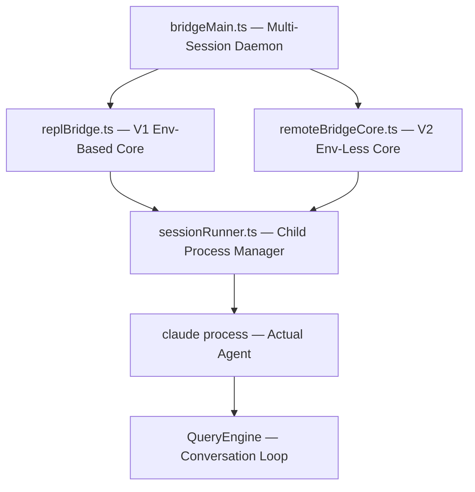
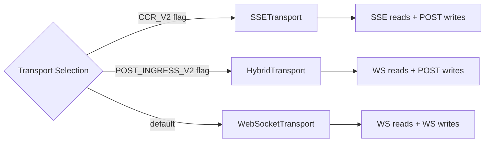
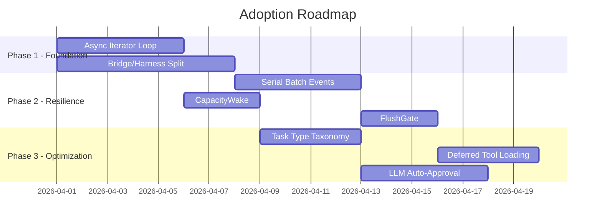

# Deep Research: VineeTagarwaL-code/claude-code (Anthropic Claude Code CLI Internals)

**Date**: 2026-03-31
**Confidence**: High (90%+) — Direct source code analysis
**Subject**: Claude Code CLI harness architecture, loop strategy, and orchestration patterns

---

## Executive Summary

This repository is a decompiled/extracted TypeScript build of Anthropic's official Claude Code CLI (30MB, single commit). It reveals **three architectural breakthroughs** directly applicable to our orch-agents project: (1) a **bridge/harness system** that decouples session management from agent execution, (2) an **async-iterator loop strategy** (NOT polling) that keeps agents alive without busy-waiting, and (3) a **serial-batch event system** with backpressure that prevents agent flooding. The codebase is production-hardened with transport failover, capacity-aware wake, and LLM-classified permission auto-approval.

---

## 1. Harness / Bridge Architecture

### Three-Layer Bridge



| Layer | File | Responsibility |
|-------|------|----------------|
| **Daemon** | `bridgeMain.ts` | Multi-session lifecycle, capacity tracking, work polling |
| **V1 Core** | `replBridge.ts` (~2400 lines) | Environment API with poll/dispatch/ack/heartbeat |
| **V2 Core** | `remoteBridgeCore.ts` | Single POST for OAuth→JWT+epoch, direct transport |
| **Runner** | `sessionRunner.ts` | Spawns child `claude` with `--print --sdk-url --input-format stream-json --output-format stream-json` |

### Key Design Decisions

- **Dependency injection via callbacks** — prevents transitive import chains from bloating builds
- **V2 eliminates the Environments API entirely** — a single `POST /v1/code/sessions/{id}/bridge` exchanges OAuth for a worker JWT + epoch
- **sessionRunner parses NDJSON from stdout** for activity tracking and permission request forwarding
- **Bridge-safe command filtering** — only `prompt` type commands and an explicit allowlist pass through bridge sessions

### What This Means for Orch-Agents

Our current architecture couples agent lifecycle with execution. The bridge pattern separates them:
- **Daemon** = our swarm coordinator (manages capacity, routes work)
- **Session Runner** = our agent spawner (manages child processes)
- **Agent** = isolated execution context with structured I/O

---

## 2. Always-On / Loop Query Strategy

### NOT a Polling Loop — Async Iterator Pattern

The agent stays alive via **blocking async iteration** on the input stream, NOT polling:

```typescript
// Simplified from cli/print.ts runHeadless()
for await (const message of inputStream) {
  switch (message.type) {
    case 'user': await queryEngine.ask(message); break;
    case 'control_response': resolvePermission(message); break;
    case 'keep_alive': /* noop */; break;
    case 'update_environment_variables': Object.assign(process.env, message.env); break;
  }
}
```

### Two-Tier Polling (Daemon Side Only)

The **daemon** (not the agent) uses a two-tier interval:

| State | Interval | Trigger |
|-------|----------|---------|
| **Seeking work** | 2 seconds | Default when capacity available |
| **At capacity** | 10 minutes | All slots occupied |

**CapacityWake** uses merged `AbortSignal`s to immediately unblock the at-capacity sleep when a session completes. No wasted cycles.

### FlushGate — Write Ordering During Bootstrap

`FlushGate<T>` ensures historical messages flush before live messages arrive:

```
1. Transport connects
2. POST flushes historical messages
3. FlushGate opens
4. Live messages flow through
```

This prevents out-of-order message delivery during reconnection.

### QueryEngine — Conversation Loop

`QueryEngine` is a class-per-conversation using `AsyncGenerator` for streaming:

| Feature | Mechanism |
|---------|-----------|
| **Auto-compact** | Proactive context compression when approaching limits |
| **Reactive compact** | Emergency compression on context overflow |
| **Token budgets** | Per-turn token limits |
| **Task budgets** | Max tasks per conversation |
| **Max-output recovery** | Up to 3 retries on `max_output_tokens` errors |

### PollConfig — Live-Tunable via GrowthBook

Poll configurations are **remotely tunable** with Zod validation enforcing safety invariants:
- Minimum 100ms intervals (prevents self-DoS)
- Required liveness mechanisms (heartbeat or keepalive)
- Feature flags for A/B testing poll strategies

### What This Means for Orch-Agents

**Critical insight**: We should switch from poll-based agent communication to **async iterator / event-stream** based. Agents should block waiting for work, not poll for it. The daemon manages capacity and routes work to agents. This is fundamentally more efficient than our current approach.

---

## 3. Agent Team / Task Orchestration

### Task Model — 7 Types, 5 Statuses

```typescript
type TaskType = 
  | 'local_bash'           // Shell command
  | 'local_agent'          // Local agent spawn
  | 'remote_agent'         // Remote agent spawn
  | 'in_process_teammate'  // In-process co-agent
  | 'local_workflow'       // Workflow execution
  | 'monitor_mcp'          // MCP server monitor
  | 'dream';               // Background processing

type TaskStatus = 'pending' | 'running' | 'completed' | 'failed' | 'cancelled';
```

Task IDs use **crypto-safe random bytes with type-prefix encoding** for collision resistance.

### Tool Interface — Deferred Loading + Concurrency Safety

```typescript
interface Tool {
  shouldDefer?: boolean;       // Lazy-load schema via ToolSearch
  concurrencySafe?: boolean;   // Can run in parallel
  interruptBehavior: 'cancel' | 'block';  // What happens on user interrupt
  persistResultToDisk?: boolean;  // Large result caching
}
```

### Auto Mode — LLM-Classified Permission Bypass

Auto mode is NOT a loop — it's an **AI classifier** for permission decisions:

| Rule Category | Purpose |
|---------------|---------|
| `allow` | Auto-approve matching tool calls |
| `soft_deny` | Require user confirmation |
| `environment` | Context for the classifier |

**Self-critique**: `autoModeCritiqueHandler()` uses a `sideQuery()` (separate LLM call) to analyze user-written rules for clarity, conflicts, and gaps.

### Agent Lifecycle

Agents are spawned as child processes via `sessionRunner.ts`:
1. Spawn `claude --print --sdk-url {url} --input-format stream-json --output-format stream-json`
2. Parse NDJSON from stdout for activity tracking
3. Forward permission requests through the bridge
4. Track idle/working/requires_action state

### What This Means for Orch-Agents

Our Task model should adopt:
- **Type-prefixed IDs** for collision-safe task routing
- **Deferred tool loading** to reduce memory pressure on large tool sets
- **Concurrency declarations** on tools so the orchestrator knows what can parallelize
- **LLM-classified auto-approval** for permission decisions in autonomous mode

---

## 4. Transport Layer

### Three Transports with Priority Chain



### Shared Resilience Features

| Feature | Implementation |
|---------|---------------|
| **Reconnection budget** | 10-minute window with exponential backoff |
| **Sleep/wake detection** | Gap > 2x backoff cap resets the budget |
| **Permanent close codes** | Certain WS close codes abort reconnection |
| **Sequence numbers** | Carried across transport swaps to prevent replay |

### Serial Batch Event Uploader

The event system uses **serial execution** (1 POST in-flight max) with:
- Batch formation respecting both count and byte limits
- **Backpressure**: `enqueue()` blocks when queue exceeds threshold
- **Retry**: Exponential backoff with jitter; server-supplied `Retry-After` support
- **Drop policy**: After N consecutive failures, drop batch and advance
- **Poison resistance**: Un-serializable items silently dropped

### CCR Client — 4 Uploaders

| Uploader | Batch Size | Queue Depth | Purpose |
|----------|-----------|-------------|---------|
| `eventUploader` | 100 | 100K | Stream events visible to frontend |
| `internalEventUploader` | 100 | 200 | Transcript persistence |
| `deliveryUploader` | 64 | 64 | Event delivery acknowledgments |
| `workerState` | 1 (coalescing) | 1 | Session state updates |

### Text Delta Coalescing

`accumulateStreamEvents()` accumulates `text_delta` events into full-so-far snapshots with a **100ms flush interval**. Mid-stream reconnects see complete text, not fragments.

---

## 5. Command Registry & Skill System

### Five-Source Command Merge

```
Priority order (first match wins):
1. getBundledSkills()           — Hardcoded skills
2. getBuiltinPluginSkillCommands() — Built-in plugin skills
3. getSkillDirCommands(cwd)    — .claude/skills/ (user/project/managed)
4. getWorkflowCommands(cwd)    — Workflow-backed commands
5. getPluginCommands()         — Installed plugins
6. COMMANDS()                  — Static built-in commands
```

### Three Command Types

| Type | Execution | Example |
|------|-----------|---------|
| `prompt` | Expands to model-facing text via `getPromptForCommand()` | Skills / slash commands |
| `local` | Executes locally, returns `LocalCommandResult` | `/advisor` |
| `local-jsx` | Renders React/Ink UI | `/brief` |

### Plugin System

- Install via `claude plugin install` with scopes: `user`, `project`, `local`
- `plugin.json` manifest: skills, agents, commands, hooks, MCP configs
- Marketplace support: GitHub repos, git URLs, local paths
- Sparse checkout for GitHub-hosted marketplaces

### Skills = Markdown with YAML Frontmatter

```yaml
---
description: "What this skill does"
whenToUse: "Trigger conditions"
allowedTools: ["Read", "Edit", "Bash"]
model: "sonnet"
context: "inline"  # or "fork"
agent: "coder"
effort: "medium"
paths: ["src/**/*.ts"]
hooks: [...]
---

# Skill content (becomes the prompt)
```

---

## 6. Strategy: How This Improves Orch-Agents

### High-Impact Adoptions

#### A. Async Iterator Agent Loop (Replace Polling)

**Current**: Agents poll for work via intervals.
**Target**: Agents block on `AsyncIterator<Message>` from input stream.

```typescript
// Proposed pattern for orch-agents
class AgentRunner {
  async *messageStream(): AsyncGenerator<AgentMessage> {
    // Blocks until message arrives from coordinator
    for await (const raw of this.transport.inbound()) {
      yield this.deserialize(raw);
    }
  }
  
  async run() {
    for await (const msg of this.messageStream()) {
      await this.handle(msg);
    }
  }
}
```

**Impact**: Eliminates poll latency, reduces CPU waste, enables instant work dispatch.

#### B. Bridge/Harness Separation

**Current**: Swarm coordinator and agent execution are tightly coupled.
**Target**: Three-layer separation:

```
SwarmCoordinator (capacity management, work routing)
    └── SessionRunner (child process lifecycle, I/O parsing)
        └── Agent (isolated execution with structured I/O)
```

**Impact**: Agents become stateless workers; the coordinator manages all lifecycle. Crash recovery is automatic — just respawn the child process.

#### C. Serial Batch Event System

**Current**: Events fire individually.
**Target**: `SerialBatchEventUploader` pattern with backpressure.

**Key parameters to adopt**:
- Max 1 POST in-flight (prevents thundering herd)
- Batch by count AND bytes
- Exponential backoff with jitter on failure
- Drop policy after N consecutive failures
- Poison resistance (silently drop un-serializable items)

**Impact**: Prevents agent flooding, enables graceful degradation under load.

#### D. CapacityWake for Swarm Scaling

**Current**: Fixed capacity management.
**Target**: `AbortSignal`-merged wake pattern.

When all agent slots are full, the coordinator sleeps on a merged signal that wakes immediately when ANY agent completes. No polling, no fixed intervals.

**Impact**: Instant work dispatch when capacity opens, zero-cost waiting.

#### E. Task Type Taxonomy

**Current**: Generic task model.
**Target**: 7-type taxonomy with type-prefixed IDs.

| Our Equivalent | Claude Code Type | Notes |
|----------------|-----------------|-------|
| Shell tasks | `local_bash` | Direct command execution |
| Agent tasks | `local_agent` / `remote_agent` | Local vs remote distinction |
| Peer agents | `in_process_teammate` | Shared-memory agents |
| Workflows | `local_workflow` | Multi-step orchestrations |
| MCP monitors | `monitor_mcp` | Health/status watchers |
| Background | `dream` | Low-priority background work |

#### F. Deferred Tool Loading

**Current**: All tools loaded upfront.
**Target**: `shouldDefer` flag + `ToolSearch` for lazy loading.

Only load tool schemas when actually needed. For our 60+ agent types, this could reduce startup memory by 70%+.

#### G. FlushGate for Transport Bootstrap

During reconnection, queue live messages while historical messages flush via a single POST. This prevents out-of-order delivery that can confuse agents.

### Implementation Priority



### Metrics to Track

| Metric | Before (est.) | Target |
|--------|---------------|--------|
| Agent dispatch latency | 2s (poll interval) | <50ms (event-driven) |
| Memory per agent | Full tool set loaded | 30% of current (deferred) |
| Event throughput | Individual fire | 100-batch with backpressure |
| Reconnection reliability | Manual | Auto with 10-min budget |
| Capacity utilization | Fixed slots | Dynamic with CapacityWake |

---

## Sources

| Source | Type | Confidence |
|--------|------|------------|
| `bridge/bridgeMain.ts` | Primary source | High |
| `bridge/replBridge.ts` (~2400 lines) | Primary source | High |
| `bridge/remoteBridgeCore.ts` | Primary source | High |
| `bridge/sessionRunner.ts` | Primary source | High |
| `QueryEngine.ts` | Primary source | High |
| `bridge/pollConfig.ts` | Primary source | High |
| `bridge/capacityWake.ts` | Primary source | High |
| `bridge/flushGate.ts` | Primary source | High |
| `Task.ts` | Primary source | High |
| `Tool.ts` | Primary source | High |
| `cli/handlers/autoMode.ts` | Primary source | High |
| `cli/transports/SerialBatchEventUploader.ts` | Primary source | High |
| `cli/transports/HybridTransport.ts` | Primary source | High |
| `cli/print.ts` (~5594 lines) | Primary source | High |
| `commands.ts` (754 lines) | Primary source | High |
| `cli/structuredIO.ts` | Primary source | High |

---

## Methodology

- **Round 1**: GitHub API — repo summary, file tree, commit history
- **Round 2**: Direct source file analysis via raw GitHub URLs
- **Round 3**: Cross-referencing architecture patterns across 20+ files
- **Round 4**: Strategy synthesis against orch-agents current architecture

**Research agents**: 2 parallel researcher agents analyzing 30+ source files
**Total analysis time**: ~7 minutes
