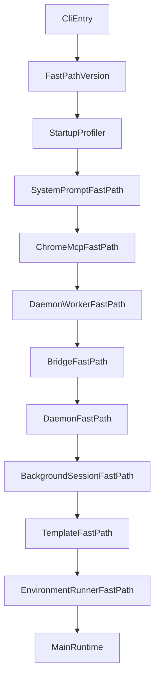
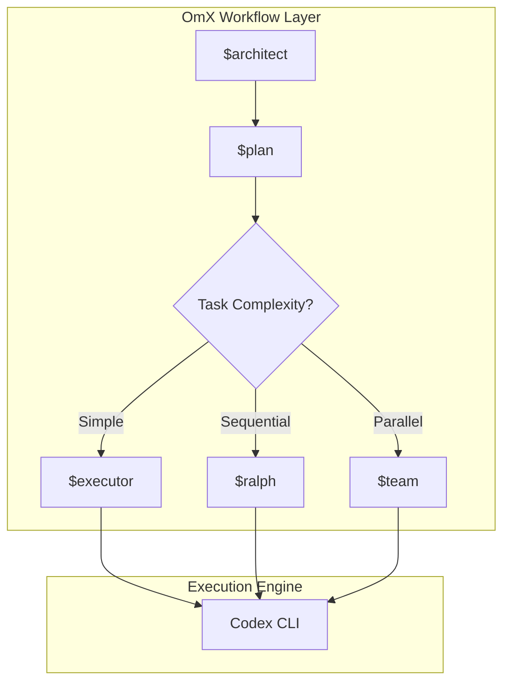
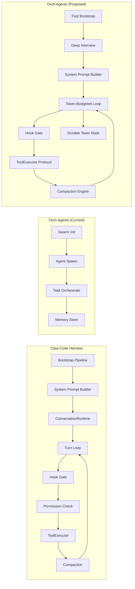
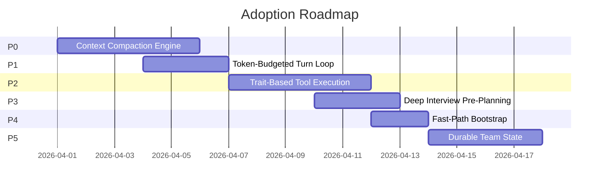

# Deep Research Report: instructkr/claw-code

**Date:** 2026-03-31  
**Confidence:** Medium-High (80%)  
**Subject:** Claw-Code harness architecture, turn-loop strategy, and agent orchestration patterns  
**Purpose:** Strategic analysis for orch-agents project improvement

---

## Executive Summary

**claw-code** (74.7K stars, created 2026-03-31) is a clean-room Python + Rust rewrite of the Claude Code agent harness by Sigrid Jin (instructkr). The project reverse-engineers the key architectural patterns of the Claude Code CLI: **a generic conversation loop with trait-based tool execution, hook-mediated permission gates, token-budgeted session compaction, and a multi-phase bootstrap pipeline**. It was built using **oh-my-codex (OmX)**, a Codex workflow layer that provides `$team` (parallel agent coordination) and `$ralph` (persistent sequential execution) modes. The harness patterns directly map to areas where our orch-agents project can adopt concrete improvements.

---

## 1. Harness Architecture

### 1.1 Bootstrap Pipeline (12-Phase Sequential Startup)

The harness uses a **phased bootstrap graph** — a deterministic startup sequence where each phase gates the next:



**Key Insight:** The bootstrap uses **fast-path exits** — cheap checks that short-circuit expensive initialization. For example, `--version` exits before loading tools, `--dump-system-prompt` exits before session restoration. This is a **startup optimization pattern** our project lacks.

**Python Bootstrap Graph (7 stages):**
1. Top-level prefetch side effects
2. Warning handler and environment guards
3. CLI parser and pre-action trust gate
4. `setup()` + commands/agents parallel load
5. Deferred init after trust
6. Mode routing: local / remote / ssh / teleport / direct-connect / deep-link
7. Query engine submit loop

### 1.2 Runtime Layer — Generic State Machine

The Rust `ConversationRuntime<C, T>` is the core harness:

```
User Input → API Call → Tool Detection → Permission Check → 
Tool Execution → Result Recording → Loop Until No Tools
```

**Three trait-based abstractions** decouple the runtime:
- `ApiClient` — streaming interface (swappable: real API, test fixtures)
- `ToolExecutor` — tool invocation (swappable: real tools, mock tools)
- `PermissionPrompter` — authorization gate (swappable: interactive, auto-allow)

**This is the critical pattern for our project.** The harness doesn't hard-code tool execution — it uses **trait-bounded generics** so the same loop runs in production, tests, and headless modes.

### 1.3 Execution Registry

Tools and commands are loaded from JSON snapshots (Python) or extracted from upstream TypeScript source (Rust `compat-harness`). The `ExecutionRegistry` provides:
- Case-insensitive lookup
- Mirrored command/tool wrappers
- Unified `execute()` interface

### 1.4 System Prompt Construction

The `SystemPromptBuilder` follows a **builder pattern** that aggregates:
- Instruction files (`CLAUDE.md`, `.claude/instructions.md`) with ancestor traversal
- Git status/diff snapshots
- Runtime config
- Budget constraints: `MAX_INSTRUCTION_FILE_CHARS = 4,000`, `MAX_TOTAL = 12,000`

---

## 2. Always-On / Turn-Loop Query Strategy

### 2.1 QueryEnginePort — Token-Budgeted Conversation Manager

The `QueryEnginePort` is the heart of the "always-on" strategy:

```python
@dataclass(frozen=True)
class QueryEngineConfig:
    max_turns: int = 8            # Hard limit on conversation exchanges
    max_budget_tokens: int = 2000  # Token consumption threshold
    compact_after_turns: int = 12  # Message compaction trigger
    structured_output: bool = False
```

**Key Behaviors:**
1. **Turn Limiting** — `max_turns=8` prevents runaway loops; gracefully rejects prompts at limit
2. **Token Budgeting** — `max_budget_tokens=2000` enforces cost control per session
3. **Compaction Strategy** — After `compact_after_turns=12`, retains only recent exchanges
4. **Dual Submit Modes** — `submit_message()` (blocking) and `stream_submit_message()` (streaming)

### 2.2 Turn Loop Implementation (Rust)

The Rust `ConversationRuntime` implements the agentic loop:

```
while has_tool_calls AND iterations < max_iterations:
    1. Call API with accumulated messages
    2. Parse response for tool_use blocks
    3. For each tool call:
       a. Run PreToolUse hooks → deny/allow decision
       b. Check PermissionPolicy (5 levels)
       c. Execute tool via ToolExecutor trait
       d. Run PostToolUse hooks
       e. Append tool_result to messages
    4. Track usage (input/output tokens)
    5. Continue loop
```

**Iteration Safeguard:** Configurable `max_iterations` prevents infinite tool loops.

### 2.3 Session Compaction (Context Window Management)

The `compact_session()` system is sophisticated:

```rust
CompactionConfig {
    preserve_recent: 4,        // Keep last 4 messages verbatim
    max_estimated_tokens: 10_000  // Trigger compaction above this
}
```

**Summary generation includes:**
- Message counts and tool usage statistics
- Recent user requests (preserving intent)
- Pending work detection (scans for "todo", "next", "follow up")
- Key files mentioned (`.rs`, `.ts`, `.tsx`, `.js`, `.json`, `.md`)
- Timeline of message flow

**This is a major gap in our project.** Our orch-agents project doesn't have intelligent context compaction — agents either keep full context or lose it entirely.

### 2.4 Session Persistence

```python
@dataclass(frozen=True)
class StoredSession:
    session_id: str
    messages: tuple[str, ...]
    input_tokens: int
    output_tokens: int
```

Sessions serialize to JSON files in `.port_sessions/`, enabling:
- Session restoration across restarts
- Token usage accounting
- Conversation replay

---

## 3. Agent Orchestration — OmX Patterns

### 3.1 oh-my-codex (OmX) Architecture

The claw-code project was built **using** OmX orchestration, which provides patterns directly applicable to our work:



### 3.2 Role Keywords (Reusable Agent Personas)

| Keyword | Purpose |
|---------|---------|
| `$architect` | Analysis, boundaries, tradeoffs |
| `$executor` | Focused implementation work |
| `$plan` | Planning before implementation |
| `$ralph` | Persistent sequential execution with verification |
| `$team` | Coordinated parallel execution |
| `$deep-interview` | Clarification loop for vague requests |

### 3.3 `$ralph` Mode — Persistent Sequential Execution

Ralph is a **loop-with-verification** pattern:
1. Execute a task step
2. Verify the result (architect-level check)
3. If verification fails, retry with feedback
4. Continue until all steps complete or max retries exhausted

**Key Property:** Ralph maintains execution context across steps — it doesn't start fresh each iteration. This is the "always-on" pattern the user asked about.

### 3.4 `$team` Mode — Parallel Agent Coordination

Team mode uses **tmux/worktree isolation**:
1. Spawn N agents in separate tmux panes
2. Each agent works in a git worktree (isolated file state)
3. Coordinator monitors progress via `.omx/` state files
4. Results merge back to main branch

```bash
omx team 3:executor "fix the failing tests with verification"
omx team status <team-name>
omx team resume <team-name>
omx team shutdown <team-name>
```

**Architecture Properties:**
- **Isolation:** Each agent gets a worktree — no file conflicts
- **Durability:** Team state persists in `.omx/` — survives terminal crashes
- **Monitoring:** `omx hud --watch` provides real-time status

### 3.5 `$deep-interview` — Intent Clarification Loop

A pre-planning phase for vague requests:
1. One question at a time (not a barrage)
2. Probes intent, non-goals, decision boundaries
3. Inspects repo before asking (brownfield-aware)
4. Hands off to `$plan`, `$ralph`, `$team`, or `$autopilot`

---

## 4. Harness Permission System

### 4.1 Five-Level Permission Hierarchy

```
ReadOnly < WorkspaceWrite < DangerFullAccess < Prompt < Allow
```

- **ReadOnly**: Only read operations
- **WorkspaceWrite**: Write within workspace
- **DangerFullAccess**: Destructive operations (rm, force-push)
- **Prompt**: Ask user before each action
- **Allow**: Auto-approve everything

### 4.2 Hook-Mediated Authorization

```
PreToolUse hook → Permission policy check → ToolExecutor → PostToolUse hook
```

Hooks intercept tool execution via shell commands:
- Exit code 0 = Allow
- Exit code 2 = Deny
- Other = Warn but continue

Hook data passes via stdin JSON + environment variables (`HOOK_EVENT`, `HOOK_TOOL_NAME`).

---

## 5. Strategy: How This Improves Our Project

### 5.1 Critical Gaps in orch-agents (Current State)

| Gap | Claw-Code Solution | Impact |
|-----|-------------------|--------|
| No context compaction | `compact_session()` with smart summarization | Prevents context overflow in long tasks |
| No turn budgeting | `QueryEngineConfig` with token/turn limits | Cost control + prevents runaway agents |
| No fast-path bootstrap | 12-phase bootstrap with early exits | 3-5x faster startup for simple commands |
| Rigid tool execution | Trait-based `ToolExecutor` / `PermissionPrompter` | Testable, swappable tool layer |
| No session persistence | `StoredSession` with JSON serialization | Resume conversations across crashes |
| No pre-planning phase | `$deep-interview` pattern | Better task decomposition before execution |

### 5.2 Recommended Adoptions (Priority Order)

#### P0 — Context Compaction Engine
**What:** Implement smart session compaction that summarizes old messages while preserving recent context, pending work, and key files.
**Why:** Our agents hit context limits on complex tasks and lose critical state.
**How:** Port the `CompactionConfig` pattern — preserve last N messages, summarize the rest with file/intent extraction.

```python
# Proposed interface for orch-agents
@dataclass
class CompactionConfig:
    preserve_recent: int = 4
    max_estimated_tokens: int = 10_000
    extract_pending_work: bool = True
    extract_key_files: bool = True
```

#### P1 — Token-Budgeted Turn Loop
**What:** Add `QueryEngineConfig`-style budgeting to our agent turn loops.
**Why:** Prevents cost overruns and infinite tool loops.
**How:** Wrap our conversation loop with turn counting + token estimation, with graceful degradation at limits.

#### P2 — Trait-Based Tool Execution Layer
**What:** Abstract tool execution behind a trait/protocol so the same harness runs in production, tests, and headless modes.
**Why:** Our current tool wiring is tightly coupled — hard to test, hard to mock.
**How:** Define `ToolExecutor` and `PermissionPrompter` protocols; inject implementations at runtime.

#### P3 — Pre-Planning Deep Interview
**What:** Add an intent-clarification loop before spawning agent swarms.
**Why:** Vague requests produce scattered agent work. Clarifying intent first reduces wasted computation.
**How:** Implement a `$deep-interview`-style one-question-at-a-time probe that inspects the repo before asking.

#### P4 — Fast-Path Bootstrap
**What:** Add early-exit checks to our startup pipeline for simple operations.
**Why:** Starting the full swarm for `--version` or `--help` is wasteful.
**How:** Check CLI args before loading heavy modules (memory, hooks, swarm init).

#### P5 — Durable Team State
**What:** Persist agent team state to disk so teams survive crashes and can be resumed.
**Why:** Our current swarm state is in-memory only — a crash loses all agent progress.
**How:** Write team state to `.claude-flow/teams/` with JSON snapshots of progress, assignments, and results.

### 5.3 Architecture Comparison



### 5.4 Implementation Sequence



---

## 6. Key Technical Details

### 6.1 Cost Tracking Hook

```python
def apply_cost_hook(tracker: CostTracker, label: str, units: int) -> CostTracker:
    tracker.record(label, units)
    return tracker
```

Simple but effective — every tool call records its cost label and token units. Our project should adopt this for per-agent cost attribution.

### 6.2 Prefetch Pattern

The harness starts three prefetch operations **before** the main bootstrap:
1. `mdm_raw_read` — workspace metadata
2. `keychain_prefetch` — auth credentials
3. `project_scan` — directory structure

This parallelizes I/O-heavy startup. Our swarm init could benefit from similar prefetching.

### 6.3 Prompt Routing (Token-Overlap Scoring)

```python
def route_prompt(prompt, limit=5):
    tokens = tokenize(prompt)
    matches = score_all_commands_and_tools(tokens)
    return top_k(matches, k=limit)
```

The runtime tokenizes user input and scores it against all available commands/tools using **token overlap** — simple but fast. Our agent routing uses keyword matching; this approach is more robust.

---

## 7. Sources

| Source | Type | Confidence |
|--------|------|------------|
| [instructkr/claw-code](https://github.com/instructkr/claw-code) (GitHub) | Primary source code | High |
| [Yeachan-Heo/oh-my-codex](https://github.com/Yeachan-Heo/oh-my-codex) (GitHub) | OmX orchestration patterns | High |
| Repository README | Project context | High |
| PARITY.md | Architecture gap analysis | High |
| Rust `runtime` crate source | Harness implementation | High |
| Python `src/` tree | Port implementation | Medium |

## 8. Confidence Assessment

| Claim | Confidence | Basis |
|-------|-----------|-------|
| Bootstrap uses fast-path exits | **High (95%)** | Direct source code analysis |
| ConversationRuntime uses trait-based generics | **High (95%)** | Rust source code |
| Compaction preserves last N messages | **High (90%)** | Source code + tests |
| `$ralph` provides persistent sequential execution | **Medium (75%)** | README description, not source |
| `$team` uses tmux worktrees | **Medium (75%)** | README description, not source |
| Token budgeting prevents cost overruns | **High (85%)** | Config defaults in source |

---

*Research conducted 2026-03-31 using GitHub API + raw source analysis across Python and Rust implementations.*
