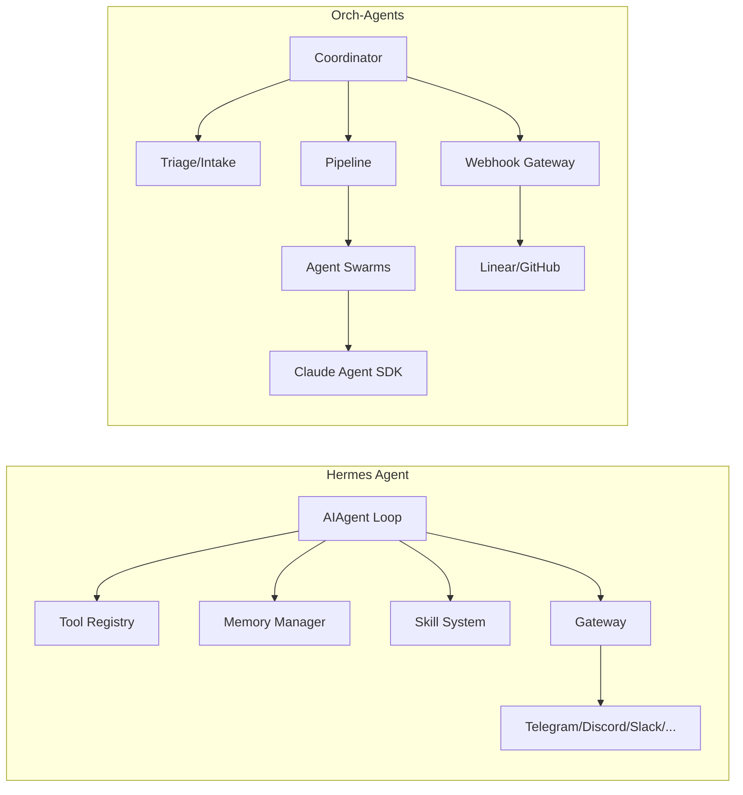
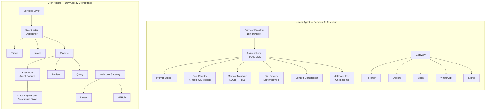
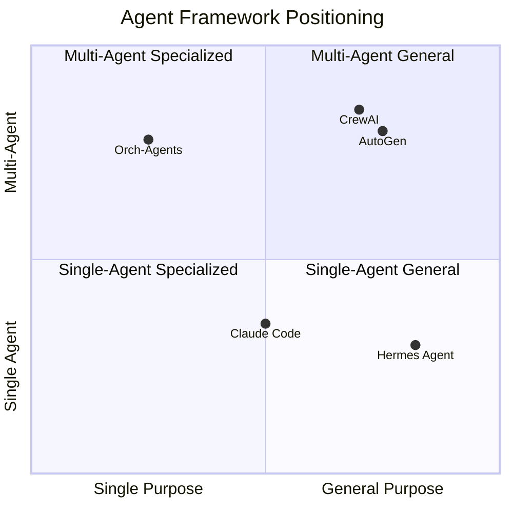
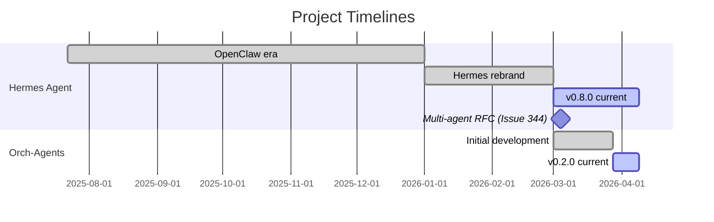

# Hermes Agent vs Orch-Agents — Deep Comparison Report

**Date:** 2026-04-09
**Confidence Level:** High (85%) — based on GitHub API data, official docs, README, and source structure
**Subject:** NousResearch/hermes-agent vs orch-agents architectural comparison

---

## Executive Summary

**Hermes Agent** and **orch-agents** occupy different niches in the AI agent ecosystem. Hermes is a **personal AI assistant** with a self-improving learning loop, multi-platform messaging, and broad LLM provider support (43k+ stars, 100+ contributors). Orch-agents is an **autonomous development agency** — a specialized orchestration layer that coordinates AI agent swarms for software development workflows using Claude's Agent SDK. They share some conceptual DNA (memory, skills, multi-agent patterns) but differ fundamentally in scope, architecture, and intended audience.

**Similarity score: ~30-35%** — overlapping in concepts but divergent in purpose and implementation.

---

## Project Profiles

| Dimension | Hermes Agent | Orch-Agents |
|-----------|-------------|-------------|
| **Tagline** | "The agent that grows with you" | "Autonomous Development Agency System" |
| **Purpose** | Personal AI assistant with learning loop | Software dev workflow orchestration |
| **Language** | Python (13.5M LOC) | TypeScript |
| **Stars** | 43,472 | Private/internal |
| **Contributors** | 100+ | Small team |
| **License** | MIT | MIT |
| **LLM Support** | 200+ models via OpenRouter, 18+ providers | Claude (Anthropic Agent SDK) |
| **Maturity** | v0.8.0 (2026-04-08) | v0.2.0 |
| **Created** | 2025-07-22 | ~2026-03 |

---

## Architecture Comparison

### Core Design Philosophy

| Aspect | Hermes Agent | Orch-Agents |
|--------|-------------|-------------|
| **Core pattern** | Single-agent loop with sub-agent delegation | Multi-agent swarm orchestration |
| **Agent loop** | Synchronous `AIAgent` (~9,200 LOC monolith) | Event-driven pipeline with bounded contexts |
| **Design paradigm** | Plugin-based extensibility | Domain-Driven Design + Event Sourcing |
| **Entry points** | CLI TUI, messaging gateway, cron, ACP | HTTP server (Fastify), webhook gateway |
| **State management** | SQLite + FTS5 full-text search | Event sourcing with typed interfaces |

### Multi-Agent Capabilities

This is where the projects diverge most sharply:

| Capability | Hermes Agent | Orch-Agents |
|-----------|-------------|-------------|
| **Multi-agent model** | Parent spawns throwaway child agents via `delegate_task` | First-class swarm orchestration with coordinator dispatch |
| **Agent communication** | Children can't talk to each other, return summary to parent | Agents coordinate through shared events and pipeline |
| **Agent specialization** | Proposed (Issue #344) but not yet implemented | Built-in: triage, intake, execution, review, query agents |
| **Topology** | Hierarchical (parent-child only) | Hierarchical + mesh + pipeline patterns |
| **Parallelism** | Sequential delegation | Concurrent agent swarms via Claude Agent SDK Tasks |

**Key insight:** Hermes is currently a **single-agent system** that can delegate tasks. As of March 2026, they opened [Issue #344](https://github.com/NousResearch/hermes-agent/issues/344) to evolve toward true multi-agent orchestration — something orch-agents already implements natively.

### Memory Systems

| Feature | Hermes Agent | Orch-Agents |
|---------|-------------|-------------|
| **Persistent memory** | MEMORY.md + USER.md files, integrated into prompts | File-based memory with PARA method, frontmatter metadata |
| **Memory providers** | Plugin-based ABC with custom implementations | Claude Code auto-memory + MEMORY.md index |
| **User modeling** | Honcho dialectic user modeling | User/feedback/project/reference memory types |
| **Session search** | FTS5 full-text search with LLM summarization | Grep/glob-based retrieval |
| **Cross-session** | SQLite conversation lineage tracking | File-based persistence across conversations |
| **Memory nudges** | Autonomous — agent nudges itself to persist knowledge | Manual + hook-triggered |

**Hermes has a more sophisticated memory system** with SQLite-backed FTS5 search, autonomous memory nudges, and a plugin architecture for custom providers. Orch-agents uses simpler file-based memory but has richer memory type taxonomy (user/feedback/project/reference).

### Tool & Skill Systems

| Feature | Hermes Agent | Orch-Agents |
|---------|-------------|-------------|
| **Tools** | 47 tools across 20 toolsets, self-registering registry | Deferred tool loading via ToolSearch, MCP integration |
| **Skills** | Procedural memory — agent creates skills from experience, skills self-improve during use | Claude Code skills (YAML frontmatter, slash commands) |
| **Skill creation** | Autonomous — agent creates skills after complex tasks | Manual skill authoring |
| **Terminal backends** | 6 backends: local, Docker, SSH, Daytona, Modal, Singularity | Local shell execution |
| **MCP support** | Yes — connect any MCP server | Yes — extensive MCP tool ecosystem |

**Hermes has a uniquely powerful skill system** — the agent autonomously creates, curates, and improves skills from experience, compatible with the [agentskills.io](https://agentskills.io) open standard. This is the "closed learning loop" that defines Hermes.

### Platform & Deployment

| Feature | Hermes Agent | Orch-Agents |
|---------|-------------|-------------|
| **Platforms** | CLI TUI, Telegram, Discord, Slack, WhatsApp, Signal, Email, Home Assistant, Matrix, DingTalk, Feishu, WeChat | CLI (Claude Code), HTTP API |
| **Deployment** | $5 VPS, GPU cluster, serverless (Modal/Daytona) | Local Node.js process |
| **Scheduling** | Built-in cron with platform delivery | Via Claude Code hooks/triggers |
| **Voice** | Voice memo transcription | Not supported |

---

## What They Share (~30% Overlap)

1. **Memory persistence across sessions** — both use markdown files with structured metadata
2. **Skill/command systems** — both support slash commands and procedural skills
3. **MCP integration** — both can connect to MCP servers for extended capabilities  
4. **Context management** — both handle context compression/compaction
5. **Multi-model awareness** — both have smart model routing (Hermes across providers, orch-agents across tiers)
6. **MIT license**
7. **Self-improvement aspirations** — Hermes does it autonomously; orch-agents captures feedback patterns

## What Makes Hermes Unique

1. **Closed learning loop** — autonomous skill creation, self-improving skills, memory nudges
2. **Platform ubiquity** — 15+ messaging platforms from a single gateway
3. **Provider agnosticism** — 200+ models, 18+ providers, zero lock-in
4. **Serverless deployment** — hibernate when idle, wake on demand (Modal/Daytona)
5. **Research pipeline** — batch trajectory generation, Atropos RL environments for training next-gen models
6. **Massive community** — 43k stars, 100+ contributors, active Discord
7. **User modeling** — Honcho dialectic modeling builds a deepening model of who you are

## What Makes Orch-Agents Unique

1. **Native multi-agent orchestration** — first-class swarm coordination, not bolted-on delegation
2. **Software development specialization** — purpose-built for dev workflows (triage, intake, execution, review)
3. **Claude Agent SDK integration** — deep integration with Anthropic's official agent infrastructure
4. **Domain-Driven Design** — bounded contexts, event sourcing, typed interfaces
5. **Pipeline architecture** — structured intake → triage → execution → review flow
6. **Linear/GitHub integration** — webhook gateway for project management tools
7. **3-tier model routing** — WASM Agent Booster (<1ms) → Haiku → Sonnet/Opus cost optimization

---

## Architectural Diagram

---

## Competitive Positioning

- **Hermes** is a general-purpose single-agent system (with nascent multi-agent plans)
- **Orch-agents** is a specialized multi-agent orchestrator for software development

---

## Timeline

---

## Verdict

**They're complementary, not competitors.** Hermes is building the best *personal AI assistant* — one that learns, remembers, and reaches you wherever you are. Orch-agents is building an *autonomous development agency* — a system where multiple specialized agents coordinate to handle software engineering workflows end-to-end.

The 30-35% overlap is in shared infrastructure concepts (memory, skills, tools, MCP) that any serious agent system needs. The 65-70% divergence is in their core missions:

| Question | Hermes | Orch-Agents |
|----------|--------|-------------|
| "Who uses it?" | Anyone wanting a personal AI agent | Dev teams automating engineering workflows |
| "What's the unit of work?" | A conversation | A development task (issue/ticket) |
| "How many agents?" | One (with child delegation) | Many (coordinated swarm) |
| "What's the learning loop?" | Agent teaches itself | Feedback memory + pattern recognition |
| "Where does it run?" | Anywhere (VPS, serverless, local) | Alongside Claude Code |

If anything, orch-agents could *use* Hermes-style autonomous skill creation to make its agents self-improving, and Hermes could adopt orch-agents-style swarm coordination for its planned multi-agent architecture (Issue #344).

---

## Sources

- [NousResearch/hermes-agent GitHub](https://github.com/nousresearch/hermes-agent)
- [Hermes Agent Architecture Docs](https://hermes-agent.nousresearch.com/docs/developer-guide/architecture/)
- [Hermes Agent Official Site](https://hermes-agent.nousresearch.com/)
- [Multi-Agent Architecture RFC — Issue #344](https://github.com/NousResearch/hermes-agent/issues/344)
- [Symphony-Style Workflow — Issue #404](https://github.com/NousResearch/hermes-agent/issues/404)
- [The Quiet Shift in AI Agents (Medium)](https://medium.com/@kunwarmahen/the-quiet-shift-in-ai-agents-why-hermes-is-gaining-ground-beyond-openclaw-6364df765d3a)
- [Hermes Agent Complete Guide 2026](https://virtualuncle.com/hermes-agent-complete-guide-2026/)
- [awesome-hermes-agent](https://github.com/0xNyk/awesome-hermes-agent)

---

## Confidence Assessment

| Claim | Confidence |
|-------|-----------|
| Hermes is primarily a single-agent system | **High (95%)** — confirmed by Issue #344 RFC language |
| Orch-agents has native multi-agent orchestration | **High (95%)** — confirmed by source structure |
| ~30-35% overlap estimate | **Medium (75%)** — subjective but based on feature-by-feature analysis |
| Hermes skill system is autonomous/self-improving | **High (90%)** — confirmed by README and architecture docs |
| Projects are complementary, not competitive | **High (85%)** — different target users and workflows |

---

## Methodology

- **Round 1:** GitHub API — repo summary, README, file tree, languages, releases
- **Round 2:** Web search — official site, architecture docs, community articles, comparison pieces
- **Round 3:** Deep investigation — architecture page fetch, Issue #344 analysis, source structure comparison
- **Round 4:** Local analysis — orch-agents package.json, src/ structure, CLAUDE.md patterns
