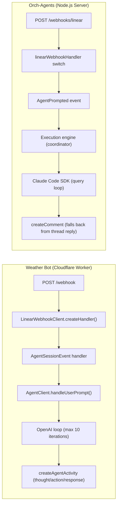

# Comparative Analysis: Linear Weather Bot vs Orch-Agents

| Field | Value |
|-------|-------|
| **Document Type** | Comparative Research Report |
| **Date** | 2026-04-04 |
| **Subject** | Linear Agent API comment/response implementation |
| **Confidence** | High (95%) -- direct source code analysis |
| **Weather Bot** | github.com/linear/weather-bot -- 53 stars, TypeScript, Cloudflare Worker |
| **Orch-Agents** | Internal -- v0.2.0, TypeScript/Node.js |

---

## Executive Summary

Linear's weather-bot is the **official reference implementation** for the Linear Agent API. It demonstrates how agents should handle `AgentSessionEvent` webhooks and respond via `AgentActivity` entries. Our orch-agents system has a fundamentally different architecture (multi-agent orchestrator vs single-agent responder) but must follow the same Linear API contract.

Key finding: the weather-bot uses **Agent Activities exclusively** for all communication -- no `createComment`. Our system still falls back to `createComment` for coordinator responses, which posts as the OAuth user instead of the bot.

---

## Architecture Comparison



## Key Differences

| Dimension | Weather Bot | Orch-Agents |
|-----------|-------------|-------------|
| **Runtime** | Cloudflare Worker (stateless) | Node.js server (stateful) |
| **LLM** | OpenAI gpt-4o-mini | Claude Code SDK (Opus/Sonnet) |
| **Response channel** | `createAgentActivity` (always) | `createComment` (fallback) |
| **Conversation history** | Fetches previous activities from Linear API | No session continuity (fresh per comment) |
| **Webhook handling** | `@linear/sdk` `LinearWebhookClient` | Manual HMAC verification + switch |
| **OAuth storage** | Cloudflare KV | Node.js SQLite |
| **Tool execution** | Custom tool loop (3 tools) | Claude Code with full tool access |
| **Max iterations** | 10 | Unlimited (coordinator decides) |
| **Activity types** | thought, action, response, error, elicitation | Only `createComment` for responses |
| **Prompt context** | Issue title + comment body + previous activities | Issue title + description + comment body |

---

## Critical Gap: Response Channel

### Weather Bot (correct pattern)

The weather-bot **never uses `createComment`**. All communication goes through the Agent Activity API:

```typescript
// Every step uses createAgentActivity
await this.linearClient.createAgentActivity({
  agentSessionId,
  content: { type: "thought", body: "..." },  // thinking step
});

await this.linearClient.createAgentActivity({
  agentSessionId,
  content: { type: "action", action: "getWeather", parameter: "..." },  // tool use
});

await this.linearClient.createAgentActivity({
  agentSessionId,
  content: { type: "response", body: "..." },  // final answer
});
```

Activities appear in Linear's **agent activity feed** (the sidebar panel), attributed to the **app actor** (bot identity).

### Orch-Agents (current behavior)

Our system posts the final response as a **top-level comment** via `createComment`:

```typescript
// simple-executor.ts line 316
await deps.linearClient.createComment(linearIssueId, linearSummary);
```

This results in:
1. Response appears as a **comment** (not in the activity feed)
2. Attributed to the **OAuth authorizing user** (not the bot)
3. No thought/action activity steps visible to the user
4. No conversation continuity (each comment starts fresh)

### Recommendation

Replace `createComment` with `createAgentActivity({ type: 'response', body })` for all Linear-triggered responses. Use `thought` activities for intermediate steps and `action` activities for tool use.

---

## Critical Gap: Conversation History

### Weather Bot

```typescript
// agentClient.ts -- fetches ALL previous activities for context
private async generateMessagesFromPreviousActivities(agentSessionId: string) {
  const agentSession = await this.linearClient.agentSession(agentSessionId);
  let activitiesConnection = await agentSession.activities();
  
  // Paginates through all activities
  while (hasNextPage) { ... }
  
  // Maps to OpenAI message format: prompt -> "user", response -> "assistant"
  return activities.map(a => ({
    role: a.content.type === "Prompt" ? "user" : "assistant",
    content: a.content.body,
  }));
}
```

This gives the LLM **full conversation history** so follow-up questions work naturally.

### Orch-Agents

Each `AgentPrompted` event creates a **fresh coordinator session** with no memory of previous interactions. The coordinator sees:
- Issue title + description
- Current comment text
- **No previous conversation**

### Recommendation

Before executing a coordinator session, fetch previous activities from the Linear Agent Session API and include them as conversation context.

---

## What Weather Bot Does Better

### 1. Streaming Activity Updates

Weather bot emits **thought** activities as the agent works, giving the user real-time visibility:
```
[thought] Looking up coordinates for Paris...
[action] getCoordinates("Paris") -> {lat: 48.86, long: 2.35}
[action] getWeather(48.86, 2.35) -> {temp: 15, condition: "cloudy"}
[response] The weather in Paris is 15C and cloudy.
```

Our coordinator runs for 89-227 seconds silently, then dumps the entire output as one comment.

### 2. Prompt Generation from Webhook

```typescript
generateUserPrompt(webhook: AgentSessionEventWebhookPayload): string {
  const issueTitle = webhook.agentSession.issue?.title;
  const commentBody = webhook.agentSession.comment?.body;
  if (issueTitle && commentBody) {
    return `Issue: ${issueTitle}\n\nTask: ${commentBody}`;
  }
  // ...
}
```

Clean, uses `webhook.agentSession.comment?.body` for the comment and `webhook.agentSession.issue?.title` for context. We fetch the issue separately via GraphQL.

### 3. Elicitation Support

Weather bot supports `elicitation` activity type -- asking the user a clarifying question and pausing until they respond. Our system has no equivalent.

---

## What Orch-Agents Does Better

### 1. Multi-Agent Orchestration
Weather bot is single-agent (one OpenAI call loop). Orch-agents can spawn parallel research workers, implementation workers, and verification workers.

### 2. Full Claude Code Tool Access
Weather bot has 3 hardcoded tools. Orch-agents gives agents Read, Write, Edit, Bash, Grep, Glob, and MCP tools -- full codebase access.

### 3. Context Compaction (P0)
Weather bot has no context management. Orch-agents has multi-tier compaction (auto-compact, snip, reactive) for long-running sessions.

### 4. Review Gate
Weather bot has no quality checks. Orch-agents has DiffReviewer + TestRunner + SecurityScanner + FixItLoop.

---

## Patterns to Adopt from Weather Bot

| # | Pattern | Priority | Effort |
|---|---------|----------|--------|
| 1 | Use `createAgentActivity` for ALL responses (not `createComment`) | **Critical** | Low |
| 2 | Emit `thought` activities during coordinator execution | **High** | Medium |
| 3 | Fetch previous session activities for conversation continuity | **High** | Medium |
| 4 | Use `webhook.agentSession.comment?.body` from SDK payload | **Medium** | Low |
| 5 | Support `elicitation` activity type for clarifying questions | **Low** | Medium |
| 6 | Use `@linear/sdk` `LinearWebhookClient` instead of manual HMAC | **Low** | Medium |

---

## Sources

| # | Source | Type |
|---|--------|------|
| 1 | github.com/linear/weather-bot (src/index.ts, src/lib/agent/agentClient.ts, src/lib/types.ts) | Primary |
| 2 | Orch-agents source code (src/execution/simple-executor.ts, src/integration/linear/) | Primary |
| 3 | Linear Agent API documentation (inferred from SDK types) | Reference |
