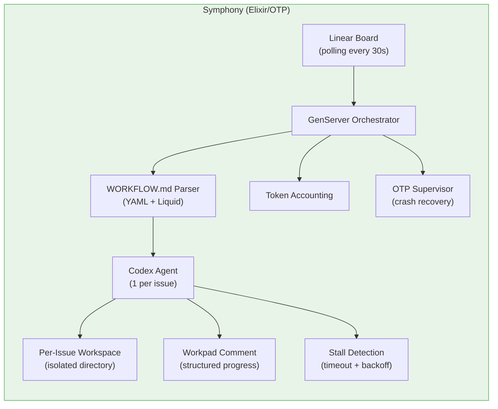
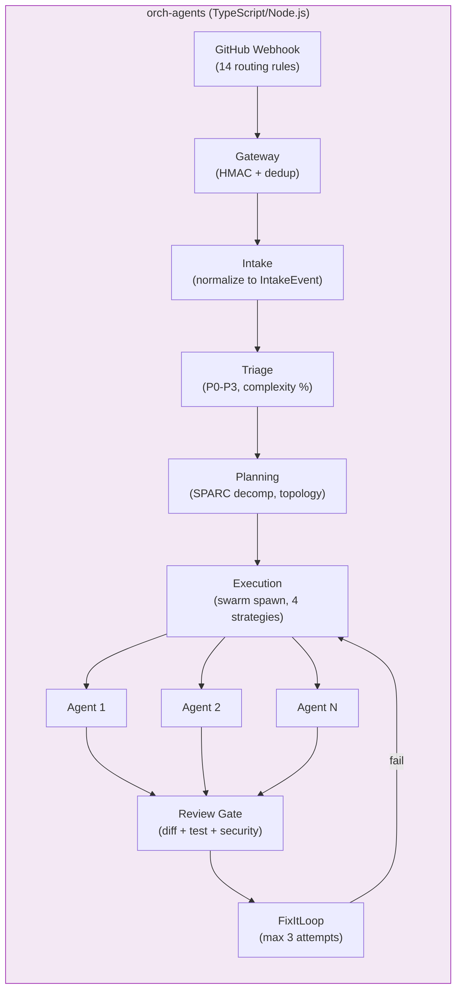
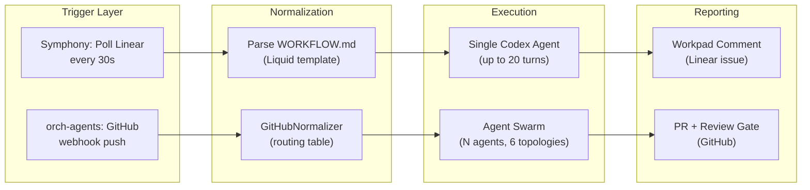
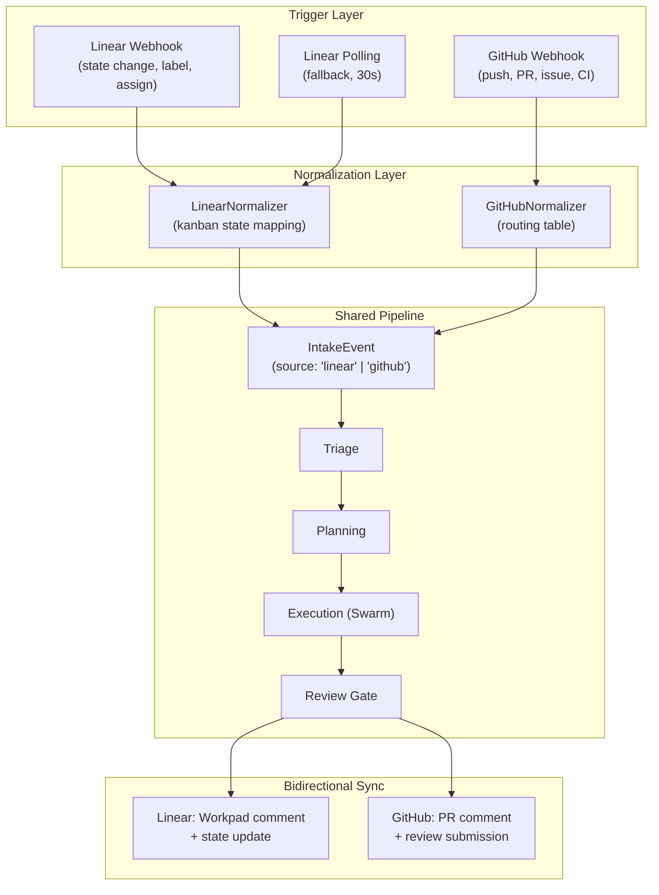

# Comparative Analysis: OpenAI Symphony vs orch-agents

| Field | Value |
|-------|-------|
| **Document Type** | Strategic Research Report |
| **Date** | 2026-03-26 |
| **Author** | System Architecture Team |
| **Version** | 1.0 |
| **Status** | Final |
| **Classification** | Internal |
| **Product A** | OpenAI Symphony (OpenAI) -- Apache 2.0, 14K stars, Elixir/OTP |
| **Product B** | orch-agents (Internal) -- v0.2.0, 10,705 LOC, TypeScript/Node.js |

---

## Table of Contents

1. [Executive Summary](#1-executive-summary)
2. [Architecture Comparison](#2-architecture-comparison)
3. [Feature Matrix](#3-feature-matrix)
4. [What Symphony Does Better](#4-what-symphony-does-better)
5. [What orch-agents Does Better](#5-what-orch-agents-does-better)
6. [The Dual-Trigger Architecture](#6-the-dual-trigger-architecture)
7. [Patterns to Adopt from Symphony](#7-patterns-to-adopt-from-symphony)
8. [Patterns to NOT Adopt](#8-patterns-to-not-adopt)
9. [Risk Assessment](#9-risk-assessment)
10. [Sources](#10-sources)

---

## 1. Executive Summary

OpenAI Symphony is a kanban-to-agent bridge. It watches a Linear project board, detects when a human moves an issue to a work state, and dispatches a single Codex agent to handle it. After four weeks and three contributors (all OpenAI employees), it has accumulated 14K stars -- a signal of intense market interest in the "project management triggers AI agents" pattern.

Symphony validates the core thesis behind orch-agents' planned dual-trigger model: that human-directed kanban workflows and autonomous webhook-driven workflows are complementary, not competing, trigger sources. The key insight is that both models ultimately produce the same artifact -- a work item with intent, context, and constraints -- and the downstream pipeline should be agnostic to the trigger source.

However, Symphony and orch-agents are architecturally opposite systems. Symphony is a single-agent, single-integration, polling-based orchestrator built on Elixir/OTP supervision trees. orch-agents is a multi-agent, event-sourced, webhook-native pipeline with swarm coordination, SPARC methodology, and composable review gates. Symphony excels at the narrow problem of "Linear card moves, agent works." orch-agents has the structural foundation to absorb Symphony's trigger model while preserving everything Symphony lacks: multi-agent collaboration, GitHub-native automation, topology-aware routing, and automated code review with fix-it loops.

The strategic recommendation is clear: adopt Symphony's best patterns (Workpad comments, stall detection, hot workflow reload, per-issue workspace isolation) as a new Linear integration bounded context within orch-agents. Do NOT adopt its polling architecture, single-agent limitation, or Codex-only model binding. The result is a dual-trigger system where Linear provides the human-directed channel and GitHub provides the autonomous channel, both feeding into the same 6-phase pipeline.

---

## 2. Architecture Comparison

### 2.1 Symphony Architecture



### 2.2 orch-agents Architecture



### 2.3 Side-by-Side Flow Comparison



### 2.4 Key Architectural Differences

| Dimension | Symphony | orch-agents |
|-----------|----------|-------------|
| **Runtime** | Elixir/OTP (BEAM VM) | TypeScript/Node.js |
| **Concurrency model** | Actor model (GenServer) | Event-sourced pipeline (EventEmitter, future NATS) |
| **Trigger mechanism** | Polling (30s interval) | Webhooks (sub-second) |
| **Agent cardinality** | 1 agent per issue | N agents per work item (swarm) |
| **Agent model** | Codex-only | 3-tier routing (WASM/Haiku/Sonnet-Opus) |
| **Configuration** | Single WORKFLOW.md | Routing JSON + workflow templates + SPARC |
| **State management** | GenServer state + Linear API | Event-sourced domain events |
| **Fault tolerance** | OTP supervision trees | FixItLoop + ReviewGate (no process supervisor) |
| **Integration surface** | Linear only | GitHub (14 rules), extensible IntakeEvent.source |
| **Code review** | None (agent self-reports) | Composable ReviewGate (diff + test + security) |
| **Workspace isolation** | Per-issue directory with path safety | Per-plan git worktree |

---

## 3. Feature Matrix

| Feature | Symphony | orch-agents | Notes |
|---------|:--------:|:-----------:|-------|
| **Trigger: GitHub webhooks** | - | Yes | 14 routing rules, HMAC verification |
| **Trigger: Linear webhooks** | - | - | Symphony uses polling, not webhooks |
| **Trigger: Linear polling** | Yes | - | 30s interval, GraphQL |
| **Trigger: Schedule** | - | Typed | IntakeEvent.source includes 'schedule' |
| **Multi-agent swarms** | - | Yes | 18 categories, 6 topologies, consensus |
| **Single-agent per issue** | Yes | Yes | orch-agents supports this as minimal topology |
| **Event sourcing** | - | Yes | 28 domain event types |
| **SPARC methodology** | - | Yes | 5-phase decomposition |
| **Code review gate** | - | Yes | Diff + test + security scoring |
| **FixItLoop** | - | Yes | Up to 3 automated fix attempts |
| **Workpad comments** | Yes | - | Structured progress on issue |
| **Stall detection** | Yes | - | Timeout + exponential backoff |
| **Hot workflow reload** | Yes | - | FileSystem watcher on WORKFLOW.md |
| **Token accounting** | Yes | Partial | Dorothy tracks per-agent TokenUsage |
| **Per-issue workspace isolation** | Yes | Yes | Symphony: directory; orch-agents: git worktree |
| **Bot loop prevention** | - | Yes | Sender ID + bot marker + username check |
| **Multi-turn execution** | Yes (20 turns) | Yes | orch-agents uses phase-based turns |
| **Configurable workflow templates** | Yes (Liquid) | Yes (JSON + SPARC) | Different templating approaches |
| **Bidirectional sync** | Yes (Linear) | Yes (GitHub) | Each syncs back to its source |
| **Rate limiting** | - | Yes | EventBuffer with per-repo limits |
| **Deduplication** | - | Yes | Delivery ID-based dedup |
| **Signature verification** | - | Yes | HMAC-SHA256 |
| **Streaming observability** | - | Yes | Dorothy layer with per-agent tracking |
| **Skills system** | Yes (.codex/skills/*.md) | - | Reusable agent skill definitions |
| **3-tier model routing** | - | Yes | WASM/Haiku/Sonnet-Opus cost optimization |
| **Topology selection** | - | Yes | mesh/hierarchical/ring/star/adaptive |
| **Consensus protocols** | - | Typed | raft/pbft/none (wiring in progress) |

---

## 4. What Symphony Does Better

### 4.1 Workpad Comment Pattern

Symphony's standout UX feature. When an agent starts working on a Linear issue, it creates a structured "Workpad" comment -- a persistent scratchpad that the agent updates as it progresses. This gives humans a single place to observe progress, debug stalls, and understand what the agent is doing without switching context to a terminal or log viewer.

orch-agents has Dorothy streaming for internal observability, but no equivalent outward-facing progress artifact on the source issue or PR. This is a clear adoption target.

### 4.2 Stall Detection with Exponential Backoff

Symphony monitors each agent for activity and triggers stall detection if no progress is made within a configurable timeout. It uses exponential backoff for retries, preventing thundering-herd scenarios when Linear or Codex APIs are slow.

orch-agents has FixItLoop for code quality retries but no general-purpose stall detection for agent execution. The Dorothy layer tracks `lastActivity` timestamps on `AgentExecState`, which provides the foundation to build this.

### 4.3 Hot Workflow Reload

Symphony watches its WORKFLOW.md file and reloads configuration without restarting the process. This enables rapid iteration on workflow definitions in development and zero-downtime config changes in production.

orch-agents loads routing rules from `config/github-routing.json` at startup via `readFileSync` with a lazy singleton cache. Adding a file watcher and cache invalidation would be straightforward.

### 4.4 Single-File Configuration Simplicity

WORKFLOW.md with YAML frontmatter + Liquid templates is genuinely elegant for the single-integration case. One file, one format, human-readable, version-controlled. It dramatically lowers the barrier to entry.

orch-agents' multi-file configuration (routing JSON, workflow templates, SPARC phases, config.ts environment parsing) is more powerful but harder to onboard. For the Linear integration specifically, adopting a simpler per-team configuration format (TEAM.md or similar) would improve DX.

### 4.5 Token Accounting Across All Agents

Symphony tracks token usage across all agents and provides a unified cost view. orch-agents tracks per-agent `TokenUsage` via Dorothy but does not aggregate across a work item or provide a cost dashboard.

### 4.6 Per-Issue Workspace Isolation with Path Safety

Symphony creates isolated directories per issue and validates all file paths to prevent directory traversal. orch-agents uses git worktrees (stronger isolation) but the path safety validation is worth auditing against Symphony's approach.

---

## 5. What orch-agents Does Better

### 5.1 Multi-Agent Collaboration

The fundamental structural advantage. Symphony dispatches exactly one agent per issue. orch-agents can spawn coordinated swarms of N agents across 6 topologies with consensus protocols. For any work item that benefits from decomposition (feature builds, large refactors, multi-file changes), this is not incrementally better -- it is categorically different.

### 5.2 Event-Sourced Pipeline

orch-agents' 28 domain event types flowing through a typed EventBus provide auditability, replay capability, and clean bounded context separation. Symphony uses GenServer state, which is ephemeral and not replayable. For compliance, debugging, and learning from past decisions, event sourcing is a structural advantage.

### 5.3 GitHub-Native Automation

orch-agents is built for the autonomous case: push to main triggers validation, PR opened triggers review, CI failure triggers debug. These happen without any human action. Symphony requires a human to move a card. Both are valuable, but GitHub webhooks are the prerequisite for fully autonomous operation.

### 5.4 Composable Review Gate

The ReviewGate (diff analysis + test verification + security scanning) with FixItLoop is a complete quality assurance pipeline. Symphony relies on the agent to self-report quality. This is the difference between "the agent says it's done" and "the system verified it's done."

### 5.5 SPARC Methodology

Structured decomposition from specification through completion with phase gates between each step. Symphony's agents work in an unstructured multi-turn loop. For complex work items, SPARC provides repeatability and quality control that freeform execution cannot match.

### 5.6 3-Tier Model Routing

Cost optimization through intelligent model selection (WASM for trivial transforms, Haiku for simple tasks, Sonnet/Opus for complex reasoning). Symphony is bound to Codex. This matters at scale: a system processing hundreds of issues per day cannot afford to use the most expensive model for every task.

### 5.7 Extensible Source Typing

`IntakeEvent.source` is already typed as `'github' | 'client' | 'schedule' | 'system'`. Adding `'linear'` is a one-line type change. The pipeline is already source-agnostic by design. Symphony was built for Linear only and has no abstraction layer for alternative trigger sources.

### 5.8 Streaming Observability

The Dorothy layer provides per-agent execution tracking with chunk-level granularity, tool use detection, and cancellation support. Symphony has no equivalent real-time observability into agent execution.

---

## 6. The Dual-Trigger Architecture

### 6.1 Core Concept

The dual-trigger model treats Linear and GitHub as complementary trigger sources feeding a single, source-agnostic pipeline. The distinction is operational intent:

- **Linear (hands-on)**: A human moves a card, assigns a label, or changes priority. This is deliberate, considered work direction. The human is actively managing what the agents work on.
- **GitHub (autonomous)**: A push, PR, or CI event triggers agents automatically. No human action is required. The system responds to repository activity on its own.

Both produce the same `IntakeEvent` structure. The only difference is the `source` field.

### 6.2 Dual-Trigger Flow



### 6.3 IntakeEvent.source Extension

The existing type in `src/types.ts` line 47:

```typescript
source: 'github' | 'client' | 'schedule' | 'system';
```

Becomes:

```typescript
source: 'github' | 'linear' | 'client' | 'schedule' | 'system';
```

No downstream pipeline changes required. Triage, Planning, Execution, and Review are already source-agnostic. They operate on `IntakeEvent.intent` and `IntakeEvent.entities`, not on `IntakeEvent.source`.

### 6.4 Kanban State Mapping

| Linear State | IntakeEvent Mapping |
|-------------|---------------------|
| Backlog -> Todo | intent: `custom:linear-todo`, priority: P2-standard |
| Todo -> In Progress | intent: `custom:linear-start`, priority: P1-high |
| In Progress -> Done | intent: `custom:linear-done` (verification pass) |
| In Progress -> Todo (bounce) | intent: `custom:linear-blocked` |
| Label added: `bug` | template: `tdd-workflow` |
| Label added: `feature` | template: `feature-build` |
| Label added: `security` | template: `security-audit` |
| Assigned to bot user | intent: `custom:linear-assigned` |
| Priority changed to Urgent | priority override: P0-immediate |

### 6.5 Why Both Triggers Together

The dual-trigger model is more than additive. It enables workflows that neither trigger can support alone:

1. **Human-initiated, machine-completed**: A PM moves a card to Todo. Agents pick it up, build a PR, push to GitHub. The GitHub trigger then handles CI validation and code review autonomously.
2. **Machine-detected, human-confirmed**: A CI failure triggers automatic debug analysis. The agent posts findings as a Workpad comment on the corresponding Linear issue. A human reviews and decides whether to let the agent fix it.
3. **Continuous handoff**: GitHub webhook triggers agent to analyze a PR. Agent updates the Linear card with findings. PM reviews on the kanban board and moves card to "Approved." Agent picks up the state change and merges.

---

## 7. Patterns to Adopt from Symphony

### Pattern 1: Workpad Comment

**What**: Structured progress comment posted to the source issue, updated as the agent progresses through phases.

**Why**: Provides human-visible progress without requiring access to agent logs. Critical for the Linear trigger where the human is actively watching the board.

**Implementation**: New `WorkpadReporter` class in `src/integration/linear/`. Subscribe to `PhaseStarted`, `PhaseCompleted`, `AgentSpawned`, `AgentCompleted` events. Format progress into a structured Markdown comment. Post via Linear GraphQL `commentCreate` mutation. Use an HTML comment marker (`<!-- orch-agents-workpad -->`) to identify and update the same comment.

**Effort**: Medium. ~200 LOC.

### Pattern 2: Stall Detection

**What**: Monitor agent execution for periods of inactivity. If no progress within a configurable timeout, trigger recovery.

**Why**: Agents can hang on API calls, enter infinite loops, or stall on ambiguous instructions. Without detection, stalled work items block the pipeline silently.

**Implementation**: Timer-based check on `AgentExecState.lastActivity` in the Dorothy layer. Configurable timeout per complexity level (trivial: 60s, small: 300s, medium: 600s, large: 1200s). On stall: emit `WorkPaused` event, update Workpad comment, optionally restart agent.

**Effort**: Small. ~100 LOC. Foundation already exists in Dorothy's `AgentExecState`.

### Pattern 3: Exponential Backoff for Retries

**What**: When retrying failed operations (API calls, agent restarts), use exponential backoff with jitter.

**Why**: Prevents thundering herd when external APIs (Linear, GitHub, model providers) are under load. Symphony's implementation handles this well.

**Implementation**: Generic `retryWithBackoff(fn, opts)` utility in `src/shared/`. Use for Linear API calls, GitHub API calls, and agent restart logic. Base delay: 1s, max delay: 60s, jitter: +/- 25%.

**Effort**: Small. ~50 LOC utility.

### Pattern 4: Hot Workflow Reload

**What**: Watch configuration files for changes and reload without restart.

**Why**: Zero-downtime configuration changes. Enables rapid iteration in development.

**Implementation**: `fs.watch` on `config/github-routing.json` and any future `config/linear-routing.json`. On change: validate JSON schema, swap the cached routing table via existing `resetRoutingTable()`, log the reload. Guard with debounce (500ms) to handle editor save storms.

**Effort**: Small. ~80 LOC.

### Pattern 5: Token Accounting Aggregation

**What**: Aggregate per-agent token usage into per-work-item and per-period cost reports.

**Why**: Cost visibility is a prerequisite for cost optimization. Cannot improve what you do not measure.

**Implementation**: Subscribe to `AgentCompleted` events. Accumulate `tokenUsage.input` and `tokenUsage.output` per `planId`. Expose via `/api/costs/:planId` endpoint. Store in event log for historical analysis.

**Effort**: Medium. ~150 LOC.

### Pattern 6: Per-Issue Workspace Path Safety

**What**: Validate all file paths produced by agents to prevent directory traversal.

**Why**: Defense in depth. Even with git worktree isolation, validating that agent-generated paths stay within the workspace prevents a class of security issues.

**Implementation**: Audit existing worktree path handling in `src/execution/`. Add `isPathWithinWorkspace(base, target)` check using `path.resolve` + `startsWith`. Apply at artifact-apply boundary.

**Effort**: Small. ~40 LOC.

### Pattern 7: Skills System

**What**: Reusable agent skill definitions stored as Markdown files that agents can reference.

**Why**: Reduces prompt duplication across workflow templates. Enables a library of domain-specific capabilities.

**Implementation**: `config/skills/*.md` directory. Skills loaded and injected into agent system prompts based on workflow template requirements. Referenced by name in routing configuration.

**Effort**: Medium. ~120 LOC loader + template integration.

### Pattern 8: Single-File Team Configuration

**What**: A TEAM.md or similar file that defines team-level preferences for kanban mapping, workflow selection, and notification rules.

**Why**: Lowers onboarding friction for the Linear integration. Teams can configure their agent behavior without touching TypeScript.

**Implementation**: `TEAM.md` in repo root with YAML frontmatter. Parsed at startup and on file change (hot reload). Fields: linear_project_id, kanban_mapping, default_template, notification_channels.

**Effort**: Medium. ~150 LOC parser + validation.

### Pattern 9: Multi-Turn Execution Budget

**What**: Configurable maximum number of turns (agent re-invocations) per work item.

**Why**: Prevents runaway cost on ambiguous or impossible tasks. Symphony caps at 20 turns.

**Implementation**: Add `maxTurns` to `WorkflowPlan`. Track turn count in execution phase. Emit `WorkFailed` when budget exhausted. Default: 10 for standard, 20 for complex.

**Effort**: Small. ~60 LOC.

### Pattern 10: Bidirectional State Sync

**What**: As agents progress through pipeline phases, update the source system (Linear or GitHub) with current state.

**Why**: Closes the feedback loop. Without this, the human who triggered the work has no visibility into progress.

**Implementation**: Event-driven. Subscribe to phase transition events. Map pipeline state back to Linear issue state or GitHub PR status. Use Workpad for Linear, PR comments for GitHub.

**Effort**: Large (combined with Patterns 1 and other sync logic). ~300 LOC.

---

## 8. Patterns to NOT Adopt

### 8.1 Polling Architecture

**Why not**: Polling every 30 seconds introduces 0-30 second latency on every trigger. Webhooks are sub-second. For the autonomous GitHub trigger, polling is unacceptable. Even for Linear, webhooks are available and preferred.

**What instead**: Use Linear webhooks as primary, polling as fallback only (for environments where webhook delivery is unreliable).

### 8.2 Single-Agent-Per-Issue Limitation

**Why not**: This is Symphony's fundamental architectural constraint, not a deliberate design choice. Complex work items benefit from decomposition across multiple agents with different specializations.

**What instead**: Keep orch-agents' swarm model. Use single-agent as the `minimal` swarm strategy for simple tasks (matching Symphony's behavior when appropriate), but retain the ability to scale up.

### 8.3 Codex-Only Model Binding

**Why not**: Model lock-in prevents cost optimization and capability matching. A type annotation fix does not need Opus. A security audit should not be run on Haiku.

**What instead**: Keep 3-tier model routing. Map Linear task complexity to appropriate tier.

### 8.4 Elixir/OTP Runtime

**Why not**: Introducing a second runtime language fragments the team's expertise, doubles the build toolchain, and complicates deployment. OTP supervision trees are excellent, but Node.js process management (PM2, systemd, container orchestration) is well-understood.

**What instead**: Stay TypeScript. Adopt the supervision pattern conceptually (restart failed agents, track health) without adopting the runtime.

### 8.5 WORKFLOW.md as Sole Configuration

**Why not**: A single configuration file works for a single integration. orch-agents has multiple trigger sources, multiple routing strategies, and per-repo customization needs. A single file cannot express this complexity without becoming unwieldy.

**What instead**: Use TEAM.md for team-level Linear configuration (adopted as Pattern 8). Keep the existing multi-file configuration for the rest.

### 8.6 Linear-Only Integration

**Why not**: Symphony's value proposition is entirely tied to Linear. If a team uses Jira, Asana, or Shortcut, Symphony is useless. orch-agents should add Linear as one source among many, not as the only project management integration.

**What instead**: Design the integration layer with an abstraction (`ProjectManagementNormalizer`) that Linear implements. Future integrations (Jira, Asana) implement the same interface.

### 8.7 No Review Gate

**Why not**: Symphony trusts the agent to self-assess quality. This is insufficient for production codebases where automated testing, security scanning, and diff review provide objective quality signals.

**What instead**: Keep ReviewGate + FixItLoop. Apply them to Linear-triggered work items with the same rigor as GitHub-triggered ones.

---

## 9. Risk Assessment

### 9.1 Integration Risks

| Risk | Likelihood | Impact | Mitigation |
|------|-----------|--------|------------|
| Linear API rate limits (1800 req/hr) | Medium | Medium | Exponential backoff, request batching, cache issue state locally |
| Linear webhook delivery failures | Low | High | Polling fallback mode, webhook replay on reconnect |
| Concurrent state changes (human + agent) | Medium | High | StateReconciler with last-write-wins + conflict detection |
| Linear schema changes | Low | Medium | GraphQL schema pinning, integration tests against Linear sandbox |
| Workpad comment size limits | Low | Low | Truncation with "see full log" link |

### 9.2 Architectural Risks

| Risk | Likelihood | Impact | Mitigation |
|------|-----------|--------|------------|
| Pipeline bottleneck at normalization | Low | Medium | Linear and GitHub normalizers are stateless, horizontally scalable |
| Event bus backpressure from dual triggers | Medium | Medium | Rate limiting per source, priority queuing for P0 events |
| Feature flag complexity (LINEAR_ENABLED) | Low | Low | Clean bounded context separation, no shared state |
| Scope creep into Jira/Asana before Linear is stable | Medium | High | Defer abstraction layer until Linear integration is proven |

---

## 10. Sources

| # | Source | Type | Notes |
|---|--------|------|-------|
| 1 | OpenAI Symphony GitHub repository | Primary | Architecture, code, WORKFLOW.md format |
| 2 | Symphony README + ARCHITECTURE.md | Primary | Design decisions, polling model, OTP supervision |
| 3 | orch-agents source code (v0.2.0) | Primary | 10.7K LOC, 864 tests, all source files referenced in this report |
| 4 | orch-agents architecture document | Primary | Section 8.3 domain events, Section 8.1 routing rules |
| 5 | Linear API documentation | Reference | GraphQL schema, webhook event types, rate limits |
| 6 | Linear webhook specification | Reference | Event payloads, delivery guarantees, retry policy |
| 7 | Previous research: claude-code-action vs orch-agents (2026-03-17) | Internal | Established comparison methodology and format |
