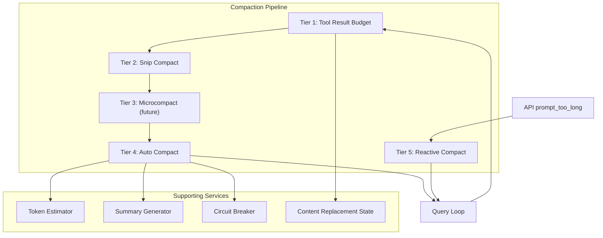

# SPARC Spec: P0 — Multi-Tier Context Compaction Engine

**Phase:** P0 (Critical)  
**Priority:** Highest  
**Estimated Effort:** 7 days  
**Source Blueprint:** Claude Code Original — `services/compact/` (5 files, ~120K LOC total)

---

## S — Specification

### 1. Requirements

```yaml
specification:
  functional_requirements:
    - id: "FR-P0-001"
      description: "System shall compact conversation context when token usage exceeds configurable threshold"
      priority: "critical"
      acceptance_criteria:
        - "Auto-compact triggers at (context_window - 13K buffer) tokens"
        - "Compacted messages preserve recent N messages verbatim"
        - "Summary includes pending work, key files, and decision history"
        - "Compaction runs as a forked side-query (does not block main loop)"

    - id: "FR-P0-002"
      description: "System shall remove individual tool results by ID when they exceed per-message budget"
      priority: "high"
      acceptance_criteria:
        - "Tool results over 50K chars are truncated with '[content replaced]' marker"
        - "tool_use blocks are preserved (only tool_result content is removed)"
        - "Removal is tracked via ContentReplacementState for session restore"

    - id: "FR-P0-003"
      description: "System shall truncate old messages beyond a configurable snip boundary"
      priority: "high"
      acceptance_criteria:
        - "Messages older than snip boundary are removed entirely"
        - "tokensFreed metric reported to downstream compaction tiers"
        - "Snip boundary message yielded to transcript for auditability"

    - id: "FR-P0-004"
      description: "System shall implement reactive compaction as emergency recovery on prompt_too_long"
      priority: "high"
      acceptance_criteria:
        - "Fires only when API returns prompt_too_long error"
        - "Single-shot guard (hasAttemptedReactiveCompact) prevents infinite loops"
        - "Falls back to surfacing the error if compaction cannot recover"

    - id: "FR-P0-005"
      description: "System shall implement circuit breaker for auto-compact failures"
      priority: "medium"
      acceptance_criteria:
        - "After 3 consecutive failures, stop retrying auto-compact"
        - "Circuit breaker resets on successful compaction"
        - "Failure count persisted across loop iterations via AutoCompactTrackingState"

  non_functional_requirements:
    - id: "NFR-P0-001"
      category: "performance"
      description: "Compaction summary generation must complete within 10 seconds"
      measurement: "p95 latency of compactConversation() call"

    - id: "NFR-P0-002"
      category: "accuracy"
      description: "Post-compact context must retain all information needed to continue the task"
      measurement: "Manual review of summary vs original for key file paths, pending work, and decisions"

    - id: "NFR-P0-003"
      category: "cost"
      description: "Compaction API call should use <20K output tokens"
      measurement: "MAX_OUTPUT_TOKENS_FOR_SUMMARY = 20_000"
```

### 2. Constraints

```yaml
constraints:
  technical:
    - "Must integrate with existing claude-flow memory system"
    - "Must work with both Opus and Sonnet models (different context windows)"
    - "Token estimation uses chars/4 approximation (no tokenizer dependency)"
    - "Compaction runs as forked agent — cannot access parent's mutable state"

  architectural:
    - "Tiers must compose: snip -> microcompact -> auto-compact pipeline"
    - "Each tier reduces work for the next — they are NOT mutually exclusive"
    - "Session persistence must survive compaction (compacted messages serialize to JSON)"

  compatibility:
    - "Must not break existing swarm agent memory store/retrieve"
    - "Must preserve tool_use block IDs for session restoration"
```

### 3. Use Cases

```yaml
use_cases:
  - id: "UC-P0-001"
    title: "Long Agent Session Hits Context Limit"
    actor: "Swarm Agent"
    preconditions:
      - "Agent has been running for 20+ turns"
      - "Token usage exceeds auto-compact threshold"
    flow:
      1. "Agent submits query to model"
      2. "Pre-query check: tokenCountWithEstimation > threshold"
      3. "Auto-compact fires: fork side-query with summarization prompt"
      4. "Summary generated preserving recent 4 messages + key context"
      5. "Post-compact messages replace original messages"
      6. "Original query retried with compacted context"
    postconditions:
      - "Token usage reduced by 50-70%"
      - "Agent continues working without context loss"
    exceptions:
      - "Compaction fails: circuit breaker increments, retry next iteration"
      - "Compaction still over limit: reactive compact fires on API error"

  - id: "UC-P0-002"
    title: "Emergency Recovery from prompt_too_long"
    actor: "Query Loop"
    preconditions:
      - "Auto-compact disabled or failed"
      - "API returns prompt_too_long error"
    flow:
      1. "Error withheld from caller (not yielded yet)"
      2. "Reactive compact attempts full conversation compaction"
      3. "If successful: retry with compacted messages"
      4. "If failed: surface original error to caller"
    postconditions:
      - "Session recovers or exits gracefully"
```

### 4. Acceptance Criteria (Gherkin)

```gherkin
Feature: Multi-Tier Context Compaction

  Scenario: Auto-compact triggers at threshold
    Given an agent session with 150K estimated tokens
    And the auto-compact threshold is 140K tokens
    When the query loop checks token usage
    Then auto-compact should fire
    And post-compact token count should be under 80K
    And recent 4 messages should be preserved verbatim

  Scenario: Microcompact removes oversized tool results
    Given a message with a tool_result of 100K characters
    And the per-message budget is 50K characters
    When microcompact runs before the API call
    Then the tool_result content should be replaced with a placeholder
    And the tool_use block should be preserved unchanged

  Scenario: Circuit breaker stops after 3 failures
    Given auto-compact has failed 3 consecutive times
    When the next auto-compact check runs
    Then it should skip compaction entirely
    And log "circuit breaker open" to diagnostics

  Scenario: Reactive compact recovers from prompt_too_long
    Given the API returns a prompt_too_long error
    And reactive compact has not been attempted this turn
    When reactive compact fires
    Then the conversation should be summarized
    And the query should retry with compacted messages
```

---

## P — Pseudocode

### Core Data Structures

```
DATA STRUCTURES:

CompactionConfig:
    Type: Frozen Dataclass
    Fields:
        - preserveRecent: int = 4
        - autoCompactBufferTokens: int = 13_000
        - maxOutputForSummary: int = 20_000
        - maxConsecutiveFailures: int = 3
        - microcompactBudgetChars: int = 50_000

AutoCompactTrackingState:
    Type: Mutable State
    Fields:
        - compacted: boolean
        - turnCounter: int
        - turnId: string (UUID)
        - consecutiveFailures: int = 0

ContentReplacementRecord:
    Type: Immutable Record
    Fields:
        - toolUseId: string
        - originalSize: int
        - replacementMarker: string
        - timestamp: number
```

### Tier 1: Tool Result Budget

```
ALGORITHM: ApplyToolResultBudget
INPUT: messages (Message[]), budget (int = 50_000)
OUTPUT: messages (Message[]) with oversized results replaced

BEGIN
    FOR EACH message IN messages DO
        IF message.type === 'user' AND hasToolResult(message) THEN
            FOR EACH block IN message.content DO
                IF block.type === 'tool_result' THEN
                    size <- characterCount(block.content)
                    IF size > budget THEN
                        replacement <- createReplacementRecord(block.tool_use_id, size)
                        block.content <- "[Content replaced - original was " + size + " chars]"
                        trackReplacement(replacement)
                    END IF
                END IF
            END FOR
        END IF
    END FOR
    RETURN messages
END
```

### Tier 2: Snip Compact

```
ALGORITHM: SnipCompactIfNeeded
INPUT: messages (Message[]), snipBoundary (int)
OUTPUT: { messages: Message[], tokensFreed: int, boundaryMessage?: Message }

BEGIN
    IF messages.length <= snipBoundary THEN
        RETURN { messages, tokensFreed: 0 }
    END IF

    snipPoint <- findSnipBoundary(messages, snipBoundary)
    removedMessages <- messages.slice(0, snipPoint)
    tokensFreed <- estimateTokens(removedMessages)
    keptMessages <- messages.slice(snipPoint)

    boundaryMessage <- createSnipBoundaryMessage(
        removedCount: removedMessages.length,
        tokensFreed: tokensFreed
    )

    RETURN { messages: keptMessages, tokensFreed, boundaryMessage }
END
```

### Tier 3: Auto Compact

```
ALGORITHM: AutoCompactIfNeeded
INPUT:
    messages (Message[]),
    toolUseContext (ToolUseContext),
    cacheSafeParams (CacheSafeParams),
    tracking (AutoCompactTrackingState),
    snipTokensFreed (int)
OUTPUT: { compactionResult?: CompactionResult, consecutiveFailures?: int }

CONSTANTS:
    AUTOCOMPACT_BUFFER = 13_000
    MAX_CONSECUTIVE_FAILURES = 3

BEGIN
    // Check circuit breaker
    IF tracking.consecutiveFailures >= MAX_CONSECUTIVE_FAILURES THEN
        RETURN { consecutiveFailures: tracking.consecutiveFailures }
    END IF

    // Check threshold
    currentTokens <- tokenCountWithEstimation(messages) - snipTokensFreed
    threshold <- getEffectiveContextWindow(model) - AUTOCOMPACT_BUFFER

    IF currentTokens < threshold THEN
        RETURN {}  // No compaction needed
    END IF

    // Run compaction as forked side-query
    TRY
        result <- compactConversation(
            messages,
            cacheSafeParams,
            preserveRecent: 4
        )

        // Validate post-compact size
        postCompactTokens <- tokenCountWithEstimation(result.summaryMessages)
        IF postCompactTokens >= threshold THEN
            RETURN { consecutiveFailures: (tracking.consecutiveFailures + 1) }
        END IF

        RETURN { compactionResult: result }

    CATCH error
        logError("Auto-compact failed", error)
        RETURN { consecutiveFailures: (tracking.consecutiveFailures + 1) }
    END TRY
END
```

### Tier 4: Reactive Compact (Emergency)

```
ALGORITHM: TryReactiveCompact
INPUT:
    hasAttempted (boolean),
    messages (Message[]),
    cacheSafeParams (CacheSafeParams)
OUTPUT: CompactionResult | null

BEGIN
    // Single-shot guard
    IF hasAttempted THEN
        RETURN null
    END IF

    TRY
        result <- compactConversation(messages, cacheSafeParams, preserveRecent: 4)
        RETURN result
    CATCH error
        logError("Reactive compact failed", error)
        RETURN null
    END TRY
END
```

### Compaction Summary Generator

```
ALGORITHM: GenerateCompactionSummary
INPUT: messages (Message[]), preserveRecent (int = 4)
OUTPUT: summaryText (string)

BEGIN
    oldMessages <- messages.slice(0, -preserveRecent)

    // Extract structured information
    filesModified <- extractFilePaths(oldMessages, ['.ts', '.tsx', '.js', '.py', '.rs'])
    pendingWork <- extractPendingWork(oldMessages, ['todo', 'next', 'follow up', 'remaining'])
    toolsUsed <- countToolUsage(oldMessages)
    keyDecisions <- extractDecisions(oldMessages)
    userRequests <- extractUserRequests(oldMessages)

    summary <- buildStructuredSummary(
        messageCount: oldMessages.length,
        toolsUsed,
        filesModified,
        pendingWork,
        keyDecisions,
        userRequests,
        timeline: buildMessageTimeline(oldMessages)
    )

    RETURN summary
END

SUBROUTINE: ExtractPendingWork
INPUT: messages, keywords
OUTPUT: pendingItems (string[])

BEGIN
    pendingItems <- []
    FOR EACH message IN messages DO
        text <- getTextContent(message)
        FOR EACH keyword IN keywords DO
            IF text.toLowerCase().includes(keyword) THEN
                sentence <- extractSentenceContaining(text, keyword)
                pendingItems.append(sentence)
            END IF
        END FOR
    END FOR
    RETURN deduplicate(pendingItems)
END
```

### Complexity Analysis

```
ANALYSIS: Multi-Tier Compaction Pipeline

Tier 1 - Tool Result Budget:
    Time: O(m * b) where m = messages, b = blocks per message
    Space: O(r) where r = replacement records

Tier 2 - Snip Compact:
    Time: O(s) where s = snipped messages (token estimation)
    Space: O(1) — in-place slice

Tier 3 - Auto Compact:
    Time: O(n) for token estimation + API call latency (~5-10s)
    Space: O(n) for summary generation

Tier 4 - Reactive Compact:
    Time: Same as Tier 3 (only fires on error recovery)
    Space: Same as Tier 3

Full Pipeline: O(m*b + s + n) per query iteration
    Dominated by API call latency, not computation
```

---

## A — Architecture

### Component Design



### File Structure

```
src/services/compact/
  index.ts                    — Public API: compactIfNeeded(), reactiveCompact()
  autoCompact.ts              — Threshold calculation, circuit breaker, tracking state
  compactConversation.ts      — Core summarization logic (forked side-query)
  summaryGenerator.ts         — Structured summary builder
  microcompact.ts             — Per-tool-result removal
  snipCompact.ts              — History truncation at snip boundary
  toolResultBudget.ts         — Per-message content size cap
  contentReplacementState.ts  — Track replaced content for session restore
  types.ts                    — CompactionConfig, CompactionResult, etc.
```

### Interface Contracts

```typescript
// Public API
export interface CompactionService {
  compactIfNeeded(
    messages: Message[],
    model: string,
    tracking: AutoCompactTrackingState,
    snipTokensFreed: number
  ): Promise<CompactionPipelineResult>;

  reactiveCompact(
    messages: Message[],
    hasAttempted: boolean
  ): Promise<CompactionResult | null>;
}

// Configuration
export interface CompactionConfig {
  preserveRecent: number;           // Default: 4
  autoCompactBufferTokens: number;  // Default: 13_000
  maxOutputForSummary: number;      // Default: 20_000
  maxConsecutiveFailures: number;   // Default: 3
  microcompactBudgetChars: number;  // Default: 50_000
}

// Result types
export interface CompactionResult {
  summaryMessages: Message[];
  preCompactTokenCount: number;
  postCompactTokenCount: number;
  compactionUsage?: { input_tokens: number; output_tokens: number };
}

export interface CompactionPipelineResult {
  compactionResult?: CompactionResult;
  consecutiveFailures?: number;
}
```

### Integration Points

```yaml
integration:
  query_loop:
    - "Pre-query: run pipeline (TRB -> Snip -> MC -> AC)"
    - "Post-API-error: run reactive compact"
    - "State propagation: AutoCompactTrackingState carried between iterations"

  session_persistence:
    - "Compacted messages serialize to JSON session file"
    - "ContentReplacementState persists for /resume"
    - "Summary messages include compact boundary markers"

  agent_tool:
    - "Subagents inherit parent's compaction config"
    - "In-process teammates compact independently"
    - "Fork subagents share parent's compacted context"

  memory_system:
    - "Compaction summary stored in memory for cross-session recall"
    - "Key files and decisions preserved in memory after compact"
```

---

## R — Refinement

### Test Plan

```typescript
// tests/services/compact/autoCompact.test.ts
describe('AutoCompact', () => {
  it('should trigger when tokens exceed threshold', async () => {
    const messages = createMessagesWithTokens(150_000);
    const tracking = createTrackingState({ compacted: false });
    const result = await compactIfNeeded(messages, 'opus', tracking, 0);
    expect(result.compactionResult).toBeDefined();
    expect(result.compactionResult!.postCompactTokenCount)
      .toBeLessThan(100_000);
  });

  it('should preserve recent 4 messages verbatim', async () => {
    const messages = createMessagesWithTokens(150_000);
    const last4 = messages.slice(-4);
    const result = await compactIfNeeded(messages, 'opus', tracking, 0);
    const postMessages = result.compactionResult!.summaryMessages;
    expect(postMessages.slice(-4)).toEqual(last4);
  });

  it('should circuit-break after 3 consecutive failures', async () => {
    const tracking = createTrackingState({ consecutiveFailures: 3 });
    const result = await compactIfNeeded(messages, 'opus', tracking, 0);
    expect(result.compactionResult).toBeUndefined();
  });

  it('should subtract snipTokensFreed from threshold check', () => {
    const tokens = 145_000;
    const threshold = 140_000;
    const snipFreed = 10_000;
    expect(tokens - snipFreed < threshold).toBe(true);
  });
});

// tests/services/compact/toolResultBudget.test.ts
describe('ToolResultBudget', () => {
  it('should replace tool results over 50K chars', () => {
    const message = createToolResultMessage(100_000);
    const result = applyToolResultBudget([message], 50_000);
    expect(result[0].content[0].content).toContain('[Content replaced');
  });

  it('should preserve tool_use blocks unchanged', () => {
    const messages = createMessagesWithToolUse();
    const result = applyToolResultBudget(messages, 50_000);
    const toolUseBlocks = result.flatMap(m =>
      m.content.filter(b => b.type === 'tool_use'));
    expect(toolUseBlocks.length).toBeGreaterThan(0);
  });
});

// tests/services/compact/reactiveCompact.test.ts
describe('ReactiveCompact', () => {
  it('should recover from prompt_too_long', async () => {
    const result = await reactiveCompact(largeMessages, false);
    expect(result).not.toBeNull();
    expect(result!.postCompactTokenCount).toBeLessThan(threshold);
  });

  it('should return null on second attempt (single-shot guard)', async () => {
    const result = await reactiveCompact(largeMessages, true);
    expect(result).toBeNull();
  });
});
```

### Performance Targets

```yaml
performance_targets:
  compaction_latency:
    p50: "3 seconds"
    p95: "8 seconds"
    p99: "15 seconds"

  token_reduction:
    minimum: "40%"
    target: "60%"
    maximum: "80%"

  summary_output_tokens:
    p99: "17,387 tokens"
    budget: "20,000 tokens"

  pipeline_overhead:
    token_estimation: "<10ms"
    tool_result_budget: "<50ms"
    snip_compact: "<20ms"
```

### Optimization Notes

```yaml
optimizations:
  - "Token estimation uses chars/4 — avoid importing a tokenizer"
  - "Snip runs BEFORE auto-compact to reduce summarization input"
  - "Microcompact uses tool_use_id index for O(1) lookup"
  - "Reactive compact shares compactConversation() with auto-compact"
  - "Circuit breaker avoids wasting API calls on irrecoverable states"
  - "Summary generator extracts files by extension filter (cheap regex)"
```
