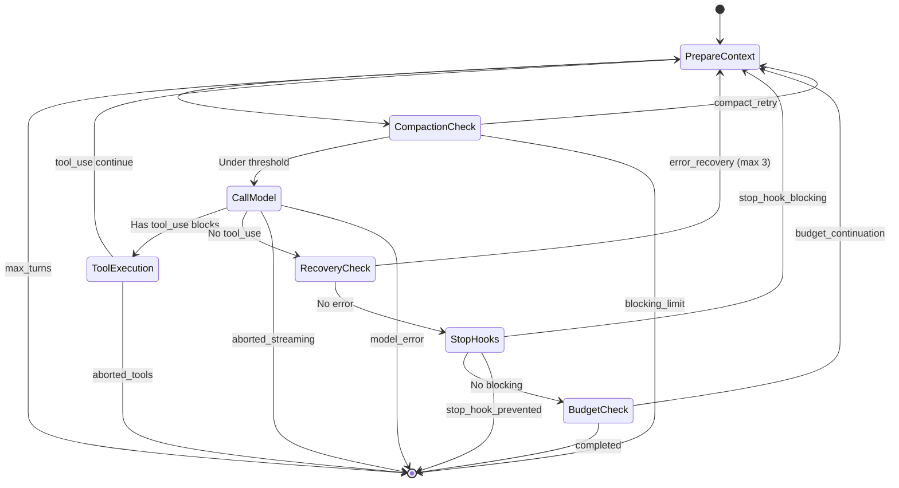

# SPARC Spec: P1 — Query Loop with Continue Transitions

**Phase:** P1 (High)  
**Priority:** High  
**Estimated Effort:** 5 days  
**Source Blueprint:** Claude Code Original — `query.ts` (69K), `query/transitions.ts`, `query/deps.ts`

---

## S — Specification

### 1. Requirements

```yaml
specification:
  functional_requirements:
    - id: "FR-P1-001"
      description: "Query loop shall run as AsyncGenerator yielding stream events, messages, and tool results"
      priority: "critical"
      acceptance_criteria:
        - "Loop runs while(true) with explicit Terminal return for exit"
        - "Each iteration: prepare context -> call model -> process tools -> decide transition"
        - "Yields StreamEvent, Message, ToolUseSummaryMessage types"

    - id: "FR-P1-002"
      description: "Query loop shall support at minimum 6 continue transitions"
      priority: "critical"
      acceptance_criteria:
        - "tool_use: model returned tool_use blocks -> execute tools, append results, re-query"
        - "compact_retry: compaction completed -> retry with compacted messages"
        - "budget_continuation: under 90% token budget -> inject nudge, continue"
        - "error_recovery: max_output_tokens hit -> inject resume message (max 3 retries)"
        - "stop_hook_blocking: stop hook returned errors -> inject errors, retry"
        - "queued_command: slash command in queue -> execute inline"

    - id: "FR-P1-003"
      description: "Query loop shall support at minimum 8 terminal transitions"
      priority: "high"
      acceptance_criteria:
        - "completed: normal completion (no tool_use, no hooks blocking)"
        - "blocking_limit: hard token limit reached"
        - "model_error: API or runtime error"
        - "aborted_streaming: user cancelled during stream"
        - "aborted_tools: user cancelled during tool execution"
        - "prompt_too_long: unrecoverable after compaction attempts"
        - "max_turns: hard turn limit reached"
        - "stop_hook_prevented: stop hook blocked continuation"

    - id: "FR-P1-004"
      description: "Loop state shall be immutable between transitions — each Continue creates a new State object"
      priority: "high"
      acceptance_criteria:
        - "State type is destructured at top of each iteration"
        - "Continue sites write state = { ...newState } (never mutate fields)"
        - "Transition reason tracked for test assertions and analytics"

    - id: "FR-P1-005"
      description: "Query loop shall integrate with P0 compaction pipeline"
      priority: "high"
      acceptance_criteria:
        - "Pre-query: run compaction pipeline on messages"
        - "On compaction success: continue with compact_retry transition"
        - "On API prompt_too_long: try reactive compact before surfacing error"

  non_functional_requirements:
    - id: "NFR-P1-001"
      category: "reliability"
      description: "Loop must never enter infinite state — all continue paths must converge to terminal"
      measurement: "max_turns hard limit + circuit breakers on each recovery path"

    - id: "NFR-P1-002"
      category: "observability"
      description: "Every transition emits analytics event with reason, turn count, and token usage"
      measurement: "logEvent calls at each continue/terminal site"

    - id: "NFR-P1-003"
      category: "testability"
      description: "QueryDeps injectable for unit testing (mock API calls, UUID generation)"
      measurement: "All external dependencies injected via deps parameter"
```

### 2. Constraints

```yaml
constraints:
  technical:
    - "Must be an AsyncGenerator (yield* composition with inner generators)"
    - "State carried via State type — not closure variables"
    - "AbortController signal checked at every yield point"
    - "Max turns enforced as hard limit regardless of other transitions"

  architectural:
    - "Query loop owns message accumulation — callers only see yielded events"
    - "Tool execution delegated to toolOrchestration (P4)"
    - "Compaction delegated to compaction pipeline (P0)"
    - "Budget tracking delegated to tokenBudget module (P3)"
```

### 3. Acceptance Criteria (Gherkin)

```gherkin
Feature: Query Loop with Continue Transitions

  Scenario: Normal tool_use loop
    Given the model returns a tool_use block for "read_file"
    When the query loop processes the response
    Then it should execute the tool
    And append the tool_result to messages
    And continue with transition reason "tool_use"
    And re-query the model

  Scenario: Max output tokens recovery
    Given the model hits max_output_tokens limit
    And recovery count is 0 (under limit of 3)
    When the error is detected after streaming
    Then the error should be withheld from the caller
    And a recovery message "Resume directly — no recap" should be injected
    And the loop should continue with transition "error_recovery"

  Scenario: Max output tokens exhausted
    Given max_output_tokens recovery has been attempted 3 times
    When the model hits the limit again
    Then the withheld error should be surfaced to the caller
    And the loop should return terminal "completed"

  Scenario: Turn limit enforcement
    Given maxTurns is set to 50
    And the current turn count is 50
    When the loop checks the turn limit
    Then it should return terminal "max_turns"
    And not execute any more tools

  Scenario: Abort during streaming
    Given the user presses Ctrl+C during model streaming
    When the abort signal fires
    Then synthetic tool_result blocks should be generated for pending tools
    And an interruption message should be yielded
    And the loop should return terminal "aborted_streaming"
```

---

## P — Pseudocode

### Core State Machine

```
TYPE Terminal = {
    reason: 'completed' | 'blocking_limit' | 'model_error'
           | 'aborted_streaming' | 'aborted_tools' | 'prompt_too_long'
           | 'max_turns' | 'stop_hook_prevented'
    error?: unknown
}

TYPE Continue = {
    reason: 'tool_use' | 'compact_retry' | 'error_recovery'
           | 'budget_continuation' | 'stop_hook_blocking' | 'queued_command'
}

TYPE State = {
    messages: Message[]
    toolUseContext: ToolUseContext
    autoCompactTracking: AutoCompactTrackingState | undefined
    maxOutputRecoveryCount: int
    hasAttemptedReactiveCompact: boolean
    turnCount: int
    transition: Continue | undefined  // Why previous iteration continued
}
```

### Main Query Loop

```
ALGORITHM: QueryLoop
INPUT: params (QueryParams)
OUTPUT: Terminal (via return) + yields StreamEvents/Messages

BEGIN
    state <- {
        messages: params.messages,
        toolUseContext: params.toolUseContext,
        autoCompactTracking: undefined,
        maxOutputRecoveryCount: 0,
        hasAttemptedReactiveCompact: false,
        turnCount: 1,
        transition: undefined
    }

    WHILE true DO
        // 1. Destructure state (read-only within iteration)
        { messages, toolUseContext, turnCount, ... } <- state

        // 2. Check turn limit
        IF turnCount > params.maxTurns THEN
            RETURN { reason: 'max_turns' }
        END IF

        // 3. Run compaction pipeline (P0)
        compactionResult <- compactIfNeeded(messages, model, tracking, snipTokensFreed)
        IF compactionResult.compactionResult THEN
            state <- { ...state, messages: compactionResult.postCompactMessages,
                       transition: { reason: 'compact_retry' } }
            CONTINUE
        END IF

        // 4. Check blocking limit (when auto-compact is OFF)
        IF isAtBlockingLimit(messages, model) THEN
            yield createErrorMessage(PROMPT_TOO_LONG)
            RETURN { reason: 'blocking_limit' }
        END IF

        // 5. Call model with streaming
        yield { type: 'stream_request_start' }
        assistantMessages <- []
        toolUseBlocks <- []
        needsFollowUp <- false

        TRY
            FOR EACH message IN callModelStream(messages, systemPrompt, tools) DO
                // Check abort
                IF abortController.signal.aborted THEN
                    yield* generateSyntheticToolResults(assistantMessages)
                    yield createInterruptionMessage()
                    RETURN { reason: 'aborted_streaming' }
                END IF

                yield message

                IF message.type === 'assistant' THEN
                    assistantMessages.push(message)
                    blocks <- extractToolUseBlocks(message)
                    IF blocks.length > 0 THEN
                        toolUseBlocks.push(...blocks)
                        needsFollowUp <- true
                    END IF
                END IF
            END FOR
        CATCH error
            yield createErrorMessage(error.message)
            RETURN { reason: 'model_error', error }
        END TRY

        // 6. Process tool_use blocks (main continue path)
        IF needsFollowUp THEN
            toolResults <- []
            FOR EACH update IN runTools(toolUseBlocks, canUseTool, toolUseContext) DO
                IF update.message THEN
                    yield update.message
                    toolResults.push(update.message)
                END IF
            END FOR

            // Check abort during tools
            IF abortController.signal.aborted THEN
                yield createInterruptionMessage()
                RETURN { reason: 'aborted_tools' }
            END IF

            state <- {
                messages: [...messages, ...assistantMessages, ...toolResults],
                toolUseContext: updatedContext,
                turnCount: turnCount + 1,
                maxOutputRecoveryCount: 0,
                transition: { reason: 'tool_use' }
            }
            CONTINUE
        END IF

        // 7. No tool_use — check for recoverable errors

        // 7a. Max output tokens recovery
        lastMessage <- assistantMessages.at(-1)
        IF lastMessage.apiError === 'max_output_tokens' THEN
            IF maxOutputRecoveryCount < 3 THEN
                recoveryMsg <- createUserMessage(
                    "Resume directly — no recap. Pick up mid-thought."
                )
                state <- {
                    messages: [...messages, ...assistantMessages, recoveryMsg],
                    maxOutputRecoveryCount: maxOutputRecoveryCount + 1,
                    transition: { reason: 'error_recovery' }
                }
                CONTINUE
            END IF
            yield lastMessage  // Surface error after exhausting retries
        END IF

        // 7b. Stop hooks
        stopResult <- handleStopHooks(messages, assistantMessages, toolUseContext)
        IF stopResult.preventContinuation THEN
            RETURN { reason: 'stop_hook_prevented' }
        END IF
        IF stopResult.blockingErrors.length > 0 THEN
            state <- {
                messages: [...messages, ...assistantMessages, ...stopResult.blockingErrors],
                transition: { reason: 'stop_hook_blocking' }
            }
            CONTINUE
        END IF

        // 7c. Token budget continuation (P3)
        budgetDecision <- checkTokenBudget(budgetTracker, turnTokens)
        IF budgetDecision.action === 'continue' THEN
            nudgeMsg <- createUserMessage(budgetDecision.nudgeMessage)
            state <- {
                messages: [...messages, ...assistantMessages, nudgeMsg],
                transition: { reason: 'budget_continuation' }
            }
            CONTINUE
        END IF

        // 8. Normal completion
        RETURN { reason: 'completed' }
    END WHILE
END
```

### Complexity Analysis

```
ANALYSIS: Query Loop

Time per iteration:
    - Compaction check: O(n) for token estimation
    - Model call: Network-bound (2-30s)
    - Tool execution: Variable (0-60s per tool)
    - Transition decision: O(1)
    Total: Dominated by model + tool latency

Space:
    - State object: O(1) fixed fields
    - Messages array: O(m) grows with conversation
    - Tool results: O(t) per iteration
    Total: O(m) — bounded by compaction

Loop convergence guarantee:
    - maxTurns hard limit (default: 200)
    - maxOutputRecoveryCount capped at 3
    - hasAttemptedReactiveCompact single-shot
    - Circuit breaker on auto-compact (3 failures)
    - All continue paths increment turnCount or have bounded retries
```

---

## A — Architecture

### State Machine Diagram



### File Structure

```
src/query/
  index.ts          — Public API: query() AsyncGenerator
  queryLoop.ts      — Inner while(true) loop with state machine
  transitions.ts    — Terminal and Continue type definitions
  deps.ts           — Injectable dependencies (callModel, uuid, microcompact)
  config.ts         — Immutable per-session config (gates, session state)
  tokenBudget.ts    — Budget tracking + continue/stop decisions (P3)
  stopHooks.ts      — Post-completion hook handling
  types.ts          — State, QueryParams, StreamEvent types
```

### Dependency Injection

```typescript
export interface QueryDeps {
  callModel: (params: ModelCallParams) => AsyncGenerator<StreamEvent>;
  uuid: () => string;
  microcompact: (messages: Message[], ctx: ToolUseContext) => Promise<MicrocompactResult>;
  autocompact: (messages: Message[], tracking: TrackingState) => Promise<CompactionPipelineResult>;
}

// Production
export function productionDeps(): QueryDeps {
  return { callModel: callAnthropicAPI, uuid: randomUUID, microcompact, autocompact };
}

// Test
export function testDeps(responses: StreamEvent[][]): QueryDeps {
  return { callModel: createScriptedModel(responses), uuid: () => 'test-uuid', ... };
}
```

---

## R — Refinement

### Test Plan

```typescript
describe('QueryLoop', () => {
  it('should complete normally when model returns text only', async () => {
    const deps = testDeps([[textMessage('Hello')]]);
    const result = await consumeGenerator(query({ ...params, deps }));
    expect(result.terminal.reason).toBe('completed');
  });

  it('should loop on tool_use and re-query', async () => {
    const deps = testDeps([
      [toolUseMessage('read_file', { path: '/foo' })],  // Turn 1
      [textMessage('File contents are...')],              // Turn 2
    ]);
    const result = await consumeGenerator(query({ ...params, deps }));
    expect(result.transitions).toContainEqual({ reason: 'tool_use' });
    expect(result.terminal.reason).toBe('completed');
  });

  it('should enforce maxTurns hard limit', async () => {
    const deps = testDeps(Array(100).fill([toolUseMessage('bash', {})]));
    const result = await consumeGenerator(query({ ...params, deps, maxTurns: 5 }));
    expect(result.terminal.reason).toBe('max_turns');
  });

  it('should recover from max_output_tokens up to 3 times', async () => {
    const deps = testDeps([
      [maxOutputTokensError()],
      [maxOutputTokensError()],
      [maxOutputTokensError()],
      [textMessage('Finally done')],
    ]);
    const result = await consumeGenerator(query({ ...params, deps }));
    expect(result.transitions.filter(t => t.reason === 'error_recovery')).toHaveLength(3);
    expect(result.terminal.reason).toBe('completed');
  });

  it('should abort cleanly on signal', async () => {
    const ac = new AbortController();
    const deps = testDeps([[slowStream(() => ac.abort())]]);
    const result = await consumeGenerator(query({ ...params, deps, abortController: ac }));
    expect(result.terminal.reason).toBe('aborted_streaming');
  });
});
```

### Convergence Proof

```yaml
convergence_guarantees:
  tool_use:
    bound: "maxTurns (default 200)"
    mechanism: "turnCount increments on every tool_use continue"

  error_recovery:
    bound: "3 attempts"
    mechanism: "maxOutputRecoveryCount < MAX_OUTPUT_TOKENS_RECOVERY_LIMIT"

  compact_retry:
    bound: "1 per iteration (circuit breaker after 3 failures)"
    mechanism: "consecutiveFailures counter + MAX_CONSECUTIVE_FAILURES"

  reactive_compact:
    bound: "1 per session"
    mechanism: "hasAttemptedReactiveCompact boolean flag"

  budget_continuation:
    bound: "Converges when tokens >= 90% budget OR diminishing returns"
    mechanism: "COMPLETION_THRESHOLD + DIMINISHING_THRESHOLD checks"

  stop_hook_blocking:
    bound: "Each blocking error is consumed — hooks won't produce same error twice"
    mechanism: "Hook state tracks already-emitted errors"
```
