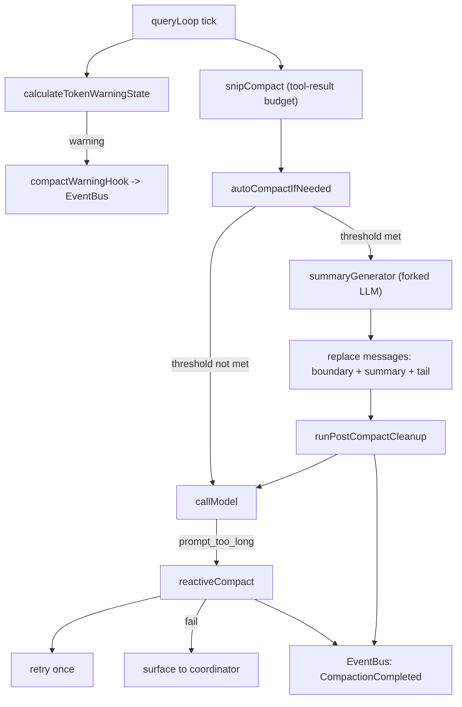
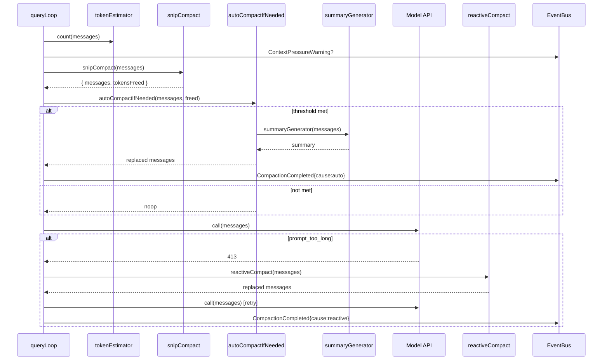

# SPARC Spec: P10 — Compaction Integration

**Phase:** P10 (Critical)
**Priority:** Critical
**Estimated Effort:** 4 days
**Dependencies:** P6 (task backbone), P9 (coordinator); enables P11 long sessions
**Source Blueprint:** Claude Code Original — `src/services/compact/{autoCompact,compact,microCompact,apiMicrocompact,sessionMemoryCompact,grouping,prompt,postCompactCleanup,compactWarningHook,compactWarningState}.ts`

---

## S — Specification

### 1. Requirements

```yaml
specification:
  functional_requirements:
    - id: "FR-P10-001"
      description: "Token-threshold trigger via autoCompact at ~80% of effective context window"
      priority: "critical"
      acceptance_criteria:
        - "queryLoop calls autoCompactIfNeeded() before each model turn"
        - "Threshold = effectiveWindow - AUTOCOMPACT_BUFFER_TOKENS (default 13_000)"
        - "effectiveWindow = contextWindowForModel - reservedSummaryTokens (max 20_000)"
        - "Threshold honors CLAUDE_AUTOCOMPACT_PCT_OVERRIDE env for tests"
        - "Disabled when DISABLE_COMPACT or DISABLE_AUTO_COMPACT truthy"
        - "Circuit breaker stops retries after 3 consecutive failures (per session)"

    - id: "FR-P10-002"
      description: "Reactive compaction triggered on ContextPressure signal from query loop (413 / prompt_too_long fallback)"
      priority: "critical"
      acceptance_criteria:
        - "queryLoop catches PROMPT_TOO_LONG_ERROR from API and invokes reactiveCompact"
        - "reactiveCompact uses compact pipeline with isAutoCompact=true"
        - "On reactive success, the offending turn is retried once"
        - "On reactive failure, the loop surfaces the error to the coordinator"
        - "Reactive path runs even when proactive autoCompact is disabled"

    - id: "FR-P10-003"
      description: "Tool-result budgeting via snipCompact (largest results first, preserve recent)"
      priority: "high"
      acceptance_criteria:
        - "Snip runs before autoCompact; tokensFreed passed back to threshold check"
        - "Only COMPACTABLE_TOOLS (read/edit/write/glob/grep/bash/web) are eligible"
        - "Snip preserves the last N tool results verbatim (default N=8)"
        - "Snip replaces content with TIME_BASED_MC_CLEARED_MESSAGE marker"
        - "Snip is idempotent across turns (already-snipped results skipped)"

    - id: "FR-P10-004"
      description: "Summary generation + reinjection as first user message with preserved tail window"
      priority: "critical"
      acceptance_criteria:
        - "summaryGenerator forks an LLM call with getCompactPrompt()"
        - "Output capped at COMPACT_MAX_OUTPUT_TOKENS (20_000)"
        - "Resulting summary is injected as a SystemCompactBoundaryMessage + first user message"
        - "Tail window: last K turns kept verbatim (default K=2 message rounds)"
        - "All messages prior to the boundary are dropped from the active conversation"
        - "Cache-read baseline reset via notifyCompaction() to avoid false cache-break alerts"

    - id: "FR-P10-005"
      description: "Post-compact cleanup hook that prunes orphaned references"
      priority: "high"
      acceptance_criteria:
        - "runPostCompactCleanup() invoked after every successful compaction path"
        - "Resets microcompact state, file-state cache, and memory-file cache"
        - "Resets lastSummarizedMessageId so the new boundary becomes the anchor"
        - "Subagent compactions skip main-thread-only resets (querySource gating)"
        - "markPostCompaction() called so the next API call carries the boundary flag"

    - id: "FR-P10-006"
      description: "compactWarningHook emits warning event before threshold for proactive UI"
      priority: "high"
      acceptance_criteria:
        - "calculateTokenWarningState() invoked once per turn in queryLoop"
        - "Emits ContextPressureWarning event when isAboveWarningThreshold && !suppressed"
        - "Emits ContextPressureError when isAboveErrorThreshold"
        - "Suppression respected via compactWarningState (per-session)"
        - "Warning carries percentLeft and recommended action (snip|compact|block)"

    - id: "FR-P10-007"
      description: "Eval that proves session continuity across a >200K token run"
      priority: "critical"
      acceptance_criteria:
        - "Long-session eval drives a synthetic agent past 200_000 tokens"
        - "At least 2 autoCompact cycles fire during the run"
        - "Final assistant turn references information from pre-compact history"
        - "No PROMPT_TOO_LONG errors leak past reactiveCompact"
        - "Eval runs in CI under tests/eval/long-session-compaction.test.ts"

  non_functional_requirements:
    - id: "NFR-P10-001"
      category: "performance"
      description: "Compaction trigger overhead < 5ms per turn (token estimation + threshold check)"
      measurement: "tokenEstimator + calculateTokenWarningState combined p95 under 5ms"

    - id: "NFR-P10-002"
      category: "reliability"
      description: "A successful compaction must reduce prompt tokens by >= 50% on average"
      measurement: "Eval logs pre/post token counts; assert >=0.5 reduction ratio"

    - id: "NFR-P10-003"
      category: "observability"
      description: "Every compaction emits a domain event with cause, ratio, latency, success"
      measurement: "EventBus receives CompactionTriggered + CompactionCompleted per cycle"

    - id: "NFR-P10-004"
      category: "backward-compatibility"
      description: "queryLoop callers without compaction wired must continue to work (graceful no-op)"
      measurement: "Existing queryLoop tests pass with compaction module absent"
```

### 2. Constraints

```yaml
constraints:
  technical:
    - "Compact modules already exist in src/services/compact/ — wire them, do not rewrite"
    - "Token estimation uses existing tokenEstimator.ts (no new tokenizer)"
    - "Summary generation must be a forked LLM call; never reuse the main loop conversation"
    - "Tail window K must be configurable but default to 2 message rounds"
    - "Snip eligibility list (COMPACTABLE_TOOLS) lives in toolResultBudget.ts"

  architectural:
    - "queryLoop is the SOLE entry point for compaction triggers (no other callers)"
    - "Compaction runs synchronously inside the loop — no background workers"
    - "Compaction state (turnId, consecutiveFailures, compacted flag) lives on the loop's tracking struct"
    - "Events emitted via existing EventBus from src/shared/event-types.ts"
    - "No mutation of original message arrays — compaction returns new arrays"
```

### 3. Use Cases

```yaml
use_cases:
  - id: "UC-P10-001"
    title: "Proactive autoCompact at 80% threshold"
    actor: "Query Loop"
    flow:
      1. "Loop iteration starts; tokenEstimator counts current message tokens"
      2. "calculateTokenWarningState reports isAboveAutoCompactThreshold=true"
      3. "snipCompact runs first, freeing 30K tokens of bash output"
      4. "autoCompactIfNeeded re-checks; still above threshold"
      5. "summaryGenerator forks LLM, returns 8K summary"
      6. "Messages replaced: [boundary, userSummary, ...tail(K)]"
      7. "runPostCompactCleanup() prunes caches"
      8. "Loop continues; next API call uses compacted context"

  - id: "UC-P10-002"
    title: "Reactive compaction on prompt_too_long"
    actor: "Query Loop"
    flow:
      1. "API call returns 413 with PROMPT_TOO_LONG_ERROR"
      2. "queryLoop catches error, invokes reactiveCompact"
      3. "reactiveCompact runs full compact pipeline (no threshold check)"
      4. "Loop retries the failed turn once with the compacted history"
      5. "If retry succeeds: continue. If retry fails: surface error to coordinator"

  - id: "UC-P10-003"
    title: "Warning UI before threshold"
    actor: "Coordinator UI"
    flow:
      1. "Loop tick emits ContextPressureWarning at 75% (warning threshold)"
      2. "Coordinator surfaces banner: '20% context remaining'"
      3. "User can dismiss → suppressCompactWarning() called"
      4. "Subsequent ticks skip warning until threshold delta crosses again"
```

### 4. Acceptance Criteria (Gherkin)

```gherkin
Feature: Compaction Integration

  Scenario: Auto-compact fires at 80% threshold
    Given a query loop with 160K tokens of history on a 200K context model
    When the next loop iteration starts
    Then autoCompactIfNeeded is called
    And snipCompact runs first to free tool-result tokens
    And summaryGenerator produces a summary message
    And the message array is replaced with [boundary, summary, ...tail]
    And a CompactionCompleted event is emitted

  Scenario: Reactive compaction recovers from 413
    Given a model API call that returns prompt_too_long
    When the query loop catches the error
    Then reactiveCompact runs the full pipeline
    And the offending turn is retried exactly once
    And the loop reports success on retry

  Scenario: Tail window preserved verbatim
    Given a compaction with K=2 tail rounds
    When compaction completes
    Then the last 2 user/assistant rounds appear verbatim after the summary
    And no tool results in the tail are snipped

  Scenario: Circuit breaker after 3 failures
    Given autoCompact has failed 3 consecutive times this session
    When the next loop iteration would trigger autoCompact
    Then autoCompactIfNeeded returns wasCompacted=false without calling the LLM

  Scenario: Long-session continuity
    Given a synthetic agent driven past 200K tokens
    When the session completes
    Then at least 2 autoCompact cycles fired
    And the final assistant turn references pre-compact information
    And zero PROMPT_TOO_LONG errors escaped reactiveCompact
```

---

## P — Pseudocode

### Query Loop Integration Point

```
// src/query/queryLoop.ts — additions only

LOOP iteration:
  warningState = calculateTokenWarningState(tokens, model)
  IF warningState.isAboveWarningThreshold AND NOT suppressed:
    eventBus.emit('ContextPressureWarning', { percentLeft, recommended })

  // 1. Snip first (cheap, no LLM)
  snipResult = snipCompact(messages, { tailRounds: 8 })
  messages = snipResult.messages
  tokensFreed = snipResult.tokensFreed

  // 2. Proactive autocompact (LLM summary)
  ac = await autoCompactIfNeeded(messages, ctx, querySource, tracking, tokensFreed)
  IF ac.wasCompacted:
    messages = ac.compactionResult.messages
    tracking.compacted = true
    tracking.consecutiveFailures = 0
    eventBus.emit('CompactionCompleted', { cause: 'auto', ratio, latencyMs })
  ELSE IF ac.consecutiveFailures:
    tracking.consecutiveFailures = ac.consecutiveFailures

  // 3. Make API call
  TRY:
    response = await callModel(messages)
  CATCH PROMPT_TOO_LONG:
    // 4. Reactive fallback
    rc = await reactiveCompact(messages, ctx, querySource)
    IF rc.success:
      messages = rc.messages
      eventBus.emit('CompactionCompleted', { cause: 'reactive', ... })
      response = await callModel(messages)   // single retry
    ELSE:
      THROW   // surface to coordinator
```

### autoCompactIfNeeded (existing — wire)

```
shouldCompact = tokens - tokensFreed >= getAutoCompactThreshold(model)
IF NOT shouldCompact: RETURN { wasCompacted: false }
IF tracking.consecutiveFailures >= 3: RETURN { wasCompacted: false }

TRY:
  result = await compactConversation(messages, ctx, params, suppress=true, isAuto=true)
  runPostCompactCleanup(querySource)
  RETURN { wasCompacted: true, compactionResult: result, consecutiveFailures: 0 }
CATCH err:
  RETURN { wasCompacted: false, consecutiveFailures: prev + 1 }
```

### snipCompact (existing — wire)

```
eligible = messages.filter(m => isToolResult(m) AND tool IN COMPACTABLE_TOOLS)
sorted   = eligible.sort(byTokenSizeDesc)
preserve = lastN(messages, tailRounds)        // never snip these

FOR each m IN sorted:
  IF m IN preserve: SKIP
  IF m.alreadySnipped: SKIP
  m.content = TIME_BASED_MC_CLEARED_MESSAGE
  tokensFreed += originalTokens
  IF tokensFreed >= targetBudget: BREAK

RETURN { messages, tokensFreed }
```

### summaryGenerator (existing — wire)

```
prompt    = getCompactPrompt(messages)
forked    = await runForkedAgent({ prompt, maxOutputTokens: 20_000 })
summary   = forked.text
boundary  = createCompactBoundaryMessage()
userSum   = createUserMessage(getCompactUserSummaryMessage(summary))
tail      = lastKRounds(messages, K=2)
RETURN [boundary, userSum, ...tail]
```

### Warning Hook

```
state = calculateTokenWarningState(tokens, model)
IF state.isAboveErrorThreshold:    emit('ContextPressureError', state)
ELSE IF state.isAboveWarningThreshold AND NOT isSuppressed():
  emit('ContextPressureWarning', state)
```

---

## A — Architecture

### Compaction Pipeline Flow



### File Structure

```
src/services/compact/
  autoCompact.ts          -- (exists) shouldAutoCompact + autoCompactIfNeeded
  reactiveCompact.ts      -- (exists) prompt_too_long fallback
  snipCompact.ts          -- (exists) tool-result budgeting
  summaryGenerator.ts     -- (exists) forked LLM summary
  tokenEstimator.ts       -- (exists) cheap token counting
  toolResultBudget.ts     -- (exists) COMPACTABLE_TOOLS + budget calc
  index.ts                -- (MODIFY) barrel export of public surface
  postCompactCleanup.ts   -- (NEW) prune caches + reset anchors

src/query/queryLoop.ts
  -- (MODIFY) Wire snip + autoCompact + reactiveCompact + warning hook

src/shared/event-types.ts
  -- (MODIFY) Add ContextPressureWarning, ContextPressureError,
              CompactionTriggered, CompactionCompleted

tests/eval/long-session-compaction.test.ts
  -- (NEW) >200K token continuity eval
```

### Query Loop Sequence (Auto + Reactive)



---

## R — Refinement

### Test Plan

| FR | Test File | Key Assertions |
|----|-----------|----------------|
| FR-P10-001 | `tests/services/compact/autoCompact.test.ts` | threshold = effectiveWindow - 13K; PCT_OVERRIDE honored; circuit breaker after 3 failures; disabled when DISABLE_COMPACT |
| FR-P10-002 | `tests/services/compact/reactiveCompact.test.ts` | invoked on PROMPT_TOO_LONG; compacts then retries once; surfaces error on second failure; runs even when auto-compact disabled |
| FR-P10-003 | `tests/services/compact/snipCompact.test.ts` | snips largest first; preserves tail K; idempotent (already-snipped skipped); only COMPACTABLE_TOOLS eligible; tokensFreed accurate |
| FR-P10-004 | `tests/services/compact/summaryGenerator.test.ts` | forked LLM call; boundary + userSum + tail order; tail K=2 preserved verbatim; output capped at 20K tokens |
| FR-P10-005 | `tests/services/compact/postCompactCleanup.test.ts` | resets microcompact state; clears memory-file cache only on main-thread; resets lastSummarizedMessageId; calls markPostCompaction |
| FR-P10-006 | `tests/services/compact/compactWarningHook.test.ts` | emits Warning when above warning threshold; emits Error when above error threshold; respects suppression state |
| FR-P10-007 | `tests/eval/long-session-compaction.test.ts` | drives >200K tokens; >=2 auto-compact cycles fire; final turn cites pre-compact info; 0 leaked PROMPT_TOO_LONG |
| Wiring | `tests/query/queryLoop.test.ts` (updated) | snip→auto→api→reactive ordering; tracking.compacted set; events emitted; backward-compat when compact module absent |

All tests use `node:test` + `node:assert/strict` with mock-first pattern.

### Anti-Patterns to Enforce

```yaml
anti_patterns:
  - name: "Compaction outside the query loop"
    bad: "Background timer triggers compactConversation()"
    good: "Only queryLoop calls autoCompactIfNeeded / reactiveCompact"
    enforcement: "Lint rule: src/services/compact imports allowed only from src/query/queryLoop.ts"

  - name: "Mutating original message array"
    bad: "messages.splice(0, n) inside snipCompact"
    good: "Return a new array; let queryLoop replace its reference"
    enforcement: "snipCompact signature returns { messages, tokensFreed }"

  - name: "Unbounded summary output"
    bad: "summaryGenerator passes maxOutputTokens=undefined to forked agent"
    good: "Cap at COMPACT_MAX_OUTPUT_TOKENS (20_000)"
    enforcement: "Test asserts forked-agent options carry maxOutputTokens"

  - name: "Snipping the tail window"
    bad: "snipCompact iterates entire history without tail guard"
    good: "Last K rounds reserved by reference equality before sort"
    enforcement: "Test: tail messages unchanged after snipCompact"

  - name: "Retrying past the circuit breaker"
    bad: "Loop keeps calling autoCompactIfNeeded after 3 failures"
    good: "Tracking carries consecutiveFailures; check before LLM call"
    enforcement: "Test: 4th call returns wasCompacted=false without forking"

  - name: "Skipping post-compact cleanup"
    bad: "Manual /compact path forgets runPostCompactCleanup"
    good: "Every compaction success funnels through cleanup"
    enforcement: "Both auto and reactive paths call cleanup before returning"
```

### Migration Strategy

```yaml
migration:
  phase_1_warning_hook:
    files: ["queryLoop.ts", "compactWarningHook.ts", "event-types.ts"]
    description: "Wire the warning hook only — no compaction yet. Pure observability."
    validation: "Warning events appear under load; no behavior change."

  phase_2_snip_only:
    files: ["queryLoop.ts", "snipCompact.ts", "toolResultBudget.ts"]
    description: "Add snipCompact pass before each model call. Tail window preserved."
    validation: "Bash-heavy sessions show reduced prompt tokens; no LLM calls added."

  phase_3_auto_compact:
    files: ["queryLoop.ts", "autoCompact.ts", "summaryGenerator.ts", "postCompactCleanup.ts"]
    description: "Wire autoCompactIfNeeded with full summary pipeline + cleanup."
    validation: "Sessions crossing 80% threshold compact successfully; tracking populated."

  phase_4_reactive:
    files: ["queryLoop.ts", "reactiveCompact.ts"]
    description: "Add 413 catch + single retry via reactiveCompact."
    validation: "Synthetic prompt_too_long induces reactive path; retry succeeds."

  phase_5_eval:
    files: ["tests/eval/long-session-compaction.test.ts"]
    description: "Long-session continuity eval gating CI."
    validation: ">200K-token run completes with >=2 compactions and zero leaked errors."
```

---

## C — Completion

### Definition of Done

```yaml
completion:
  code_deliverables:
    - "Modified: src/query/queryLoop.ts — snip + auto + reactive + warning wiring"
    - "Modified: src/services/compact/index.ts — public barrel"
    - "New: src/services/compact/postCompactCleanup.ts — cache pruning"
    - "Modified: src/shared/event-types.ts — Compaction + ContextPressure events"

  test_deliverables:
    - "tests/services/compact/autoCompact.test.ts"
    - "tests/services/compact/reactiveCompact.test.ts"
    - "tests/services/compact/snipCompact.test.ts"
    - "tests/services/compact/summaryGenerator.test.ts"
    - "tests/services/compact/postCompactCleanup.test.ts"
    - "tests/services/compact/compactWarningHook.test.ts"
    - "tests/eval/long-session-compaction.test.ts"
    - "Updated: tests/query/queryLoop.test.ts"

  verification_checklist:
    - "npm run build succeeds"
    - "npm test passes (existing + new)"
    - "npx tsc --noEmit passes"
    - "npm run lint passes"
    - "Long-session eval passes in CI (>200K tokens, >=2 compactions)"
    - "EventBus receives Compaction + ContextPressure events for every cycle"
    - "Lint rule prevents src/services/compact imports outside queryLoop"
    - "No mutation of input message arrays (verified by test)"

  success_metrics:
    - "Sessions can run beyond 200K tokens without prompt_too_long escaping"
    - "Auto-compact threshold check overhead < 5ms p95 per turn"
    - "Average compaction ratio >= 50% prompt-token reduction"
    - "Zero compaction-related crashes across long-session eval"
    - "Circuit breaker prevents >3 consecutive failed compactions per session"
```
