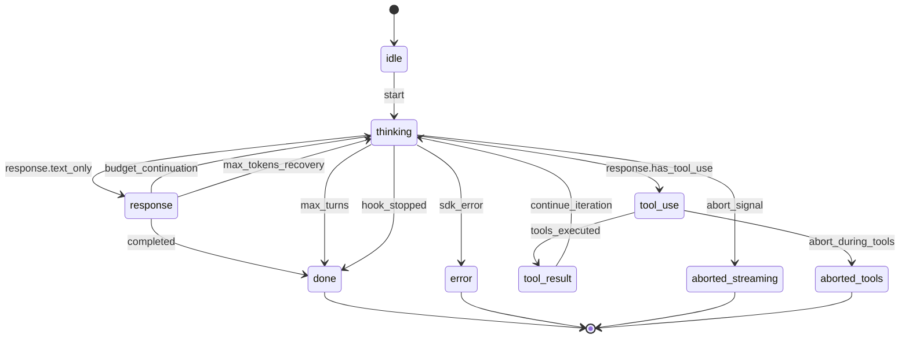
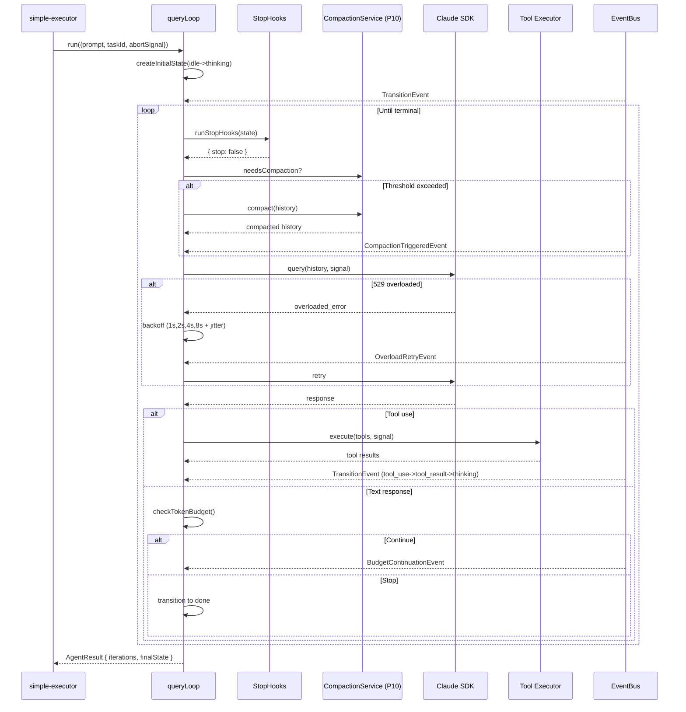

# SPARC Spec: P11 — Query Loop Activation

**Phase:** P11 (Critical)
**Priority:** Critical
**Estimated Effort:** 5 days
**Dependencies:** P6 (Task Backbone Wiring), P10 (Multi-Tier Compaction)
**Source Blueprint:** Claude Code Original — `src/query.ts` (1730 LOC, canonical query loop), `src/QueryEngine.ts`, `src/query/transitions.ts`, `src/query/tokenBudget.ts`, `src/query/stopHooks.ts`, `src/query/deps.ts`, `src/query/config.ts`

---

## S — Specification

### 1. Requirements

```yaml
specification:
  functional_requirements:
    - id: "FR-P11-001"
      description: "simple-executor shall replace its single Claude SDK call with queryLoopFactory().run()"
      priority: "critical"
      acceptance_criteria:
        - "simple-executor imports createQueryLoop from src/query/index.ts"
        - "Single sdk.query() call replaced with queryLoop.run({ prompt, abortSignal, taskId })"
        - "Loop returns when state machine reaches terminal state (done | aborted | error)"
        - "AgentResult.iterations count reflects loop turns taken"
        - "Existing happy-path test still passes (single-turn completion case)"

    - id: "FR-P11-002"
      description: "Query loop state machine shall transition through (idle → thinking → tool_use → tool_result → thinking → response → done) and emit TransitionEvent on every change"
      priority: "critical"
      acceptance_criteria:
        - "QueryState enum: idle, thinking, tool_use, tool_result, response, done, aborted, error"
        - "transition(state, event) is pure-functional, returns new state"
        - "Every transition emits a TransitionEvent { from, to, reason, timestamp, taskId } on EventBus"
        - "Invalid transitions throw InvalidQueryTransitionError"
        - "Initial state is always idle; terminal states are done | aborted | error"

    - id: "FR-P11-003"
      description: "Query loop shall auto-continue on token-budget continue decision and on max_tokens stop reason, bounded by maxIterations"
      priority: "critical"
      acceptance_criteria:
        - "After each turn, checkTokenBudget() decides continue|stop"
        - "On continue: append nudgeMessage to history and re-iterate"
        - "On SDK stop_reason === 'max_tokens': continue loop with recovery prompt"
        - "Default maxIterations = 50; configurable via QueryLoopConfig"
        - "Hitting maxIterations transitions to terminal state with reason: 'max_turns'"
        - "Loop emits BudgetContinuationEvent with continuationCount and pct"

    - id: "FR-P11-004"
      description: "Query loop shall retry on 529/overloaded API responses using exponential backoff with jitter"
      priority: "critical"
      acceptance_criteria:
        - "Detect HTTP 529 OR error message containing 'overloaded' OR error.type === 'overloaded_error'"
        - "Retry sequence: 1s, 2s, 4s, 8s with ±25% jitter"
        - "Max retries: 4 (configurable via QueryLoopConfig.maxOverloadRetries)"
        - "After max retries, transition to error state with reason: 'overloaded_exhausted'"
        - "Each retry emits OverloadRetryEvent with attempt number and delay"
        - "Retries respect abortSignal — abort cancels pending backoff timer"

    - id: "FR-P11-005"
      description: "Query loop shall integrate StopHooks via pre-stop checks that can abort early on user signal"
      priority: "high"
      acceptance_criteria:
        - "Before each iteration, runStopHooks() invoked with current state"
        - "If any hook returns { stop: true }, transition to terminal: 'hook_stopped'"
        - "If hook returns { stop: false, blocking: true, reason }: emit HookBlockedEvent and continue with reason injected"
        - "Hooks are async and awaited sequentially (preserves CC ordering)"
        - "User stop signal (WorkCancelled domain event) registers a stop hook that returns { stop: true }"

    - id: "FR-P11-006"
      description: "Query loop shall propagate abort signals to in-flight tool calls when WorkCancelled fires"
      priority: "critical"
      acceptance_criteria:
        - "queryLoop.run() accepts AbortSignal in QueryLoopOptions"
        - "On signal abort during streaming: transition to 'aborted_streaming'"
        - "On signal abort during tool execution: transition to 'aborted_tools', tool calls receive same signal"
        - "WorkCancelled domain event triggers abort on the loop's AbortController"
        - "Loop returns within 500ms of abort signal (no orphaned promises)"

    - id: "FR-P11-007"
      description: "Query loop shall trigger compaction (P10) when token budget exceeds threshold mid-loop"
      priority: "high"
      acceptance_criteria:
        - "Before each iteration, check totalTokens / contextWindow against compactionThreshold (default 0.85)"
        - "On threshold breach: invoke compactionService.compact(history) from P10"
        - "Replace loop history with compacted version, emit CompactionTriggeredEvent"
        - "If compaction itself fails: transition to error with reason: 'compaction_failed'"
        - "Compaction reason recorded in transition: 'reactive_compact_retry'"

  non_functional_requirements:
    - id: "NFR-P11-001"
      category: "performance"
      description: "State transitions and budget checks must be synchronous and sub-millisecond"
      measurement: "transition() + checkTokenBudget() < 1ms per turn (in-memory operations)"

    - id: "NFR-P11-002"
      category: "observability"
      description: "Every loop turn must be observable via EventBus"
      measurement: "TransitionEvent emitted on every state change; iteration count visible to monitor"

    - id: "NFR-P11-003"
      category: "reliability"
      description: "Loop must never leak abort handlers or timers on terminal exit"
      measurement: "AbortController cleanup verified via test; no setTimeout outliving the loop"

    - id: "NFR-P11-004"
      category: "backward-compatibility"
      description: "Existing single-call simple-executor consumers must observe identical happy-path behavior"
      measurement: "All existing simple-executor tests pass without modification"
```

### 2. Constraints

```yaml
constraints:
  technical:
    - "src/query/ modules already exist — wire them, do not rewrite"
    - "queryLoop, queryLoopFactory, state, transitions, tokenBudget, deps must be consumed via src/query/index.ts barrel only"
    - "AbortController is the sole abort primitive — no custom signal types"
    - "Backoff timers must use unref'd setTimeout to not block process exit"
    - "Compaction is invoked via the P10 CompactionService interface, not inlined"
    - "Token counts come from SDK response usage field — no client-side estimation"

  architectural:
    - "Query loop is an async generator (matches CC canonical pattern)"
    - "State machine is pure-functional (transition returns new state) — side effects via TransitionListener"
    - "EventBus is sole notification channel — no callbacks between loop and orchestrator"
    - "Query loop owns its AbortController; external aborts come via the passed AbortSignal"
    - "StopHooks are async functions registered at loop construction, not mutable mid-run"
```

### 3. Use Cases

```yaml
use_cases:
  - id: "UC-P11-001"
    title: "Multi-Turn Tool-Using Agent Completes via Query Loop"
    actor: "simple-executor"
    flow:
      1. "simple-executor calls queryLoop.run({ prompt, taskId, abortSignal })"
      2. "Loop transitions idle → thinking, sends prompt to SDK"
      3. "SDK returns tool_use block — loop transitions thinking → tool_use"
      4. "Tool executes, result appended — transition tool_use → tool_result → thinking"
      5. "Second SDK call returns final text — transition thinking → response → done"
      6. "Loop returns AgentResult with iterations=2, finalState=done"

  - id: "UC-P11-002"
    title: "Auto-Continue on Token Budget Continuation"
    actor: "Query Loop"
    flow:
      1. "Turn 1 completes, totalTokens=12000, budget=20000 (60%)"
      2. "checkTokenBudget returns continue with nudgeMessage"
      3. "Loop appends nudge, BudgetContinuationEvent emitted"
      4. "Turn 2 runs, totalTokens=18500 (92.5%)"
      5. "checkTokenBudget returns stop (over COMPLETION_THRESHOLD)"
      6. "Loop transitions to done"

  - id: "UC-P11-003"
    title: "Overloaded Retry with Exponential Backoff"
    actor: "Query Loop"
    flow:
      1. "SDK call returns 529 overloaded_error"
      2. "Loop catches, emits OverloadRetryEvent(attempt=1, delay=1000±jitter)"
      3. "Awaits backoff respecting abortSignal"
      4. "Retry succeeds — loop continues normally"
      5. "If retries 1-4 all fail: transition to error('overloaded_exhausted')"

  - id: "UC-P11-004"
    title: "User Cancels Mid-Tool-Call"
    actor: "Linear Webhook Stop Signal"
    flow:
      1. "WorkCancelled domain event fires for active taskId"
      2. "Orchestrator calls abortController.abort() on loop"
      3. "In-flight bash tool receives same signal, terminates process"
      4. "Loop transitions to aborted_tools within 500ms"
      5. "AgentResult returned with status=cancelled"

  - id: "UC-P11-005"
    title: "Mid-Loop Compaction at 85% Context"
    actor: "Query Loop"
    flow:
      1. "Before turn N, totalTokens=170000, contextWindow=200000 (85%)"
      2. "Loop invokes compactionService.compact(history) from P10"
      3. "History replaced with compacted summary + recent turns"
      4. "CompactionTriggeredEvent emitted"
      5. "Loop continues with reduced token footprint"
```

### 4. Acceptance Criteria (Gherkin)

```gherkin
Feature: Query Loop Activation

  Scenario: simple-executor uses query loop instead of single SDK call
    Given a simple agent dispatch request
    When simple-executor.execute() is called
    Then queryLoopFactory().run() is invoked exactly once
    And the returned AgentResult contains iterations >= 1

  Scenario: Multi-turn tool execution drives state machine
    Given a prompt that triggers a tool_use response
    When the query loop runs
    Then the state transitions thinking → tool_use → tool_result → thinking → response → done
    And a TransitionEvent is emitted for each transition

  Scenario: Auto-continue on token budget
    Given a turn that ends with 60 percent of token budget consumed
    When the loop checks the token budget
    Then it returns a continue decision with a nudge message
    And the loop iterates again

  Scenario: Exponential backoff on overloaded
    Given the SDK returns a 529 overloaded_error
    When the loop handles the error
    Then it retries after approximately 1, 2, 4, and 8 seconds with jitter
    And after 4 failed retries the loop transitions to error state

  Scenario: Abort signal cancels in-flight tool calls
    Given a query loop is executing a long-running tool
    When the abortSignal fires
    Then the tool call receives the same signal
    And the loop transitions to aborted_tools within 500ms

  Scenario: Compaction triggers at 85 percent context
    Given the conversation history exceeds 85 percent of context window
    When the loop starts the next iteration
    Then compactionService.compact() is invoked
    And a CompactionTriggeredEvent is emitted

  Scenario: Bounded iterations prevent infinite loops
    Given a query loop with maxIterations = 50
    When the loop reaches iteration 50
    Then it transitions to terminal state with reason max_turns
```

---

## P — Pseudocode

### Query Loop (Async Generator)

```
ASYNC GENERATOR queryLoop(opts):
  state = createInitialState(opts.taskId)
  budget = createBudgetTracker()
  controller = new AbortController()
  opts.abortSignal?.addEventListener('abort', () => controller.abort())

  FOR iteration IN 1..maxIterations:
    IF controller.signal.aborted: RETURN terminal('aborted_streaming')

    // Stop hook check
    hookResult = AWAIT runStopHooks(state)
    IF hookResult.stop: RETURN terminal('hook_stopped')

    // Compaction check
    IF state.totalTokens / contextWindow > compactionThreshold:
      state.history = AWAIT compactionService.compact(state.history)
      emit('CompactionTriggeredEvent', { taskId, iteration })
      state = transition(state, { reason: 'reactive_compact_retry' })

    // SDK call with overload retry
    response = AWAIT callSdkWithOverloadRetry(state, controller.signal)
    state = transition(state, { from: 'thinking', to: classifyResponse(response) })

    // Tool execution
    IF response.containsToolUse:
      state = transition(state, { from: 'tool_use', to: 'tool_result' })
      toolResults = AWAIT executeTools(response.tools, controller.signal)
      state.history.push(toolResults)
      state = transition(state, { from: 'tool_result', to: 'thinking' })
      CONTINUE

    // Token budget check on text response
    decision = checkTokenBudget(budget, undefined, opts.budget, state.totalTokens)
    IF decision.action === 'continue':
      state.history.push(nudgeMessage(decision))
      emit('BudgetContinuationEvent', decision)
      CONTINUE

    // max_tokens stop reason recovery
    IF response.stop_reason === 'max_tokens' AND iteration < maxIterations:
      state = transition(state, { reason: 'max_output_tokens_recovery' })
      CONTINUE

    RETURN terminal('completed', state)

  RETURN terminal('max_turns', state)
```

### Overload Retry with Backoff

```
FUNCTION callSdkWithOverloadRetry(state, signal):
  FOR attempt IN 1..maxOverloadRetries:
    TRY:
      RETURN AWAIT sdk.query(state.history, { signal })
    CATCH err:
      IF NOT isOverloaded(err): THROW err
      delay = baseDelay * (2 ** (attempt - 1))      // 1s, 2s, 4s, 8s
      jitter = delay * 0.25 * (Math.random() * 2 - 1)
      emit('OverloadRetryEvent', { attempt, delay: delay + jitter })
      AWAIT abortableSleep(delay + jitter, signal)
  THROW OverloadExhaustedError()

FUNCTION isOverloaded(err):
  RETURN err.status === 529
      OR err.type === 'overloaded_error'
      OR /overloaded/i.test(err.message)
```

### Stop Hook Registration (WorkCancelled)

```
hooks.register(async (state) => {
  IF cancelledTaskIds.has(state.taskId): RETURN { stop: true, reason: 'user_cancelled' }
  RETURN { stop: false }
})

// Domain event listener:
eventBus.on('WorkCancelled', ({ taskId }) => cancelledTaskIds.add(taskId))
```

---

## A — Architecture

### Query Loop State Machine



### Loop Integration Sequence



### File Structure

```
src/query/
  index.ts             -- (exists, EXTEND) barrel: createQueryLoop, types
  queryLoop.ts         -- (exists, WIRE) async generator implementation
  queryLoopFactory.ts  -- (exists, WIRE) DI factory for loop instances
  state.ts             -- (exists, EXTEND) QueryState enum + createInitialState
  transitions.ts       -- (exists, EXTEND) transition() + TransitionEvent emission
  tokenBudget.ts       -- (exists) checkTokenBudget() — no changes
  deps.ts              -- (exists, EXTEND) dependency injection types (CompactionService)
  stopHooks.ts         -- (NEW) runStopHooks() + WorkCancelled hook registration
  overloadRetry.ts     -- (NEW) callSdkWithOverloadRetry + abortableSleep
  events.ts            -- (NEW) TransitionEvent, OverloadRetryEvent, BudgetContinuationEvent

src/execution/simple-executor.ts
  -- (MODIFY) Replace single sdk.query call with createQueryLoop().run()
```

---

## R — Refinement

### Test Plan

| Module | Test File | Key Assertions |
|--------|-----------|----------------|
| State machine | `tests/query/transitions.test.ts` | valid transitions return new state; invalid throws InvalidQueryTransitionError; every transition emits TransitionEvent with from/to/reason |
| Token budget | `tests/query/tokenBudget.test.ts` (existing, extend) | continue at <90% budget; stop at >=90%; stop on diminishing returns after 3 continuations; nudge message non-empty |
| Overload retry | `tests/query/overloadRetry.test.ts` | retries 4 times on 529; backoff approximately 1/2/4/8s ±25%; aborts mid-backoff on signal; throws OverloadExhaustedError after max retries; non-overload errors propagate immediately |
| Stop hooks | `tests/query/stopHooks.test.ts` | sequential hook execution; first stop:true short-circuits; WorkCancelled event registers cancellation; blocking hooks emit HookBlockedEvent |
| Query loop happy path | `tests/query/queryLoop.test.ts` | single-turn text response → done; multi-turn tool_use → tool_result → done; iteration count accurate |
| Query loop budget continuation | `tests/query/queryLoop.test.ts` | mock budget triggers continue; loop appends nudge; 2nd turn proceeds |
| Query loop max_tokens recovery | `tests/query/queryLoop.test.ts` | stop_reason=max_tokens triggers continue; max_turns terminates after maxIterations |
| Query loop abort | `tests/query/queryLoop.test.ts` | abort during streaming → aborted_streaming within 500ms; abort during tools → aborted_tools; tool call receives same signal |
| Query loop compaction | `tests/query/queryLoop.test.ts` | tokens > threshold triggers CompactionService.compact; history replaced; CompactionTriggeredEvent emitted; compaction failure → error state |
| simple-executor wiring | `tests/execution/simple-executor.test.ts` (extend) | createQueryLoop invoked; AgentResult.iterations populated; existing happy-path tests pass unchanged |

All tests use `node:test` + `node:assert/strict` with mock-first pattern. Mock SDK exposes scriptable response sequences for multi-turn flows.

### Anti-Patterns to Enforce

```yaml
anti_patterns:
  - name: "Direct SDK Call in Executors"
    bad: "simple-executor calls anthropic.messages.create() directly"
    good: "All executor SDK access goes through queryLoop.run()"
    enforcement: "Lint rule: no direct anthropic SDK imports outside src/query/"

  - name: "Mutable State Transitions"
    bad: "state.current = 'thinking'"
    good: "state = transition(state, { from, to })"
    enforcement: "QueryState fields are readonly; transition() returns new object"

  - name: "Unbounded Retry"
    bad: "while (overloaded) { retry() }"
    good: "for (let attempt = 1; attempt <= maxRetries; attempt++)"
    enforcement: "callSdkWithOverloadRetry has hard-coded loop bound from config"

  - name: "Orphaned Abort Handlers"
    bad: "signal.addEventListener('abort', handler) without cleanup"
    good: "AbortController + signal.removeEventListener on terminal exit"
    enforcement: "queryLoop wraps body in try/finally that cleans up listeners"

  - name: "Inline Compaction"
    bad: "if (tokens > threshold) { history = summarize(history) }"
    good: "compactionService.compact(history) — P10 service injected via deps"
    enforcement: "queryLoop has no string manipulation for summarization"

  - name: "Polling for Cancellation"
    bad: "setInterval(() => checkCancellation())"
    good: "WorkCancelled EventBus listener triggers AbortController.abort()"
    enforcement: "No setInterval in src/query/"
```

### Migration Strategy

```yaml
migration:
  phase_1_state_and_transitions:
    files: ["state.ts", "transitions.ts", "events.ts"]
    description: "Solidify state machine with TransitionEvent emission. Pure additions."
    validation: "New transitions tests pass. Existing query/ tests untouched."

  phase_2_overload_retry:
    files: ["overloadRetry.ts"]
    description: "Standalone retry helper with abortable sleep. No loop integration yet."
    validation: "overloadRetry tests pass with mock SDK errors."

  phase_3_stop_hooks:
    files: ["stopHooks.ts"]
    description: "Hook registration + WorkCancelled listener wiring."
    validation: "stopHooks tests pass; WorkCancelled triggers cancellation set."

  phase_4_loop_assembly:
    files: ["queryLoop.ts", "queryLoopFactory.ts", "deps.ts", "index.ts"]
    description: "Wire state, transitions, retry, hooks, compaction into the loop generator."
    validation: "queryLoop unit tests pass for all scenarios (happy, multi-turn, retry, abort, compact)."

  phase_5_simple_executor_integration:
    files: ["simple-executor.ts"]
    description: "Replace single SDK call with createQueryLoop().run()."
    validation: "simple-executor tests pass; existing AgentResult shape preserved."
```

---

## C — Completion

### Definition of Done

```yaml
completion:
  code_deliverables:
    - "src/query/stopHooks.ts — runStopHooks + WorkCancelled registration"
    - "src/query/overloadRetry.ts — callSdkWithOverloadRetry + abortableSleep"
    - "src/query/events.ts — TransitionEvent, OverloadRetryEvent, BudgetContinuationEvent, CompactionTriggeredEvent, HookBlockedEvent"
    - "Extended: src/query/state.ts — QueryState enum, createInitialState"
    - "Extended: src/query/transitions.ts — transition() with EventBus emission"
    - "Extended: src/query/deps.ts — CompactionService injection point"
    - "Extended: src/query/queryLoop.ts — async generator with full lifecycle"
    - "Extended: src/query/queryLoopFactory.ts — DI factory wiring all deps"
    - "Extended: src/query/index.ts — public barrel"
    - "Modified: src/execution/simple-executor.ts — replaces direct SDK call with queryLoop.run()"

  test_deliverables:
    - "tests/query/transitions.test.ts"
    - "tests/query/overloadRetry.test.ts"
    - "tests/query/stopHooks.test.ts"
    - "tests/query/queryLoop.test.ts (covering happy path, multi-turn, budget continuation, max_tokens recovery, abort, compaction, max_turns)"
    - "Updated: tests/execution/simple-executor.test.ts (queryLoop wiring assertions)"

  verification_checklist:
    - "npm run build succeeds"
    - "npm test passes (all existing + new tests)"
    - "npx tsc --noEmit passes"
    - "npm run lint passes"
    - "No direct anthropic SDK imports outside src/query/"
    - "All TransitionEvent emissions observable on EventBus"
    - "AbortController cleanup verified — no leaked listeners"
    - "P10 CompactionService consumed via injected interface, not concrete import"
    - "Backward compatibility: simple-executor happy-path tests pass unchanged"

  success_metrics:
    - "100% of agent dispatches go through queryLoop.run() (grep simple-executor for sdk.query)"
    - "Multi-turn tool agents complete via loop iteration (verified by integration test)"
    - "Overload retries succeed within 4 attempts in 99% of injected-failure tests"
    - "Abort latency from signal to terminal state < 500ms (p99)"
    - "Compaction triggered automatically when context > 85% (verified by integration test)"
```
