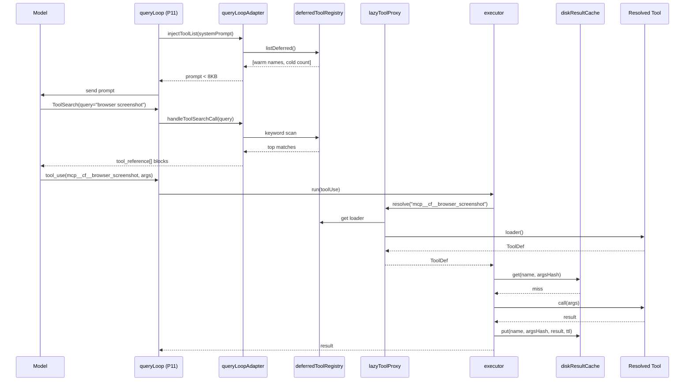

# SPARC Spec: P12 — Deferred Tool Loading

**Phase:** P12 (High)
**Priority:** High
**Estimated Effort:** 5 days
**Dependencies:** P11 (query loop is the registration/resolution host)
**Source Blueprint:** Claude Code Original — `src/services/tools/toolExecution.ts`, `src/services/tools/toolOrchestration.ts`, `src/services/tools/StreamingToolExecutor.ts`, `src/services/tools/toolHooks.ts`, `src/tools/ToolSearchTool/ToolSearchTool.ts`

---

## S — Specification

### 1. Requirements

```yaml
specification:
  functional_requirements:
    - id: "FR-P12-001"
      description: "Tool registration API stores name + 1-line description only; full schema deferred until first invocation"
      priority: "critical"
      acceptance_criteria:
        - "deferredToolRegistry.register({ name, description, loader }) accepts a thunk that resolves the full ToolDef"
        - "Registered entries occupy < 200 bytes per tool in the prompt advertisement"
        - "Schema, prompt, inputSchema, outputSchema NOT resolved at registration time"
        - "Re-registering the same name throws DuplicateToolError"
        - "Registry exposes listDeferred() returning name + description tuples"

    - id: "FR-P12-002"
      description: "Lazy schema resolution on first invocation via lazyToolProxy"
      priority: "critical"
      acceptance_criteria:
        - "lazyToolProxy.resolve(name) calls the registered loader exactly once, then memoizes"
        - "Concurrent resolve() calls for the same name share a single in-flight Promise"
        - "Resolved ToolDef cached in deferredIndex keyed by name"
        - "Loader failure surfaces as ToolResolutionError with the offending name"
        - "Resolved tools become eligible for executor.run() without re-registration"

    - id: "FR-P12-003"
      description: "Partitioner heuristic (hot/warm/cold tiers) keeps prompt budget bounded as N grows"
      priority: "high"
      acceptance_criteria:
        - "partitioner.classify(tool) returns 'hot' | 'warm' | 'cold'"
        - "Hot: always advertised in prompt with full description (e.g. Read, Write, Edit, Bash, Glob, Grep)"
        - "Warm: advertised by name only in deferred index, no schema"
        - "Cold: not advertised at all; surfaced only via ToolSearch keyword query"
        - "Classification inputs: usage frequency from diskResultCache, tool category, isReadOnly flag"
        - "Total hot+warm prompt advertisement remains < 8KB regardless of cold tool count"

    - id: "FR-P12-004"
      description: "queryLoopAdapter hook surfaces deferred tool list to model via the ToolSearch pattern"
      priority: "critical"
      acceptance_criteria:
        - "queryLoopAdapter.injectToolList(systemPrompt) appends hot tools fully, warm tools as name+description, cold tools as count"
        - "ToolSearch tool itself is always in the hot tier (model needs it to discover others)"
        - "Adapter handles `select:<name>` queries by calling lazyToolProxy.resolve and returning tool_reference blocks"
        - "Adapter handles keyword queries by scoring against name parts + description (mirrors CC's searchToolsWithKeywords)"
        - "MCP-prefixed tools matched via prefix match on `mcp__server__` form"

    - id: "FR-P12-005"
      description: "Disk result cache keyed by (tool, args-hash) with TTL eviction"
      priority: "high"
      acceptance_criteria:
        - "diskResultCache.get(toolName, argsHash) returns cached result or undefined"
        - "diskResultCache.put(toolName, argsHash, result, ttlMs) writes JSON file under data/tool-cache/"
        - "Cache key = sha256(JSON.stringify(args, sortedKeys))"
        - "TTL eviction sweep runs on cache open and every 5 minutes thereafter"
        - "Only tools marked cacheable=true in their ToolDef participate"
        - "Cache hits emit ToolCacheHit domain event for observability"

    - id: "FR-P12-006"
      description: "ConcurrencyClassifier marks tools as parallel-safe vs serial-only"
      priority: "high"
      acceptance_criteria:
        - "concurrencyClassifier.isConcurrencySafe(toolDef, parsedInput) returns boolean"
        - "Read-only tools (isReadOnly=true) default to concurrency-safe"
        - "Mutating tools (Write, Edit, Bash) default to serial-only"
        - "Bash classifier inspects parsed command for write redirects, mv, rm, etc., per CC pattern"
        - "Classification result feeds executor.partition() for batching"
        - "Classifier failures fall back to serial-only (conservative)"

    - id: "FR-P12-007"
      description: "Eval — prompt budget stays under 8KB as tool count grows from 10 to 500"
      priority: "high"
      acceptance_criteria:
        - "Eval harness registers N tools (N in {10, 50, 100, 250, 500}) with synthetic descriptions"
        - "Measures injectToolList() output byte length for each N"
        - "All measurements < 8192 bytes"
        - "Hot tier count remains constant across N (capped at 12)"
        - "Cold tier resolution latency < 50ms p95 under load (100 concurrent resolves)"

  non_functional_requirements:
    - id: "NFR-P12-001"
      category: "performance"
      description: "Tool resolution must not block the query loop"
      measurement: "lazyToolProxy.resolve() returns within 10ms p95 for cached entries; 50ms p95 for cold loads"

    - id: "NFR-P12-002"
      category: "memory"
      description: "Registry footprint scales linearly and modestly with tool count"
      measurement: "< 200 bytes per registered (deferred) tool until first resolve()"

    - id: "NFR-P12-003"
      category: "observability"
      description: "All resolution and cache events flow through EventBus"
      measurement: "ToolResolved, ToolResolutionFailed, ToolCacheHit, ToolCacheMiss events emitted with toolName + latency"

    - id: "NFR-P12-004"
      category: "compatibility"
      description: "Existing eager-loaded tools must continue to work without registration changes"
      measurement: "Tools registered via existing toolDefinitions path bypass the deferred index but remain callable from executor"
```

### 2. Constraints

```yaml
constraints:
  technical:
    - "All deferred infrastructure already exists under src/services/tools/ — wire it, do not rewrite"
    - "Loaders must be idempotent — they may be invoked multiple times under race conditions before memoization"
    - "Cache keys are content-addressed via sha256 of canonicalized args — no clock-based keys"
    - "ToolSearch tool itself MUST live in the hot tier — circular bootstrap otherwise"
    - "Partitioner classification is deterministic for a given (tool, usage stats) input"
    - "Disk cache lives at data/tool-cache/{toolName}/{argsHash}.json — gitignored"

  architectural:
    - "deferredToolRegistry is process-local singleton; no cross-process sharing"
    - "lazyToolProxy is the sole resolution path — executor never bypasses it"
    - "queryLoopAdapter is the sole integration point with src/query/queryLoop.ts (P11)"
    - "concurrencyClassifier is consulted by executor before partitioning, never inside tool implementations"
    - "diskResultCache is opt-in per ToolDef.cacheable — never cache by default"
```

### 3. Use Cases

```yaml
use_cases:
  - id: "UC-P12-001"
    title: "Model Discovers and Invokes a Cold Tool via ToolSearch"
    actor: "Model (via query loop)"
    flow:
      1. "Query loop builds system prompt with hot tools + ToolSearch + warm tool list (names only)"
      2. "Model sees task needs an MCP browser tool not in the prompt"
      3. "Model invokes ToolSearch with query 'browser screenshot'"
      4. "queryLoopAdapter handles the call: keyword search over deferred index"
      5. "Returns top match: mcp__claude-flow__browser_screenshot as tool_reference"
      6. "Model issues a tool_use block referencing that name"
      7. "Executor calls lazyToolProxy.resolve('mcp__...') — loader runs, schema cached"
      8. "concurrencyClassifier marks it serial-only; executor runs it"
      9. "Result cached in diskResultCache (if cacheable=true)"

  - id: "UC-P12-002"
    title: "Repeated Identical Tool Call Hits Disk Cache"
    actor: "Executor"
    flow:
      1. "Model calls Read({path: '/foo.ts'}) — first invocation, miss"
      2. "diskResultCache.put writes data/tool-cache/Read/{hash}.json with TTL 60s"
      3. "Model calls Read({path: '/foo.ts'}) again within TTL"
      4. "diskResultCache.get returns cached blob"
      5. "ToolCacheHit event emitted; no real read performed"
      6. "After TTL elapses, sweep removes the entry"

  - id: "UC-P12-003"
    title: "Concurrency-Safe Batch Execution"
    actor: "Executor"
    flow:
      1. "Model issues 5 tool_use blocks: 3x Read, 1x Edit, 1x Read"
      2. "executor.partition() consults concurrencyClassifier per block"
      3. "Partitions: [Read,Read,Read] safe → [Edit] serial → [Read] safe"
      4. "Concurrent batch runs first 3 Reads in parallel"
      5. "Edit runs alone (mutating)"
      6. "Final Read runs alone in its batch (no peer to merge with)"
```

### 4. Acceptance Criteria (Gherkin)

```gherkin
Feature: Deferred Tool Loading

  Scenario: Tool registered without resolving its schema
    Given the deferred tool registry is empty
    When a tool is registered with name "Foo" and a loader thunk
    Then listDeferred() includes "Foo"
    And the loader has not been called

  Scenario: First invocation triggers loader exactly once
    Given a deferred tool "Foo" is registered
    When lazyToolProxy.resolve("Foo") is called twice concurrently
    Then the loader runs exactly once
    And both calls receive the same resolved ToolDef

  Scenario: Prompt budget stays bounded at 500 tools
    Given 500 tools are registered (12 hot, 488 deferred)
    When queryLoopAdapter.injectToolList(systemPrompt) runs
    Then the resulting advertisement is under 8192 bytes
    And contains all 12 hot tool descriptions in full

  Scenario: ToolSearch select returns a tool reference
    Given a deferred tool "mcp__x__y" is registered
    When the model invokes ToolSearch with "select:mcp__x__y"
    Then the result contains a tool_reference block for "mcp__x__y"
    And lazyToolProxy.resolve was called for "mcp__x__y"

  Scenario: Cache hit avoids re-running the tool
    Given a Read call is cached with TTL 60 seconds
    When the same Read call is issued 10 seconds later
    Then the result comes from diskResultCache
    And no filesystem read occurs
    And a ToolCacheHit event is emitted

  Scenario: Concurrency classifier batches reads in parallel
    Given the model issues [Read, Read, Edit, Read]
    When executor.partition() runs
    Then the first batch is [Read, Read] concurrency-safe
    And the second batch is [Edit] serial
    And the third batch is [Read] concurrency-safe
```

---

## P — Pseudocode

### deferredToolRegistry

```
MODULE: deferredToolRegistry
STATE: entries = Map<string, { description, loader, resolved? }>

  register({ name, description, loader }):
    IF entries.has(name): THROW DuplicateToolError
    entries.set(name, { description, loader, resolved: undefined })

  listDeferred():
    RETURN entries.values().filter(e => !e.resolved)
                          .map(e => ({ name, description }))

  isDeferred(name): RETURN entries.has(name) AND NOT entries.get(name).resolved
```

### lazyToolProxy

```
MODULE: lazyToolProxy
STATE: inFlight = Map<string, Promise<ToolDef>>

  resolve(name):
    entry = registry.get(name)
    IF NOT entry: THROW UnknownToolError
    IF entry.resolved: RETURN entry.resolved
    IF inFlight.has(name): RETURN inFlight.get(name)

    promise = (async () => {
      def = await entry.loader()
      entry.resolved = def
      deferredIndex.set(name, def)
      emit('ToolResolved', { name, latencyMs })
      RETURN def
    })()
    inFlight.set(name, promise)
    promise.finally(() => inFlight.delete(name))
    RETURN promise
```

### partitioner (hot/warm/cold)

```
classify(tool, usageStats):
  IF tool.name IN HOT_PINNED_SET: RETURN 'hot'             // ToolSearch, Read, Edit, ...
  IF usageStats.calls7d >= HOT_THRESHOLD: RETURN 'hot'
  IF tool.isReadOnly OR usageStats.calls7d >= WARM_THRESHOLD: RETURN 'warm'
  RETURN 'cold'

buildAdvertisement(allTools, usageStats):
  buckets = { hot: [], warm: [], cold: [] }
  FOR t IN allTools: buckets[classify(t, usageStats)].push(t)

  text = renderHotFully(buckets.hot)
  text += renderWarmNamesAndDescriptions(buckets.warm)
  text += `(${buckets.cold.length} additional tools available via ToolSearch)`
  ASSERT byteLength(text) < 8192
  RETURN text
```

### concurrencyClassifier

```
isConcurrencySafe(toolDef, parsedInput):
  TRY:
    IF toolDef.isReadOnly: RETURN true
    IF toolDef.name === 'Bash': RETURN bashIsReadOnly(parsedInput.command)
    IF toolDef.isConcurrencySafe: RETURN toolDef.isConcurrencySafe(parsedInput)
    RETURN false
  CATCH:
    RETURN false      // conservative
```

### queryLoopAdapter (ToolSearch handler)

```
handleToolSearchCall({ query, max_results }):
  IF query.startsWith('select:'):
    names = parseCsv(query.slice(7))
    found = []
    FOR n IN names:
      def = await lazyToolProxy.resolve(n)
      found.push({ type: 'tool_reference', tool_name: def.name })
    RETURN found

  // keyword search — mirrors CC's searchToolsWithKeywords
  scored = []
  FOR entry IN deferredToolRegistry.listDeferred():
    score = scoreTermsAgainstNameAndDescription(query, entry)
    IF score > 0: scored.push({ name: entry.name, score })
  RETURN scored.sortDesc('score').slice(0, max_results)
                .map(s => ({ type: 'tool_reference', tool_name: s.name }))
```

### diskResultCache

```
get(toolName, argsHash):
  path = `${dataDir}/tool-cache/${toolName}/${argsHash}.json`
  IF NOT exists(path): RETURN undefined
  entry = readJson(path)
  IF entry.expiresAt < now: unlink(path); RETURN undefined
  emit('ToolCacheHit', { toolName }); RETURN entry.result

put(toolName, argsHash, result, ttlMs):
  path = `${dataDir}/tool-cache/${toolName}/${argsHash}.json`
  writeJson(path, { result, expiresAt: now + ttlMs })
```

---

## A — Architecture

### Partitioner & Resolution Flow

```mermaid
flowchart TD
    subgraph Registration
        TD["toolDefinitions.ts"] -->|register({name, desc, loader})| REG["deferredToolRegistry"]
    end

    subgraph "Prompt Build (per turn)"
        QL["queryLoop (P11)"] --> QLA["queryLoopAdapter"]
        QLA --> PART["partitioner.classify"]
        PART -->|hot| HOT["Hot Tier (full schema)"]
        PART -->|warm| WARM["Warm Tier (name + 1-line)"]
        PART -->|cold| COLD["Cold Tier (count only)"]
        HOT --> ADV["Advertisement < 8KB"]
        WARM --> ADV
        COLD --> ADV
        ADV --> QL
    end

    subgraph "Model Discovery"
        MODEL["Model"] -->|ToolSearch query| QLA
        QLA -->|select or keyword| TSI["toolSearchIndex"]
        TSI -->|tool_reference| MODEL
    end

    subgraph Execution
        MODEL -->|tool_use| EXEC["executor"]
        EXEC -->|resolve| LAZY["lazyToolProxy"]
        LAZY -->|loader()| REG
        LAZY --> IDX["deferredIndex (resolved cache)"]
        EXEC --> CC["concurrencyClassifier"]
        CC -->|partition| EXEC
        EXEC --> CACHE["diskResultCache"]
        CACHE -->|hit| EXEC
        EXEC -->|run| TOOL["ToolDef.call()"]
    end
```

### File Wiring (existing files, to be consumed)

```
src/services/tools/
  deferredToolRegistry.ts    -- (exists) register/list/isDeferred
  deferredIndex.ts           -- (exists) resolved cache (Map<string, ToolDef>)
  lazyToolProxy.ts           -- (exists) resolve() with in-flight dedup
  deferredTypes.ts           -- (exists) DeferredEntry, ToolLoader, classification enums
  partitioner.ts             -- (exists) classify(), buildAdvertisement()
  concurrencyClassifier.ts   -- (exists) isConcurrencySafe()
  executor.ts                -- (exists) partition + run + cache integration
  queryLoopAdapter.ts        -- (exists) ToolSearch handler + injectToolList
  toolDefinitions.ts         -- (exists) registration entry points
  toolSearchIndex.ts         -- (exists) keyword scoring
  diskResultCache.ts         -- (exists) get/put/sweep

src/query/queryLoop.ts (P11)
  -- INTEGRATION POINT — calls queryLoopAdapter.injectToolList() during prompt build
  -- and routes ToolSearch tool_use blocks to queryLoopAdapter.handleToolSearchCall()
```

### Tool Discovery Sequence (Cold Path)



---

## R — Refinement

### Test Plan

| FR | Test File | Key Assertions |
|----|-----------|----------------|
| FR-P12-001 | `tests/services/tools/deferredToolRegistry.test.ts` | register stores name+description+loader; loader not invoked at register time; duplicate name throws; listDeferred excludes resolved entries |
| FR-P12-002 | `tests/services/tools/lazyToolProxy.test.ts` | resolve calls loader once; concurrent resolves share Promise; loader failure surfaces ToolResolutionError; resolved def cached in deferredIndex |
| FR-P12-003 | `tests/services/tools/partitioner.test.ts` | classify returns hot/warm/cold per usage stats; HOT_PINNED_SET always hot; buildAdvertisement byte length under 8KB at N=500; ToolSearch always in hot tier |
| FR-P12-004 | `tests/services/tools/queryLoopAdapter.test.ts` | injectToolList adds hot full + warm names + cold count; select:name returns tool_reference block; keyword query returns scored matches; mcp__ prefix matching works |
| FR-P12-005 | `tests/services/tools/diskResultCache.test.ts` | put then get round-trips; expired entry returns undefined and unlinks; sha256 args hash stable across key order; ToolCacheHit event emitted on hit |
| FR-P12-006 | `tests/services/tools/concurrencyClassifier.test.ts` | read-only tools concurrency-safe; Bash with `rm` serial; Bash with `cat` safe; classifier exception falls back to serial |
| FR-P12-007 | `tests/services/tools/promptBudget.eval.test.ts` | register N in {10,50,100,250,500}; assert advertisement < 8192 bytes for each; hot tier count constant; cold resolve p95 < 50ms over 100 concurrent calls |

All tests use `node:test` + `node:assert/strict` with mock-first pattern. The eval test (FR-P12-007) uses synthetic loaders and a microbenchmark harness.

### Anti-Patterns to Enforce

```yaml
anti_patterns:
  - name: "Eager Schema Resolution"
    bad: "Calling loader() at register time to validate the schema"
    good: "Loader runs only on first lazyToolProxy.resolve()"
    enforcement: "registry.register() type signature accepts a thunk, not a ToolDef"

  - name: "Bypassing the Proxy"
    bad: "executor reaches into deferredIndex directly without going through lazyToolProxy"
    good: "All resolution flows through lazyToolProxy.resolve()"
    enforcement: "deferredIndex is internal — only lazyToolProxy imports it"

  - name: "Unbounded Prompt Growth"
    bad: "buildAdvertisement concatenates every tool's full description"
    good: "Partitioner caps hot tier and emits cold count summary"
    enforcement: "Eval test (FR-P12-007) gates merges if advertisement exceeds 8KB"

  - name: "Optimistic Concurrency"
    bad: "Classifier defaults unknown tools to concurrency-safe"
    good: "Unknown or exception → serial-only"
    enforcement: "concurrencyClassifier returns false on any throw"

  - name: "Cache Without TTL"
    bad: "diskResultCache.put with TTL=Infinity"
    good: "Every cacheable tool declares an explicit ttlMs"
    enforcement: "ToolDef.cacheable is { enabled: true, ttlMs: number } — no boolean shorthand"

  - name: "Cold ToolSearch"
    bad: "ToolSearch tool itself classified as warm — model can never discover anything"
    good: "ToolSearch is pinned to the hot tier permanently"
    enforcement: "HOT_PINNED_SET unit test asserts ToolSearch membership"
```

### Migration Strategy

```yaml
migration:
  phase_1_registry_consumed:
    files: ["toolDefinitions.ts"]
    description: "Convert existing tool definitions to register via deferredToolRegistry where appropriate. Hot tools may stay eager initially."
    validation: "Existing tool tests still pass; listDeferred() returns expected set."

  phase_2_proxy_in_executor:
    files: ["executor.ts"]
    description: "Executor consults lazyToolProxy.resolve() before invoking any tool."
    validation: "Executor unit tests pass; first-call latency measured."

  phase_3_partitioner_in_adapter:
    files: ["queryLoopAdapter.ts", "partitioner.ts"]
    description: "Adapter calls partitioner to build the tool advertisement."
    validation: "Prompt budget eval (FR-P12-007) passes at all N."

  phase_4_query_loop_integration:
    files: ["src/query/queryLoop.ts"]
    description: "P11's query loop calls injectToolList() and routes ToolSearch tool_use to handleToolSearchCall()."
    validation: "End-to-end: register cold tool, model issues ToolSearch, model invokes tool, executor runs it."

  phase_5_cache_and_concurrency:
    files: ["diskResultCache.ts", "concurrencyClassifier.ts", "executor.ts"]
    description: "Wire cache get/put around tool calls; partition batches by classifier output."
    validation: "Cache hit ratio > 0 in integration test; concurrency batching matches CC partitioner behavior."
```

---

## C — Completion

### Definition of Done

```yaml
completion:
  code_deliverables:
    - "Wired: src/services/tools/deferredToolRegistry.ts (consumed by toolDefinitions)"
    - "Wired: src/services/tools/lazyToolProxy.ts (consumed by executor)"
    - "Wired: src/services/tools/partitioner.ts (consumed by queryLoopAdapter)"
    - "Wired: src/services/tools/concurrencyClassifier.ts (consumed by executor.partition)"
    - "Wired: src/services/tools/queryLoopAdapter.ts (consumed by src/query/queryLoop.ts)"
    - "Wired: src/services/tools/diskResultCache.ts (consumed by executor)"
    - "Wired: src/services/tools/toolSearchIndex.ts (consumed by queryLoopAdapter keyword search)"
    - "Modified: src/services/tools/toolDefinitions.ts — registers deferred entries"
    - "Modified: src/services/tools/executor.ts — proxy resolution + cache + partition"
    - "Modified: src/query/queryLoop.ts — adapter integration point"

  test_deliverables:
    - "tests/services/tools/deferredToolRegistry.test.ts"
    - "tests/services/tools/lazyToolProxy.test.ts"
    - "tests/services/tools/partitioner.test.ts"
    - "tests/services/tools/queryLoopAdapter.test.ts"
    - "tests/services/tools/diskResultCache.test.ts"
    - "tests/services/tools/concurrencyClassifier.test.ts"
    - "tests/services/tools/promptBudget.eval.test.ts"

  verification_checklist:
    - "npm run build succeeds"
    - "npm test passes (all existing + new tests)"
    - "npx tsc --noEmit passes"
    - "npm run lint passes"
    - "Eval FR-P12-007: prompt budget < 8KB at N=500 confirmed"
    - "ToolSearch in HOT_PINNED_SET (asserted in test)"
    - "No direct imports of deferredIndex outside lazyToolProxy"
    - "data/tool-cache/ created and gitignored"
    - "EventBus receives ToolResolved / ToolCacheHit / ToolCacheMiss"

  success_metrics:
    - "Cold-tool first-resolve latency p95 < 50ms"
    - "Cached-tool resolve latency p95 < 10ms"
    - "Prompt advertisement < 8KB at 500 registered tools"
    - "Concurrency-safe Read batches 5+ in parallel"
    - "0 eager loader invocations at registration time (asserted in test)"
```
