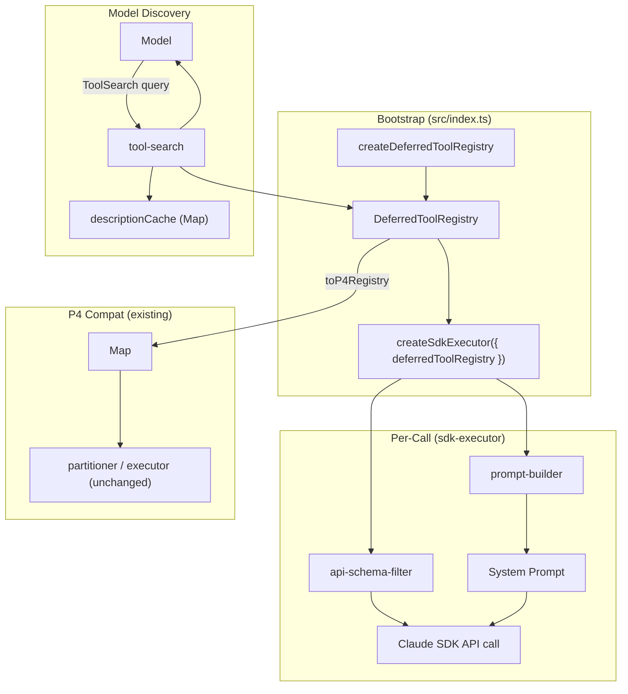

# SPARC Spec: P12 — Deferred Tool Loading

**Phase:** P12 (High)
**Priority:** High
**Estimated Effort:** 3 days
**Dependencies:** P11 (query loop host), P6 (task lifecycle), P10 (compaction)

> **Spec revised after CC source audit (2026-04-04).** The original Wave 1 spec
> described features (hot/warm/cold tiers, sha256-keyed result memoization, lazy
> per-instance proxy schema loading, Bash command parser for parallelism) that
> **do not exist** in Claude Code. This revision matches CC's actual
> `ToolSearchTool` + `defer_loading` pattern as observed in:
>
> - `src/tools/ToolSearchTool/ToolSearchTool.ts` (473 LOC)
> - `src/tools/ToolSearchTool/prompt.ts:62-107` (`shouldDefer` / `alwaysLoad`)
> - `src/tools.ts:193-250` (eager instantiation at startup)
> - `src/utils/api.ts:223-226` (`defer_loading: true` per-tool API field)
> - `src/services/tools/toolOrchestration.ts:91-116` (`isConcurrencySafe(input)`)
>
> CC has 40 built-in tools, ~133 KB of tool prompt text, 27 of 40 deferred via
> the schema flag. Tools are eagerly instantiated; only their *advertisement*
> in the API request is deferred. There is no runtime lazy proxy and no result
> memoization.

---

## S — Specification

### 1. Requirements

```yaml
specification:
  functional_requirements:
    - id: "FR-P12-001"
      description: "Eager tool registry with per-tool shouldDefer + alwaysLoad flags"
      priority: "critical"
      acceptance_criteria:
        - "registry.register({ name, description, schema, execute, shouldDefer, alwaysLoad, isConcurrencySafe }) stores the full ToolDef in-memory"
        - "Tools are instantiated at registry.register() time — there is no lazy loader thunk"
        - "alwaysLoad core tools (Read, Edit, Write, Bash, Grep, Glob, Agent, ToolSearch) default to shouldDefer=false"
        - "Newly registered orch-agents-specific or MCP tools default to shouldDefer=true"
        - "Re-registering the same name throws DuplicateToolError"
        - "registry.list() returns all tools; listDeferred() filters by shouldDefer; listAlwaysLoad() filters by alwaysLoad"

    - id: "FR-P12-002"
      description: "Tool descriptions exposed in system prompt as 1-line summaries; full schemas held in registry until requested"
      priority: "critical"
      acceptance_criteria:
        - "buildPromptAdvertisement(registry) emits one line per deferred tool: '- {name}: {description}'"
        - "AlwaysLoad tools (incl. ToolSearch) emit their full schema inline"
        - "Output is plain markdown — no JSON schema noise — for the deferred set"
        - "Output stays under the 8 KB cap regardless of how many deferred tools are registered"

    - id: "FR-P12-003"
      description: "ToolSearch meta-tool — direct selection or keyword search"
      priority: "critical"
      acceptance_criteria:
        - "Input schema: { query: string, max_results?: number }"
        - "select:ToolName form returns the named tool's full descriptor (comma-separated multi-select supported)"
        - "Keyword form scores against name + description; +required terms must match the name; bare terms are ranked"
        - "MCP server prefix matching: a query of mcp__server__ matches all tools under that server"
        - "Returns { matches: Array<{name, description}>, query, total_deferred_tools }"
        - "Memoized description cache (Map keyed by name) — populated lazily, never invalidated within a process lifetime"

    - id: "FR-P12-004"
      description: "Tool registry built once at startup; API schema serializer filters by defer_loading per-tool"
      priority: "critical"
      acceptance_criteria:
        - "buildApiToolList(registry) returns the full tool list serialized for the model API"
        - "AlwaysLoad tools serialize with their full input_schema inline"
        - "Deferred tools serialize with input_schema=null and a defer_loading: true marker (mirrors CC api.ts:223-226)"
        - "Output preserves registration order"
        - "Pure function — no side effects on the registry"

    - id: "FR-P12-005"
      description: "Memoized description cache for ToolSearch keyword matching"
      priority: "high"
      acceptance_criteria:
        - "First call to tool-search.describe(name) reads registry; subsequent calls hit a Map cache"
        - "Cache survives across ToolSearch invocations within the same process"
        - "Not an LRU — deferred tool count is bounded and the cache is small (< 1 KB per entry)"
        - "Cache stats observable via toolSearch.getCacheStats() for tests"

    - id: "FR-P12-006"
      description: "Per-tool isConcurrencySafe(input) consumed by the existing P4 partitioner"
      priority: "high"
      acceptance_criteria:
        - "DeferredToolDef.isConcurrencySafe(input) is the same shape as the existing P4 ToolDefinition.isConcurrencySafe"
        - "DeferredToolRegistry can produce a P4-compatible Map<string, ToolDefinition> via registry.toP4Registry()"
        - "P4's partitionToolCalls and runTools work unchanged against this map"
        - "No rewrite of partitioner.ts, executor.ts, or queryLoopAdapter.ts"

    - id: "FR-P12-007"
      description: "Eval — system prompt tool budget stays under 8 KB regardless of deferred tool count"
      priority: "high"
      acceptance_criteria:
        - "Test registers N synthetic deferred tools where N ∈ {10, 50, 100, 500}"
        - "buildPromptAdvertisement byte length is < 8192 bytes for every N"
        - "ToolSearch tool's full schema is always present in the advertisement"
        - "When N exceeds the budget, the advertisement truncates with a '+ X more tools available via ToolSearch' line"

  non_functional_requirements:
    - id: "NFR-P12-001"
      category: "performance"
      description: "Registry operations are O(1) for lookup and O(N) for full enumeration"
      measurement: "registry.get() < 1ms p99; registry.listDeferred() < 5ms p99 at N=500"

    - id: "NFR-P12-002"
      category: "memory"
      description: "Registry footprint is the sum of registered ToolDef objects — no overhead beyond a Map and two filter caches"
      measurement: "Heap delta < 100 bytes per registered tool over the bare ToolDef"

    - id: "NFR-P12-003"
      category: "compatibility"
      description: "sdk-executor must accept the registry as an optional dep without breaking P6/P10/P11 wiring"
      measurement: "All P6/P10/P11 sdk-executor tests pass with deferredToolRegistry omitted; passing one is purely additive"

    - id: "NFR-P12-004"
      category: "compatibility"
      description: "Existing P4 modules under src/services/tools/* (partitioner, executor, concurrencyClassifier, queryLoopAdapter, toolDefinitions, types, index) are not modified"
      measurement: "0 line diff in those files; their tests still pass"
```

### 2. Constraints

```yaml
constraints:
  technical:
    - "Tools are eagerly instantiated at registration — no lazy loader thunks (matches CC tools.ts:193-250)"
    - "Deferral is a *schema serialization* concern, not a runtime one"
    - "ToolSearch must always be in the always-load set or the model cannot discover deferred tools"
    - "MCP server prefix is mcp__{server}__{tool}; the search must split on __ to identify server names"
    - "Description cache is process-local; no cross-process sharing"
    - "The new deferred-tools service lives in src/services/deferred-tools/ — separate from the colliding src/services/tools/ P4 modules to avoid name shadowing"

  architectural:
    - "DeferredToolRegistry is a process-local singleton constructed once at app bootstrap"
    - "src/services/tools/* (P4) is left untouched; the new module is additive"
    - "sdk-executor accepts the registry as an optional dep — when omitted, behavior is identical to today (preserves P6/P10/P11 wiring)"
    - "When provided, sdk-executor uses the registry to compute its allowedTools array; the API schema filter and prompt advertisement are computed once per call"
    - "ToolSearch invocations are routed by the SDK preset, not by orch-agents; we provide the meta-tool definition but the SDK call site is the consumer"
```

### 3. Use Cases

```yaml
use_cases:
  - id: "UC-P12-001"
    title: "Bootstrap registers built-in tools and MCP tools"
    actor: "Orch-Agents process startup"
    flow:
      1. "src/index.ts constructs a DeferredToolRegistry"
      2. "Built-in core tools (Read, Edit, Write, Bash, Grep, Glob, Agent) are registered with alwaysLoad=true, shouldDefer=false"
      3. "ToolSearch is registered with alwaysLoad=true, shouldDefer=false"
      4. "Any orch-agents- or MCP-specific tools are registered with shouldDefer=true"
      5. "Registry is passed to createSdkExecutor as deferredToolRegistry"
      6. "sdk-executor builds its allowedTools list from registry.list().map(t => t.name)"

  - id: "UC-P12-002"
    title: "Model invokes ToolSearch with select: form"
    actor: "Model"
    flow:
      1. "Model sees the deferred-tool advertisement in the system prompt"
      2. "Model emits ToolSearch({ query: 'select:mcp__cf__browser_screenshot' })"
      3. "ToolSearch parses the select: prefix, looks up the tool in the registry"
      4. "Returns { matches: [{ name, description }], query, total_deferred_tools }"
      5. "Model now has enough context to construct the next tool_use call"

  - id: "UC-P12-003"
    title: "Prompt budget stays bounded at 500 tools"
    actor: "buildPromptAdvertisement"
    flow:
      1. "Registry has 500 deferred tools + 8 always-load tools"
      2. "buildPromptAdvertisement walks always-load tools first (full schemas)"
      3. "Then walks deferred tools, emitting one line per tool"
      4. "When the running byte total nears 8 KB, truncates and emits '+ X more tools available via ToolSearch'"
      5. "Returned string is < 8192 bytes, contains all always-load tools' full schemas"
```

### 4. Acceptance Criteria (Gherkin)

```gherkin
Feature: Deferred Tool Loading

  Scenario: Tool registered with full schema at register time
    Given an empty DeferredToolRegistry
    When a tool "Foo" is registered with shouldDefer=true
    Then registry.get("Foo") returns the full ToolDef including its schema
    And registry.listDeferred() includes "Foo"
    And registry.listAlwaysLoad() does not include "Foo"

  Scenario: Duplicate registration throws
    Given a tool "Foo" is already registered
    When the same name is registered again
    Then a DuplicateToolError is thrown

  Scenario: ToolSearch select returns the tool descriptor
    Given a deferred tool "mcp__x__y" is registered with description "Does Y"
    When the model invokes ToolSearch with "select:mcp__x__y"
    Then the result contains { name: "mcp__x__y", description: "Does Y" }
    And total_deferred_tools reflects the registry's deferred count

  Scenario: ToolSearch keyword search ranks by description match
    Given deferred tools "browser_screenshot" and "browser_click" are registered
    When the model invokes ToolSearch with "screenshot"
    Then "browser_screenshot" appears before "browser_click" in matches

  Scenario: ToolSearch +required filter requires the term in the name
    Given a tool "browser_screenshot" exists with description "capture image"
    And a tool "image_compress" exists with description "compress images"
    When the model invokes ToolSearch with "+browser image"
    Then only "browser_screenshot" appears

  Scenario: API schema filter applies defer_loading per tool
    Given the registry has 1 always-load tool "Read" and 1 deferred tool "Foo"
    When buildApiToolList(registry) runs
    Then "Read" appears with its full input_schema inline
    And "Foo" appears with input_schema=null and defer_loading=true

  Scenario: Prompt budget at 500 deferred tools
    Given 500 deferred tools are registered with realistic descriptions
    When buildPromptAdvertisement(registry) runs
    Then the result is under 8192 bytes
    And the result contains all always-load tools' full schemas
    And the result ends with "+ X more tools available via ToolSearch" if truncated

  Scenario: Concurrency safety propagates to P4 partitioner
    Given the registry has read-only tools and write tools registered with isConcurrencySafe
    When registry.toP4Registry() is converted and passed to partitionToolCalls
    Then read-only tool blocks are batched together
    And write tools land in their own serial batches
```

---

## P — Pseudocode

### registry

```
MODULE: DeferredToolRegistry
STATE: tools = Map<string, DeferredToolDef>

  register(def):
    IF tools.has(def.name): THROW DuplicateToolError
    tools.set(def.name, def)

  get(name): RETURN tools.get(name)
  list(): RETURN [...tools.values()]
  listDeferred(): RETURN list().filter(t => t.shouldDefer)
  listAlwaysLoad(): RETURN list().filter(t => t.alwaysLoad)

  toP4Registry():                    // FR-P12-006
    map = new Map<string, P4ToolDefinition>()
    FOR t IN list():
      map.set(t.name, {
        name: t.name,
        isConcurrencySafe: t.isConcurrencySafe ?? (() => false),
        execute: t.execute,
      })
    RETURN map
```

### tool-search

```
MODULE: ToolSearch
STATE: descriptionCache = Map<string, string>

  describe(registry, name):
    IF descriptionCache.has(name): RETURN descriptionCache.get(name)
    def = registry.get(name)
    IF NOT def: RETURN undefined
    descriptionCache.set(name, def.description)
    RETURN def.description

  search(registry, { query, max_results }):
    deferred = registry.listDeferred()
    total = deferred.length

    IF query.startsWith('select:'):
      names = query.slice(7).split(',').map(trim).filter(nonempty)
      matches = names
        .map(n => registry.get(n))
        .filter(present)
        .map(t => ({ name: t.name, description: describe(registry, t.name) }))
      RETURN { matches, query, total_deferred_tools: total }

    // Keyword form: +required terms first, then bare ranked terms
    parts = query.split(/\s+/).filter(nonempty)
    required = parts.filter(p => p.startsWith('+')).map(p => p.slice(1).toLowerCase())
    optional = parts.filter(p => NOT p.startsWith('+')).map(p => p.toLowerCase())

    candidates = deferred
    FOR req IN required:
      candidates = candidates.filter(t => t.name.toLowerCase().includes(req))

    // MCP prefix awareness
    mcpQuery = optional.find(t => t.startsWith('mcp__'))
    IF mcpQuery:
      candidates = candidates.filter(t => t.name.startsWith(mcpQuery))

    scored = candidates.map(t => ({
      tool: t,
      score: scoreOptional(t, optional)
    }))
    .filter(s => s.score > 0 OR optional.length === 0)
    .sort((a, b) => b.score - a.score)
    .slice(0, max_results ?? 10)

    matches = scored.map(s => ({
      name: s.tool.name,
      description: describe(registry, s.tool.name)
    }))
    RETURN { matches, query, total_deferred_tools: total }

  scoreOptional(tool, optional):
    haystack = (tool.name + ' ' + (tool.description ?? '')).toLowerCase()
    score = 0
    FOR term IN optional:
      IF tool.name.toLowerCase().includes(term): score += 2
      ELSE IF haystack.includes(term):           score += 1
    RETURN score
```

### prompt-builder

```
MODULE: PromptBuilder
CONST PROMPT_BUDGET_BYTES = 8 * 1024

  buildPromptAdvertisement(registry):
    parts = []
    parts.push('## Available Tools')
    parts.push('')

    FOR t IN registry.listAlwaysLoad():
      parts.push(`### ${t.name}`)
      parts.push(t.description)
      parts.push('```json')
      parts.push(JSON.stringify(t.schema, null, 2))
      parts.push('```')
      parts.push('')

    deferred = registry.listDeferred()
    IF deferred.length > 0:
      parts.push('## Deferred Tools (use ToolSearch to expand)')
      truncatedAt = -1
      FOR i, t IN deferred:
        line = `- ${t.name}: ${t.description}`
        candidate = parts.concat([line]).join('\n')
        IF byteLength(candidate) > PROMPT_BUDGET_BYTES:
          truncatedAt = i
          BREAK
        parts.push(line)

      IF truncatedAt >= 0:
        remaining = deferred.length - truncatedAt
        parts.push(`+ ${remaining} more tools available via ToolSearch`)

    RETURN parts.join('\n')
```

### api-schema-filter

```
MODULE: ApiSchemaFilter

  buildApiToolList(registry):
    RETURN registry.list().map(t => ({
      name: t.name,
      description: t.description,
      input_schema: (t.alwaysLoad OR NOT t.shouldDefer) ? t.schema : null,
      defer_loading: t.shouldDefer && NOT t.alwaysLoad,
    }))
```

---

## A — Architecture



### File layout

```
src/services/deferred-tools/                    -- NEW (this phase)
  registry.ts                                   -- DeferredToolRegistry
  tool-search.ts                                -- ToolSearch meta-tool
  prompt-builder.ts                             -- buildPromptAdvertisement
  api-schema-filter.ts                          -- buildApiToolList
  index.ts                                      -- barrel

src/services/tools/                             -- UNTOUCHED (P4 modules)
  partitioner.ts | executor.ts | concurrencyClassifier.ts
  queryLoopAdapter.ts | toolDefinitions.ts | types.ts | index.ts

src/execution/runtime/sdk-executor.ts           -- additive: optional deferredToolRegistry dep
src/index.ts                                    -- bootstrap registers built-ins
src/execution/orchestrator/issue-worker.ts      -- worker thread bootstrap
```

---

## R — Refinement

### Test Plan

| FR | Test File | Key Assertions |
|----|-----------|----------------|
| FR-P12-001 | `tests/services/deferred-tools/registry.test.ts` | register stores full def; duplicate throws; listDeferred / listAlwaysLoad filter correctly; toP4Registry yields a Map shaped like the existing P4 ToolDefinition |
| FR-P12-002, FR-P12-007 | `tests/services/deferred-tools/prompt-builder.test.ts` | always-load tools rendered with full schema; deferred tools rendered as one-line summaries; 8 KB cap enforced; truncation tail emitted when needed; ToolSearch always present when registered |
| FR-P12-003, FR-P12-005 | `tests/services/deferred-tools/tool-search.test.ts` | select: form returns descriptors; comma-separated multi-select; +required filter; bare keyword scoring; mcp__server__ prefix filter; max_results respected; description cache hit on second call |
| FR-P12-004 | `tests/services/deferred-tools/api-schema-filter.test.ts` | always-load → input_schema inline; deferred → input_schema=null; defer_loading flag set per-tool |
| FR-P12-006 | covered in registry.test.ts via toP4Registry roundtrip |
| FR-P12-007 | `tests/eval/deferred-tool-prompt-budget.test.ts` | N ∈ {10, 50, 100, 500} all under 8 KB; deterministic ordering |
| sdk-executor backward compat | `tests/execution/runtime/sdk-executor.test.ts` (extended) | omitting deferredToolRegistry yields identical behavior; passing one feeds allowedTools from registry |

All tests use `node:test` + `node:assert/strict`, mock-first.

### Anti-Patterns

```yaml
anti_patterns:
  - name: "Lazy schema thunks"
    bad: "Storing a () => Promise<ToolDef> loader at register time"
    good: "Eagerly construct the ToolDef and store it whole — match CC tools.ts:193-250"
    enforcement: "registry.register() type signature accepts a concrete ToolDef, not a thunk"

  - name: "Result memoization"
    bad: "sha256-keyed disk cache for tool results"
    good: "Don't memoize results — CC doesn't, and tool results are not pure"
    enforcement: "No cache module under src/services/deferred-tools/"

  - name: "Hot/warm/cold tiers"
    bad: "Three-tier classification with usage-based promotion"
    good: "Two states: alwaysLoad vs deferred, set at register time"
    enforcement: "DeferredToolDef has shouldDefer + alwaysLoad booleans only — no tier enum"

  - name: "Bash command parser for parallelism"
    bad: "Parsing Bash arguments to decide concurrency safety"
    good: "Tool declares isConcurrencySafe(input) — Bash returns false unconditionally"
    enforcement: "P4's existing partitioner handles this — no new code"

  - name: "ToolSearch in the deferred set"
    bad: "ToolSearch with shouldDefer=true — model can never discover anything"
    good: "ToolSearch is always alwaysLoad=true and shouldDefer=false"
    enforcement: "Bootstrap test asserts this"
```

### Migration Strategy

```yaml
migration:
  phase_1_clean_stubs:
    description: "Delete the orphan Phase 9G stubs that don't match the revised spec"
    files:
      - "src/services/tools/deferredToolRegistry.ts (delete — to be rewritten under deferred-tools/)"
      - "src/services/tools/deferredTypes.ts (delete)"
      - "src/services/tools/lazyToolProxy.ts (delete — CC has no lazy proxy)"
      - "src/services/tools/diskResultCache.ts (delete — CC has no result memoization)"
      - "src/services/tools/toolSearchIndex.ts (delete — replaced by tool-search.ts)"
      - "src/services/tools/deferredIndex.ts (delete — barrel for the above)"
      - "tests/services/tools/{deferredToolRegistry,lazyToolProxy,diskResultCache,toolSearchIndex}.test.ts"
    validation: "grep confirms zero production callers of any deleted symbol"

  phase_2_new_module:
    description: "Build src/services/deferred-tools/ from scratch"
    files: ["registry.ts", "tool-search.ts", "prompt-builder.ts", "api-schema-filter.ts", "index.ts"]
    validation: "all FR-coverage tests pass"

  phase_3_wire_sdk_executor:
    description: "sdk-executor accepts optional deferredToolRegistry; when set, allowedTools is computed from the registry"
    files: ["src/execution/runtime/sdk-executor.ts"]
    validation: "P6/P10/P11 sdk-executor tests still pass with no registry; new test asserts registry path"

  phase_4_bootstrap:
    description: "src/index.ts and src/execution/orchestrator/issue-worker.ts construct a registry and pass it to createSdkExecutor"
    validation: "build + lint clean; existing integration tests pass"
```

> **Scope intentionally bounded.** The Claude Agent SDK uses
> `tools: { type: 'preset', preset: 'claude_code' }`, which means CC's preset
> owns the actual tool list and ToolSearch routing inside the SDK. Orch-Agents
> cannot intercept ToolSearch calls without abandoning the preset and risking
> P10/P11 wiring. This phase delivers the registry, advertisement, schema
> filter, and meta-tool implementation as a standalone library that
> sdk-executor consumes for `allowedTools`. A follow-up phase can replace the
> SDK preset with a custom tool list driven by the registry once the preset
> escape hatch is mature.

---

## C — Completion

```yaml
completion:
  code_deliverables:
    - "Created: src/services/deferred-tools/registry.ts"
    - "Created: src/services/deferred-tools/tool-search.ts"
    - "Created: src/services/deferred-tools/prompt-builder.ts"
    - "Created: src/services/deferred-tools/api-schema-filter.ts"
    - "Created: src/services/deferred-tools/index.ts"
    - "Modified: src/execution/runtime/sdk-executor.ts (additive optional dep)"
    - "Modified: src/index.ts (bootstrap registry)"
    - "Modified: src/execution/orchestrator/issue-worker.ts (worker bootstrap)"
    - "Deleted: src/services/tools/{deferredToolRegistry,deferredTypes,lazyToolProxy,diskResultCache,toolSearchIndex,deferredIndex}.ts"
    - "Deleted: tests/services/tools/{deferredToolRegistry,lazyToolProxy,diskResultCache,toolSearchIndex}.test.ts"

  test_deliverables:
    - "tests/services/deferred-tools/registry.test.ts"
    - "tests/services/deferred-tools/tool-search.test.ts"
    - "tests/services/deferred-tools/prompt-builder.test.ts"
    - "tests/services/deferred-tools/api-schema-filter.test.ts"
    - "tests/eval/deferred-tool-prompt-budget.test.ts"
    - "tests/execution/runtime/sdk-executor.test.ts (extended)"

  verification_checklist:
    - "npm run build succeeds"
    - "npx tsc --noEmit clean"
    - "npm test passes — count moved from 1587 → 1587+ delta"
    - "P4 partitioner / executor / classifier tests still pass (untouched)"
    - "sdk-executor tests pass with and without deferredToolRegistry"
    - "FR-P12-007 prompt budget eval green at N=500"
    - "Bootstrap test confirms ToolSearch is alwaysLoad=true"
    - "No production callers of any deleted Phase 9G stub symbol"

  success_metrics:
    - "Prompt advertisement < 8 KB at 500 deferred tools"
    - "ToolSearch select: returns in O(1) per name"
    - "0 lines diff in P4 modules under src/services/tools/"
    - "Zero behavioral change to sdk-executor when deferredToolRegistry omitted"
```
