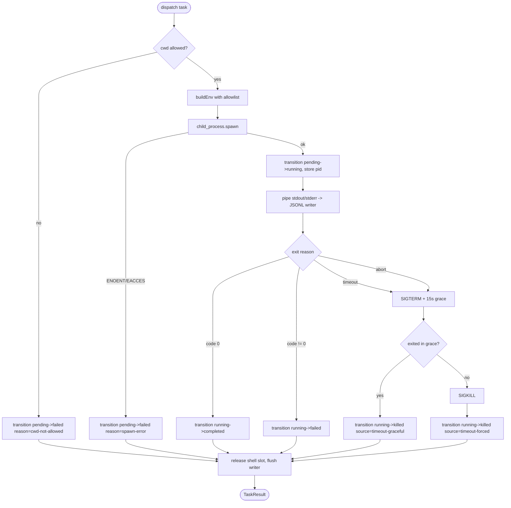

# SPARC Spec: P13 — LocalShellTask Executor

**Phase:** P13 (Medium)
**Priority:** Medium
**Estimated Effort:** 3 days
**Dependencies:** P6 (TaskRouter, TaskRegistry, ConcurrencyClass, TaskOutputWriter)
**Source Blueprint:** Claude Code Original —
- `src/tasks/LocalShellTask/LocalShellTask.tsx` (spawnShellTask, lifecycle)
- `src/tasks/LocalShellTask/guards.ts` (isLocalShellTask, LocalShellTaskState)
- `src/tasks/LocalShellTask/killShellTasks.ts` (killTask, killShellTasksForAgent)
- `src/utils/task/framework.ts` (registerTask, updateTaskState)
- `src/utils/task/diskOutput.ts` (JSONL write/evict)
- `src/utils/task/TaskOutput.ts`

---

## Context

P6 wired `TaskType.local_bash` into the type system but never built an executor for it. The coordinator currently invokes shell commands by asking Claude to use the Bash tool — slow, expensive, indirect, and outside the Task backbone (no JSONL output, no concurrency-class accounting, no kill semantics). A native LocalShellTask executor lets the orchestrator dispatch shell directly via `TaskRouter`, matching CC's `spawnShellTask` pattern but adapted to our DDD layout.

---

## S — Specification

### 1. Requirements

```yaml
specification:
  functional_requirements:
    - id: "FR-P13-001"
      description: "LocalShellExecutor shall spawn a subprocess via child_process.spawn using payload-supplied command, args, env, and cwd"
      priority: "critical"
      acceptance_criteria:
        - "spawn() invoked with { cwd, env, stdio: ['ignore','pipe','pipe'], shell: false }"
        - "Payload schema: { command: string, args: string[], cwd: string, env?: Record<string,string>, timeoutMs?: number }"
        - "Detached=false (subprocess dies with parent on hard crash)"
        - "PID stored on Task metadata for observability"

    - id: "FR-P13-002"
      description: "stdout and stderr shall stream into the task-output JSONL via TaskOutputWriter from P6"
      priority: "critical"
      acceptance_criteria:
        - "Each chunk emitted as { ts, stream: 'stdout'|'stderr', data: string } JSON line"
        - "UTF-8 decoding with replacement on invalid bytes"
        - "Buffered line-splitting NOT required — caller writes raw chunks"
        - "Output file path comes from existing taskOutputWriter.getTaskOutputPath(taskId)"
        - "Writer flushed on subprocess exit before terminal transition"

    - id: "FR-P13-003"
      description: "Timeout handling shall escalate SIGTERM → SIGKILL with a 15s grace period (CC parity)"
      priority: "critical"
      acceptance_criteria:
        - "On timeout: send SIGTERM, schedule SIGKILL after 15_000ms"
        - "On graceful exit before grace expires: clear SIGKILL timer"
        - "Default timeoutMs = 600_000 (10 min); payload may override"
        - "Kill source recorded ('timeout' | 'abort' | 'agent-exit') on Task metadata"

    - id: "FR-P13-004"
      description: "Exit code shall map to terminal TaskStatus deterministically"
      priority: "critical"
      acceptance_criteria:
        - "exit code 0 → TaskStatus.completed"
        - "exit code != 0 (and no signal) → TaskStatus.failed"
        - "Killed by signal (SIGTERM/SIGKILL from us) → TaskStatus.killed"
        - "Spawn ENOENT or EACCES → TaskStatus.failed (no transition through running)"
        - "Result object includes { exitCode, signal, killed, durationMs }"

    - id: "FR-P13-005"
      description: "TaskRouter shall route TaskType.local_bash to LocalShellExecutor under ConcurrencyClass.shell"
      priority: "high"
      acceptance_criteria:
        - "taskRouter registers executor: { type: local_bash, executor: LocalShellExecutor, class: shell }"
        - "CapacityWake.acquire('shell') gates dispatch (per P6 slot pools)"
        - "release('shell') called in finally regardless of terminal status"
        - "No direct spawn outside the executor — orchestrator never calls child_process directly"

    - id: "FR-P13-006"
      description: "Working directory must be inside an allowed worktree path (security boundary)"
      priority: "critical"
      acceptance_criteria:
        - "guards.assertCwdAllowed(cwd, allowedRoots) called before spawn"
        - "allowedRoots seeded from the same writableRoots set used in P7"
        - "Path is realpath-resolved (no symlink escape) before comparison"
        - "Rejection produces TaskStatus.failed with reason='cwd-not-allowed' — no spawn attempted"

    - id: "FR-P13-007"
      description: "Subprocess environment shall be filtered through an allowlist (no secret leakage)"
      priority: "critical"
      acceptance_criteria:
        - "Default allowlist: PATH, HOME, USER, LANG, LC_ALL, TZ, TMPDIR, SHELL"
        - "Payload env merged AFTER allowlist (caller-supplied wins, but never inherits parent secrets)"
        - "Keys matching /TOKEN|SECRET|KEY|PASSWORD|CREDENTIAL/i stripped from final env"
        - "Final env logged at debug level with values redacted"

  non_functional_requirements:
    - id: "NFR-P13-001"
      category: "performance"
      description: "Executor overhead (spawn → first stdout chunk) must not measurably exceed raw spawn"
      measurement: "executor latency - raw spawn latency < 5ms p95"

    - id: "NFR-P13-002"
      category: "reliability"
      description: "No orphaned subprocesses on orchestrator shutdown"
      measurement: "SIGTERM to orchestrator → all running shell tasks receive SIGTERM within 100ms"

    - id: "NFR-P13-003"
      category: "observability"
      description: "Every shell task transition emits TaskStateChanged on EventBus"
      measurement: "transition() goes through P6 taskStateMachine — no direct status writes"

    - id: "NFR-P13-004"
      category: "security"
      description: "No secret env vars from parent process visible to subprocess"
      measurement: "Test: parent has SECRET_X=foo, child env has no SECRET_X"
```

### 2. Constraints

```yaml
constraints:
  technical:
    - "Use child_process.spawn — NOT exec, NOT execFile (we need stream control + signal escalation)"
    - "shell: false — caller passes argv array; no shell interpolation, no injection surface"
    - "Reuse P6 TaskOutputWriter — do not create a parallel JSONL writer"
    - "Reuse P6 taskStateMachine.transition — never mutate Task.status directly"
    - "Reuse P6 CapacityWake — executor calls neither acquire nor release; TaskRouter does"
    - "No React, no Ink, no AppState — this is a server-side executor (CC's LocalShellTask is React-coupled; we strip that)"

  architectural:
    - "Executor implements the TaskExecutor interface from P6 (execute(task) → Promise<TaskResult>)"
    - "Guards live in a separate file (guards.ts) so non-executor consumers can import without pulling spawn"
    - "killSource is metadata, not a status — TaskStatus.killed is the only kill outcome"
    - "Allowlist + writableRoots come from a config object injected at executor construction (no global state)"
```

### 3. Use Cases

```yaml
use_cases:
  - id: "UC-P13-001"
    title: "Coordinator Dispatches Shell Task via TaskRouter"
    actor: "Symphony Orchestrator"
    flow:
      1. "Orchestrator builds payload { command: 'pnpm', args: ['test'], cwd: '/wt/abc' }"
      2. "createTask(TaskType.local_bash, payload), register in TaskRegistry"
      3. "TaskRouter.dispatch(task) — acquires shell slot via CapacityWake"
      4. "LocalShellExecutor.execute(task): assertCwdAllowed → buildEnv → spawn"
      5. "transition(pending → running), PID written to metadata"
      6. "stdout/stderr chunks streamed to task-output/lb-xxx.jsonl"
      7. "Subprocess exits 0 → transition(running → completed)"
      8. "Writer flushed, slot released, TaskResult returned"

  - id: "UC-P13-002"
    title: "Timeout Escalates SIGTERM to SIGKILL"
    actor: "LocalShellExecutor"
    flow:
      1. "Task spawned with timeoutMs=30_000"
      2. "30s elapsed, no exit — sendSignal('SIGTERM'), set killSource='timeout'"
      3. "Schedule SIGKILL timer (15_000ms grace)"
      4. "Subprocess catches SIGTERM, exits cleanly within grace → clear SIGKILL timer"
      5. "transition(running → killed) with reason='timeout-graceful'"

  - id: "UC-P13-003"
    title: "Disallowed cwd Rejected Pre-Spawn"
    actor: "LocalShellExecutor"
    flow:
      1. "Payload cwd='/etc' arrives"
      2. "guards.assertCwdAllowed throws CwdNotAllowedError"
      3. "Executor catches, transitions Task pending → failed (no running state)"
      4. "TaskResult.reason='cwd-not-allowed', no subprocess spawned"

  - id: "UC-P13-004"
    title: "Orchestrator Shutdown Kills All Running Shells"
    actor: "Symphony Orchestrator"
    flow:
      1. "Orchestrator receives SIGTERM"
      2. "Iterates TaskRegistry.listByStatus(running) where type=local_bash"
      3. "For each: executor.abort(taskId) → SIGTERM → 15s grace → SIGKILL"
      4. "All tasks reach terminal state before orchestrator exits"
```

### 4. Acceptance Criteria (Gherkin)

```gherkin
Feature: LocalShellTask Executor

  Scenario: Successful command execution
    Given a Task with command "echo" and args ["hello"]
    When LocalShellExecutor executes the task
    Then the Task transitions pending → running → completed
    And the JSONL output contains a line with stream="stdout" and data containing "hello"
    And the exitCode in TaskResult is 0

  Scenario: Nonzero exit code maps to failed
    Given a Task running "sh -c exit 7"
    When the subprocess exits with code 7
    Then the Task status is failed
    And TaskResult.exitCode is 7

  Scenario: Timeout escalation
    Given a Task with timeoutMs=100 running "sleep 60"
    When 100ms elapses
    Then SIGTERM is sent to the subprocess
    And if the process does not exit within 15s, SIGKILL is sent
    And the final Task status is killed
    And killSource is "timeout"

  Scenario: cwd outside allowed roots is rejected
    Given allowedRoots = ["/workspace"]
    And a Task with cwd "/etc"
    When LocalShellExecutor executes the task
    Then no subprocess is spawned
    And the Task status is failed with reason "cwd-not-allowed"

  Scenario: Secret env vars are stripped
    Given the parent process has GITHUB_TOKEN set
    When LocalShellExecutor spawns a subprocess
    Then the subprocess env does not contain GITHUB_TOKEN

  Scenario: Concurrency-class slot accounting
    Given the shell pool max=2 with 2 running tasks
    When a third local_bash task is dispatched
    Then TaskRouter blocks the dispatch until a slot is released
```

---

## P — Pseudocode

### LocalShellExecutor

```
MODULE: LocalShellExecutor
DEPENDS: taskOutputWriter, taskStateMachine, guards, config{allowedRoots, envAllowlist}

  execute(task):
    payload = task.payload as LocalShellPayload
    TRY:
      assertCwdAllowed(payload.cwd, config.allowedRoots)
    CATCH CwdNotAllowedError:
      RETURN transition(task, failed, { reason: 'cwd-not-allowed' })

    env = buildEnv(payload.env, config.envAllowlist)
    writer = taskOutputWriter.open(task.id)

    child = spawn(payload.command, payload.args, {
      cwd: payload.cwd, env, stdio: ['ignore','pipe','pipe'], shell: false
    })

    task = transition(task, running, { pid: child.pid })

    timeoutId = setTimeout(() => abortChild('timeout'), payload.timeoutMs ?? DEFAULT_TIMEOUT)
    killTimerId = null
    killSource = null

    child.stdout.on('data', chunk => writer.append({ ts: now(), stream: 'stdout', data: chunk.toString('utf8') }))
    child.stderr.on('data', chunk => writer.append({ ts: now(), stream: 'stderr', data: chunk.toString('utf8') }))

    AWAIT child exit:
      clearTimeout(timeoutId); clearTimeout(killTimerId)
      writer.flushAndClose()
      status = mapExit(exitCode, signal, killSource)
      RETURN transition(task, status, { exitCode, signal, killSource, durationMs })

  abortChild(source):
    killSource = source
    child.kill('SIGTERM')
    killTimerId = setTimeout(() => child.kill('SIGKILL'), 15_000)
```

### Exit Mapping

```
mapExit(exitCode, signal, killSource):
  IF killSource !== null: RETURN killed
  IF signal !== null:     RETURN killed   // killed by external signal
  IF exitCode === 0:      RETURN completed
  RETURN failed
```

### Env Builder

```
buildEnv(payloadEnv, allowlist):
  base = pick(process.env, allowlist)            // PATH, HOME, ...
  merged = { ...base, ...(payloadEnv ?? {}) }
  RETURN omit(merged, /TOKEN|SECRET|KEY|PASSWORD|CREDENTIAL/i)
```

### Guards

```
assertCwdAllowed(cwd, allowedRoots):
  real = realpathSync(cwd)
  IF NOT allowedRoots.some(root => real === root || real.startsWith(root + sep)):
    THROW CwdNotAllowedError(real)
```

---

## A — Architecture

### Lifecycle



### File Structure

```
src/tasks/local-shell/
  executor.ts        -- (NEW) LocalShellExecutor implementing TaskExecutor from P6
  guards.ts          -- (NEW) assertCwdAllowed, CwdNotAllowedError, env allowlist helpers
  index.ts           -- (NEW) Barrel: LocalShellExecutor, LocalShellPayload, types

src/execution/task/taskRouter.ts
  -- (MODIFY) Register { type: local_bash, executor: LocalShellExecutor, class: shell }

tests/tasks/local-shell/
  executor.test.ts   -- (NEW)
  guards.test.ts     -- (NEW)
```

---

## R — Refinement

### Test Plan

| Module | Test File | Key Assertions |
|---|---|---|
| Executor — happy path | `executor.test.ts` | spawn echo hello → completed; JSONL contains stdout chunk; exitCode 0 |
| Executor — nonzero exit | `executor.test.ts` | sh -c 'exit 7' → failed; TaskResult.exitCode === 7 |
| Executor — stderr capture | `executor.test.ts` | sh -c '>&2 echo bad' → JSONL line has stream="stderr" |
| Executor — spawn ENOENT | `executor.test.ts` | command="/no/such/bin" → failed, reason='spawn-error', no running transition |
| Executor — timeout SIGTERM graceful | `executor.test.ts` | sleep + SIGTERM handler exits in <15s → killed, source='timeout-graceful' |
| Executor — timeout SIGKILL forced | `executor.test.ts` | trap-ignoring sleep → SIGKILL after grace → killed, source='timeout-forced' |
| Executor — abort signal | `executor.test.ts` | external abort() → SIGTERM → killed, source='abort' |
| Executor — pid in metadata | `executor.test.ts` | running task has numeric pid in metadata |
| Executor — slot release on failure | `executor.test.ts` | mock CapacityWake; assert release('shell') called even when spawn throws |
| Executor — JSONL flushed before terminal transition | `executor.test.ts` | reading file at completed event returns all chunks |
| Guards — cwd inside root | `guards.test.ts` | /workspace/repo when allowedRoots=[/workspace] → no throw |
| Guards — cwd equals root | `guards.test.ts` | /workspace when allowedRoots=[/workspace] → no throw |
| Guards — cwd escape via .. | `guards.test.ts` | /workspace/../etc → realpath resolves → throws CwdNotAllowedError |
| Guards — cwd escape via symlink | `guards.test.ts` | symlink /workspace/link → /etc → throws |
| Guards — env allowlist | `guards.test.ts` | parent has GITHUB_TOKEN → buildEnv result omits it |
| Guards — secret pattern stripped from payload | `guards.test.ts` | payload.env={MY_SECRET:'x'} → stripped from final env |
| Guards — payload overrides allowlist defaults | `guards.test.ts` | payload PATH wins over parent PATH |
| TaskRouter integration | `taskRouter.test.ts` (updated) | dispatch(local_bash task) routes to LocalShellExecutor; uses shell slot pool |

All tests use `node:test` + `node:assert/strict`, mock-first per project conventions. Subprocess tests use real `/bin/sh`-style commands gated by platform check.

### Anti-Patterns to Enforce

```yaml
anti_patterns:
  - name: "Shell interpolation"
    bad: "spawn(payload.command, { shell: true })"
    good: "spawn(command, args, { shell: false }) — argv array only"
    enforcement: "Lint rule / code review — no shell:true in this module"

  - name: "Bypassing TaskOutputWriter"
    bad: "Direct fs.appendFile to a custom log path"
    good: "Reuse taskOutputWriter from P6 — single source of truth for task output"
    enforcement: "No fs.* imports in executor.ts except via writer"

  - name: "Direct status mutation"
    bad: "task.status = 'completed'"
    good: "transition(task, completed, metadata)"
    enforcement: "Task.status readonly per P6"

  - name: "Inheriting full process.env"
    bad: "spawn(..., { env: process.env })"
    good: "buildEnv() with allowlist + secret stripping"
    enforcement: "Test asserts GITHUB_TOKEN absent from child env"

  - name: "Skipping the SIGTERM grace"
    bad: "child.kill('SIGKILL') on timeout"
    good: "SIGTERM, then SIGKILL after 15s — give the process a chance to clean up"
    enforcement: "Test verifies SIGTERM precedes SIGKILL"

  - name: "Forgetting to release the slot on failure"
    bad: "release only in success path"
    good: "TaskRouter wraps execute in try/finally — release always called"
    enforcement: "Mock test asserts release count == acquire count under failure"
```

### Migration Strategy

```yaml
migration:
  phase_1_guards_and_types:
    files: ["src/tasks/local-shell/guards.ts", "src/tasks/local-shell/index.ts"]
    description: "Pure helpers — assertCwdAllowed, buildEnv, LocalShellPayload type. No spawn yet."
    validation: "guards.test.ts passes; no other code touched."

  phase_2_executor:
    files: ["src/tasks/local-shell/executor.ts"]
    description: "Implement LocalShellExecutor against P6 TaskExecutor interface."
    validation: "executor.test.ts passes against real subprocesses on POSIX runners."

  phase_3_router_registration:
    files: ["src/execution/task/taskRouter.ts"]
    description: "Register LocalShellExecutor for TaskType.local_bash with ConcurrencyClass.shell."
    validation: "taskRouter.test.ts dispatches local_bash tasks end-to-end through real executor."
```

---

## C — Completion

### Definition of Done

```yaml
completion:
  code_deliverables:
    - "src/tasks/local-shell/executor.ts — LocalShellExecutor"
    - "src/tasks/local-shell/guards.ts — assertCwdAllowed, buildEnv, CwdNotAllowedError"
    - "src/tasks/local-shell/index.ts — barrel export"
    - "Modified: src/execution/task/taskRouter.ts — register local_bash → LocalShellExecutor under shell class"

  test_deliverables:
    - "tests/tasks/local-shell/executor.test.ts"
    - "tests/tasks/local-shell/guards.test.ts"
    - "Updated: tests/execution/task/taskRouter.test.ts (local_bash route)"

  verification_checklist:
    - "npm run build succeeds"
    - "npm test passes (existing + new)"
    - "npx tsc --noEmit passes"
    - "npm run lint passes"
    - "No child_process imports outside src/tasks/local-shell/"
    - "No shell:true anywhere in the module"
    - "All env-leakage tests pass on POSIX"
    - "Killed tasks consistently reach terminal state within 15s + epsilon"

  success_metrics:
    - "Coordinator stops invoking Bash tool for shell tasks it can dispatch directly"
    - "Average shell task latency drops vs Claude-mediated Bash tool path"
    - "0 orphaned subprocesses after orchestrator restart in soak test"
    - "100% of local_bash tasks have matching JSONL output files"
```
