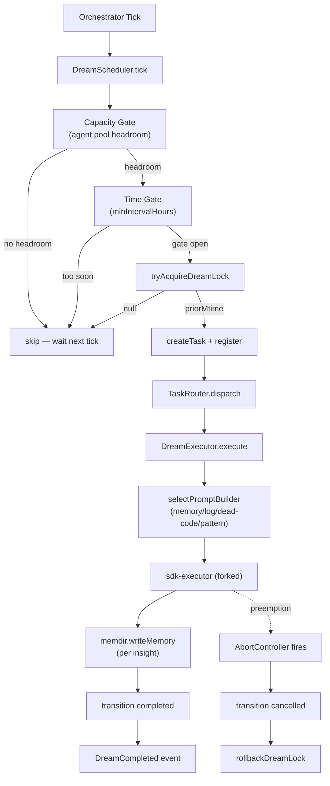
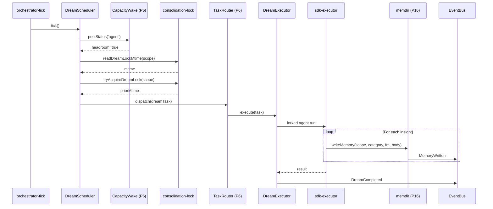

# SPARC Spec: P14 — DreamTask Executor

**Phase:** P14 (Medium)
**Priority:** Medium
**Estimated Effort:** 4 days
**Dependencies:** P6 (TaskRouter, ConcurrencyClass.dream, TaskRegistry), P16 (memdir — `extractMemories`, `writeMemory`)
**Source Blueprint:** Claude Code Original — `src/tasks/DreamTask/DreamTask.ts`, `src/services/autoDream/autoDream.ts`, `src/services/autoDream/consolidationLock.ts`, `src/services/autoDream/consolidationPrompt.ts`, `src/services/autoDream/config.ts`

---

## Context

P6 wired `TaskType.dream` and `ConcurrencyClass.dream` into the type system but left the executor side empty — dream tasks are a recognized class with no module behind them. This phase ports CC's `autoDream` + `DreamTask` pair into orch-agents as the executor for low-priority background work that runs only when the agent harness is otherwise idle. Dream tasks consolidate memories, distill cross-session patterns, summarize logs, and detect dead code — work that improves the system over time without competing with foreground tasks for capacity.

CC's autoDream is gated by three cheap checks (time → sessions → lock), forks an agent with a structured 4-phase prompt (orient → gather → consolidate → prune), and uses the lock file's mtime as the `lastConsolidatedAt` cursor. Failed runs roll the mtime back. Orch-agents inherits this gating model but routes execution through P6's TaskRouter and persists output through P16's memdir API rather than CC's own filesystem layer.

P14 is the **primary consumer** of P16's `extractMemories` (FR-P16-006) and `writeMemory` (FR-P16-008) APIs. The dream executor never writes files directly — every memory it consolidates flows through memdir's sandboxed write path with frontmatter, scope, and category resolved per FR-P16-001 and FR-P16-002.

---

## S — Specification

### 1. Requirements

```yaml
specification:
  functional_requirements:
    - id: "FR-P14-001"
      description: "Dream scheduler runs dream tasks ONLY when ConcurrencyClass.agent has idle headroom"
      priority: "critical"
      acceptance_criteria:
        - "DreamScheduler.shouldFire() returns false when CapacityWake reports agent pool used >= max - 1"
        - "Idle check consults P6 CapacityWake.poolStatus('agent') — no parallel state"
        - "When agent pool drains, scheduler picks up the next tick (no manual kick required)"
        - "Idle headroom threshold configurable (default: at least 1 free agent slot)"
        - "Monitor and shell pools are NOT considered — only agent class blocks dreams"

    - id: "FR-P14-002"
      description: "consolidationLock prevents overlapping dreams per repo scope"
      priority: "critical"
      acceptance_criteria:
        - "Lock file at {memdirBase}/repos/{slug}/.dream-lock with mtime = lastDreamAt"
        - "tryAcquireDreamLock(scope) returns priorMtime on success, null when held by live PID"
        - "Holder PID stored in lock body; stale-PID guard reclaims after HOLDER_STALE_MS (default 1h)"
        - "rollbackDreamLock(priorMtime) rewinds mtime on failure (utimes) and clears PID body"
        - "One dream at a time per repo slug; cross-repo dreams may run concurrently if capacity allows"

    - id: "FR-P14-003"
      description: "Built-in dream prompt categories — memory consolidation, log analysis, dead code detection, pattern distillation"
      priority: "high"
      acceptance_criteria:
        - "DreamPromptKind enum: memory_consolidation | log_analysis | dead_code_detection | pattern_distillation"
        - "Each kind has a dedicated builder under src/services/auto-dream/prompts/"
        - "All builders share a 4-phase structure: orient → gather → consolidate/produce → prune/index"
        - "Builders accept (memdirRoot, scopeHints, extra) — same shape as CC's buildConsolidationPrompt"
        - "Scheduler picks the next kind via round-robin per scope; cadence enforced per-kind (FR-P14-007)"
        - "Tool constraints note injected for forked-agent runs: read-only Bash, write only via memdir API"

    - id: "FR-P14-004"
      description: "Output persisted into memdir via P16's writeMemory API — categorized as cross-session-learning"
      priority: "critical"
      acceptance_criteria:
        - "Dream executor never calls fs.writeFile directly — all writes go through memdir.writeMemory() (cite FR-P16-008)"
        - "Default category for dream output: cross-session-learning (per FR-P16-002)"
        - "Pattern distillation may also write convention category memories"
        - "Dead code detection writes failed-approach category for confirmed dead exports"
        - "Scope resolution: repo-scoped by default, issue-scoped only when triggered with issueId hint"
        - "Each writeMemory call carries source='dream:{kind}' frontmatter for trace correlation"
        - "Dream executor consumes ExtractionRequest events emitted by FR-P16-006"

    - id: "FR-P14-005"
      description: "Preemption — dream task yields immediately when a higher-priority task arrives"
      priority: "high"
      acceptance_criteria:
        - "Dream executor subscribes to TaskStateChanged events for ConcurrencyClass.agent transitions"
        - "When a new agent task transitions pending->running, dream's AbortController fires"
        - "Forked dream agent receives abort signal, persists partial progress, exits cleanly"
        - "Lock mtime rewound to priorMtime via rollbackDreamLock — next tick may retry"
        - "Task transitions to TaskStatus.cancelled (not failed) so observers can distinguish preemption from error"
        - "Preemption checkpoint must complete within 500ms of abort signal"

    - id: "FR-P14-006"
      description: "Dream task scheduling guarantees execution within 5 minutes of capacity becoming available"
      priority: "medium"
      acceptance_criteria:
        - "DreamScheduler tick interval ≤ 60s (configurable, default 60s)"
        - "When agent pool drains and all gates open, next tick fires within ≤ 60s"
        - "Worst-case latency from idle to dream start ≤ 5 minutes (per P9F TASK_TYPE_METADATA dream entry)"
        - "Scheduler tick is cheap: one CapacityWake stat + one lock mtime read + one settings read"
        - "Tick never blocks — all checks are async with bounded latency"

    - id: "FR-P14-007"
      description: "Configurable dream cadence — minimum interval per scope to prevent thrashing"
      priority: "high"
      acceptance_criteria:
        - "Default minimum interval: 1 hour between dreams per (scope, kind) pair"
        - "Configurable via settings.autoDream.minIntervalHours"
        - "Time gate: (now - lockMtime) / 3_600_000 >= minIntervalHours"
        - "Per-kind cadence override allowed (e.g., dead_code_detection daily, memory_consolidation hourly)"
        - "Force flag bypasses time gate but NOT lock or capacity gate (test/debug only)"

  non_functional_requirements:
    - id: "NFR-P14-001"
      category: "performance"
      description: "Scheduler tick must add zero measurable overhead to the orchestrator loop"
      measurement: "DreamScheduler.tick() returns < 5ms when no dream is fired (just gate checks)"

    - id: "NFR-P14-002"
      category: "isolation"
      description: "Dream tasks must never starve foreground tasks"
      measurement: "Agent pool admission latency unchanged (within 5%) with dream scheduler active"

    - id: "NFR-P14-003"
      category: "observability"
      description: "Every dream lifecycle event observable on EventBus"
      measurement: "DreamFired, DreamCompleted, DreamFailed, DreamPreempted events emitted with kind, scope, durationMs"

    - id: "NFR-P14-004"
      category: "safety"
      description: "Dream agents run with restricted tool surface"
      measurement: "Forked dream agent canUseTool denies all writes outside memdir.writeMemory; Bash restricted to read-only commands"
```

### 2. Constraints

```yaml
constraints:
  technical:
    - "Dream executor implements the TaskExecutor interface from P6 — registered against TaskType.dream in TaskRouter"
    - "All persistence flows through P16 memdir — no direct fs.writeFile in any auto-dream module"
    - "Lock file lives inside memdir scope dir, not in a separate state location"
    - "Scheduler is a singleton bound to the orchestrator tick — no parallel scheduler instances"
    - "Forked dream agent uses the existing sdk-executor; no bespoke runtime"
    - "Cadence + idle gates are pure-functional (no side effects until lock acquire)"

  architectural:
    - "auto-dream module depends on: shared/, memdir/, execution/task/ — NOT on integration/ or coordinator/"
    - "Dream executor is registered via TaskRouter.register(TaskType.dream, executor) — no direct dispatch"
    - "Capacity check goes through CapacityWake.poolStatus — no inspection of TaskRegistry internals"
    - "Memory writes go through memdir.writeMemory only — never parseMemoryFile/writeMemoryFile directly"
    - "EventBus is the only notification channel — no callbacks between scheduler and executor"
```

### 3. Use Cases

```yaml
use_cases:
  - id: "UC-P14-001"
    title: "Idle Orchestrator Triggers Memory Consolidation"
    actor: "DreamScheduler"
    flow:
      1. "Orchestrator tick fires; no foreground agents running"
      2. "DreamScheduler.tick() — capacity gate passes (agent pool 0/5)"
      3. "Time gate passes — last dream for this repo > 1h ago"
      4. "tryAcquireDreamLock(repoSlug) succeeds, returns priorMtime"
      5. "TaskRouter.dispatch(dreamTask) — task type=dream, class=dream"
      6. "Dream executor builds memory_consolidation prompt via prompts/memory-consolidation.ts"
      7. "Forked agent runs the 4-phase consolidation pass"
      8. "For each consolidated insight, executor calls memdir.writeMemory(repoScope, cross-session-learning, fm, body)"
      9. "Task transitions completed; DreamCompleted event emitted; lock mtime stays at now"

  - id: "UC-P14-002"
    title: "Foreground Task Preempts In-Flight Dream"
    actor: "Linear Webhook"
    flow:
      1. "Dream task running on repoX (memory_consolidation, 30s in)"
      2. "Linear webhook arrives — new local_agent task created"
      3. "TaskStateChanged event fires (pending->running for the new agent)"
      4. "Dream executor's preemption listener trips AbortController"
      5. "Forked dream agent receives abort, flushes any in-progress writeMemory calls"
      6. "Dream task transitions to TaskStatus.cancelled within 500ms"
      7. "rollbackDreamLock rewinds mtime to priorMtime"
      8. "Foreground agent dispatches with full agent pool capacity"
      9. "Next dream tick after foreground completes re-evaluates gates"

  - id: "UC-P14-003"
    title: "Extraction Request Consumed by Dream"
    actor: "memdir.extractMemories (P16)"
    flow:
      1. "Foreground task completes; simple-executor calls memdir.extractMemories(taskResult, ctx)"
      2. "memdir emits ExtractionRequest event on EventBus (per FR-P16-006)"
      3. "Dream executor's extraction queue receives event, buffers transcript + scope hints"
      4. "Next idle tick: scheduler fires a pattern_distillation dream with the buffered transcripts"
      5. "Dream agent summarizes distilled patterns into typed memory objects"
      6. "Each pattern persisted via memdir.writeMemory with category=convention or cross-session-learning"
      7. "MemoryWritten events emitted (per memdir's NFR-P16-003), correlated to original task IDs"

  - id: "UC-P14-004"
    title: "Dead Code Detection Dream"
    actor: "DreamScheduler"
    flow:
      1. "Per-kind cadence: dead_code_detection runs once per 24h per repo"
      2. "Dream task fires with prompts/dead-code-detection.ts builder"
      3. "Forked agent greps for unused exports, dead imports, orphaned files (read-only Bash)"
      4. "Confirmed dead code candidates written via memdir.writeMemory(repoScope, failed-approach, fm, body)"
      5. "Body includes file paths + rationale; future planning dreams can surface these"
```

### 4. Acceptance Criteria (Gherkin)

```gherkin
Feature: DreamTask Executor

  Scenario: Dream blocked while agent pool full
    Given agent pool has 5/5 slots used
    When DreamScheduler.tick fires
    Then no dream task is registered
    And no lock acquire is attempted

  Scenario: Dream fires when pool drains
    Given agent pool has 0/5 slots used
    And last dream for this repo was 2 hours ago
    When DreamScheduler.tick fires
    Then a Task with type dream is created in TaskRegistry
    And tryAcquireDreamLock returned a non-null priorMtime

  Scenario: Preemption cancels in-flight dream
    Given a dream task is running for repoX
    When a local_agent task transitions to running
    Then the dream task's AbortController fires
    And the dream task transitions to TaskStatus.cancelled within 500ms
    And rollbackDreamLock is called with the original priorMtime

  Scenario: Dream output written via memdir
    Given a dream task completes 3 consolidated memories
    When the executor persists output
    Then memdir.writeMemory is called 3 times
    And no direct fs.writeFile call occurs in auto-dream modules
    And each memory frontmatter has source="dream:memory_consolidation"

  Scenario: Per-scope lock prevents concurrent dreams
    Given a dream is running for repoA
    When DreamScheduler.tick evaluates repoA
    Then tryAcquireDreamLock returns null
    And no second dream task is created for repoA

  Scenario: Cross-repo dreams may run concurrently
    Given a dream is running for repoA
    And capacity allows another dream
    When DreamScheduler.tick evaluates repoB
    Then a second dream task is created for repoB
```

---

## P — Pseudocode

### DreamScheduler (orchestrator-tick driven)

```
MODULE: DreamScheduler
STATE: lastTickAt, nextKindByScope = Map<scope, DreamPromptKind>

  tick(now = Date.now()):
    IF now - lastTickAt < TICK_INTERVAL_MS: RETURN
    lastTickAt = now
    IF NOT settings.autoDream.enabled: RETURN
    IF NOT capacityWake.poolStatus('agent').hasHeadroom(): RETURN  -- FR-P14-001

    FOR EACH scope IN activeScopes():
      kind = nextKindByScope.get(scope) ?? rotate()
      lockMtime = await readDreamLockMtime(scope)
      IF (now - lockMtime) / 3_600_000 < settings.minIntervalHours[kind]: continue  -- FR-P14-007
      priorMtime = await tryAcquireDreamLock(scope)                                  -- FR-P14-002
      IF priorMtime === null: continue
      task = createTask(TaskType.dream, { scope, kind, priorMtime })
      taskRegistry.register(task)
      taskRouter.dispatch(task)
      nextKindByScope.set(scope, advance(kind))
```

### DreamExecutor (TaskExecutor for TaskType.dream)

```
MODULE: DreamExecutor
  execute(task):
    abortController = new AbortController()
    subscribeToPreemption(abortController)                                            -- FR-P14-005
    transition(task, pending -> running)
    try:
      promptBuilder = selectPromptBuilder(task.metadata.kind)                          -- FR-P14-003
      prompt = promptBuilder(memdirRoot(task.scope), scopeHints(task), readOnlyExtra)
      result = await sdkExecutor.execute({
        prompt,
        abortController,
        canUseTool: dreamCanUseTool,                                                   -- NFR-P14-004
        querySource: 'auto_dream',
      })
      FOR EACH insight IN result.extractedInsights:
        await memdir.writeMemory(                                                      -- FR-P14-004 (cite FR-P16-008)
          task.scope,
          insight.category ?? 'cross-session-learning',                                -- FR-P16-002
          { source: `dream:${task.metadata.kind}`, ...insight.frontmatter },
          insight.body,
        )
      transition(task, running -> completed)
      eventBus.emit('DreamCompleted', { kind, scope, durationMs })
    catch (e):
      IF abortController.signal.aborted:
        transition(task, running -> cancelled)
        await rollbackDreamLock(task.scope, task.metadata.priorMtime)
        eventBus.emit('DreamPreempted', { kind, scope })
      ELSE:
        transition(task, running -> failed)
        await rollbackDreamLock(task.scope, task.metadata.priorMtime)
        eventBus.emit('DreamFailed', { kind, scope, error })
```

### consolidation-lock (per-scope, mtime as cursor)

```
MODULE: consolidation-lock
  lockPath(scope) = {memdirBase}/repos/{slug}/.dream-lock
  readDreamLockMtime(scope)        -- mtime or 0
  tryAcquireDreamLock(scope)       -- writes PID, returns priorMtime | null
  rollbackDreamLock(scope, priorMtime)  -- utimes back to priorMtime, clears PID
```

### Extraction queue bridge (P16 -> P14)

```
MODULE: extraction-bridge
STATE: queue = Map<scope, ExtractionRequest[]>

  onExtractionRequest(event):                                                          -- FR-P16-006 consumer
    queue.get(event.scopeHints.repoSlug).push(event)

  drainForKind(scope, 'pattern_distillation'):
    requests = queue.get(scope) ?? []
    queue.set(scope, [])
    return requests
```

---

## A — Architecture

### Dream Lifecycle



### Cross-Module Wiring



### File Structure

```
src/tasks/dream/
  executor.ts                         -- (NEW) DreamExecutor implementing TaskExecutor

src/services/auto-dream/
  scheduler.ts                        -- (NEW) DreamScheduler — gates, idle detect, cadence
  consolidation-lock.ts               -- (NEW) per-scope mtime lock + rollback
  extraction-bridge.ts                -- (NEW) consumes ExtractionRequest events from memdir
  index.ts                            -- (NEW) public barrel
  prompts/
    memory-consolidation.ts           -- (NEW) 4-phase consolidation prompt builder
    log-analysis.ts                   -- (NEW) log summarization prompt
    dead-code-detection.ts            -- (NEW) dead-export detection prompt
    pattern-distillation.ts           -- (NEW) cross-session pattern distillation prompt

src/execution/task/taskRouter.ts
  -- (MODIFY in integration patch) register TaskType.dream -> DreamExecutor

src/execution/orchestrator/symphony-orchestrator.ts
  -- (MODIFY in integration patch) call DreamScheduler.tick() in existing tick loop
```

---

## R — Refinement

### Test Plan

| Module | Test File | Key Assertions |
|--------|-----------|----------------|
| consolidation-lock | `tests/services/auto-dream/consolidation-lock.test.ts` | mtime read returns 0 when absent; tryAcquire writes PID and returns priorMtime; second concurrent acquire returns null; stale-PID reclaim after HOLDER_STALE_MS; rollback rewinds mtime via utimes; rollback to 0 unlinks file |
| scheduler — capacity gate | `tests/services/auto-dream/scheduler.test.ts` | tick is no-op when poolStatus('agent') has no headroom; tick proceeds when headroom present; only agent pool consulted (shell/monitor ignored) |
| scheduler — time gate | `tests/services/auto-dream/scheduler.test.ts` | tick skips when (now - lockMtime) < minIntervalHours; tick proceeds when interval elapsed; per-kind cadence override honored |
| scheduler — kind rotation | `tests/services/auto-dream/scheduler.test.ts` | nextKindByScope rotates round-robin; each scope tracked independently; force flag bypasses time gate but not lock |
| scheduler — tick cost | `tests/services/auto-dream/scheduler.test.ts` | tick returns < 5ms when gates closed (NFR-P14-001); no dream task created in registry on skip path |
| extraction-bridge | `tests/services/auto-dream/extraction-bridge.test.ts` | ExtractionRequest events buffered per scope; drainForKind empties queue; no buffer growth when extractEnabled=false |
| executor — happy path | `tests/tasks/dream/executor.test.ts` | task pending->running->completed; memdir.writeMemory called per insight; frontmatter source="dream:{kind}"; DreamCompleted emitted with durationMs |
| executor — preemption | `tests/tasks/dream/executor.test.ts` | AbortController fires on TaskStateChanged for new agent task; transition is cancelled (not failed); rollbackDreamLock called with priorMtime; checkpoint completes < 500ms |
| executor — failure | `tests/tasks/dream/executor.test.ts` | exception path transitions to failed; rollbackDreamLock called; DreamFailed event includes error |
| executor — memdir-only writes | `tests/tasks/dream/executor.test.ts` | grep assertion: zero fs.writeFile imports in src/tasks/dream/ and src/services/auto-dream/; all persistence via memdir barrel |
| prompt builders | `tests/services/auto-dream/prompts.test.ts` | each builder returns 4-phase structure; memdirRoot interpolated; tool constraint note included; extra section appended when provided |
| integration — full loop | `tests/services/auto-dream/integration.test.ts` | orchestrator tick → scheduler → lock → dispatch → executor → writeMemory → DreamCompleted, end to end against tmpdir memdir |

All tests use `node:test` + `node:assert/strict`, mock-first, typed fixtures. No live filesystem outside `os.tmpdir()`.

### Anti-Patterns to Enforce

```yaml
anti_patterns:
  - name: "Direct Filesystem Writes"
    bad: "DreamExecutor calls fs.writeFile to persist consolidated memories"
    good: "All persistence flows through memdir.writeMemory (FR-P16-008)"
    enforcement: "Lint rule: src/tasks/dream/ and src/services/auto-dream/ may not import from node:fs/promises except consolidation-lock.ts"

  - name: "Bypassing Capacity Gate"
    bad: "Dream scheduler checks its own slot accounting"
    good: "Scheduler consults CapacityWake.poolStatus('agent') as the single source of truth"
    enforcement: "scheduler.ts has no slot/pool state of its own; review checks CapacityWake import"

  - name: "Ignoring Preemption"
    bad: "Dream task runs to completion even after a foreground agent arrives"
    good: "AbortController wired to TaskStateChanged listener; transition to cancelled within 500ms"
    enforcement: "executor.test.ts asserts cancellation latency"

  - name: "Lock Without Rollback"
    bad: "Acquire on success, leave mtime advanced even on failure — next dream blocked for full minIntervalHours"
    good: "Every failure path (catch, abort, timeout) calls rollbackDreamLock(priorMtime)"
    enforcement: "executor.test.ts asserts rollback called on failed and cancelled paths"

  - name: "Direct LLM Call from Scheduler"
    bad: "scheduler.ts builds prompts and calls sdk-executor inline"
    good: "Scheduler only dispatches via TaskRouter; executor owns the LLM call"
    enforcement: "scheduler.ts has zero imports from src/execution/runtime/"

  - name: "Cross-Repo Lock Sharing"
    bad: "Single global dream lock blocks all repos"
    good: "Lock keyed by repo scope; cross-repo dreams may run concurrently within capacity"
    enforcement: "consolidation-lock.test.ts asserts independent locks for two scopes"
```

### Migration Strategy

```yaml
migration:
  phase_1_lock_and_prompts:
    files: ["consolidation-lock.ts", "prompts/*.ts"]
    description: "Per-scope lock module + four prompt builders. No scheduler or executor yet."
    validation: "Lock unit tests pass; each prompt builder returns expected 4-phase structure."

  phase_2_scheduler:
    files: ["scheduler.ts", "extraction-bridge.ts"]
    description: "Idle detection, cadence enforcement, kind rotation, extraction queue."
    validation: "Scheduler tests pass with mocked CapacityWake and lock; cost test under 5ms."

  phase_3_executor:
    files: ["src/tasks/dream/executor.ts"]
    description: "TaskExecutor implementation — preemption wiring, memdir writeMemory loop."
    validation: "Executor tests pass; memdir.writeMemory invoked on success path; rollback on failure/cancel."

  phase_4_integration_handoff:
    files: ["index.ts"]
    description: "Public barrel + ready for TaskRouter registration and orchestrator tick wiring."
    validation: "Barrel exposes scheduler factory, executor factory, types. Wiring delivered as separate integration patch."
```

---

## C — Completion

### Definition of Done

```yaml
completion:
  code_deliverables:
    - "src/tasks/dream/executor.ts — DreamExecutor implementing TaskExecutor for TaskType.dream"
    - "src/services/auto-dream/scheduler.ts — DreamScheduler with capacity/time/lock gates"
    - "src/services/auto-dream/consolidation-lock.ts — per-scope mtime lock + rollback"
    - "src/services/auto-dream/extraction-bridge.ts — ExtractionRequest event consumer"
    - "src/services/auto-dream/prompts/memory-consolidation.ts"
    - "src/services/auto-dream/prompts/log-analysis.ts"
    - "src/services/auto-dream/prompts/dead-code-detection.ts"
    - "src/services/auto-dream/prompts/pattern-distillation.ts"
    - "src/services/auto-dream/index.ts — public barrel"

  test_deliverables:
    - "tests/services/auto-dream/consolidation-lock.test.ts"
    - "tests/services/auto-dream/scheduler.test.ts"
    - "tests/services/auto-dream/extraction-bridge.test.ts"
    - "tests/services/auto-dream/prompts.test.ts"
    - "tests/services/auto-dream/integration.test.ts"
    - "tests/tasks/dream/executor.test.ts"

  verification_checklist:
    - "npm run build succeeds"
    - "npm test passes (existing + new auto-dream tests)"
    - "npx tsc --noEmit passes"
    - "npm run lint passes"
    - "Zero fs.writeFile imports under src/tasks/dream/ and src/services/auto-dream/ except consolidation-lock.ts"
    - "Zero imports from src/execution/runtime/ in scheduler.ts (LLM isolation)"
    - "All persistence calls go through memdir barrel"
    - "DreamFired/DreamCompleted/DreamFailed/DreamPreempted events observable on EventBus"
    - "Scheduler tick cost < 5ms in benchmark fixture"
    - "Preemption checkpoint < 500ms in test fixture"

  success_metrics:
    - "Dream tasks fire within 5 minutes of agent pool draining (FR-P14-006)"
    - "Zero foreground task starvation (NFR-P14-002 — admission latency unchanged within 5%)"
    - "100% of dream-written memories carry source='dream:{kind}' frontmatter"
    - "P16 memdir is the sole persistence path (zero direct fs writes from auto-dream code)"
    - "Cross-repo dreams run concurrently when capacity allows; same-repo dreams strictly serialized"
```
