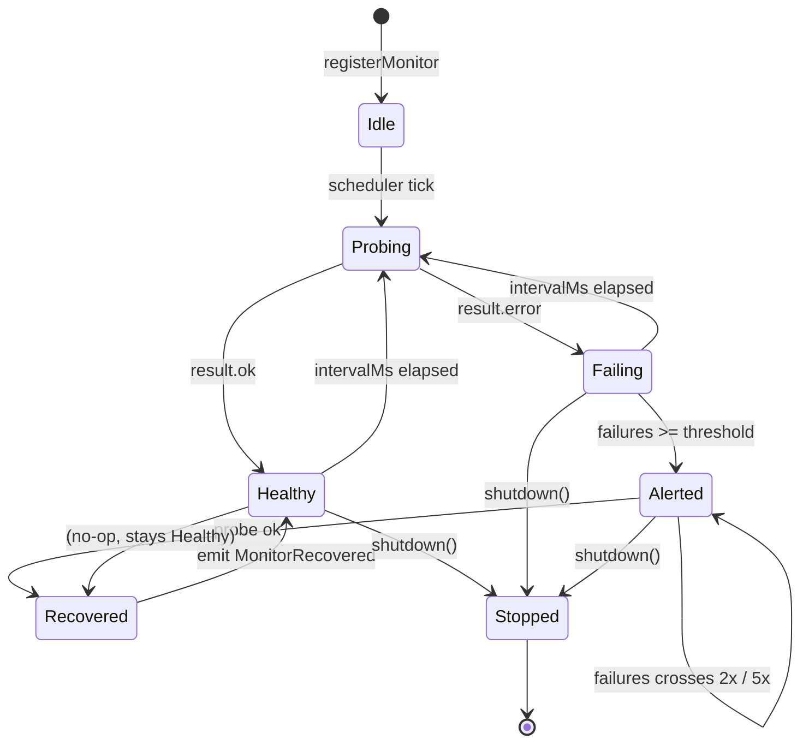

# SPARC Spec: P15 — MonitorMcpTask Executor

**Phase:** P15 (Medium)
**Priority:** Medium
**Estimated Effort:** 3 days
**Dependencies:** P6 (TaskRouter, ConcurrencyClass.monitor, EventBus)
**Source Blueprint:** None — invented pattern. CC has no monitor-flavored task type. This spec invents the pattern by composing the existing TaskRouter (P6) with `ConcurrencyClass.monitor` and the EventBus. Design borrows liveness/health-probe shape from `~/Developer/Benchmarks/claude-code-original-source/src/services/mcp/` (notably `client.ts`, `MCPConnectionManager.tsx`, `useManageMCPConnections.ts`) and dead-worker detection from `src/tasks/RemoteAgentTask/RemoteAgentTask.tsx`.

---

## S — Specification

### 1. Requirements

```yaml
specification:
  functional_requirements:
    - id: "FR-P15-001"
      description: "Monitor tasks shall be exempt from capacity caps and always admitted via the existing P6 monitor exemption in capacity-wake"
      priority: "high"
      acceptance_criteria:
        - "TaskRouter.dispatch() for TaskType.monitor_mcp calls capacityWake.acquire('monitor')"
        - "capacityWake.acquire('monitor') returns true unconditionally (per P6 NFR)"
        - "Running monitor count is observable but does not block other ConcurrencyClass pools"
        - "Monitor tasks never appear in dream-deferral or backpressure paths"

    - id: "FR-P15-002"
      description: "Health checks shall be defined by a typed schema with probe, interval, and failure threshold"
      priority: "critical"
      acceptance_criteria:
        - "HealthCheck interface: { name: string, probe: () => Promise<HealthResult>, intervalMs: number, failureThreshold: number, timeoutMs: number }"
        - "HealthResult union: { ok: true, latencyMs, details? } | { ok: false, error, details? }"
        - "Probes registered at startup via registerMonitor(check) on the executor"
        - "Duplicate registration by name throws RegistrationError"
        - "intervalMs minimum is 1_000ms; below that throws ValidationError"

    - id: "FR-P15-003"
      description: "Monitor tasks shall use a separate retry budget with infinite retries and 30s backoff"
      priority: "high"
      acceptance_criteria:
        - "TASK_TYPE_METADATA.monitor_mcp.maxRetries === Infinity (set in phase-9f metadata table)"
        - "Probe failure does NOT transition the task to TaskStatus.failed"
        - "Failure increments a per-monitor consecutiveFailures counter"
        - "Next probe is scheduled at intervalMs after the previous attempt completed (success OR failure)"
        - "On unhandled probe rejection, executor logs and continues — never crashes"

    - id: "FR-P15-004"
      description: "Alert escalation shall emit MonitorAlert on the EventBus when consecutive failures exceed failureThreshold"
      priority: "high"
      acceptance_criteria:
        - "MonitorAlert event emitted exactly once per failure streak (on the first probe AT-OR-AFTER threshold)"
        - "Event payload: { name, taskId, consecutiveFailures, lastError, firstFailureAt, severity }"
        - "Severity escalates: 'warning' at threshold, 'critical' at 2x threshold, 'fatal' at 5x threshold"
        - "No duplicate MonitorAlert events while severity bucket is unchanged"

    - id: "FR-P15-005"
      description: "Recovery emission shall emit MonitorRecovered when a probe succeeds after a failure streak"
      priority: "high"
      acceptance_criteria:
        - "MonitorRecovered emitted on the FIRST successful probe after consecutiveFailures > 0"
        - "Event payload: { name, taskId, downtimeMs, failedAttempts, recoveredAt }"
        - "consecutiveFailures reset to 0 immediately after emission"
        - "If never alerted (failures < threshold), MonitorRecovered still fires for observability"

    - id: "FR-P15-006"
      description: "Built-in monitors shall ship for the four critical orch-agents subsystems"
      priority: "medium"
      acceptance_criteria:
        - "LinearWebhookHealth: probes Linear webhook deliverability via /viewer query, threshold=3"
        - "DaemonHeartbeat: pings local orchestrator HTTP /healthz, threshold=2"
        - "McpLiveness: pings each configured MCP server using ping/initialize, threshold=3"
        - "OAuthExpiry: scans token store for tokens expiring within 24h, threshold=1"
        - "All four registered automatically when monitor executor boots"
        - "Each monitor lives in its own file under src/tasks/monitor-mcp/monitors/"

    - id: "FR-P15-007"
      description: "Graceful shutdown shall stop all monitors with no orphan timers or pending probes"
      priority: "critical"
      acceptance_criteria:
        - "Executor exposes shutdown() returning Promise<void>"
        - "shutdown() clears all interval timers synchronously"
        - "shutdown() awaits in-flight probes up to 5s, then aborts via AbortSignal"
        - "Post-shutdown: registered monitors map cleared; subsequent registerMonitor() throws ShutdownError"
        - "Orchestrator shutdown hook calls executor.shutdown() before TaskRegistry teardown"

  non_functional_requirements:
    - id: "NFR-P15-001"
      category: "reliability"
      description: "Probe failures must never propagate to the orchestrator process"
      measurement: "All probes wrapped in try/catch; unhandled rejections logged at warn"

    - id: "NFR-P15-002"
      category: "performance"
      description: "Probe scheduling overhead must be negligible compared to probe latency"
      measurement: "Scheduler tick < 1ms for 50 registered monitors"

    - id: "NFR-P15-003"
      category: "observability"
      description: "Every probe outcome must be observable via EventBus"
      measurement: "MonitorProbeCompleted emitted per probe with { name, ok, latencyMs }"

    - id: "NFR-P15-004"
      category: "isolation"
      description: "A single misbehaving monitor must not block others"
      measurement: "Each monitor runs on its own setTimeout chain; no shared scheduler queue"
```

### 2. Constraints

```yaml
constraints:
  technical:
    - "Reuses TaskType.monitor_mcp already defined in phase-9f metadata; do not introduce new TaskType"
    - "Reuses ConcurrencyClass.monitor exemption from P6 capacity-wake"
    - "Reuses TaskRegistry from P6 — monitor task registered once at boot, lives forever in 'running' state"
    - "EventBus is the sole alert channel — no direct webhook/email fan-out from this module"
    - "AbortSignal is the cancellation primitive — no custom shutdown flags"

  architectural:
    - "One MonitorMcpExecutor per orchestrator process (singleton wired into TaskRouter)"
    - "Each HealthCheck owns its own timer chain — no central interval loop"
    - "Probes are pure functions of external state — no shared mutable state between monitors"
    - "Monitor task IDs use the 'mm-' prefix per phase-9f task-id scheme"
    - "Built-in monitors must be tree-shakable: each in its own file, registered via index.ts barrel"
```

### 3. Use Cases

```yaml
use_cases:
  - id: "UC-P15-001"
    title: "Linear Webhook Goes Down and Recovers"
    actor: "MonitorMcpExecutor"
    flow:
      1. "LinearWebhookHealth probe runs every 30s"
      2. "Probe 1 fails (network timeout) — consecutiveFailures=1, no alert (threshold=3)"
      3. "Probe 2 fails — consecutiveFailures=2, no alert"
      4. "Probe 3 fails — consecutiveFailures=3, MonitorAlert{severity:warning} emitted"
      5. "Probe 4 fails — consecutiveFailures=4, no new alert (still warning bucket)"
      6. "Probe 5 fails — consecutiveFailures=5, no new alert"
      7. "Probe 6 fails — consecutiveFailures=6, MonitorAlert{severity:critical} emitted (2x threshold)"
      8. "Probe 7 succeeds — MonitorRecovered{downtimeMs, failedAttempts:6} emitted, counter reset"

  - id: "UC-P15-002"
    title: "MCP Server Liveness Across Multiple Servers"
    actor: "MonitorMcpExecutor"
    flow:
      1. "Boot reads MCP config, registers one McpLiveness monitor per server"
      2. "Each monitor runs independently with its own timer"
      3. "Server A goes down, Server B stays up — only A emits MonitorAlert"
      4. "Server A recovers — only A emits MonitorRecovered"

  - id: "UC-P15-003"
    title: "Graceful Shutdown Mid-Probe"
    actor: "Orchestrator"
    flow:
      1. "Orchestrator receives SIGTERM"
      2. "shutdown hook calls monitorExecutor.shutdown()"
      3. "All pending setTimeout handles cleared"
      4. "In-flight probes signaled via AbortController; awaited up to 5s"
      5. "Monitors map cleared, executor enters shutdown state"
      6. "TaskRegistry teardown proceeds — no orphan mm-* tasks"
```

### 4. Acceptance Criteria (Gherkin)

```gherkin
Feature: MonitorMcpTask Executor

  Scenario: Monitor task admitted regardless of capacity
    Given the agent pool is at maximum capacity
    When a monitor_mcp task requests dispatch
    Then capacityWake.acquire('monitor') returns true immediately
    And the monitor begins probing

  Scenario: Failure threshold triggers warning alert
    Given a HealthCheck with failureThreshold=3
    When the probe fails 3 consecutive times
    Then a MonitorAlert event with severity=warning is emitted exactly once

  Scenario: Severity escalates at 2x threshold
    Given a HealthCheck with failureThreshold=3 already in warning state
    When the probe fails for the 6th consecutive time
    Then a MonitorAlert event with severity=critical is emitted

  Scenario: Recovery clears the failure streak
    Given a HealthCheck with consecutiveFailures=5
    When the next probe succeeds
    Then a MonitorRecovered event is emitted with failedAttempts=5
    And consecutiveFailures is reset to 0

  Scenario: Probe exception does not crash executor
    Given a HealthCheck whose probe throws synchronously
    When the scheduler invokes it
    Then the error is logged at warn
    And the next probe is scheduled normally

  Scenario: Shutdown clears all timers
    Given 4 registered monitors with active timers
    When shutdown() is called
    Then all timers are cleared within 5 seconds
    And subsequent registerMonitor() throws ShutdownError
```

---

## P — Pseudocode

### MonitorMcpExecutor (Core)

```
MODULE: MonitorMcpExecutor
STATE:
  monitors  = Map<string, MonitorRuntime>   -- name -> runtime state
  shutdown  = false
  abort     = AbortController

  registerMonitor(check)
    IF shutdown: throw ShutdownError
    IF monitors.has(check.name): throw RegistrationError
    validate(check)                           -- intervalMs >= 1000, threshold >= 1
    runtime = {
      check,
      consecutiveFailures: 0,
      firstFailureAt: null,
      severity: null,
      timer: null,
      inFlight: null,
    }
    monitors.set(check.name, runtime)
    scheduleNext(runtime, 0)                  -- run immediately

  scheduleNext(runtime, delayMs)
    IF shutdown: return
    runtime.timer = setTimeout(() => runProbe(runtime), delayMs)

  runProbe(runtime)
    runtime.inFlight = withTimeout(
      runtime.check.probe({ signal: abort.signal }),
      runtime.check.timeoutMs
    )
    result = await runtime.inFlight.catch(err => ({ ok: false, error: err }))
    runtime.inFlight = null
    handleResult(runtime, result)
    scheduleNext(runtime, runtime.check.intervalMs)

  handleResult(runtime, result)
    emit('MonitorProbeCompleted', { name, ok: result.ok, latencyMs })
    IF result.ok:
      IF runtime.consecutiveFailures > 0:
        emit('MonitorRecovered', {
          name, taskId, failedAttempts: runtime.consecutiveFailures,
          downtimeMs: now - runtime.firstFailureAt, recoveredAt: now
        })
      runtime.consecutiveFailures = 0
      runtime.firstFailureAt = null
      runtime.severity = null
    ELSE:
      runtime.consecutiveFailures += 1
      IF runtime.firstFailureAt == null: runtime.firstFailureAt = now
      newSeverity = computeSeverity(runtime)
      IF newSeverity != runtime.severity:
        runtime.severity = newSeverity
        emit('MonitorAlert', { name, taskId, consecutiveFailures, lastError, firstFailureAt, severity })

  computeSeverity(runtime)
    threshold = runtime.check.failureThreshold
    failures  = runtime.consecutiveFailures
    IF failures >= threshold * 5: return 'fatal'
    IF failures >= threshold * 2: return 'critical'
    IF failures >= threshold:     return 'warning'
    return null

  shutdown()
    shutdown = true
    abort.abort()
    FOR runtime IN monitors.values():
      IF runtime.timer: clearTimeout(runtime.timer)
    await Promise.race([
      Promise.all([...monitors].map(r => r.inFlight ?? Promise.resolve())),
      delay(5000)
    ])
    monitors.clear()
```

### TaskRouter Integration

```
// In src/execution/task/taskRouter.ts (P6)
router.register(TaskType.monitor_mcp, {
  dispatch(task) {
    capacityWake.acquire('monitor')           // always true
    monitorExecutor.start(task)               // begins probing all registered checks
    transition(task, TaskStatus.running)
    // Task stays 'running' indefinitely. Never transitions to terminal.
  }
})
```

---

## A — Architecture

### Design Rationale

CC's existing task types do not cover this use case:

- **`local_agent` / `local_bash`** are bounded one-shot tasks with terminal states; monitors run forever.
- **`remote_agent` (RemoteAgentTask)** has health probes for dead-worker detection but is still a one-shot work item — its lifecycle ends when the remote worker finishes.
- **`background_task`** in CC is for shell processes, not stateful watch loops with alerting.

Patterns we are borrowing:

- **From `RemoteAgentTask.tsx`**: the shape of probe-with-timeout, consecutive-failure tracking, and the idea that health failures are independent from task failures.
- **From `src/services/mcp/client.ts` and `MCPConnectionManager.tsx`**: how MCP servers expose `ping`/`initialize` for liveness, and how connection state transitions are surfaced as events rather than callbacks.
- **From `useManageMCPConnections.ts`**: the per-server isolation model — each server has its own retry/backoff state.
- **From P6's `ConcurrencyClass.monitor` exemption**: the precedent that monitor work bypasses capacity caps.

The novel piece this spec invents:

- **Continuous polling tasks with infinite retry budget** that live as a single "always running" task in TaskRegistry, but internally orchestrate N independent probe loops, each emitting EventBus alerts on threshold-crossing transitions. CC has no analogue — its task model assumes terminal states.

### File Structure

```
src/tasks/monitor-mcp/
  index.ts                              -- (NEW) barrel: createMonitorMcpExecutor() + built-ins
  executor.ts                           -- (NEW) MonitorMcpExecutor class, register/start/shutdown
  health-check.ts                       -- (NEW) HealthCheck / HealthResult types, validators, computeSeverity
  monitors/
    linear-webhook-health.ts            -- (NEW) probes Linear /viewer
    daemon-heartbeat.ts                 -- (NEW) probes local /healthz
    mcp-liveness.ts                     -- (NEW) probes each configured MCP server
    oauth-expiry.ts                     -- (NEW) scans token store for near-expiry tokens

src/execution/task/taskRouter.ts        -- (MODIFY) register TaskType.monitor_mcp -> MonitorMcpExecutor
src/shared/event-types.ts               -- (MODIFY) add MonitorAlert, MonitorRecovered, MonitorProbeCompleted
```

### Component Diagram

```mermaid
flowchart TD
    subgraph "Boot"
        BOOT["Orchestrator Boot"]
        REG["registerMonitor x N"]
    end

    subgraph "MonitorMcpExecutor"
        EXEC["executor.ts"]
        SCHED["per-monitor setTimeout chain"]
        HC["health-check.ts (types + computeSeverity)"]
    end

    subgraph "Built-in Monitors"
        LWH["linear-webhook-health"]
        DH["daemon-heartbeat"]
        ML["mcp-liveness"]
        OE["oauth-expiry"]
    end

    subgraph "Backbone (P6)"
        TR["TaskRegistry"]
        CW["CapacityWake (monitor exempt)"]
        EB["EventBus"]
    end

    BOOT --> REG
    REG --> EXEC
    LWH --> EXEC
    DH --> EXEC
    ML --> EXEC
    OE --> EXEC

    EXEC --> SCHED
    SCHED -->|probe()| LWH
    SCHED -->|probe()| DH
    SCHED -->|probe()| ML
    SCHED -->|probe()| OE
    EXEC --> HC

    EXEC -->|register mm-* task| TR
    EXEC -->|acquire('monitor')| CW
    EXEC -->|MonitorAlert / Recovered / ProbeCompleted| EB
```

### Probe Lifecycle



---

## R — Refinement

### Test Plan

| Module | Test File | Key Assertions |
|--------|-----------|----------------|
| HealthCheck validators | `tests/tasks/monitor-mcp/health-check.test.ts` | rejects intervalMs < 1000; rejects failureThreshold < 1; computeSeverity returns null/warning/critical/fatal at the right boundaries |
| Executor registration | `tests/tasks/monitor-mcp/executor.test.ts` | registerMonitor adds runtime; duplicate name throws RegistrationError; post-shutdown registration throws ShutdownError |
| Probe scheduling | `tests/tasks/monitor-mcp/executor.test.ts` | first probe runs immediately; subsequent probe scheduled at intervalMs; failed probe still reschedules; probe timeout enforced |
| Failure streak + alerts | `tests/tasks/monitor-mcp/executor.test.ts` | MonitorAlert emits exactly once at threshold; second emission only when severity bucket changes (2x, 5x); MonitorAlert payload includes consecutiveFailures and lastError |
| Recovery emission | `tests/tasks/monitor-mcp/executor.test.ts` | MonitorRecovered emits on first success after failures > 0; downtimeMs computed from firstFailureAt; counter resets; recovery fires even when no alert was emitted |
| Probe exception isolation | `tests/tasks/monitor-mcp/executor.test.ts` | synchronous throw in probe is caught; async rejection caught; next probe still scheduled; one bad monitor does not block others |
| Capacity exemption | `tests/tasks/monitor-mcp/executor.test.ts` | dispatch under saturated agent pool still admits monitor task |
| Graceful shutdown | `tests/tasks/monitor-mcp/executor.test.ts` | shutdown() clears all timers; awaits in-flight probes up to 5s; aborts via AbortSignal after timeout; monitors map cleared |
| LinearWebhookHealth | `tests/tasks/monitor-mcp/monitors/linear-webhook-health.test.ts` | probe returns ok on /viewer 200; returns error on 4xx/5xx/timeout; uses configured threshold=3 |
| DaemonHeartbeat | `tests/tasks/monitor-mcp/monitors/daemon-heartbeat.test.ts` | probe pings /healthz; threshold=2; latencyMs measured |
| McpLiveness | `tests/tasks/monitor-mcp/monitors/mcp-liveness.test.ts` | one HealthCheck registered per configured server; per-server isolation (one fails, others don't) |
| OAuthExpiry | `tests/tasks/monitor-mcp/monitors/oauth-expiry.test.ts` | scans token store; returns error when any token expires within 24h; threshold=1 |
| TaskRouter wiring | `tests/execution/task/taskRouter.test.ts` (updated) | TaskType.monitor_mcp registered; dispatch creates mm-* task in TaskRegistry; task stays in 'running' state across multiple poll cycles |
| Event types | `tests/shared/event-types.test.ts` (updated) | MonitorAlert / MonitorRecovered / MonitorProbeCompleted serialize round-trip with required fields |

All tests use `node:test` + `node:assert/strict` with mock-first pattern. Probes mocked via injected dependencies — no real network in unit tests.

### Anti-Patterns to Enforce

```yaml
anti_patterns:
  - name: "Shared scheduler queue"
    bad: "Single setInterval that iterates all monitors"
    good: "Per-monitor setTimeout chain — one slow probe never starves others"
    enforcement: "Code review checklist; no setInterval anywhere in monitor-mcp/"

  - name: "Probe failure crashes task"
    bad: "Probe throws and transitions task to TaskStatus.failed"
    good: "Probe failure increments counter only; task stays running"
    enforcement: "Test asserts task.status === running after N probe failures"

  - name: "Alert spam"
    bad: "Emit MonitorAlert on every failed probe past the threshold"
    good: "Emit only on severity bucket transitions (warning -> critical -> fatal)"
    enforcement: "Test counts events emitted across 100 consecutive failures: must equal 3"

  - name: "Capacity contention"
    bad: "Monitor task acquires from agent pool, blocking real work"
    good: "ConcurrencyClass.monitor is bypass-only — never decrements other pools"
    enforcement: "Capacity-wake test: saturated agent pool still admits monitors"

  - name: "Orphan timers on shutdown"
    bad: "Shutdown returns while setTimeout handles still pending"
    good: "shutdown() clears every timer + awaits in-flight probes"
    enforcement: "Test runs shutdown then asserts no pending Node handles via process._getActiveHandles equivalents"

  - name: "Hardcoded built-in registration"
    bad: "Built-ins imported and registered inside executor.ts"
    good: "Built-ins exported by index.ts barrel; consumer chooses which to register"
    enforcement: "Tree-shake test: importing executor.ts alone does not pull in monitors/"
```

### Migration Strategy

```yaml
migration:
  phase_1_types_and_executor:
    files: ["health-check.ts", "executor.ts", "index.ts"]
    description: "Introduce HealthCheck types and executor with no built-ins. Pure unit test target."
    validation: "executor.test.ts + health-check.test.ts pass."

  phase_2_event_types:
    files: ["src/shared/event-types.ts"]
    description: "Add MonitorAlert, MonitorRecovered, MonitorProbeCompleted to event union."
    validation: "Event-types test round-trips all three."

  phase_3_built_in_monitors:
    files: ["monitors/linear-webhook-health.ts", "monitors/daemon-heartbeat.ts", "monitors/mcp-liveness.ts", "monitors/oauth-expiry.ts"]
    description: "Implement four built-ins with injected probe dependencies."
    validation: "Each monitor has its own test file with mocked transport."

  phase_4_taskrouter_wiring:
    files: ["src/execution/task/taskRouter.ts"]
    description: "Register TaskType.monitor_mcp -> MonitorMcpExecutor in router."
    validation: "Router test confirms dispatch path; integration test runs executor end-to-end with one fake monitor."

  phase_5_shutdown_hook:
    files: ["src/execution/orchestrator/symphony-orchestrator.ts"]
    description: "Wire executor.shutdown() into orchestrator shutdown sequence before TaskRegistry teardown."
    validation: "Shutdown test asserts no orphan handles."
```

---

## C — Completion

### Definition of Done

```yaml
completion:
  code_deliverables:
    - "src/tasks/monitor-mcp/health-check.ts — types, validators, computeSeverity"
    - "src/tasks/monitor-mcp/executor.ts — MonitorMcpExecutor with register/start/shutdown"
    - "src/tasks/monitor-mcp/index.ts — barrel exporting executor + built-ins"
    - "src/tasks/monitor-mcp/monitors/linear-webhook-health.ts"
    - "src/tasks/monitor-mcp/monitors/daemon-heartbeat.ts"
    - "src/tasks/monitor-mcp/monitors/mcp-liveness.ts"
    - "src/tasks/monitor-mcp/monitors/oauth-expiry.ts"
    - "Modified: src/execution/task/taskRouter.ts — register TaskType.monitor_mcp"
    - "Modified: src/shared/event-types.ts — MonitorAlert, MonitorRecovered, MonitorProbeCompleted"
    - "Modified: src/execution/orchestrator/symphony-orchestrator.ts — shutdown hook"

  test_deliverables:
    - "tests/tasks/monitor-mcp/health-check.test.ts"
    - "tests/tasks/monitor-mcp/executor.test.ts"
    - "tests/tasks/monitor-mcp/monitors/linear-webhook-health.test.ts"
    - "tests/tasks/monitor-mcp/monitors/daemon-heartbeat.test.ts"
    - "tests/tasks/monitor-mcp/monitors/mcp-liveness.test.ts"
    - "tests/tasks/monitor-mcp/monitors/oauth-expiry.test.ts"
    - "Updated: tests/execution/task/taskRouter.test.ts (monitor_mcp dispatch)"
    - "Updated: tests/shared/event-types.test.ts (new monitor events)"

  verification_checklist:
    - "npm run build succeeds"
    - "npm test passes (all existing + new tests)"
    - "npx tsc --noEmit passes"
    - "npm run lint passes"
    - "No setInterval anywhere in src/tasks/monitor-mcp/"
    - "Every probe wrapped in try/catch — no unhandled rejections in tests"
    - "Shutdown clears all timers (verified by test)"
    - "Built-in monitors registered only via barrel — no implicit imports inside executor.ts"
    - "Monitor task ID prefix is 'mm-' per phase-9f scheme"

  success_metrics:
    - "0 orphan timers after shutdown across 100 test runs"
    - "Per-monitor scheduler overhead < 1ms for 50 registered checks"
    - "Alert emission count == severity-bucket-transition count (no spam)"
    - "Probe failure isolation: one throwing monitor leaves all others on schedule"
```
