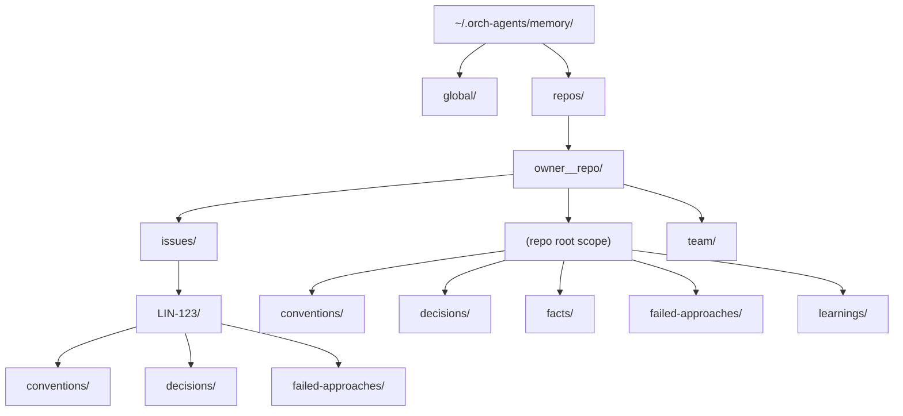
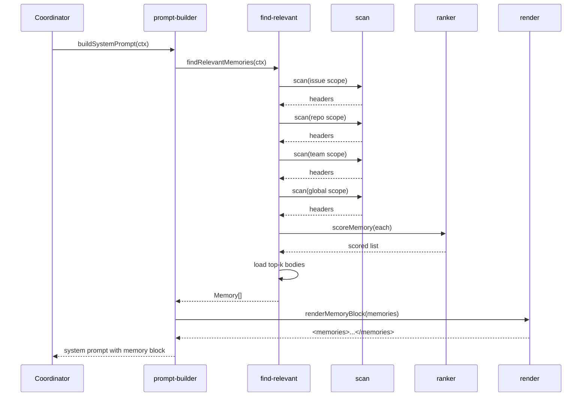
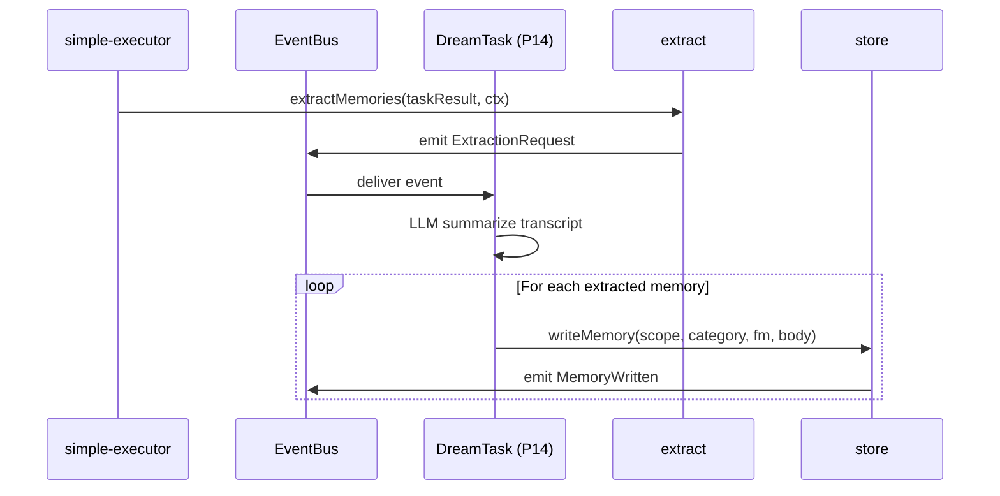

# SPARC Spec: P16 — Memory Directory (memdir)

**Phase:** P16 (High)
**Priority:** High
**Estimated Effort:** 6 days
**Dependencies:** P6 (task metadata carries issue/repo context for memory scoping)
**Blocks:** P14 DreamTask (consolidates memories into memdir), P18 Linear Planning (uses memdir for conventions)
**Source Blueprint:** Claude Code Original — `src/memdir/memdir.ts`, `src/memdir/memoryTypes.ts`, `src/memdir/findRelevantMemories.ts`, `src/memdir/memoryAge.ts`, `src/memdir/memoryScan.ts`, `src/memdir/paths.ts`, `src/memdir/teamMemPaths.ts`, `src/memdir/teamMemPrompts.ts`, `src/services/SessionMemory/`, `src/services/extractMemories/`, `src/services/teamMemorySync/`

---

## Context

The orch-agents harness has no cross-session memory. Every Linear-issued run on the same repo starts cold — the agent re-discovers conventions, re-makes the same wrong-turn refactor, re-asks the user the same clarifying question. CC's `src/memdir/` is the persistent learning layer that turns each session into compounding context. The more it runs on YOUR codebase, the smarter it gets. This spec ports memdir into orch-agents as the foundation for P14 DreamTask consolidation and P18 Linear planning conventions.

CC's memdir is a filesystem-backed, human-editable, markdown-with-frontmatter store. Memories are scoped (private vs team), typed (`user`/`feedback`/`project`/`reference`), and recalled via an LLM-based selector that reads file headers and picks the most relevant ones for the current query. Age is surfaced as a freshness caveat, not used as a hard filter — staleness is a hint to the model, not a delete trigger. Pruning is conservative (manual or DreamTask-driven).

---

## S — Specification

### 1. Requirements

```yaml
specification:
  functional_requirements:
    - id: "FR-P16-001"
      description: "Filesystem-backed memory store scoped by (user, repo, issue, cross-project)"
      priority: "critical"
      acceptance_criteria:
        - "Base dir resolves to {dataDir}/memory (default ~/.orch-agents/memory)"
        - "Per-repo scope path derived from canonical git remote URL slug (owner__repo)"
        - "Per-issue scope path nested under repo: {base}/repos/{slug}/issues/{issueId}"
        - "Cross-project (user-global) scope at {base}/global"
        - "Team-shared scope at {base}/repos/{slug}/team (synced via P14, not in this phase)"
        - "All scopes are validated against directory traversal — null bytes and ../ rejected"

    - id: "FR-P16-002"
      description: "Memory categories — fact, decision, failed-approach, convention, cross-session-learning"
      priority: "critical"
      acceptance_criteria:
        - "MemoryCategory enum with exactly the five values"
        - "Each category maps to a folder under its scope: facts/, decisions/, failed-approaches/, conventions/, learnings/"
        - "parseMemoryCategory(raw) gracefully returns undefined for unknown values (forward-compat)"
        - "Category guides recall ranking (conventions weighted higher for planning, failed-approaches for retry tasks)"

    - id: "FR-P16-003"
      description: "findRelevantMemories(context) recall API keyed by current task context"
      priority: "critical"
      acceptance_criteria:
        - "Accepts RecallContext { issueId?, repoSlug, filePathsInScope[], queryText, k? }"
        - "Scans candidate scopes in priority order: issue → repo → team → global"
        - "Returns at most k memories (default 5), absolute paths + frontmatter + mtime"
        - "Ranking combines: scope proximity, category weight, recency, lexical overlap with queryText/filePaths"
        - "Excludes any memory whose mtime is older than the hard-prune threshold (default 180 days)"
        - "Pure-functional: no LLM call required for the basic ranker (LLM rerank optional, off by default)"

    - id: "FR-P16-004"
      description: "Age-based pruning via memoryAge with recency × relevance score"
      priority: "high"
      acceptance_criteria:
        - "memoryAgeDays(mtime) returns floor days since modification (CC parity)"
        - "memoryFreshnessNote(mtime) returns wrapped staleness caveat for memories >1 day old"
        - "scoreMemory(memory, ctx) returns 0..1 combining recency decay, category weight, lexical hits"
        - "pruneScope(scope, opts) removes memories with score < threshold AND age > minAgeDays"
        - "Pruning is opt-in: never runs implicitly during recall — only via DreamTask (P14) or CLI"

    - id: "FR-P16-005"
      description: "Prompt injection point in coordinator system prompt and worker briefing"
      priority: "critical"
      acceptance_criteria:
        - "renderMemoryBlock(memories) emits a <memories> XML section with one <memory> per file"
        - "Each <memory> includes path, category, age string (today/yesterday/N days ago), and body"
        - "Coordinator prompt builder calls findRelevantMemories before rendering system prompt"
        - "Worker prompt builder (prompt-builder.ts) injects scoped memories before task instructions"
        - "Empty result yields empty string — never injects an empty <memories/> tag"
        - "Total injected memory bytes capped at 8KB (configurable) to protect context budget"

    - id: "FR-P16-006"
      description: "Extraction hook after task completion — extractMemories(taskResult)"
      priority: "high"
      acceptance_criteria:
        - "extractMemories(taskResult, ctx) is the public hook called by P14 DreamTask"
        - "Hook emits a typed ExtractionRequest event on EventBus — does NOT call LLM directly"
        - "Hook is no-op when disabled via settings.memdir.extractEnabled = false"
        - "writeMemory(scope, category, frontmatter, body) is the underlying append API"
        - "Filenames generated as {YYYYMMDD}-{slug}-{shortHash}.md to keep directory listings sortable"

    - id: "FR-P16-007"
      description: "Team-shared memories via teamMemPaths pattern"
      priority: "medium"
      acceptance_criteria:
        - "Team scope path resolution mirrors CC's teamMemPaths.ts pattern"
        - "Team memories live at {base}/repos/{slug}/team and are read by recall but not written by extract in this phase"
        - "Sync mechanism (push/pull to team store) is OUT OF SCOPE — owned by a future phase"
        - "Path resolution returns null for repos with no detected remote (single-user fallback)"

    - id: "FR-P16-008"
      description: "Memory format — markdown frontmatter for metadata, body for content"
      priority: "critical"
      acceptance_criteria:
        - "YAML frontmatter delimited by --- with required fields: category, scope, createdAt, source"
        - "Optional frontmatter fields: issueId, repoSlug, filePaths[], tags[], expiresAt"
        - "Body is freeform markdown — human-editable, no schema enforced beyond a max-bytes cap"
        - "parseMemoryFile(path) returns { frontmatter, body, mtime } or throws TypedError on malformed"
        - "writeMemoryFile(path, mem) round-trips: parse(write(m)) deeply equals m"
        - "Files with missing/unknown frontmatter degrade gracefully (treated as category: fact, scope: repo)"

  non_functional_requirements:
    - id: "NFR-P16-001"
      category: "performance"
      description: "Recall must not add measurable latency to coordinator startup"
      measurement: "findRelevantMemories returns < 50ms for scopes with up to 500 memory files"

    - id: "NFR-P16-002"
      category: "safety"
      description: "Memory paths must be sandboxed inside the configured base dir"
      measurement: "Any resolved path that escapes baseDir throws PathEscapeError before any FS operation"

    - id: "NFR-P16-003"
      category: "observability"
      description: "Every recall and write emits a domain event for trace correlation"
      measurement: "MemoryRecalled and MemoryWritten events on EventBus include scope, category, count, latencyMs"

    - id: "NFR-P16-004"
      category: "human-editability"
      description: "Memory files must be readable and editable by hand without tooling"
      measurement: "Round-trip parse/write preserves whitespace and frontmatter key order; no binary or base64 fields"
```

### 2. Constraints

```yaml
constraints:
  technical:
    - "Markdown + YAML frontmatter only — no SQLite, no embeddings, no vector store in this phase"
    - "Recall ranker is pure-functional (no LLM call) — keeps the hot path deterministic and offline-safe"
    - "Memory IDs derived from filename — no separate index file to keep in sync"
    - "Use node:fs/promises for all filesystem ops — no third-party fs wrappers"
    - "Frontmatter parsed with a minimal hand-rolled parser (no js-yaml dependency for read path)"
    - "Memory body capped at 8KB per file; recall block capped at 8KB total"

  architectural:
    - "memdir module is leaf — depends on shared/, NOT on execution/, integration/, or coordinator/"
    - "Integration points (coordinator prompt, simple-executor) call memdir via the index.ts barrel only"
    - "Extraction hook emits an event — DreamTask (P14) owns the LLM call, not memdir"
    - "Pruning is never implicit — only DreamTask or explicit CLI invocation triggers it"
    - "No global state — store is constructed with explicit baseDir, scoping is parameterized"
```

### 3. Use Cases

```yaml
use_cases:
  - id: "UC-P16-001"
    title: "Coordinator Recalls Memories Before Planning"
    actor: "Coordinator"
    flow:
      1. "Linear webhook arrives with issue assignment"
      2. "Coordinator builds RecallContext { issueId, repoSlug, queryText: issue title + body }"
      3. "findRelevantMemories scans issue/, repo/, team/, global/ scopes in priority order"
      4. "Ranker scores each candidate against context, returns top 5"
      5. "renderMemoryBlock emits <memories> XML with frontmatter + bodies + age strings"
      6. "Coordinator system prompt includes the rendered block before task instructions"
      7. "Coordinator drafts a plan informed by past conventions and failed approaches"

  - id: "UC-P16-002"
    title: "Worker Briefing Includes Repo Conventions"
    actor: "Worker (sdk-executor)"
    flow:
      1. "simple-executor builds prompt for a worker via prompt-builder.ts"
      2. "prompt-builder calls findRelevantMemories with filePathsInScope from the work item"
      3. "Recall returns convention memories (e.g., 'tests use node:test', 'no js-yaml dep')"
      4. "Worker prompt includes the memory block before the task description"
      5. "Worker writes code that matches convention on first try — no rework"

  - id: "UC-P16-003"
    title: "DreamTask Extracts Memories from Completed Task"
    actor: "DreamTask (P14)"
    flow:
      1. "Task completes successfully, P6 emits TaskCompleted with output transcript"
      2. "DreamTask invokes extractMemories(taskResult, ctx)"
      3. "memdir emits ExtractionRequest event with transcript + scope hints"
      4. "DreamTask LLM call summarizes into typed memory objects (category + body)"
      5. "DreamTask calls writeMemory(scope, category, frontmatter, body) for each"
      6. "Files written to {base}/repos/{slug}/issues/{issueId}/conventions/20260404-test-runner-abc.md"
      7. "MemoryWritten event emitted, correlated to the originating task ID"

  - id: "UC-P16-004"
    title: "Stale Memory Surfaces Freshness Caveat"
    actor: "Recall consumer"
    flow:
      1. "Memory file last modified 47 days ago"
      2. "Memory passes recall ranker, included in result set"
      3. "renderMemoryBlock annotates the entry with '47 days ago' and a freshness caveat"
      4. "Coordinator sees the caveat and downgrades reliance on file:line claims"
```

### 4. Acceptance Criteria (Gherkin)

```gherkin
Feature: Memory Directory (memdir)

  Scenario: Recall returns memories from issue scope before repo scope
    Given a memory at issues/LIN-123/conventions/test-runner.md
    And a memory at conventions/test-runner.md (repo scope)
    When findRelevantMemories is called with issueId LIN-123
    Then both memories are returned
    And the issue-scoped memory ranks higher

  Scenario: Recall caps total injected bytes
    Given 20 memory files each 1KB in scope
    When findRelevantMemories is called with k=20
    Then renderMemoryBlock output is at most 8KB
    And the lowest-ranked memories are dropped

  Scenario: Write rejects path escape
    Given a write request with category="../../etc"
    When writeMemory is invoked
    Then it throws PathEscapeError
    And no file is created

  Scenario: Parse handles missing frontmatter
    Given a markdown file with no --- delimiters
    When parseMemoryFile is called
    Then it returns category=fact, scope=repo, and the full text as body
    And no error is thrown

  Scenario: Stale memory carries freshness note
    Given a memory file with mtime 47 days in the past
    When renderMemoryBlock includes it
    Then the rendered entry contains "47 days ago"
    And contains a freshness caveat string

  Scenario: Extract hook is no-op when disabled
    Given settings.memdir.extractEnabled = false
    When extractMemories is invoked
    Then no event is emitted
    And no file is written
```

---

## P — Pseudocode

### Path Resolution

```
MODULE: paths
  resolveBaseDir(settings)         -- {dataDir}/memory (or override)
  resolveRepoSlug(repoUrl)         -- canonical "owner__repo" from git remote
  scopePath(base, scope)           -- {base}/global | repos/{slug} | repos/{slug}/issues/{id} | repos/{slug}/team
  categoryDir(scopeDir, category)  -- {scopeDir}/{categoryFolder}
  validateInsideBase(p, base)      -- throws PathEscapeError on traversal
```

### Memory File Format

```
MODULE: types
  Memory { path, frontmatter, body, mtimeMs }
  MemoryFrontmatter { category, scope, createdAt, source, issueId?, repoSlug?, filePaths?, tags?, expiresAt? }
  MemoryCategory = fact | decision | failed-approach | convention | cross-session-learning
  MemoryScope = global | repo | issue | team
```

### Recall

```
MODULE: find-relevant
  findRelevantMemories(ctx):
    candidates = []
    FOR scope IN [issue, repo, team, global] (skip if not applicable):
      scopeDir = scopePath(base, scope)
      headers = scan(scopeDir)                  -- mtime + frontmatter only
      FOR h IN headers:
        IF age(h) > HARD_PRUNE_DAYS: continue
        score = scoreMemory(h, ctx, scope)
        candidates.push({ header: h, score })
    sort candidates by score desc
    selected = first k candidates
    return load full bodies for selected
```

### Scoring

```
scoreMemory(h, ctx, scope):
  s = 0
  s += SCOPE_WEIGHT[scope]                 -- issue 1.0, repo 0.8, team 0.7, global 0.5
  s += CATEGORY_WEIGHT[h.category]         -- convention 1.0, failed-approach 0.9, ...
  s += recencyDecay(h.mtimeMs)             -- 1.0 today → 0.2 at 90 days
  s += lexicalHits(h, ctx.queryText)       -- token overlap, capped at 0.5
  s += filePathHits(h, ctx.filePathsInScope) -- frontmatter.filePaths intersect, capped at 0.5
  return s
```

### Render & Inject

```
MODULE: prompt-injection
  renderMemoryBlock(memories):
    IF memories empty: return ''
    parts = ['<memories>']
    bytes = 0
    FOR m IN memories:
      entry = format(m)                    -- includes age string + freshness caveat if stale
      IF bytes + entry.length > MAX_BYTES: break
      parts.push(entry); bytes += entry.length
    parts.push('</memories>')
    return parts.join('\n')
```

### Extract Hook

```
MODULE: extract
  extractMemories(taskResult, ctx):
    IF NOT settings.memdir.extractEnabled: return
    eventBus.emit('ExtractionRequest', {
      transcript: taskResult.transcript,
      scopeHints: { issueId: ctx.issueId, repoSlug: ctx.repoSlug },
      taskId: taskResult.taskId,
    })
    -- DreamTask (P14) consumes this event, calls writeMemory for each extracted memory
```

---

## A — Architecture

### Storage Hierarchy



### Recall Flow



### Extraction Flow



### File Structure

```
src/memdir/
  types.ts              -- (NEW) Memory, MemoryCategory, MemoryScope, MemoryFrontmatter, errors
  paths.ts              -- (NEW) baseDir, scopePath, categoryDir, validateInsideBase
  scan.ts               -- (NEW) directory walker — returns headers (frontmatter + mtime)
  store.ts              -- (NEW) parseMemoryFile, writeMemoryFile, deleteMemory
  find-relevant.ts      -- (NEW) findRelevantMemories + scoreMemory + recencyDecay
  ageing.ts             -- (NEW) memoryAgeDays, memoryFreshnessNote, pruneScope
  extract.ts            -- (NEW) extractMemories hook (event emitter, no LLM)
  prompt-injection.ts   -- (NEW) renderMemoryBlock with byte cap
  index.ts              -- (NEW) public barrel: types + recall + extract + render

src/coordinator/coordinatorPrompt.ts
  -- (MODIFY in integration patch, NOT this spec) inject renderMemoryBlock output

src/execution/simple-executor.ts
  -- (MODIFY in integration patch, NOT this spec) call extractMemories on task completion
```

---

## R — Refinement

### Test Plan

| Module | Test File | Key Assertions |
|--------|-----------|----------------|
| paths | `tests/memdir/paths.test.ts` | baseDir defaults to {dataDir}/memory; repo slug derived from git remote URL; PathEscapeError on `../`; null byte rejected; team scope returns null when no remote |
| types | `tests/memdir/types.test.ts` | parseMemoryCategory returns undefined for unknown; all five categories round-trip; MemoryScope enum exhaustive |
| store (parse) | `tests/memdir/store.test.ts` | parses valid frontmatter + body; handles missing frontmatter (defaults to fact/repo); throws TypedError on malformed YAML; mtime read from fs.stat |
| store (write) | `tests/memdir/store.test.ts` | round-trip parse(write(m)) deep-equals; filename matches `{YYYYMMDD}-{slug}-{hash}.md`; rejects body > 8KB; emits MemoryWritten event |
| scan | `tests/memdir/scan.test.ts` | returns headers only (no full body load); skips non-`.md` files; recursive across category folders; handles missing dir gracefully (empty result) |
| find-relevant | `tests/memdir/find-relevant.test.ts` | issue-scoped ranks above repo-scoped; respects k cap; excludes memories older than HARD_PRUNE_DAYS; lexical overlap boosts score; filePathHits boosts score |
| ageing | `tests/memdir/ageing.test.ts` | memoryAgeDays floors correctly; memoryFreshnessNote empty for ≤1 day; pruneScope only removes when score < threshold AND age > minAgeDays |
| prompt-injection | `tests/memdir/prompt-injection.test.ts` | empty input returns empty string; output capped at 8KB; lowest-scored dropped first; stale entries include freshness caveat |
| extract | `tests/memdir/extract.test.ts` | no-op when extractEnabled=false; emits ExtractionRequest event with transcript + scope hints; does not call LLM directly |

All tests use `node:test` + `node:assert/strict`, mock-first, typed fixtures. No live filesystem outside `os.tmpdir()`.

### Anti-Patterns to Enforce

```yaml
anti_patterns:
  - name: "Implicit Pruning During Recall"
    bad: "findRelevantMemories deletes stale files as a side effect"
    good: "Recall is read-only; pruning is explicit via DreamTask or CLI"
    enforcement: "find-relevant.ts has no fs.unlink; lint rule blocks unlink imports outside ageing.ts"

  - name: "Direct LLM Call from memdir"
    bad: "extract.ts imports an LLM client and summarizes inline"
    good: "extract.ts emits ExtractionRequest; DreamTask owns the LLM"
    enforcement: "memdir module has zero imports from src/execution/runtime/ or LLM client paths"

  - name: "Unbounded Memory Block Injection"
    bad: "renderMemoryBlock concatenates all memories without a byte cap"
    good: "Cap at 8KB total, drop lowest-scored when over budget"
    enforcement: "prompt-injection.ts asserts bytes <= MAX_BYTES; test verifies overflow drops"

  - name: "Path Construction Without Sandboxing"
    bad: "join(baseDir, userInput) used directly for fs.writeFile"
    good: "validateInsideBase(resolvedPath, baseDir) called before every fs op"
    enforcement: "store.ts and paths.ts unit tests assert PathEscapeError on traversal inputs"

  - name: "Hidden State / Singleton Store"
    bad: "memdir exports a default store bound to process env at import time"
    good: "Store constructed with explicit baseDir; callers own the lifecycle"
    enforcement: "index.ts exports factories, not pre-constructed instances"
```

### Migration Strategy

```yaml
migration:
  phase_1_types_and_paths:
    files: ["types.ts", "paths.ts"]
    description: "Type taxonomy and path resolver. No fs ops yet."
    validation: "Unit tests for parseMemoryCategory, scopePath, validateInsideBase pass."

  phase_2_store_and_scan:
    files: ["store.ts", "scan.ts"]
    description: "Read/write/parse memory files. Directory walker."
    validation: "Round-trip parse/write tests pass; scan returns headers from tmpdir fixtures."

  phase_3_recall_and_ageing:
    files: ["find-relevant.ts", "ageing.ts"]
    description: "Scoring, ranking, age calculations, optional pruning."
    validation: "Recall ranks issue > repo > team > global; freshness notes correct for known mtimes."

  phase_4_render_and_extract:
    files: ["prompt-injection.ts", "extract.ts", "index.ts"]
    description: "Render block with byte cap; extract hook emitting events."
    validation: "Render output capped; extract no-op when disabled; barrel exposes full public API."

  phase_5_integration_handoff:
    files: ["(none in this spec)"]
    description: "Coordinator and simple-executor wiring delivered as a separate integration patch outside this phase."
    validation: "memdir public API ready for P14 DreamTask and P18 Linear Planning to consume."
```

---

## C — Completion

### Definition of Done

```yaml
completion:
  code_deliverables:
    - "src/memdir/types.ts — Memory, MemoryCategory, MemoryScope, MemoryFrontmatter, typed errors"
    - "src/memdir/paths.ts — baseDir, scopePath, categoryDir, validateInsideBase, repo slug from git"
    - "src/memdir/scan.ts — directory walker returning headers (frontmatter + mtime only)"
    - "src/memdir/store.ts — parseMemoryFile, writeMemoryFile, deleteMemory with sandboxing"
    - "src/memdir/find-relevant.ts — findRelevantMemories + scoreMemory + recencyDecay"
    - "src/memdir/ageing.ts — memoryAgeDays, memoryFreshnessNote, pruneScope"
    - "src/memdir/extract.ts — extractMemories event-emitting hook (no LLM)"
    - "src/memdir/prompt-injection.ts — renderMemoryBlock with 8KB cap"
    - "src/memdir/index.ts — public barrel"

  test_deliverables:
    - "tests/memdir/paths.test.ts"
    - "tests/memdir/types.test.ts"
    - "tests/memdir/store.test.ts"
    - "tests/memdir/scan.test.ts"
    - "tests/memdir/find-relevant.test.ts"
    - "tests/memdir/ageing.test.ts"
    - "tests/memdir/prompt-injection.test.ts"
    - "tests/memdir/extract.test.ts"

  verification_checklist:
    - "npm run build succeeds"
    - "npm test passes (existing + new memdir tests)"
    - "npx tsc --noEmit passes"
    - "npm run lint passes"
    - "memdir module has zero imports from src/execution/, src/integration/, src/coordinator/"
    - "No unlink calls outside ageing.ts (enforced by review)"
    - "All fs writes pass validateInsideBase before touching disk"
    - "renderMemoryBlock output never exceeds 8KB in any test fixture"
    - "MemoryRecalled and MemoryWritten events observable on EventBus"

  success_metrics:
    - "Recall latency < 50ms for scopes with 500 memory files"
    - "Round-trip parse(write(m)) deep-equality holds for 100% of generated fixtures"
    - "0 path-escape vulnerabilities (all traversal inputs caught in tests)"
    - "P14 DreamTask can consume ExtractionRequest events without modifying memdir"
    - "P18 Linear Planning can call findRelevantMemories without modifying memdir"
```
