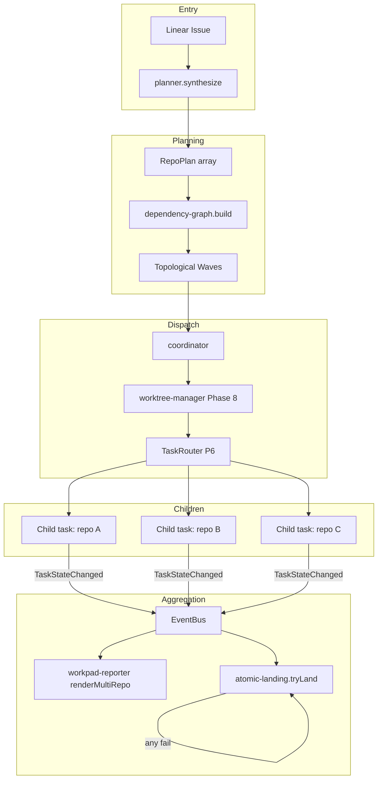
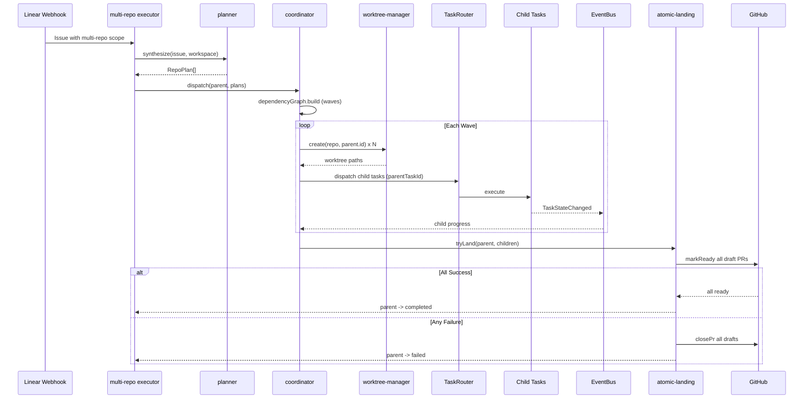

# SPARC Spec: P17 — Multi-Repo Dispatch Task Type

**Phase:** P17 (High)
**Priority:** High
**Estimated Effort:** 7 days
**Dependencies:** P6 (TaskRouter, parent-child task correlation), P13 (LocalShellTask for git ops), `phase-8-multi-repo-workspace.md` (existing multi-repo workspace resolution)
**Source Blueprint: None — orch-agents-specific moat.** CC is a single-repo harness. orch-agents serves Linear teams that ship across multiple repos (schema in repo A, client in repo B, docs in repo C). This task type is what makes orch-agents defensible — generic CC can't do this. The closest CC patterns we borrow from are `~/Developer/Benchmarks/claude-code-original-source/src/tasks/LocalAgentTask/LocalAgentTask.tsx` (sub-task fan-out) and `src/utils/task/framework.ts` `pollTasks` (parent-child correlation aggregation).

---

## S — Specification

### 1. Requirements

```yaml
specification:
  functional_requirements:
    - id: "FR-P17-001"
      description: "Accept a single Linear issue and synthesize a per-repo execution plan"
      priority: "critical"
      acceptance_criteria:
        - "planner.synthesize(issue, workspace) returns RepoPlan[] (one per affected repo)"
        - "Each RepoPlan includes: repoSlug, files[], rationale, estimatedComplexity"
        - "Planner consults workspace.repos from WORKFLOW.md (Phase 8 contract)"
        - "Issue body parsed for explicit repo hints (e.g., 'in repo X') before LLM fallback"
        - "Empty plan (no repos affected) returns RepoPlan[] of length 0 — caller handles"

    - id: "FR-P17-002"
      description: "Create worktrees in parallel across N repos via Phase 8 workspace resolver"
      priority: "critical"
      acceptance_criteria:
        - "coordinator.prepareWorktrees(plans) calls worktree-manager once per repo concurrently"
        - "All worktrees share a single parent task ID for correlation"
        - "Failure in any worktree creation aborts the dispatch and cleans up successful peers"
        - "Worktree paths recorded in TaskMetadata.childWorkspaces map"

    - id: "FR-P17-003"
      description: "Fan-out to N LocalAgentTask children, one per repo, tagged with parent task ID"
      priority: "critical"
      acceptance_criteria:
        - "Parent task type is `multi_repo`, child tasks are `local_agent`"
        - "Each child task carries metadata.parentTaskId = parent.id"
        - "Each child task carries metadata.repoSlug for routing"
        - "Children dispatched via TaskRouter (P6 backbone), not direct executor calls"
        - "Parent task transitions running -> waiting_children after fan-out"

    - id: "FR-P17-004"
      description: "Single Linear workpad renders per-repo progress as a status table"
      priority: "high"
      acceptance_criteria:
        - "workpad-reporter.renderMultiRepo(parent, children) emits one workpad comment"
        - "Each row: repo slug, child task status, files touched, PR URL (when available)"
        - "Rows update on every child TaskStateChanged event (debounced 2s)"
        - "Final render includes aggregate verdict (all-success / partial / all-fail)"

    - id: "FR-P17-005"
      description: "Atomic PR coordination — all PRs land or none do"
      priority: "critical"
      acceptance_criteria:
        - "Each child opens its PR in draft state when work completes successfully"
        - "atomic-landing.tryLand(parent) waits for ALL children to reach draft-ready"
        - "If all draft-ready: convert all PRs to ready-for-review in a single atomic phase"
        - "If any child fails: close all sibling PRs (drafted or otherwise) and emit rollback event"
        - "Atomic landing phase is idempotent — safe to retry on partial failure"

    - id: "FR-P17-006"
      description: "Cross-repo dependency awareness — sequence dependent repos rather than parallelize"
      priority: "high"
      acceptance_criteria:
        - "dependency-graph.build(plans) returns a DAG of repo nodes"
        - "Edges declared via planner output (e.g., client depends on schema)"
        - "Coordinator dispatches in topological waves, not all-at-once"
        - "Cycle detection throws with clear error before dispatch starts"
        - "Independent repos within a wave still run in parallel"

    - id: "FR-P17-007"
      description: "Rollback emits Linear comments explaining which sibling caused the failure"
      priority: "high"
      acceptance_criteria:
        - "On any child failure, atomic-landing emits a rollback summary"
        - "Summary names the failing repo, the failure category, and the closed sibling PRs"
        - "Comment posted to parent issue via workpad-reporter (not raw Linear API)"
        - "Closed PR descriptions include a backlink to the failing sibling PR"

  non_functional_requirements:
    - id: "NFR-P17-001"
      category: "performance"
      description: "Fan-out dispatch latency must scale linearly, not quadratically, with repo count"
      measurement: "Dispatch wall time for N=5 repos < 2x dispatch wall time for N=1"

    - id: "NFR-P17-002"
      category: "atomicity"
      description: "Atomic landing must be all-or-nothing observable from Linear"
      measurement: "No window where some sibling PRs are merged and others remain draft"

    - id: "NFR-P17-003"
      category: "observability"
      description: "Every parent state transition emits a domain event with child task IDs"
      measurement: "MultiRepoStateChanged event includes parent.id and children[].id array"

    - id: "NFR-P17-004"
      category: "isolation"
      description: "Child task failures must not leak to sibling worktrees"
      measurement: "Sibling worktrees remain on their own branch with no cross-write"
```

### 2. Constraints

```yaml
constraints:
  technical:
    - "Reuse worktree-manager from Phase 8 — do not duplicate worktree creation logic"
    - "Reuse TaskRouter dispatch from P6 — multi_repo is a new TaskType, not a new router"
    - "Reuse LocalShellTask (P13) for all git operations (push, draft conversion, PR close)"
    - "Reuse workpad-reporter — extend with renderMultiRepo, do not fork it"
    - "PR draft state is the synchronization barrier — no custom locking"

  architectural:
    - "Parent-child correlation is via metadata.parentTaskId, not a separate registry"
    - "Aggregation is event-driven — coordinator subscribes to TaskStateChanged from EventBus"
    - "Atomic landing is a separate sub-phase, not embedded in coordinator step loop"
    - "Dependency graph is data-only — no executable code in graph nodes"
    - "Multi-repo task type is opt-in via plan declaration, not auto-detected mid-flight"
```

### 3. Use Cases

```yaml
use_cases:
  - id: "UC-P17-001"
    title: "Schema + Client Cross-Repo Change"
    actor: "Linear Webhook"
    flow:
      1. "Issue assigned: 'Add user.preferredName field'"
      2. "Planner identifies repos: schema (add column), client (add UI), docs (update API ref)"
      3. "Dependency graph: schema -> client, schema -> docs (two-wave dispatch)"
      4. "Wave 1: schema worktree + child task spawn -> work completes -> draft PR"
      5. "Wave 2: client + docs worktrees + children spawn in parallel"
      6. "All children reach draft-ready -> atomic landing converts all 3 PRs to ready"
      7. "Workpad shows 3-row table, all green, with PR links"

  - id: "UC-P17-002"
    title: "Partial Failure Triggers Rollback"
    actor: "Coordinator"
    flow:
      1. "Three children dispatched in parallel (no deps)"
      2. "Two reach draft-ready, one fails (test failure)"
      3. "atomic-landing.tryLand detects failure"
      4. "Closes the two draft PRs with backlink to failing sibling"
      5. "Emits rollback comment to Linear: 'Aborted: client tests failed (PR #42)'"
      6. "Parent task transitions waiting_children -> failed"

  - id: "UC-P17-003"
    title: "Cycle Detection Prevents Dispatch"
    actor: "Planner"
    flow:
      1. "Plan declares repo A depends on B, B depends on A"
      2. "dependency-graph.build throws CycleError before any worktree created"
      3. "Parent task transitions pending -> failed with error metadata"
      4. "Linear receives single error comment, no work performed"
```

### 4. Acceptance Criteria (Gherkin)

```gherkin
Feature: Multi-Repo Dispatch

  Scenario: Single issue fans out to three repos
    Given a Linear issue affecting schema, client, and docs repos
    When the multi_repo task is dispatched
    Then three local_agent child tasks are created
    And each child carries metadata.parentTaskId
    And the parent task status is waiting_children

  Scenario: Atomic landing on full success
    Given a multi_repo parent with three children all draft-ready
    When atomic-landing.tryLand runs
    Then all three PRs transition from draft to ready-for-review
    And the parent task transitions to completed

  Scenario: Rollback on partial failure
    Given three children where one fails after the others reach draft
    When atomic-landing.tryLand runs
    Then the two draft PRs are closed
    And each closed PR description references the failing sibling
    And a rollback comment is posted to the Linear issue
    And the parent task transitions to failed

  Scenario: Sequenced dispatch via dependency graph
    Given plans declare client depends on schema
    When the coordinator dispatches
    Then schema child completes before client child starts
    And independent repos within the same wave run in parallel

  Scenario: Cycle detection
    Given plans declare A depends on B and B depends on A
    When dependency-graph.build is called
    Then a CycleError is thrown
    And no worktrees are created
```

---

## P — Pseudocode

### Planner

```
planner.synthesize(issue, workspace):
  hints = parseExplicitRepoHints(issue.body)        // "in repo X"
  candidates = hints.length > 0 ? hints : workspace.repos
  plans = []
  FOR repo IN candidates:
    summary = llmAnalyzeRelevance(issue, repo)
    IF summary.affected:
      plans.push({
        repoSlug: repo.slug,
        files: summary.files,
        rationale: summary.rationale,
        complexity: summary.complexity,
        dependsOn: summary.dependsOn ?? []
      })
  RETURN plans
```

### Coordinator (Fan-Out)

```
coordinator.dispatch(parentTask, plans):
  graph = dependencyGraph.build(plans)              // throws on cycle
  waves = graph.topologicalWaves()
  parentTask = transition(parentTask, running)

  FOR wave IN waves:
    worktrees = await Promise.all(wave.map(p =>
      worktreeManager.create(p.repoSlug, parentTask.id)))
    children = wave.map((p, i) => createTask(local_agent, {
      parentTaskId: parentTask.id,
      repoSlug: p.repoSlug,
      worktreePath: worktrees[i].path,
      plan: p
    }))
    children.forEach(taskRegistry.register)
    parentTask = transition(parentTask, waiting_children)
    await waitForChildren(children)                 // event-driven, EventBus

    IF anyChildFailed(children):
      RETURN handleFailure(parentTask, children)

  RETURN atomicLanding.tryLand(parentTask, allChildren)
```

### Atomic Landing

```
atomicLanding.tryLand(parent, children):
  draftPrs = children.map(c => c.metadata.draftPrUrl)
  IF anyMissing(draftPrs): RETURN rollback(parent, children, "missing draft PR")

  // Phase 1: convert all to ready
  results = await Promise.all(draftPrs.map(pr =>
    githubClient.markReady(pr).catch(e => ({error: e, pr}))))

  IF anyError(results):
    rollback(parent, children, "ready conversion failed")
    RETURN

  parent = transition(parent, completed)
  workpadReporter.renderMultiRepo(parent, children, "all-success")

rollback(parent, children, reason):
  draftPrs = children.map(c => c.metadata.draftPrUrl).filter(Boolean)
  await Promise.all(draftPrs.map(pr =>
    githubClient.closePr(pr, backlinkToFailingSibling(children))))
  parent = transition(parent, failed, { reason })
  workpadReporter.renderMultiRepo(parent, children, "rollback")
```

### Dependency Graph

```
dependencyGraph.build(plans):
  nodes = new Map(plans.map(p => [p.repoSlug, p]))
  edges = []
  FOR p IN plans:
    FOR dep IN p.dependsOn:
      IF NOT nodes.has(dep): throw MissingDependencyError
      edges.push([dep, p.repoSlug])
  IF hasCycle(nodes, edges): throw CycleError
  RETURN { nodes, edges, topologicalWaves: () => kahn(nodes, edges) }
```

---

## A — Architecture

### Design Rationale

CC's `LocalAgentTask` fans out sub-agents within a single repo, single working directory — its parent-child correlation lives in `framework.ts pollTasks` aggregation, but the entire fan-out assumes one filesystem root. CC has no concept of cross-repo coordination, no atomic landing semantics, and no notion of dependency-sequenced waves.

We borrow three patterns:

1. **LocalAgentTask sub-task fan-out** — the shape of "spawn N children, tag them with parent ID, aggregate via poll" maps cleanly. We replace the single-repo assumption with a per-child worktree.
2. **framework.ts pollTasks parent-child aggregation** — event-driven status rollup is exactly what we need; we extend it to dispatch atomic-landing once all children settle.
3. **Database transaction semantics (atomic commit / rollback)** — borrowed from RDBMS two-phase commit. PR draft state acts as the prepare phase; converting all to ready is the commit phase; closing all is the abort phase.

The novel piece — and the moat — is **cross-repo atomic landing**. No general-purpose coding agent does this because no general-purpose coding agent owns the workpad-issue-PR feedback loop. orch-agents owns all three (Linear issue, multi-repo workspace, GitHub PRs) and can therefore enforce all-or-nothing semantics across repos. This is structurally hard to add to CC and structurally easy for us once P6 backbone exists.

### Multi-Repo Dispatch Flow



### File Structure

```
src/tasks/multi-repo/
  index.ts                 -- (NEW) Public barrel
  executor.ts              -- (NEW) Orchestrates dispatch, registers TaskType.multi_repo
  planner.ts               -- (NEW) Synthesize per-repo plans from issue
  coordinator.ts           -- (NEW) Parent-child correlation, fan-out, aggregation
  atomic-landing.ts        -- (NEW) Draft -> ready / rollback two-phase commit
  dependency-graph.ts      -- (NEW) DAG, cycle detection, topological waves
  types.ts                 -- (NEW) RepoPlan, MultiRepoMetadata, RollbackReason

src/execution/task/taskRouter.ts
  -- (MODIFY) Register TaskType.multi_repo -> MultiRepoExecutorAdapter

src/integration/linear/workpad-reporter.ts
  -- (MODIFY) Add renderMultiRepo(parent, children, verdict)
```

### Parent-Child Correlation Sequence



---

## R — Refinement

### Test Plan

| Module | Test File | Key Assertions |
|--------|-----------|----------------|
| planner | `tests/tasks/multi-repo/planner.test.ts` | Explicit hints override LLM; empty workspace returns []; per-repo files list populated; complexity score in range |
| dependency-graph | `tests/tasks/multi-repo/dependency-graph.test.ts` | Cycle throws CycleError; missing dep throws MissingDependencyError; topological waves correct for diamond DAG; independent nodes share a wave |
| coordinator | `tests/tasks/multi-repo/coordinator.test.ts` | Fan-out creates N children with parentTaskId; waves dispatched sequentially; partial failure aborts later waves; cleanup of successful peer worktrees on early failure |
| atomic-landing | `tests/tasks/multi-repo/atomic-landing.test.ts` | All-success path converts all drafts to ready; any failure closes all drafts; idempotent retry on partial network failure; rollback backlinks include failing sibling PR URL |
| executor | `tests/tasks/multi-repo/executor.test.ts` | Registers TaskType.multi_repo; transitions parent through pending->running->waiting_children->completed; emits MultiRepoStateChanged events |
| workpad-reporter (extension) | `tests/integration/linear/workpad-reporter.test.ts` (updated) | renderMultiRepo emits single comment with N rows; debounce coalesces rapid child updates; final render includes verdict |
| taskRouter wiring | `tests/execution/task/taskRouter.test.ts` (updated) | multi_repo TaskType registered; routes to MultiRepoExecutorAdapter; rejects unknown sub-types |
| Integration | `tests/tasks/multi-repo/integration.test.ts` | End-to-end: mock issue -> mock workspace (3 repos) -> fan-out -> all children mock-succeed -> PRs marked ready; failure variant closes all |

All tests use `node:test` + `node:assert/strict`, mock-first per project conventions.

### Anti-Patterns to Enforce

```yaml
anti_patterns:
  - name: "Hidden Cross-Repo Writes"
    bad: "Child agent writes to a sibling repo's worktree"
    good: "Each child confined to its own worktree path; coordinator validates"
    enforcement: "Worktree path injected via metadata; agents have no access to peer paths"

  - name: "Non-Atomic Landing"
    bad: "Mark some PRs ready, then discover failure mid-flight"
    good: "Two-phase commit: prepare (draft-ready) then commit (mark ready)"
    enforcement: "atomic-landing.tryLand only proceeds after ALL children draft-ready"

  - name: "Auto-Promotion to multi_repo"
    bad: "Coordinator infers multi-repo mid-execution and re-routes"
    good: "Multi-repo opt-in declared in plan synthesis phase only"
    enforcement: "TaskType.multi_repo set at parent task creation, never mutated"

  - name: "Polling Children Instead of Subscribing"
    bad: "Coordinator polls TaskRegistry for child status"
    good: "Coordinator subscribes to TaskStateChanged on EventBus"
    enforcement: "Coordinator unit test asserts no setInterval calls"

  - name: "Silent Cycle Acceptance"
    bad: "Cyclic dependency graph degrades to single-wave parallel"
    good: "CycleError thrown before any worktree created"
    enforcement: "dependency-graph.build called before worktreeManager.create"
```

### Migration Strategy

```yaml
migration:
  phase_1_planner_and_graph:
    files: ["planner.ts", "dependency-graph.ts", "types.ts"]
    description: "Pure functions, no I/O. Unit-tested in isolation."
    validation: "Planner and graph tests pass; no other code changed."

  phase_2_coordinator_and_executor:
    files: ["coordinator.ts", "executor.ts", "index.ts"]
    description: "Wire fan-out using existing worktree-manager and TaskRouter."
    validation: "Coordinator unit tests with mocked worktree-manager and TaskRouter pass."

  phase_3_atomic_landing:
    files: ["atomic-landing.ts"]
    description: "Implement two-phase commit against GitHub client (mocked in tests)."
    validation: "Atomic landing tests pass; rollback path verified with mocked failures."

  phase_4_workpad_extension:
    files: ["workpad-reporter.ts"]
    description: "Add renderMultiRepo with debounced child updates."
    validation: "Workpad reporter tests pass with new render path; existing tests unchanged."

  phase_5_router_registration:
    files: ["taskRouter.ts"]
    description: "Register TaskType.multi_repo executor adapter."
    validation: "Integration test exercises full path: webhook -> planner -> dispatch -> landing."
```

---

## C — Completion

### Definition of Done

```yaml
completion:
  code_deliverables:
    - "src/tasks/multi-repo/planner.ts — RepoPlan synthesis"
    - "src/tasks/multi-repo/dependency-graph.ts — DAG with cycle detection"
    - "src/tasks/multi-repo/coordinator.ts — fan-out and event-driven aggregation"
    - "src/tasks/multi-repo/atomic-landing.ts — two-phase commit for PRs"
    - "src/tasks/multi-repo/executor.ts — TaskType.multi_repo executor adapter"
    - "src/tasks/multi-repo/types.ts — shared types"
    - "src/tasks/multi-repo/index.ts — barrel export"
    - "Modified: src/execution/task/taskRouter.ts — register multi_repo"
    - "Modified: src/integration/linear/workpad-reporter.ts — renderMultiRepo"

  test_deliverables:
    - "tests/tasks/multi-repo/planner.test.ts"
    - "tests/tasks/multi-repo/dependency-graph.test.ts"
    - "tests/tasks/multi-repo/coordinator.test.ts"
    - "tests/tasks/multi-repo/atomic-landing.test.ts"
    - "tests/tasks/multi-repo/executor.test.ts"
    - "tests/tasks/multi-repo/integration.test.ts"
    - "Updated: tests/integration/linear/workpad-reporter.test.ts"
    - "Updated: tests/execution/task/taskRouter.test.ts"

  verification_checklist:
    - "npm run build succeeds"
    - "npm test passes (existing + new)"
    - "npx tsc --noEmit passes"
    - "npm run lint passes"
    - "TaskType.multi_repo registered in TaskRouter"
    - "No direct worktree creation outside Phase 8 worktree-manager"
    - "No direct GitHub API calls outside atomic-landing module"
    - "All parent-child correlation flows through metadata.parentTaskId"
    - "Cycle detection unit-tested with diamond, triangle, self-loop fixtures"

  success_metrics:
    - "Multi-repo issues fan out to N parallel children with single workpad"
    - "Atomic landing observed: zero partial-merge windows in integration tests"
    - "Rollback backlinks present in 100% of closed sibling PRs"
    - "Dependency-sequenced dispatch reduces cross-repo merge conflicts to zero in test fixtures"
```
