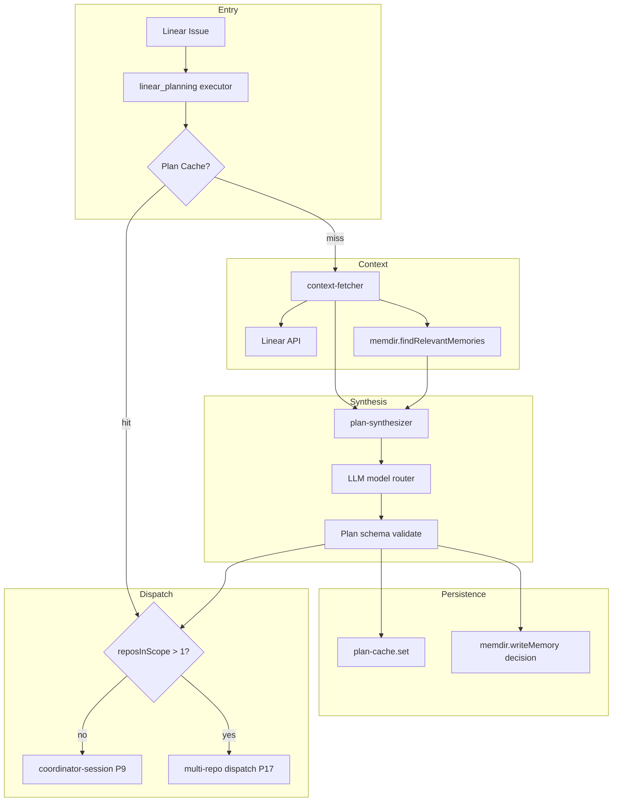
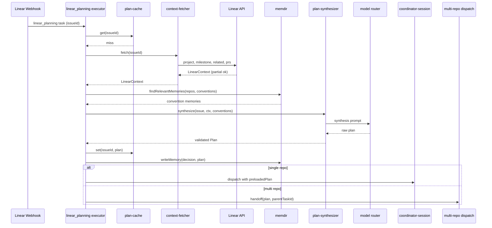

# SPARC Spec: P18 — Linear-Aware Planning Task Type

**Phase:** P18 (High)
**Priority:** High
**Estimated Effort:** 5 days
**Dependencies:** P9 (coordinator session manager — consumes the plan), P16 (memdir — Linear conventions recall), P17 (multi-repo dispatch — receives plans that cross repo boundaries)
**Source Blueprint: None — orch-agents-specific moat.** CC is a generic coding harness with no opinion on issue-tracking systems. orch-agents is positioned as the Linear-native engineering harness. P18 is what makes the planning phase *Linear-aware* — it uses Linear's project structure, milestones, related issues, and team conventions to synthesize plans grounded in actual organizational context, not just the issue body. The closest pattern analogue is `~/Developer/Benchmarks/claude-code-original-source/src/coordinator/coordinatorMode.ts` for the research-phase prompt shape, but CC's coordinator has no Linear context to inject — only the bare task description.

---

## Context

A single Linear issue arrives at the coordinator. Today, the coordinator only sees the issue title and description. It has no awareness of which Linear project the issue belongs to, what the milestone deadline is, what other issues are related (parent/child/blocks/blocked-by), what team conventions apply, or what recent PRs touched similar code. P18 introduces a `linear_planning` task type that runs BEFORE the coordinator dispatches workers, fetching all of that context and synthesizing a plan grounded in the team's actual workflow.

The output is a structured `Plan` consumed by P9's coordinator session (cite FR-P9-001) as preloaded context — the coordinator skips the cold-start research phase if a plan is already available. When the plan declares scope across multiple repos, P18 hands off to P17's multi-repo dispatch (cite FR-P17-001) instead of single-repo coordinator.

---

## S — Specification

### 1. Requirements

```yaml
specification:
  functional_requirements:
    - id: "FR-P18-001"
      description: "Linear API context fetch — for a given issue, fetch project metadata, milestone, related issues, recent PRs from the team, and active labels"
      priority: "critical"
      acceptance_criteria:
        - "context-fetcher.fetch(issueId) returns LinearContext with project, milestone, labels, team"
        - "Related issues fetched: parent, children, blocks, blocked-by, duplicates"
        - "Recent team PRs fetched via Linear's attachment graph (last 14 days, configurable)"
        - "All Linear API queries use existing linear-client (no new transport)"
        - "Network failures degrade gracefully — partial context returned with missing fields flagged"
        - "Context fetch respects Linear API rate limits via existing client backoff"

    - id: "FR-P18-002"
      description: "Convention recall via memdir — call findRelevantMemories with category filter `convention` and scope `repo` for repos in scope"
      priority: "critical"
      acceptance_criteria:
        - "Calls memdir.findRelevantMemories (cite FR-P16-003) with categoryFilter=['convention']"
        - "RecallContext built with repoSlug from workspace.repos and queryText from issue title+body"
        - "Returns top-k convention memories per repo (default k=5)"
        - "Recall is best-effort — empty result is valid, planner proceeds without conventions"
        - "Memdir failures logged but never abort planning (planning is degraded, not failed)"
        - "Convention bodies passed through to plan synthesis prompt verbatim"

    - id: "FR-P18-003"
      description: "Plan synthesis prompt — uses Linear taxonomy (project, milestone, labels, team) plus retrieved conventions to produce a structured Plan"
      priority: "critical"
      acceptance_criteria:
        - "plan-synthesizer.synthesize(issue, linearContext, conventions) returns Plan"
        - "Plan fields: scope (summary), filesToTouch[], reposInScope[], sequencing[], risks[]"
        - "Prompt template includes XML sections: <linear-context>, <conventions>, <issue>"
        - "LLM call uses existing model router (Sonnet by default for planning)"
        - "Output validated against Plan JSON schema before return — invalid output retried once"
        - "Synthesis failure produces a degraded Plan (issue body only) rather than throwing"

    - id: "FR-P18-004"
      description: "Plan injected into coordinator research phase as preloaded context — coordinator skips cold-start research"
      priority: "critical"
      acceptance_criteria:
        - "Coordinator session (cite FR-P9-001) accepts optional preloadedPlan in CoordinatorTaskRequest"
        - "When preloadedPlan present, currentPhase initialized to synthesis (skipping research)"
        - "Plan rendered into coordinator system prompt as <preloaded-plan> XML block"
        - "WorkerState.filesExplored seeded from plan.filesToTouch (cite FR-P9-002 decision matrix)"
        - "Coordinator may still spawn research workers if plan flagged as low-confidence"
        - "Confidence score (0..1) emitted by synthesizer drives skip-research decision"

    - id: "FR-P18-005"
      description: "Multi-repo handoff — when plan crosses repo boundaries, hand off to P17 multi-repo dispatch"
      priority: "high"
      acceptance_criteria:
        - "Executor inspects plan.reposInScope after synthesis"
        - "If reposInScope.length > 1, dispatch to P17 multi-repo (cite FR-P17-001) instead of single-repo coordinator"
        - "Plan.sequencing translated to P17 RepoPlan dependsOn edges"
        - "Single-repo plans dispatch to coordinator-session as before"
        - "Handoff target chosen at executor level — synthesizer is unaware of dispatch routing"
        - "Multi-repo handoff preserves original parentTaskId for trace correlation"

    - id: "FR-P18-006"
      description: "Plan caching keyed by issue ID with TTL invalidation"
      priority: "high"
      acceptance_criteria:
        - "plan-cache.get(issueId) returns cached Plan if present and not invalidated"
        - "TTL default 1 hour, configurable via settings.linearPlanning.cacheTtlMs"
        - "Invalidation triggers: issue body change, label change, related-issue add/remove"
        - "Cache key includes issue updatedAt timestamp (auto-invalidate on Linear update)"
        - "Cache is process-local in this phase — no external store"
        - "Cache miss falls through to context-fetch + synthesis path"

    - id: "FR-P18-007"
      description: "Plan persistence to memdir as `decision` category"
      priority: "high"
      acceptance_criteria:
        - "Every plan synthesis writes a memory via memdir.writeMemory (cite FR-P16-002)"
        - "Memory category is `decision`, scope is `issue`, frontmatter includes issueId + reposInScope"
        - "Body contains scope summary, files-to-touch, sequencing rationale, and risks"
        - "Persistence is best-effort — failure logged but never aborts dispatch"
        - "Persisted plans become recallable by future runs on the same or related issues"
        - "Memory write emits MemoryWritten event correlated to the linear_planning task ID"

  non_functional_requirements:
    - id: "NFR-P18-001"
      category: "latency"
      description: "Planning overhead must be bounded — context-fetch + synthesis under 5 seconds for typical issues"
      measurement: "End-to-end plan synthesis < 5s for issues with < 20 related items"

    - id: "NFR-P18-002"
      category: "degradation"
      description: "Every dependency (Linear API, memdir, LLM) is allowed to fail without aborting planning"
      measurement: "Unit tests cover Linear timeout, memdir error, and LLM error — all produce a degraded Plan"

    - id: "NFR-P18-003"
      category: "observability"
      description: "Plan synthesis emits structured events for trace correlation"
      measurement: "PlanSynthesized event includes issueId, reposInScope, confidenceScore, latencyMs"

    - id: "NFR-P18-004"
      category: "context-budget"
      description: "Rendered plan injected into coordinator prompt is bounded"
      measurement: "Plan render output capped at 4KB; lowest-priority sections dropped first"
```

### 2. Constraints

```yaml
constraints:
  technical:
    - "Reuse existing linear-client for all Linear API calls — no new transport"
    - "Reuse memdir public barrel only (cite P16) — no direct memdir internals access"
    - "LLM call routed via existing model router — no direct SDK instantiation"
    - "Plan cache is in-process Map — no SQLite or external KV in this phase"
    - "Plan JSON schema validated with existing validation utility (no new dep)"

  architectural:
    - "linear_planning is a TaskType registered in TaskRouter — not a side path"
    - "Synthesizer is pure-functional given LinearContext + conventions — no I/O"
    - "Executor owns dispatch routing — synthesizer outputs Plan, executor decides target"
    - "Cache lifetime is process — restart invalidates all entries (acceptable)"
    - "Memdir write is fire-and-forget — never blocks dispatch on persistence"
```

### 3. Use Cases

```yaml
use_cases:
  - id: "UC-P18-001"
    title: "Linear Issue with Project Context Plans Single-Repo Work"
    actor: "Linear Webhook"
    flow:
      1. "Webhook delivers issue LIN-123 (project: 'Q2 Auth', milestone: '2026-04-30')"
      2. "Executor checks plan cache by issueId — miss"
      3. "context-fetcher fetches project, milestone, related issues, recent PRs"
      4. "memdir.findRelevantMemories returns 3 convention memories for the auth repo"
      5. "plan-synthesizer LLM call produces Plan with scope, filesToTouch, single repo"
      6. "Plan cached, persisted to memdir as decision memory"
      7. "Executor sees reposInScope.length === 1 — dispatches to coordinator-session"
      8. "Coordinator skips research phase, starts at synthesis with preloaded plan"

  - id: "UC-P18-002"
    title: "Cross-Repo Plan Hands Off to Multi-Repo Dispatch"
    actor: "Executor"
    flow:
      1. "Issue LIN-456 affects schema repo and client repo (per related issue links)"
      2. "context-fetcher returns related issues showing both repos"
      3. "Synthesizer produces Plan with reposInScope = ['schema', 'client'], sequencing edges"
      4. "Executor sees reposInScope.length > 1"
      5. "Plan translated to P17 RepoPlan[] with dependsOn edges (cite FR-P17-001)"
      6. "Multi-repo dispatch invoked — P17 owns the rest"

  - id: "UC-P18-003"
    title: "Cache Hit Skips Context Fetch and Synthesis"
    actor: "Executor"
    flow:
      1. "Linear webhook fires twice in 30s for the same issue (debounce edge case)"
      2. "First call: full path, plan cached"
      3. "Second call: cache hit (TTL not exceeded, issue updatedAt unchanged)"
      4. "Cached plan returned immediately, no API calls, no LLM call"

  - id: "UC-P18-004"
    title: "Degraded Planning on Linear API Failure"
    actor: "context-fetcher"
    flow:
      1. "Linear API times out fetching related issues"
      2. "context-fetcher returns partial LinearContext with relatedIssues=[] and a warning flag"
      3. "Synthesizer proceeds with project + milestone + labels only"
      4. "Plan emitted with confidenceScore lowered (e.g. 0.6 instead of 0.85)"
      5. "Coordinator sees low confidence, may still spawn a research worker (cite FR-P9-002)"
```

### 4. Acceptance Criteria (Gherkin)

```gherkin
Feature: Linear-Aware Planning

  Scenario: Plan synthesized from Linear context and conventions
    Given a Linear issue with project, milestone, and 3 related issues
    And memdir has 2 convention memories for the affected repo
    When linear_planning task runs
    Then context-fetcher returns project, milestone, related issues
    And memdir.findRelevantMemories is called with category filter "convention"
    And plan-synthesizer returns a Plan with scope, filesToTouch, reposInScope
    And the Plan is cached by issueId
    And a decision memory is written to memdir

  Scenario: Single-repo plan dispatches to coordinator
    Given a synthesized Plan with reposInScope of length 1
    When executor routes the plan
    Then coordinator-session receives the plan as preloadedPlan
    And the coordinator phase initializes to synthesis

  Scenario: Multi-repo plan hands off to P17
    Given a synthesized Plan with reposInScope of length 3
    When executor routes the plan
    Then multi-repo dispatch is invoked
    And the original parentTaskId is preserved

  Scenario: Cache hit avoids API and LLM
    Given a plan cached for issue LIN-123 with current updatedAt
    When linear_planning runs again for LIN-123
    Then the cached plan is returned
    And context-fetcher is not called
    And plan-synthesizer is not called

  Scenario: Issue update invalidates cache
    Given a cached plan for LIN-123 with updatedAt T1
    When the issue is fetched and updatedAt is T2 > T1
    Then the cache entry is treated as stale
    And full synthesis runs

  Scenario: Linear API failure produces degraded plan
    Given Linear API times out fetching related issues
    When context-fetcher runs
    Then partial context is returned with a warning flag
    And synthesizer produces a Plan with lowered confidenceScore
    And no exception propagates to the executor
```

---

## P — Pseudocode

### Executor (Entry Point)

```
executor.run(linearPlanningTask):
  issueId = task.metadata.issueId
  cached = planCache.get(issueId)
  IF cached AND NOT staleVsLinear(cached, issueId):
    plan = cached
  ELSE:
    linearCtx = await contextFetcher.fetch(issueId)            // FR-P18-001
    conventions = await recallConventions(linearCtx.repos)     // FR-P18-002
    plan = await planSynthesizer.synthesize(
      issue, linearCtx, conventions)                           // FR-P18-003
    planCache.set(issueId, plan)
    fireAndForget(memdir.writeMemory(
      scope: 'issue', category: 'decision', body: renderPlan(plan)))  // FR-P18-007

  IF plan.reposInScope.length > 1:
    return multiRepoDispatch.handoff(plan, task.id)            // FR-P18-005
  ELSE:
    return coordinatorSession.dispatch({
      ...task, preloadedPlan: plan })                          // FR-P18-004
```

### Context Fetcher

```
contextFetcher.fetch(issueId):
  ctx = { issue: null, project: null, milestone: null,
          relatedIssues: [], recentPrs: [], labels: [], team: null,
          warnings: [] }
  TRY: ctx.issue = await linear.getIssue(issueId)
  CATCH: ctx.warnings.push('issue-fetch-failed'); return ctx

  parallel:
    ctx.project       = safe(linear.getProject(ctx.issue.projectId))
    ctx.milestone     = safe(linear.getMilestone(ctx.issue.milestoneId))
    ctx.relatedIssues = safe(linear.getRelatedIssues(issueId))
    ctx.recentPrs     = safe(linear.getRecentTeamPrs(ctx.issue.teamId))
    ctx.labels        = ctx.issue.labels
    ctx.team          = safe(linear.getTeam(ctx.issue.teamId))

  return ctx   // partial fields valid; warnings collected
```

### Convention Recall

```
recallConventions(reposInScope):
  results = {}
  FOR repo IN reposInScope:
    TRY:
      results[repo.slug] = await memdir.findRelevantMemories({
        repoSlug: repo.slug,
        queryText: issue.title + ' ' + issue.description,
        categoryFilter: ['convention'],
        k: 5,
      })
    CATCH e:
      log.warn('memdir-recall-failed', { repo: repo.slug, error: e })
      results[repo.slug] = []
  return results
```

### Plan Synthesizer

```
planSynthesizer.synthesize(issue, linearCtx, conventions):
  prompt = renderPrompt({
    issueXml: <issue>...</issue>,
    contextXml: <linear-context>project, milestone, related, prs</linear-context>,
    conventionsXml: <conventions>...</conventions>,
  })
  raw = await llm.call(prompt, model: SONNET)
  plan = parseAndValidate(raw, planSchema)
  IF NOT plan: plan = retryOnce(prompt)
  IF NOT plan: plan = degradedPlan(issue)   // body-only fallback
  plan.confidenceScore = computeConfidence(linearCtx, conventions, plan)
  return plan
```

### Plan Cache

```
planCache:
  store = Map<issueId, { plan, cachedAt, issueUpdatedAt }>
  get(id) → entry if (now - cachedAt) < TTL else undefined
  set(id, plan) → store the entry with current timestamps
  staleVsLinear(entry, id) → true if linear.issue.updatedAt > entry.issueUpdatedAt
  invalidate(id) → store.delete(id)
```

---

## A — Architecture

### Design Rationale

CC's coordinator research phase (`coordinatorMode.ts`) is a generic "go look at the codebase" prompt — it has no Linear context to inject because CC has no notion of issue-tracking systems. The research phase always cold-starts: spawn workers, let them grep, aggregate findings. This works for ad-hoc coding sessions but is wasteful when the harness is driven by an issue tracker that already encodes intent (project, milestone, related work, conventions).

We borrow three patterns:

1. **CC coordinator research-phase prompt shape** (`coordinatorMode.ts`) — the XML-tagged context-injection style for system prompts. We reuse the structural pattern of `<context>...</context>` blocks but populate them with Linear taxonomy instead of generic codebase summaries.
2. **memdir convention recall** (cite FR-P16-003) — `findRelevantMemories` with category filter is exactly the API needed to retrieve repo-specific team conventions stored as `convention` memories (cite FR-P16-002).
3. **Multi-repo dispatch handoff** (cite FR-P17-001) — when plan scope crosses repo boundaries, the existing P17 executor takes over rather than P18 reinventing fan-out.

The novel piece — and the moat — is **Linear API context fetch + plan synthesis grounded in project/milestone/team taxonomy**. CC cannot do this because CC has no Linear integration. orch-agents owns the Linear loop end-to-end (webhook intake, issue fetching, workpad reporting) and can therefore enrich planning with the same organizational context a human engineer would consult before starting work. The result is a plan that respects deadlines, sibling work, and team conventions on the first try — eliminating the cold-start research phase for the common case.

### Planning Flow



### Sequence: Issue to Dispatch



### File Structure

```
src/tasks/linear-planning/
  index.ts                 -- (NEW) Public barrel
  executor.ts              -- (NEW) TaskType.linear_planning entry point + dispatch routing
  context-fetcher.ts       -- (NEW) Linear API queries (project, milestone, related, prs)
  plan-synthesizer.ts      -- (NEW) Prompt template + LLM call + schema validation
  plan-cache.ts            -- (NEW) In-process TTL cache keyed by issueId
  types.ts                 -- (NEW) Plan, Scope, RepoSlot, LinearContext, ConfidenceScore

INTEGRATION POINTS (modified in separate patch, not this spec):
  src/execution/task/taskRouter.ts            -- register TaskType.linear_planning
  src/execution/runtime/coordinator-session.ts -- accept preloadedPlan (cite FR-P9-001)
  P16 memdir public barrel                    -- findRelevantMemories + writeMemory
  P17 multi-repo dispatch entry               -- handoff target (cite FR-P17-001)
```

---

## R — Refinement

### Test Plan

| Module | Test File | Key Assertions |
|--------|-----------|----------------|
| context-fetcher | `tests/tasks/linear-planning/context-fetcher.test.ts` | Returns full LinearContext on happy path; partial context with warning on Linear timeout; parallel fetch of project/milestone/related; never throws — always returns ctx |
| convention recall | `tests/tasks/linear-planning/context-fetcher.test.ts` | Calls memdir with category filter `convention`; empty result when memdir errors; recall scoped per repo in workspace |
| plan-synthesizer | `tests/tasks/linear-planning/plan-synthesizer.test.ts` | Renders prompt with linear-context, conventions, issue XML blocks; validates output against Plan schema; retries once on invalid output; degraded plan on second failure; confidenceScore in 0..1 |
| plan-cache | `tests/tasks/linear-planning/plan-cache.test.ts` | get returns undefined on miss; set + get round-trip; TTL expiry after configured ms; staleVsLinear true when issue.updatedAt advances; invalidate clears entry |
| executor (single-repo) | `tests/tasks/linear-planning/executor.test.ts` | Routes to coordinator-session when reposInScope.length === 1; preloadedPlan attached to dispatch request |
| executor (multi-repo) | `tests/tasks/linear-planning/executor.test.ts` | Routes to multi-repo dispatch when reposInScope.length > 1; parentTaskId preserved across handoff |
| executor (cache hit) | `tests/tasks/linear-planning/executor.test.ts` | Cache hit skips context-fetcher and synthesizer entirely |
| executor (degraded) | `tests/tasks/linear-planning/executor.test.ts` | Linear API failure → degraded plan with lowered confidence; no exception escapes |
| memdir persistence | `tests/tasks/linear-planning/executor.test.ts` | Calls memdir.writeMemory with scope=issue, category=decision; failure logged but does not abort dispatch |
| Integration | `tests/tasks/linear-planning/integration.test.ts` | End-to-end: mock Linear + mock memdir + mock LLM → Plan → coordinator-session receives preloadedPlan |

All tests use `node:test` + `node:assert/strict`, mock-first per project conventions.

### Anti-Patterns to Enforce

```yaml
anti_patterns:
  - name: "Synthesis Without Linear Context"
    bad: "Synthesizer called with only the issue body, ignoring project/milestone/related"
    good: "Synthesizer always receives a LinearContext (possibly partial with warnings)"
    enforcement: "plan-synthesizer signature requires LinearContext — no overload accepts bare issue"

  - name: "Hard Dependency on Linear API"
    bad: "Planning aborts if Linear API times out"
    good: "Partial context with warning flag is valid input to synthesizer"
    enforcement: "context-fetcher unit tests cover every fetch failure path"

  - name: "Synthesizer Owns Dispatch Routing"
    bad: "Synthesizer decides whether to call coordinator or multi-repo"
    good: "Synthesizer returns a Plan; executor inspects reposInScope and routes"
    enforcement: "plan-synthesizer module has zero imports from coordinator or multi-repo modules"

  - name: "Blocking on Memdir Persistence"
    bad: "Dispatch awaits memdir.writeMemory before routing"
    good: "writeMemory is fire-and-forget — failures logged, dispatch proceeds"
    enforcement: "executor unit test verifies dispatch occurs even when writeMemory rejects"

  - name: "Cache Without Linear Update Check"
    bad: "Cache entry returned on TTL hit regardless of issue.updatedAt"
    good: "Every cache hit verified against current Linear issue.updatedAt"
    enforcement: "plan-cache.staleVsLinear unit-tested for forward and backward timestamps"

  - name: "Direct memdir Internals Access"
    bad: "Importing from src/memdir/find-relevant.ts"
    good: "Importing from src/memdir/index.ts barrel only (cite P16 architecture)"
    enforcement: "lint rule blocks deep imports under src/memdir/ outside the module itself"
```

### Migration Strategy

```yaml
migration:
  phase_1_types_and_cache:
    files: ["types.ts", "plan-cache.ts"]
    description: "Pure types and in-process cache. No I/O."
    validation: "Types compile; cache TTL and staleness unit tests pass."

  phase_2_context_fetcher:
    files: ["context-fetcher.ts"]
    description: "Linear API queries with parallel fetch and graceful degradation."
    validation: "Happy path + every failure path tested with mocked linear-client."

  phase_3_synthesizer:
    files: ["plan-synthesizer.ts"]
    description: "Prompt template, LLM call, schema validation, retry, degraded fallback."
    validation: "Synthesizer tests pass with mocked LLM (success, invalid, double-fail)."

  phase_4_executor:
    files: ["executor.ts", "index.ts"]
    description: "Wire context-fetcher + memdir recall + synthesizer + cache + dispatch routing."
    validation: "Executor tests cover single-repo, multi-repo, cache hit, degraded paths."

  phase_5_integration_handoff:
    files: ["(none in this spec)"]
    description: "TaskRouter registration, coordinator-session preloadedPlan acceptance, P17 handoff wiring delivered as separate integration patch."
    validation: "Integration test exercises full webhook → planning → dispatch path."
```

---

## C — Completion

### Definition of Done

```yaml
completion:
  code_deliverables:
    - "src/tasks/linear-planning/types.ts — Plan, Scope, RepoSlot, LinearContext, ConfidenceScore"
    - "src/tasks/linear-planning/plan-cache.ts — TTL cache keyed by issueId with staleness check"
    - "src/tasks/linear-planning/context-fetcher.ts — Linear API queries with graceful degradation"
    - "src/tasks/linear-planning/plan-synthesizer.ts — Prompt + LLM + validation + retry"
    - "src/tasks/linear-planning/executor.ts — TaskType.linear_planning entry + dispatch routing"
    - "src/tasks/linear-planning/index.ts — public barrel"

  test_deliverables:
    - "tests/tasks/linear-planning/plan-cache.test.ts"
    - "tests/tasks/linear-planning/context-fetcher.test.ts"
    - "tests/tasks/linear-planning/plan-synthesizer.test.ts"
    - "tests/tasks/linear-planning/executor.test.ts"
    - "tests/tasks/linear-planning/integration.test.ts"

  verification_checklist:
    - "npm run build succeeds"
    - "npm test passes (existing + new linear-planning tests)"
    - "npx tsc --noEmit passes"
    - "npm run lint passes"
    - "linear-planning module has zero imports from coordinator-session or multi-repo internals"
    - "All memdir access via public barrel only (cite P16 architecture constraint)"
    - "Every Linear API call wrapped in safe() — no unhandled rejections"
    - "Plan schema validation runs on every synthesizer output"
    - "PlanSynthesized event emitted for every successful synthesis"

  success_metrics:
    - "Plan synthesis < 5s end-to-end for typical issues (NFR-P18-001)"
    - "Cache hit rate > 30% in production after first day (debounce + retry traffic)"
    - "Coordinator skips research phase on > 70% of webhook-triggered runs (preloaded plan present)"
    - "Multi-repo handoff exercised end-to-end with P17 in integration tests"
    - "Zero planning aborts due to Linear API or memdir failures (degraded plans only)"
```
