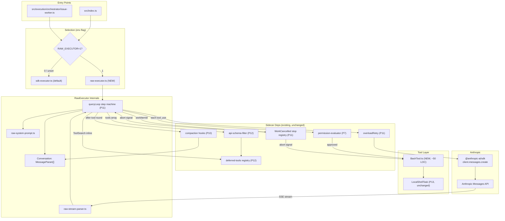

# SPARC Spec: P19 — Raw Executor Spike (Phase A of Agent-SDK Migration)

**Phase:** P19 (Critical — unblocks the harness moat)
**Priority:** Critical
**Estimated Effort:** 2 days
**Dependencies:** P7 (permission-evaluator), P10 (compaction hooks), P11 (queryLoop + overloadRetry + WorkCancelled stop registry), P12 (deferred-tools registry + api-schema-filter), P13 (LocalShellTask)
**Source Blueprint:** Direct `@anthropic-ai/sdk` usage. This is NOT a port from the Claude Code source — it is "use the standard Anthropic Messages API the way every other Anthropic customer does, with our own loop on top."

---

## Context

The Claude Code source leak confirmed that the harness is the value. P6–P13 built harness primitives (Task backbone, permission-evaluator, coordinator session, compaction hooks, queryLoop + overloadRetry + WorkCancelled registry, deferred-tools registry + api-schema-filter, LocalShellTask) that sit *beside* `@anthropic-ai/claude-agent-sdk` rather than driving it — because the Agent SDK's `query()` owns the multi-turn loop, conversation, tool execution, retry, and permission flow internally. Our parallel infrastructure cannot intervene per-turn.

P19 is **Phase A** of removing `@anthropic-ai/claude-agent-sdk` and replacing it with direct `@anthropic-ai/sdk` calls driven by orch-agents' existing infrastructure. This phase is a **spike**: prove the architecture end-to-end with one tool (Bash via P13), behind a feature flag, with sdk-executor preserved as production default. Phases B–F follow as separate PRs.

---

## S — Specification

### 1. Requirements

```yaml
specification:
  functional_requirements:
    - id: "FR-P19-001"
      description: "RawExecutor implements InteractiveTaskExecutor as a drop-in alternative to sdk-executor, gated by RAW_EXECUTOR=1 env flag"
      acceptance_criteria:
        - "src/execution/runtime/raw-executor.ts exports createRawExecutor(deps) returning InteractiveTaskExecutor"
        - "Same execute(request) signature, same TaskExecutionResult shape, same NormalizedRuntimeEvent emissions as sdk-executor"
        - "RAW_EXECUTOR unset/'0' → sdk-executor selected (no behavioral change); RAW_EXECUTOR=1 → raw-executor selected"

    - id: "FR-P19-002"
      description: "RawExecutor calls @anthropic-ai/sdk messages.create({stream:true}) directly — no Agent SDK in the code path"
      acceptance_criteria:
        - "No import of @anthropic-ai/claude-agent-sdk in raw-executor.ts or its helpers"
        - "Anthropic client constructed once per executor, reused; ANTHROPIC_API_KEY read from env, never logged"
        - "stream:true mode; SSE events parsed by raw-stream-parser.ts"

    - id: "FR-P19-003"
      description: "P11 queryLoop drives the multi-turn loop one step at a time inside raw-executor"
      acceptance_criteria:
        - "Each iteration: callMessages → parseStream → branch on stop_reason (tool_use vs end_turn)"
        - "tool_use: evaluate permission, execute, append tool_result, continue. end_turn: terminate."
        - "max_turns derived from request.timeout same as sdk-executor; queryLoop transitions emitted via deps.emitQueryEvent"

    - id: "FR-P19-004"
      description: "P11 overloadRetry wraps messages.create (same semantics as sdk-executor)"
      acceptance_criteria:
        - "callWithOverloadRetry wraps the messages.create factory"
        - "529/overloaded → exponential backoff (1s/2s/4s/8s ±25%, 4 retries max); non-overload errors propagate"
        - "deps.overloadRetry override respected; OverloadAbortedError → status='cancelled'"

    - id: "FR-P19-005"
      description: "P7 permission-evaluator gates EVERY tool_use before execution"
      acceptance_criteria:
        - "evaluatePermission(request, policy) called for every tool_use block"
        - "Denied → tool_result with is_error=true and denial reason; loop continues; BashTool.execute NOT called"
        - "Bash writing outside writableRoots is denied"

    - id: "FR-P19-006"
      description: "P12 deferred-tools registry drives the API tool list; ToolSearch handled inline by RawExecutor"
      acceptance_criteria:
        - "Tools array derived via api-schema-filter(deps.deferredToolRegistry); no literal tool arrays"
        - "ToolSearch + Bash marked alwaysLoad=true for the spike"
        - "tool_use(ToolSearch,...) routed inline to registry lookup — no real execution, tool_result contains tool_reference blocks"
        - "Subsequent turn's tools array includes unlocked definitions"

    - id: "FR-P19-007"
      description: "BashTool adapter wraps P13 LocalShellTask as one native Anthropic-API tool"
      acceptance_criteria:
        - "src/tools/bash/BashTool.ts exports tool definition {name:'Bash', input_schema:{command,cwd?,timeoutMs?}}"
        - "execute(input, abortSignal) delegates to localShellTask.execute; subprocess honors abort signal"
        - "File ≤80 LOC; P13 LocalShellTask source NOT modified"

    - id: "FR-P19-008"
      description: "RawExecutor owns the conversation as Anthropic.MessageParam[]; P10 compaction operates on it directly"
      acceptance_criteria:
        - "Single MessageParam[] reference mutated in-place; maybeCompact(conversation) called after each tool round"
        - "Compaction hooks see the SAME array that the next messages.create call sends — no hidden SDK state"

    - id: "FR-P19-009"
      description: "WorkCancelled aborts in-flight execution within one event"
      acceptance_criteria:
        - "createWorkCancelledStopRegistry wired same as sdk-executor (metaWorkItemId lookup)"
        - "AbortController.signal passed to messages.create AND BashTool.execute"
        - "WorkCancelled mid-stream → loop exits cancelled on next event boundary; in-flight Bash receives abort"
        - "stopRegistry.dispose() in finally — no leaked listeners"

    - id: "FR-P19-010"
      description: "End-to-end integration test with mocked Anthropic client + real LocalShellTask"
      acceptance_criteria:
        - "tests/execution/runtime/raw-executor.test.ts dispatches a Bash task"
        - "Mocked Anthropic returns scripted SSE: turn 1 tool_use(Bash), turn 2 end_turn"
        - "Real subprocess runs (echo hello); no shell mocking; no real API credits"
        - "Asserts same events as sdk-executor: TaskStateChanged (pending→running→completed), TaskOutputDelta, TaskNotified"
        - "Runs in <5s"

  non_functional_requirements:
    - id: "NFR-P19-001"
      category: "backward-compatibility"
      description: "RAW_EXECUTOR unset/0 must produce zero behavioral change in production"
      measurement: "All existing sdk-executor unit tests pass unmodified; integration runs with RAW_EXECUTOR=0 are byte-identical to today"

    - id: "NFR-P19-002"
      category: "code-reuse"
      description: "RawExecutor consumes existing P7/P10/P11/P12/P13 modules — no reimplementation"
      measurement: "Grep raw-executor.ts: must import from query/, runtime/permission-evaluator, services/deferred-tools, services/compact, tasks/local-shell. Must NOT reimplement retry, permission, compaction, or shell exec logic."

    - id: "NFR-P19-003"
      category: "observability"
      description: "RawExecutor emits the same domain events as sdk-executor so existing observers (WorkTracker, taskPoller, EventBus subscribers) work unchanged"
      measurement: "Event parity table (NormalizedRuntimeEvent.type values: progress, toolCall, tokenUsage, result, error) verified by integration test"

    - id: "NFR-P19-004"
      category: "scope"
      description: "Spike scope cap ~1000 LOC including the integration test"
      measurement: "raw-executor.ts ≤ 500, raw-stream-parser.ts ≤ 150, raw-system-prompt.ts ≤ 100, BashTool.ts ≤ 80, raw-executor.test.ts ≤ 200. If any file exceeds budget, stop and report."

    - id: "NFR-P19-005"
      category: "test-parity"
      description: "Existing sdk-executor unit tests covering shared behavior (abort propagation, overload retry classification) must pass when re-targeted at raw-executor"
      measurement: "A subset of sdk-executor.test.ts cases is parameterized to also run against raw-executor; both pass"
```

### 2. Constraints

```yaml
constraints:
  technical:
    - "Do NOT remove @anthropic-ai/claude-agent-sdk from package.json — that is Phase F"
    - "Do NOT migrate any production caller off sdk-executor in this PR — sdk-executor remains the default"
    - "Do NOT port additional tools (Read/Write/Edit/Grep/Glob) — that is Phase B"
    - "Do NOT modify queryLoop.ts, overloadRetry.ts, permission-evaluator.ts, deferred-tools/*.ts, or LocalShellTask.ts — use them as-is"
    - "If P7/P10/P11/P12/P13 modules need additive params for raw-executor, those go in a SEPARATE prep PR before P19 lands"
    - "Verify @anthropic-ai/sdk presence: if not already a transitive dep of @anthropic-ai/claude-agent-sdk, add it as a direct dependency in this PR"
    - "ANTHROPIC_API_KEY read from process.env only — never hardcoded, never logged"

  architectural:
    - "RawExecutor is selected at process startup via env flag in src/index.ts and src/execution/orchestrator/issue-worker.ts; the rest of the system sees only InteractiveTaskExecutor"
    - "Conversation state lives in raw-executor only — no shared mutable state with the SDK path"
    - "BashTool is the ONLY native API tool registered in this spike; ToolSearch handled inline (registry lookup, no execution)"
    - "Permission evaluation is the ONLY gate before tool execution — no parallel allowlist checks elsewhere"
    - "Stream parser handles only the SSE event types we care about today: message_start, content_block_start, content_block_delta, content_block_stop, message_delta, message_stop, error. Other types are skipped, not errored."

  scope:
    - "This is a SPIKE. Goal is 'prove it works', not 'ship to production'"
    - "After Phase A lands and runs in staging for a few days, decide: commit to Phase B (port Read/Write/Edit) or roll back the env flag"
    - "No telemetry dashboards, no metrics export, no admin UI changes — observability is via existing EventBus only"
```

### 3. Use Cases

```yaml
use_cases:
  - id: "UC-P19-001"
    title: "Linear webhook → coordinator dispatches a Bash task → RawExecutor runs it"
    flow:
      - "issue-worker reads RAW_EXECUTOR=1 → selects createRawExecutor"
      - "RawExecutor builds [system(toolAdvertisement), user(prompt)]; calls messages.create(stream:true)"
      - "Stream: tool_use(Bash); permission-evaluator approves; BashTool→LocalShellTask runs command"
      - "tool_result appended; next messages.create → end_turn; TaskExecutionResult{completed}"
      - "Same TaskStateChanged + TaskNotified events as sdk-executor path"

  - id: "UC-P19-002"
    title: "Model invokes ToolSearch — RawExecutor handles inline"
    flow:
      - "Initial tools array: [ToolSearch, Bash] (alwaysLoad)"
      - "Model emits tool_use(ToolSearch, {query:'select:Bash'})"
      - "RawExecutor routes inline: deferredToolRegistry.search → tool_reference blocks"
      - "tool_result appended, no real execution, no permission check"
      - "Next turn's tools array includes unlocked definitions"

  - id: "UC-P19-003"
    title: "WorkCancelled mid-execution aborts stream AND in-flight shell"
    flow:
      - "execute() binds WorkCancelled stop registry to AbortController"
      - "Mid-stream, WorkCancelled for workItemId flips signal"
      - "BashTool subprocess receives abort via P13, exits"
      - "Loop exits on next iteration with status='cancelled'"
      - "finally disposes stopRegistry — no leaked listeners"
```

### 4. Acceptance Criteria (Gherkin)

```gherkin
Feature: P19 Raw Executor Spike

  Scenario: Env flag selects executor
    Given RAW_EXECUTOR is unset
    When the orchestrator boots
    Then sdk-executor is wired into the InteractiveTaskExecutor slot
    Given RAW_EXECUTOR=1
    When the orchestrator boots
    Then raw-executor is wired into the InteractiveTaskExecutor slot

  Scenario: RawExecutor drives the loop directly
    Given a mocked Anthropic client that returns a tool_use Bash turn followed by end_turn
    When RawExecutor.execute(request) is called
    Then anthropicClient.messages.create is called exactly twice
    And BashTool.execute is called exactly once between the two calls
    And the final result.status is "completed"

  Scenario: Permission evaluator denies Bash outside writable roots
    Given a Bash tool_use with command writing to /etc/passwd
    When RawExecutor processes the turn
    Then evaluatePermission returns approved=false
    And BashTool.execute is NOT called
    And a tool_result block with is_error=true is appended
    And the loop continues to the next turn

  Scenario: Overload retry wraps messages.create
    Given the Anthropic client throws a 529 overloaded_error on the first call
    When RawExecutor calls messages.create through callWithOverloadRetry
    Then a retry is scheduled with backoff per OverloadRetryOptions
    And the retry attempt count is emitted via emitQueryEvent

  Scenario: ToolSearch handled inline
    Given the model emits tool_use(ToolSearch, {query:"select:Bash"})
    When RawExecutor processes the turn
    Then no API tool execution is dispatched
    And the deferred-tools registry is queried directly
    And a tool_result block containing tool_reference entries for Bash is appended

  Scenario: WorkCancelled aborts execution within one event
    Given RawExecutor is mid-stream with workItemId="wi-123"
    When a WorkCancelled domain event for "wi-123" is published
    Then the AbortController.signal flips to aborted within one tick
    And messages.create stream consumption halts on the next event boundary
    And any in-flight BashTool subprocess receives abort
    And the result status is "cancelled"

  Scenario: Compaction operates on the owned conversation
    Given the conversation array exceeds the compaction threshold after a tool round
    When maybeCompact(conversation, compactionHooks) fires
    Then the same array passed to the next messages.create call reflects the compaction
```

---

## P — Pseudocode

### Main Loop in RawExecutor

```
async function execute(request):
  startTime = now()
  workItemId = request.metadata?.workItemId
  taskId = request.metadata?.taskId

  abortController = new AbortController()
  stopRegistry = bindWorkCancelled(eventBus, workItemId, abortController)  // P11

  conversation = [
    systemMessage(buildSystemPrompt(deferredToolRegistry)),                 // raw-system-prompt.ts
    userMessage(request.prompt)
  ]
  tools = apiSchemaFilter(deferredToolRegistry)                             // P12

  try:
    transitionTaskOnFirstEvent = once(() => transition(taskId, running))

    for turn in 0..maxTurns:
      if abortController.signal.aborted: return cancelled()

      stream = await callWithOverloadRetry(                                 // P11
        () => anthropicClient.messages.create({
          model, max_tokens, stream: true,
          system: ..., messages: conversation, tools,
          signal: abortController.signal
        }),
        deps.overloadRetry
      )

      parsed = await parseStream(stream, {                                  // raw-stream-parser.ts
        onFirstEvent: transitionTaskOnFirstEvent,
        onTextDelta: (delta) => emitProgress(delta) + appendJsonl(taskId),
        onTokenUsage: (usage) => emitTokenUsage(usage),
        abortSignal: abortController.signal
      })
      conversation.push(parsed.assistantMessage)

      if parsed.stop_reason == 'end_turn':
        transition(taskId, completed)
        return { status: 'completed', output: parsed.text, ... }

      if parsed.stop_reason == 'tool_use':
        toolResultBlocks = []
        for toolUse in parsed.toolUses:
          if toolUse.name == 'ToolSearch':
            result = handleToolSearchInline(toolUse.input, deferredToolRegistry)
            toolResultBlocks.push(toolResultBlock(toolUse.id, result))
            continue

          permission = evaluatePermission(                                  // P7
            { tool: toolUse.name, args: toolUse.input },
            permissionPolicy
          )
          if !permission.approved:
            toolResultBlocks.push(errorBlock(toolUse.id, permission.reason))
            continue

          impl = toolRegistry.get(toolUse.name)
          if !impl:
            toolResultBlocks.push(errorBlock(toolUse.id, 'unknown tool'))
            continue

          try:
            result = await impl.execute(toolUse.input, abortController.signal)
            toolResultBlocks.push(toolResultBlock(toolUse.id, result))
            emitToolCall(toolUse.name, ok: true)
          catch err:
            toolResultBlocks.push(errorBlock(toolUse.id, err.message))
            emitToolCall(toolUse.name, ok: false, error: err.message)

        conversation.push(userMessage(toolResultBlocks))
        maybeCompact(conversation, compactionHooks)                          // P10
        continue

      // max_tokens / stop_sequence / etc → handled per existing queryLoop transitions
      return handleTerminalReason(parsed.stop_reason)

    return { status: 'failed', error: 'max_turns_exceeded' }

  catch err:
    return mapError(err)                                                    // OverloadAborted → cancelled, etc.

  finally:
    stopRegistry.dispose()
```

### handleToolSearchInline

```
function handleToolSearchInline(input, registry):
  query = input.query                                                       // e.g. "select:Bash" or keyword
  matches = registry.search(query)
  return {
    tool_references: matches.map(m => ({ name: m.name, schema: m.input_schema, description: m.description }))
  }
```

### Stream Parser (raw-stream-parser.ts)

Consume SSE `message_start` / `content_block_start|delta|stop` / `message_delta` / `message_stop` / `error`. Accumulate text from `text_delta`, reassemble tool_use input from `input_json_delta` (JSON.parse on `content_block_stop`), capture `stop_reason` from `message_delta`, capture usage. Unknown event types skipped, `error` throws. Returns `{ assistantMessage, stop_reason, usage, text, toolUses }`.

### BashTool Adapter

Exports `bashToolDefinition` (name:'Bash', input_schema:{command, cwd?, timeoutMs?}) and `createBashTool(localShellTask)` with `execute(input, abortSignal)` that creates a local_shell Task and delegates to `localShellTask.execute(task, {...input, abortSignal})`, returning `{stdout, stderr, exitCode}`. No business logic — pure adapter.

---

## A — Architecture

### Component Diagram



### File Structure

```
src/execution/runtime/raw-executor.ts        (NEW, ≤500 LOC) — main executor
src/execution/runtime/raw-stream-parser.ts   (NEW, ≤150 LOC) — SSE → typed turn result
src/execution/runtime/raw-system-prompt.ts   (NEW, ≤100 LOC) — system prompt + tool advertisement
src/tools/bash/BashTool.ts                   (NEW, ≤80 LOC)  — LocalShellTask adapter
src/index.ts                                 (MODIFIED)      — env flag selects executor
src/execution/orchestrator/issue-worker.ts   (MODIFIED)      — same env flag check in worker thread

tests/execution/runtime/raw-executor.test.ts (NEW, ≤200 LOC) — integration + unit tests
tests/execution/runtime/raw-stream-parser.test.ts (NEW)      — synthetic SSE event coverage
```

---

## R — Refinement

### Test Plan

| FR | Test File | Key Assertions |
|----|-----------|----------------|
| FR-P19-001 | raw-executor.test.ts | createRawExecutor returns InteractiveTaskExecutor; env flag in index.ts selects raw vs sdk; same TaskExecutionResult shape as sdk-executor |
| FR-P19-002 | raw-executor.test.ts | mocked Anthropic client called with stream:true; no @anthropic-ai/claude-agent-sdk import in raw-executor.ts (static check) |
| FR-P19-003 | raw-executor.test.ts | loop iterates correct number of turns; stop_reason=end_turn terminates; stop_reason=tool_use continues; max_turns derived from request.timeout |
| FR-P19-004 | raw-executor.test.ts | mocked client throws 529 → callWithOverloadRetry retries; OverloadAbortedError → status='cancelled'; deps.overloadRetry override respected |
| FR-P19-005 | raw-executor.test.ts | Bash command outside writableRoots → denied; tool_result has is_error=true; loop continues to next turn; BashTool.execute NOT called |
| FR-P19-006 | raw-executor.test.ts | apiSchemaFilter consulted for tools array; ToolSearch tool_use routed inline to registry; tool_result contains tool_reference blocks; no extra real-tool execution |
| FR-P19-007 | bash-tool.test.ts | BashTool definition matches Anthropic schema; execute delegates to LocalShellTask; abortSignal propagates to subprocess; file ≤80 LOC |
| FR-P19-008 | raw-executor.test.ts | conversation array mutated in-place; maybeCompact called after each tool round; same array reference passed to next messages.create |
| FR-P19-009 | raw-executor.test.ts | publish WorkCancelled event mid-stream → loop exits within one tick; abortSignal flips on BashTool; stopRegistry.dispose() called in finally |
| FR-P19-010 | raw-executor.test.ts (integration) | full stack: mocked Anthropic + real LocalShellTask running 'echo hello'; asserts TaskStateChanged (pending→running→completed), TaskOutputDelta, TaskNotified events; <5s; zero API credits |
| (parser unit) | raw-stream-parser.test.ts | message_start/content_block_*/message_delta/message_stop handled; text deltas accumulated; tool_use input JSON assembled from input_json_delta; unknown event types skipped not errored; error event throws |
| (parity) | raw-executor.test.ts | re-targeted sdk-executor cases for abort propagation + overload retry classification all pass against raw-executor |

All tests use `node:test` + `node:assert/strict`, mock-first per project conventions. No real API credits burned in any test.

### Anti-Patterns to Enforce

```yaml
anti_patterns:
  - "Reimplementing retry logic — must use callWithOverloadRetry from P11"
  - "Reimplementing permission policy — must call evaluatePermission from P7 for every tool_use"
  - "Owning a parallel conversation that diverges from compaction hooks — single MessageParam[] reference, mutated in place"
  - "Modifying P6–P13 modules — P19 PR must not touch src/query/, permission-evaluator.ts, deferred-tools/, compact/, local-shell/"
  - "Hardcoding tool definitions — must derive via apiSchemaFilter(deferredToolRegistry)"
  - "Skipping abort signal propagation to in-flight tools — BashTool.execute must accept abortSignal"
  - "Logging or echoing ANTHROPIC_API_KEY — read from process.env only, never log"
```

### Migration Strategy

```yaml
migration:
  - "Phase 1: Verify @anthropic-ai/sdk is present (transitive or direct). Add as direct dep if not."
  - "Phase 2: Build raw-stream-parser.ts + unit tests against synthetic SSE event sequences"
  - "Phase 3: Build raw-system-prompt.ts — advertise tools from deferred-tools registry"
  - "Phase 4: Build BashTool.ts — test LocalShellTask wrapping + abort signal propagation"
  - "Phase 5: Build raw-executor.ts — integrate overloadRetry, permission-evaluator, deferred-tools, compaction, BashTool, ToolSearch inline"
  - "Phase 6: Wire RAW_EXECUTOR env flag in src/index.ts and src/execution/orchestrator/issue-worker.ts (default off)"
  - "Phase 7: End-to-end integration test with mocked Anthropic + real LocalShellTask"
  - "Phase 8: Update this spec's Completion section with staging operator instructions"
```

---

## C — Completion

### Definition of Done

```yaml
completion:
  code_deliverables:
    - "src/execution/runtime/raw-executor.ts — RawExecutor implementation"
    - "src/execution/runtime/raw-stream-parser.ts — SSE event → typed turn result"
    - "src/execution/runtime/raw-system-prompt.ts — system prompt assembler"
    - "src/tools/bash/BashTool.ts — LocalShellTask adapter"
    - "Modified: src/index.ts — RAW_EXECUTOR env flag check"
    - "Modified: src/execution/orchestrator/issue-worker.ts — same env flag check in worker thread"

  test_deliverables:
    - "tests/execution/runtime/raw-executor.test.ts — unit + integration"
    - "tests/execution/runtime/raw-stream-parser.test.ts — synthetic SSE coverage"
    - "tests/tools/bash/bash-tool.test.ts — adapter + abort propagation"

  verification_checklist:
    - "raw-executor.ts compiles and passes unit tests"
    - "raw-stream-parser handles message_start, content_block_start/delta/stop, message_delta, message_stop, error"
    - "BashTool wraps LocalShellTask correctly and propagates abort signal"
    - "permission-evaluator gates every tool call (verified by denied-Bash test)"
    - "callWithOverloadRetry wraps messages.create (verified by 529 retry test)"
    - "WorkCancelled aborts in-flight execution within one event boundary"
    - "Compaction hooks fire on the owned conversation (identity check)"
    - "ToolSearch handled inline via registry lookup, no real tool execution"
    - "End-to-end integration test passes with mocked Anthropic + real LocalShellTask"
    - "RAW_EXECUTOR=1 selects raw-executor; RAW_EXECUTOR unset/0 keeps sdk-executor"
    - "All existing sdk-executor tests still pass (sdk-executor source untouched)"
    - "npx tsc --noEmit clean"
    - "npm run lint clean"
    - "npm run build succeeds"
    - "Total LOC budget respected (~1000 across new files including tests)"
    - "No P6–P13 modules modified (git diff scope check)"
    - "@anthropic-ai/claude-agent-sdk still in package.json (Phase F removes it)"

  success_metrics:
    - "RAW_EXECUTOR=1 in staging: one full coordinator-driven Bash task completes successfully"
    - "Same observable EventBus events fire on raw vs sdk paths for the same task input"
    - "Zero new dependencies beyond @anthropic-ai/sdk (which may already be transitive)"
    - "Phase B/C/D/E/F decision made within 1 week of P19 landing in staging"
```

### Honest Scope Notes

- **This is a spike, not a production cutover.** The goal is "prove the architecture works end-to-end with one tool". After Phase A lands and runs in staging for a few days, we make a binary call: commit to Phase B (port Read/Write/Edit/Grep/Glob as native API tools) or roll back the env flag and reassess.
- **The integration test mocks the Anthropic client** but uses a real Bash subprocess via P13 LocalShellTask. We do not burn real API credits in CI.
- **`@anthropic-ai/sdk` dependency status:** unverified at spec time. The implementation PR's first task is to confirm whether it's already a transitive dep of `@anthropic-ai/claude-agent-sdk`. If not, add it as a direct dep.
- **The spike intentionally does NOT replace any production caller.** sdk-executor remains the production default until Phase F cutover.
- **No new tools beyond Bash.** Phase B is where Read/Write/Edit/Grep/Glob get ported. Phase C is the Linear tool bridge migration. Phase D handles MCP tool routing. Phase E adds the remaining native tools. Phase F removes `@anthropic-ai/claude-agent-sdk` and flips the default.

### Open Questions / Honest Unknowns

1. **`@anthropic-ai/sdk` availability:** is it already installed transitively, or does P19 need to add it as a direct dep? Verified in Phase 1 of migration.
2. **ToolSearch input shape:** the model-facing schema for ToolSearch (`{query: string}` vs `{select: string[]}` vs free-form) is not yet pinned. Phase 5 of migration will pick one and document it inline.
3. **System prompt tool advertisement format:** how exactly do we mention deferred tools without bloating the prompt? Phase 3 will prototype 2-3 formats and pick the shortest that the model reliably uses.
4. **Compaction hook contract for the owned conversation:** P10's compaction hooks today operate on AgentRunner-managed history. Confirm during Phase 5 that the same hook signature works on raw `Anthropic.MessageParam[]`. If not, a P10 prep PR is required before P19.
5. **maxTurns derivation:** sdk-executor uses `Math.max(1, Math.floor(request.timeout / 60_000)) || 20`. Same heuristic in raw-executor, or revisit? Default: same heuristic, revisit in Phase B.
6. **Worker thread env propagation:** confirm `RAW_EXECUTOR` env var is inherited by worker threads spawned by `issue-worker.ts`. If not, pass it explicitly via workerData.
