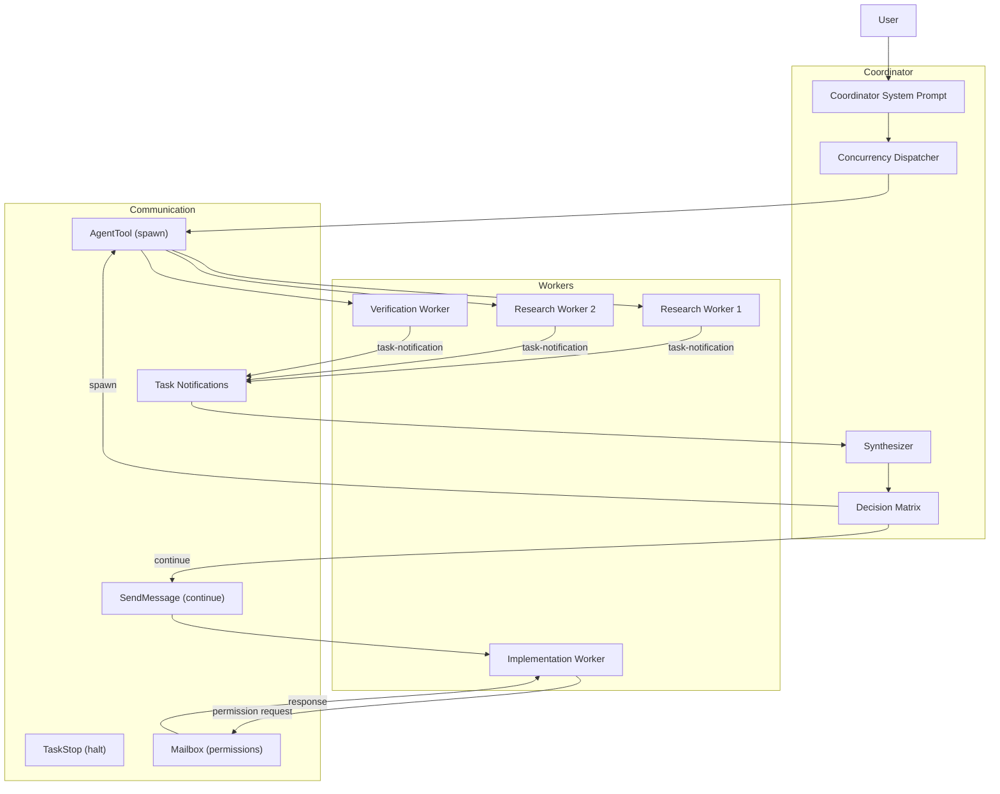

# SPARC Spec: P2 — Coordinator/Worker Phase Pattern

**Phase:** P2 (High)  
**Priority:** High  
**Estimated Effort:** 5 days  
**Source Blueprint:** Claude Code Original — `coordinator/coordinatorMode.ts` (19K), `utils/swarm/inProcessRunner.ts` (54K)

---

## S — Specification

### 1. Requirements

```yaml
specification:
  functional_requirements:
    - id: "FR-P2-001"
      description: "Coordinator mode shall transform the agent into a non-coding orchestrator that delegates to workers"
      priority: "critical"
      acceptance_criteria:
        - "Coordinator never directly executes Bash, Edit, Write, or Glob tools"
        - "Coordinator uses only: AgentTool (spawn), SendMessage (continue), TaskStop (halt)"
        - "Coordinator system prompt explicitly defines orchestration role"

    - id: "FR-P2-002"
      description: "Coordinator shall enforce a 4-phase workflow: Research -> Synthesis -> Implementation -> Verification"
      priority: "critical"
      acceptance_criteria:
        - "Research phase: parallel read-only workers investigating codebase"
        - "Synthesis phase: coordinator reads findings, writes SPECIFIC implementation specs"
        - "Implementation phase: workers execute specs, one at a time per file set"
        - "Verification phase: fresh workers verify changes independently"

    - id: "FR-P2-003"
      description: "Coordinator shall never delegate understanding — must synthesize before directing"
      priority: "critical"
      acceptance_criteria:
        - "Prompts to implementation workers must include file paths and line numbers"
        - "Phrases like 'based on your findings, fix it' are explicitly forbidden"
        - "Coordinator proves understanding by referencing specific code locations"

    - id: "FR-P2-004"
      description: "Workers shall report completion via task-notification XML in user-role messages"
      priority: "high"
      acceptance_criteria:
        - "Notification includes: task-id, status, summary, result, usage"
        - "Coordinator receives notifications as user messages (not system messages)"
        - "Coordinator must not fabricate or predict worker results"

    - id: "FR-P2-005"
      description: "Workers shall be continuable via SendMessage for follow-up tasks"
      priority: "high"
      acceptance_criteria:
        - "SendMessage preserves worker's full context from previous run"
        - "Continue vs spawn decision based on context overlap"
        - "Corrections use continue (error context valuable)"
        - "Verification uses spawn (fresh eyes, no assumptions)"

    - id: "FR-P2-006"
      description: "Coordinator shall manage worker concurrency correctly"
      priority: "high"
      acceptance_criteria:
        - "Read-only tasks (research) run in parallel freely"
        - "Write-heavy tasks (implementation) serialize per file set"
        - "After launching workers, coordinator ends response briefly"
        - "No progress checking — trust task-notification delivery"

  non_functional_requirements:
    - id: "NFR-P2-001"
      category: "efficiency"
      description: "Coordinator should maximize parallelism for research phase"
      measurement: "Multiple research workers launched in single message"

    - id: "NFR-P2-002"
      category: "quality"
      description: "Verification workers must independently prove code works"
      measurement: "Verifier runs tests with feature enabled, not just confirms existence"
```

### 2. Constraints

```yaml
constraints:
  technical:
    - "Coordinator system prompt injected via getCoordinatorSystemPrompt()"
    - "Worker tool access defined by ASYNC_AGENT_ALLOWED_TOOLS constant"
    - "Workers access MCP tools from connected servers"
    - "Scratchpad directory available for durable cross-worker knowledge"

  architectural:
    - "Coordinator mode mutually exclusive with fork subagent (P5)"
    - "Workers are in-process teammates — not separate processes"
    - "Permission bridging: workers surface permission prompts to coordinator"
    - "Workers compact independently when over threshold"
```

### 3. Use Cases

```yaml
use_cases:
  - id: "UC-P2-001"
    title: "Fix a Bug with Coordinator Pattern"
    actor: "User"
    flow:
      1. "User: 'There's a null pointer in the auth module'"
      2. "Coordinator spawns 2 parallel research workers:"
      3. "  - Worker A: investigate auth module for null pointer"
      4. "  - Worker B: find all auth-related test files"
      5. "Worker A reports: 'Found null in validate.ts:42, user field undefined when session expired'"
      6. "Coordinator SYNTHESIZES: specific file, line, root cause"
      7. "Coordinator continues Worker A with implementation spec:"
      8. "  'Fix null pointer in src/auth/validate.ts:42. Add null check before user.id.'"
      9. "Worker A commits fix, reports hash"
      10. "Coordinator spawns fresh Worker C for verification:"
      11. "  'Run auth tests. Verify session expiry handling works.'"
      12. "Worker C confirms: all tests pass"

  - id: "UC-P2-002"
    title: "Continue vs Spawn Decision"
    actor: "Coordinator"
    flow:
      1. "Research worker explored files that need editing -> CONTINUE (context overlap)"
      2. "Broad research, narrow implementation -> SPAWN FRESH (avoid noise)"
      3. "Worker reported failure -> CONTINUE (error context valuable)"
      4. "Verify code a different worker wrote -> SPAWN FRESH (independent eyes)"
      5. "Wrong approach entirely -> SPAWN FRESH (avoid anchoring bias)"
```

---

## P — Pseudocode

### Coordinator System Prompt Builder

```
ALGORITHM: BuildCoordinatorSystemPrompt
INPUT: mcpClients (ServerConnection[]), scratchpadDir (string?)
OUTPUT: systemPrompt (string)

BEGIN
    workerTools <- getAllowedWorkerTools()
    // Filter out internal-only tools (TeamCreate, TeamDelete, SendMessage, SyntheticOutput)
    workerTools <- workerTools.filter(t => NOT isInternalWorkerTool(t))

    prompt <- "You are Claude Code, an AI assistant that orchestrates software engineering tasks."
    prompt += COORDINATOR_ROLE_SECTION       // Role definition
    prompt += COORDINATOR_TOOLS_SECTION      // AgentTool, SendMessage, TaskStop
    prompt += WORKER_CAPABILITIES_SECTION(workerTools)
    prompt += FOUR_PHASE_WORKFLOW_SECTION    // Research -> Synthesis -> Implement -> Verify
    prompt += CONCURRENCY_RULES_SECTION     // Parallel read, serial write
    prompt += VERIFICATION_RULES_SECTION    // Prove it works, don't rubber-stamp
    prompt += PROMPT_WRITING_RULES_SECTION  // Never delegate understanding

    IF mcpClients.length > 0 THEN
        serverNames <- mcpClients.map(c => c.name).join(', ')
        prompt += "\nWorkers have access to MCP tools from: " + serverNames
    END IF

    IF scratchpadDir AND isScratchpadEnabled() THEN
        prompt += "\nScratchpad directory: " + scratchpadDir
        prompt += "\nWorkers can read/write here without permission prompts."
    END IF

    RETURN prompt
END
```

### Worker Task Notification Handler

```
ALGORITHM: HandleTaskNotification
INPUT: notification (TaskNotification), coordinator (CoordinatorState)
OUTPUT: coordinatorAction (CoordinatorAction)

TYPE TaskNotification = {
    taskId: string
    status: 'completed' | 'failed' | 'killed'
    summary: string
    result?: string
    usage?: { totalTokens: int, toolUses: int, durationMs: int }
}

BEGIN
    worker <- coordinator.getWorker(notification.taskId)

    IF notification.status === 'completed' THEN
        // Coordinator must SYNTHESIZE findings before next action
        findings <- parseFindings(notification.result)

        IF worker.phase === 'research' THEN
            // Don't immediately act — wait for all research workers
            coordinator.recordFindings(worker, findings)

            IF coordinator.allResearchComplete() THEN
                // Synthesis phase: coordinator creates specific implementation specs
                spec <- synthesizeImplementationSpec(coordinator.allFindings())
                RETURN { action: 'continue_or_spawn', spec }
            ELSE
                RETURN { action: 'wait_for_more_results' }
            END IF

        ELSE IF worker.phase === 'implementation' THEN
            // Spawn fresh verification worker
            RETURN {
                action: 'spawn_verifier',
                prompt: buildVerificationPrompt(findings)
            }

        ELSE IF worker.phase === 'verification' THEN
            RETURN { action: 'report_to_user', findings }
        END IF

    ELSE IF notification.status === 'failed' THEN
        // Continue same worker with error context
        RETURN {
            action: 'continue_worker',
            targetId: notification.taskId,
            message: buildCorrectionPrompt(notification.summary)
        }
    END IF
END
```

### Continue vs Spawn Decision

```
ALGORITHM: DecideContinueOrSpawn
INPUT: worker (WorkerState), nextTask (TaskSpec)
OUTPUT: 'continue' | 'spawn'

BEGIN
    // Calculate context overlap
    workerFiles <- worker.filesExplored
    taskFiles <- nextTask.targetFiles

    overlap <- intersection(workerFiles, taskFiles).size / taskFiles.size

    // Decision matrix
    IF nextTask.type === 'verification' THEN
        RETURN 'spawn'  // Always fresh eyes for verification
    END IF

    IF worker.lastStatus === 'failed' AND nextTask.type === 'correction' THEN
        RETURN 'continue'  // Error context is valuable
    END IF

    IF worker.approach === 'wrong' THEN
        RETURN 'spawn'  // Avoid anchoring on failed approach
    END IF

    IF overlap > 0.7 THEN
        RETURN 'continue'  // High overlap — reuse context
    ELSE
        RETURN 'spawn'  // Low overlap — clean slate
    END IF
END
```

---

## A — Architecture

### Component Design



### File Structure

```
src/coordinator/
  index.ts                   — Public API: isCoordinatorMode(), getCoordinatorPrompt()
  coordinatorPrompt.ts       — System prompt builder with 4-phase workflow
  taskNotificationHandler.ts — Parse and route task-notification XML
  synthesizer.ts             — Extract findings, build implementation specs
  decisionMatrix.ts          — Continue vs spawn logic
  concurrencyDispatcher.ts   — Parallel research, serial implementation
  types.ts                   — CoordinatorState, WorkerState, TaskSpec

src/utils/swarm/
  inProcessRunner.ts         — Teammate execution wrapper
  permissionSync.ts          — Mailbox-based permission bridging
  teammateMailbox.ts         — Inter-agent communication
  spawnInProcess.ts          — In-process agent spawning
```

### Worker System Prompt Addendum

```typescript
const COORDINATOR_WORKER_ADDENDUM = `
You are a worker agent spawned by a coordinator. Your job is to:
1. Execute the specific task described in your prompt
2. Report findings or changes clearly
3. Self-verify before reporting done (run tests, typecheck)

Rules:
- Do NOT modify files outside the scope described
- Do NOT interact with the user — only the coordinator sees your output
- If you encounter a blocker, report it clearly — don't guess
- Include file paths, line numbers, and commit hashes in your report
`;
```

---

## R — Refinement

### Test Plan

```typescript
describe('CoordinatorMode', () => {
  it('should inject coordinator system prompt when enabled', () => {
    process.env.CLAUDE_CODE_COORDINATOR_MODE = '1';
    const prompt = getCoordinatorSystemPrompt();
    expect(prompt).toContain('You are a coordinator');
    expect(prompt).toContain('AgentTool');
    expect(prompt).not.toContain('BashTool');
  });

  it('should list worker tools excluding internal tools', () => {
    const context = getCoordinatorUserContext([], undefined);
    expect(context.workerToolsContext).not.toContain('TeamCreateTool');
    expect(context.workerToolsContext).not.toContain('SyntheticOutputTool');
    expect(context.workerToolsContext).toContain('BashTool');
  });

  it('should include MCP server names in worker context', () => {
    const clients = [{ name: 'github' }, { name: 'linear' }];
    const context = getCoordinatorUserContext(clients, undefined);
    expect(context.workerToolsContext).toContain('github');
    expect(context.workerToolsContext).toContain('linear');
  });

  it('should include scratchpad path when enabled', () => {
    const context = getCoordinatorUserContext([], '/tmp/scratch');
    expect(context.workerToolsContext).toContain('/tmp/scratch');
  });
});

describe('ContinueVsSpawnDecision', () => {
  it('should always spawn fresh for verification', () => {
    const decision = decideContinueOrSpawn(anyWorker, { type: 'verification' });
    expect(decision).toBe('spawn');
  });

  it('should continue on failure correction', () => {
    const worker = { lastStatus: 'failed' };
    const decision = decideContinueOrSpawn(worker, { type: 'correction' });
    expect(decision).toBe('continue');
  });

  it('should spawn fresh on low context overlap', () => {
    const worker = { filesExplored: ['a.ts', 'b.ts'] };
    const task = { targetFiles: ['x.ts', 'y.ts'] };
    const decision = decideContinueOrSpawn(worker, task);
    expect(decision).toBe('spawn');
  });
});

describe('TaskNotificationHandler', () => {
  it('should parse task-notification XML correctly', () => {
    const xml = '<task-notification><task-id>a1b</task-id><status>completed</status>...</task-notification>';
    const notification = parseTaskNotification(xml);
    expect(notification.taskId).toBe('a1b');
    expect(notification.status).toBe('completed');
  });
});
```

### Anti-Patterns to Enforce

```yaml
anti_patterns:
  - name: "Lazy Delegation"
    bad: "Based on your findings, fix the bug"
    good: "Fix null pointer in src/auth/validate.ts:42. Add null check before user.id."
    enforcement: "Coordinator prompt explicitly forbids this pattern"

  - name: "Progress Polling"
    bad: "Spawn worker to check on another worker"
    good: "Wait for task-notification delivery"
    enforcement: "System prompt: 'Do not use one worker to check on another'"

  - name: "Fabricated Results"
    bad: "The worker probably found X, so I'll report that to the user"
    good: "Still waiting on worker results — should land shortly"
    enforcement: "System prompt: 'Never fabricate or predict agent results'"

  - name: "Rubber-Stamp Verification"
    bad: "Verification worker confirms code exists"
    good: "Verification worker runs tests with feature enabled"
    enforcement: "System prompt: 'Prove the code works, don't just confirm it exists'"
```
