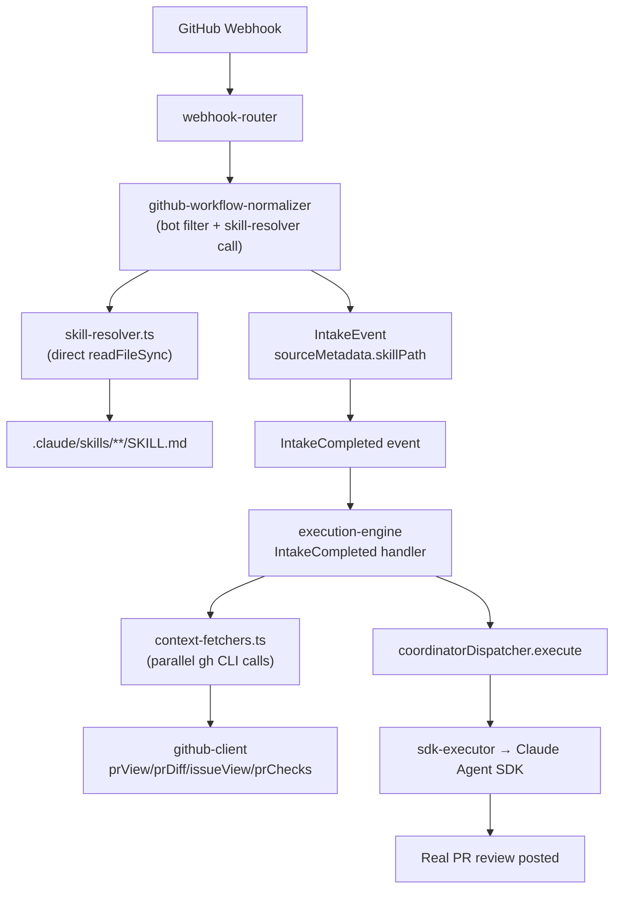
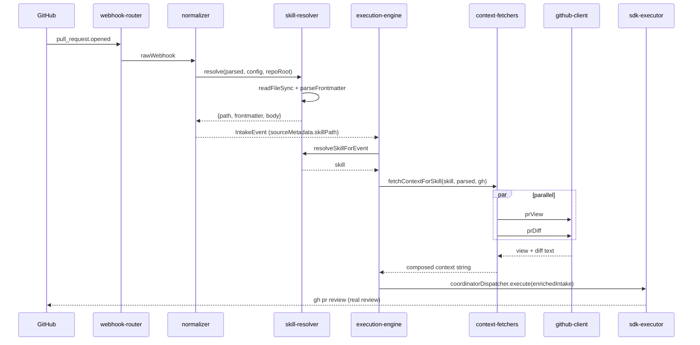

# SPARC Spec: P20 — Skill-Based Event Routing

**Phase:** P20 (High)
**Priority:** High
**Estimated Effort:** 1 day
**Dependencies:** PR #17 (mechanical refactor — must merge first), P6, P9, P11, P13
**Source Blueprint:** None — orch-agents-specific. Architecture mirrors route-table patterns from Kubernetes ingress, Nginx vhost, and Traefik: routing table in config, behavior in content files, clean separation of concerns.

---

## S — Specification

### 1. Problem Statement

After Option C (PRs #10–#13), orch-agents is coordinator-only. Every GitHub webhook currently flows through a single generic code path:

- `src/execution/orchestrator/execution-engine.ts` — the `IntakeCompleted` handler builds a generic coordinator plan for every event regardless of type and never fetches the triggering PR/issue content.
- Production trace on PR #16 open: the coordinator responded with `"I'm ready to help! What task would you like me to work on?"` because no PR diff/title/description was ever fetched before dispatch.
- `src/intake/github-workflow-normalizer.ts` — ~351 LOC total, of which ~200 LOC is vestigial `deriveIntent` + `templateToSeverity` + `matchGitHubEventRule` logic computing labels nobody consumes.
- `src/types.ts` — `WorkIntent` union type is a compile-time approximation of what should be editable runtime content.

The routing decision, the behavioral instructions, and the context-fetching logic are tangled together in TypeScript. Operators cannot change routing or agent behavior without a code deploy.

### 2. Solution

- `WORKFLOW.md` `github.events` map becomes the single source of truth for routing: each webhook event key maps to a **relative file path** pointing at a skill file.
- Each skill file is a markdown file with YAML frontmatter (`contextFetchers`, optional `timeoutMs`) and a prose body containing specific instructions for that kind of work.
- The coordinator reads the resolved skill's body and runs the skill's declared `contextFetchers` before dispatch, composing the enriched prompt inline.
- A `default:` fallback under `github:` handles events that don't have an explicit mapping.
- Vestigial `deriveIntent` / `WorkIntent` enum / template-name strings all get deleted.

The design mirrors ingress route tables: routing in config (WORKFLOW.md), behavior in content (skill files), code stays dumb.

### 3. Functional Requirements

```yaml
functional_requirements:
  - id: "FR-P20-001"
    description: "WORKFLOW.md github.events values become relative file paths to skill files"
    priority: "critical"
    acceptance_criteria:
      - "Example: pull_request.opened: .claude/skills/github-ops/SKILL.md"
      - "workflow-parser already reads github.events as Record<string, string> — no parser shape change"
      - "An optional top-level default: string field under github: is added and parsed"
      - "Existing workflow-parser tests still pass after the optional field is wired"

  - id: "FR-P20-002"
    description: "New src/intake/skill-resolver.ts (~50 LOC) directly resolves a skill for a webhook event"
    priority: "critical"
    acceptance_criteria:
      - "Exports resolveSkillForEvent(parsed, config, repoRoot): ResolvedSkill | null"
      - "Lookup order: config.github.events[ruleKey] ?? config.github.default"
      - "Resolves relative to repoRoot, readFileSync the file, parses frontmatter + body"
      - "Returns {path, frontmatter, body} or null if path missing or file does not exist"
      - "NO registry. NO scanning. NO indexing. NO caching."

  - id: "FR-P20-003"
    description: "parseRuleKey ports from github-workflow-normalizer.ts to skill-resolver.ts with its tests"
    priority: "high"
    acceptance_criteria:
      - "parseRuleKey builds keys like pull_request.opened, issues.labeled.bug, push.default_branch"
      - "KNOWN_ACTION_EVENTS constant ports with it"
      - "Existing normalizer tests covering parseRuleKey move to skill-resolver.test.ts"
      - "No duplicate parseRuleKey export remains in github-workflow-normalizer.ts"

  - id: "FR-P20-004"
    description: "src/shared/frontmatter-parser.ts extends with two skill-specific optional fields"
    priority: "high"
    acceptance_criteria:
      - "New optional field: contextFetchers: string[] (fetcher names)"
      - "New optional field: timeoutMs: number (coordinator timeout override)"
      - "Does NOT add triggers, severity, or name as load-bearing fields — the file path is the identifier"
      - "Backward compatible with existing frontmatter consumers"

  - id: "FR-P20-005"
    description: "New src/intake/context-fetchers.ts (~160 LOC) composes per-skill context fetching"
    priority: "critical"
    acceptance_criteria:
      - "Exports CONTEXT_FETCHERS: Record<string, ContextFetcher>"
      - "Exports fetchContextForSkill(skill, parsed, ghClient, logger) => Promise<string>"
      - "Each fetcher: (parsed: ParsedGitHubEvent, gh: GitHubClient) => Promise<string>"
      - "Fetchers run in parallel via Promise.all, results joined with a separator"
      - "Individual fetcher failures log a warning and return empty string — never throw"
      - "Unknown fetcher name logs a warning and is skipped"

  - id: "FR-P20-006"
    description: "src/integration/github-client.ts gains four new read methods"
    priority: "high"
    acceptance_criteria:
      - "prView(repo, prNumber): Promise<string> wraps `gh pr view`"
      - "prDiff(repo, prNumber): Promise<string> wraps `gh pr diff`"
      - "issueView(repo, issueNumber): Promise<string> wraps `gh issue view`"
      - "prChecks(repo, prNumber): Promise<string> wraps `gh pr checks`"
      - "All four reuse existing validateRepo + validatePRNumber input validation"
      - "All four call the existing private run() helper"
      - "~40 LOC code + ~60 LOC tests"

  - id: "FR-P20-007"
    description: "src/intake/github-workflow-normalizer.ts shrinks from ~351 to ~120 LOC"
    priority: "high"
    acceptance_criteria:
      - "Deleted: deriveIntent() (~40 LOC)"
      - "Deleted: templateToSeverity() (~14 LOC)"
      - "Deleted: matchGitHubEventRule() + matchesCondition() (~80 LOC)"
      - "Moved: parseRuleKey → skill-resolver.ts"
      - "Kept: bot loop prevention, agent-commit filter"
      - "Emits IntakeEvent with sourceMetadata.skillPath set from skill-resolver"
      - "Factory signature gains a skillResolver dependency"

  - id: "FR-P20-008"
    description: "src/types.ts drops WorkIntent; intent becomes a free-form string"
    priority: "high"
    acceptance_criteria:
      - "WorkIntent union type removed from src/types.ts"
      - "IntakeEvent.intent: WorkIntent → intent: string (kept for observability/logs)"
      - "IntakeEvent.sourceMetadata.skillPath?: string added"
      - "src/integration/linear/linear-normalizer.ts drops WorkIntent import; string literals remain"
      - "grep of src/ shows zero WorkIntent references after the change"

  - id: "FR-P20-009"
    description: "execution-engine.ts IntakeCompleted handler composes skill body + fetched context"
    priority: "critical"
    acceptance_criteria:
      - "Reads intakeEvent.sourceMetadata.skillPath"
      - "Missing skillPath → log warning + skip dispatch (no crash)"
      - "Calls resolveSkillForEvent (or reads pre-resolved skill from metadata)"
      - "Runs fetchContextForSkill in parallel before dispatch"
      - "Composes rawText as `${skill.body}\\n\\n## Trigger Context\\n\\n${fetchedContext}`"
      - "Passes enriched intake to coordinatorDispatcher.execute(plan, enrichedIntake)"
      - "Same pattern applied in runIssueWorkerLifecycle if IntakeCompleted path is used there"

  - id: "FR-P20-010"
    description: "Two new skill files land with this PR + WORKFLOW.md updated"
    priority: "high"
    acceptance_criteria:
      - ".claude/skills/github-ops/SKILL.md created (~80 LOC prose, contextFetchers: [gh-pr-view, gh-pr-diff])"
      - ".claude/skills/general-intake/SKILL.md created (~40 LOC fallback prose)"
      - "WORKFLOW.md github.events values updated from template names to relative paths"
      - "WORKFLOW.md github.default: .claude/skills/general-intake/SKILL.md added"
      - "No additional skill files created in this PR"
```

### 4. Non-Functional Requirements

```yaml
non_functional_requirements:
  - id: "NFR-P20-001"
    category: "backward-compatibility"
    description: "github.events shape (Record<string,string>) preserved; only value semantics change"
    measurement: "workflow-parser tests pass without schema changes beyond adding the optional default field"

  - id: "NFR-P20-002"
    category: "isolation"
    description: "Zero behavior change for coordinator-internal mechanics"
    measurement: "No edits to P6 task lifecycle, P7 permissions, P10 compaction, P11 retry/abort, P13 LocalShellTask"

  - id: "NFR-P20-003"
    category: "isolation"
    description: "Linear AgentSessionEvent path is UNCHANGED in this PR"
    measurement: "Skill resolver is wired only for the GitHub IntakeCompleted path; AgentPrompted handler untouched"

  - id: "NFR-P20-004"
    category: "reliability"
    description: "Graceful degradation for missing skill files"
    measurement: "Missing explicit path → fall back to default; missing default → log warning + skip dispatch, no crash"

  - id: "NFR-P20-005"
    category: "observability"
    description: "Every skill resolution logs routing decision metadata"
    measurement: "Log payload includes {skillPath, ruleKey, contextFetchers, bytesInBody, bytesInContext}"
```

### 5. Constraints

```yaml
constraints:
  explicit_user_rejections:
    - "NO skill registry with name indexing"
    - "NO triggers / severity / name as load-bearing frontmatter fields"
    - "NO caching of skill file reads (add later if perf demands)"
    - "NO re-implementing parseRuleKey — port the existing one"

  scope:
    - "Do NOT touch workflow-parser.ts beyond adding the optional default field under github:"
    - "Do NOT touch any P6–P13 internal module"
    - "Do NOT migrate the Linear AgentSessionEvent path to skills (out of scope)"
    - "Do NOT create more than 2 skill files in this PR (github-ops + general-intake)"
    - "Do NOT delete the github.events block from WORKFLOW.md — update in place"
    - "Total PR scope cap: ~800 LOC including tests + skill files"

  technical:
    - "Skill file reads happen on every dispatch (no cache)"
    - "Context fetchers run in parallel; per-fetcher failures are isolated"
    - "File path is the identifier — no name-based lookup"
```

### 6. Use Cases

```yaml
use_cases:
  - id: "UC-P20-001"
    title: "PR opened triggers real PR review with diff context"
    flow:
      - "pull_request.opened webhook → normalizer → skill-resolver reads .claude/skills/github-ops/SKILL.md"
      - "IntakeEvent.sourceMetadata.skillPath set; IntakeCompleted handler runs gh-pr-view + gh-pr-diff in parallel"
      - "rawText = skill.body + '\\n\\n## Trigger Context\\n\\n' + fetchedContext"
      - "coordinatorDispatcher dispatches enriched intake; real PR review posted via `gh pr review`"

  - id: "UC-P20-002"
    title: "Unmapped event falls back to default skill"
    flow:
      - "issues.labeled.security has no explicit mapping → resolver returns github.default"
      - "general-intake/SKILL.md dispatched with generic triage instructions"
      - "Follow-up PR adds security-audit/SKILL.md + WORKFLOW.md entry — zero code changes"

  - id: "UC-P20-003"
    title: "Operator edits skill prose without restart"
    flow:
      - "Edit .claude/skills/github-ops/SKILL.md; next webhook reads fresh (no cache) — new rule active immediately"
```

### 7. Acceptance Criteria (Gherkin)

```gherkin
Feature: Skill-Based Event Routing

  Scenario: PR opened resolves to github-ops skill and fetches diff
    Given WORKFLOW.md maps pull_request.opened to .claude/skills/github-ops/SKILL.md
    And the skill declares contextFetchers [gh-pr-view, gh-pr-diff]
    When a pull_request.opened webhook arrives
    Then skill-resolver returns the parsed skill
    And the IntakeEvent sourceMetadata.skillPath is set to that path
    And the IntakeCompleted handler composes skill body + PR view + PR diff into rawText
    And coordinator dispatch receives the enriched intake

  Scenario: Unmapped event falls back to default
    Given WORKFLOW.md has no explicit entry for issues.labeled.security
    And github.default is .claude/skills/general-intake/SKILL.md
    When an issues.labeled.security webhook arrives
    Then the resolver returns the default skill

  Scenario: Missing skill file returns null
    Given WORKFLOW.md maps pull_request.opened to a nonexistent path
    And no default is configured
    When a pull_request.opened webhook arrives
    Then the resolver returns null
    And execution-engine logs a warning and skips dispatch

  Scenario: Context fetcher failure is isolated
    Given a skill declares contextFetchers [gh-pr-view, gh-pr-diff]
    When gh-pr-diff fails
    Then the composed context contains gh-pr-view output
    And the composed context contains an empty section for gh-pr-diff
    And dispatch still proceeds

  Scenario: WorkIntent type is deleted
    When the codebase is grepped for WorkIntent
    Then zero references exist in src/
```

---

## P — Pseudocode

### skill-resolver.ts

```
resolveSkillForEvent(parsed, config, repoRoot):
  ruleKey = parseRuleKey(parsed)                        // pull_request.opened, etc.
  relPath = config.github.events[ruleKey] ?? config.github.default
  IF !relPath: RETURN null
  absPath = path.resolve(repoRoot, relPath)
  IF !existsSync(absPath): RETURN null
  raw = readFileSync(absPath, 'utf8')
  { frontmatter, body } = parseFrontmatter(raw)
  RETURN { path: absPath, frontmatter, body }
```

### context-fetchers.ts

```
CONTEXT_FETCHERS = {
  'gh-pr-view':    (p, gh) => gh.prView(p.repo, p.prNumber),
  'gh-pr-diff':    (p, gh) => gh.prDiff(p.repo, p.prNumber),
  'gh-issue-view': (p, gh) => gh.issueView(p.repo, p.issueNumber),
  'gh-pr-checks':  (p, gh) => gh.prChecks(p.repo, p.prNumber),
}

fetchContextForSkill(skill, parsed, gh, logger):
  names = skill.frontmatter.contextFetchers ?? []
  results = await Promise.all(names.map(name =>
    (CONTEXT_FETCHERS[name] ?? warnAndEmpty)(parsed, gh)
      .catch(err => { logger.warn({name, err}); return '' })
  ))
  RETURN results.filter(Boolean).join('\n\n---\n\n')
```

### IntakeCompleted handler rewrite

```
onIntakeCompleted(intakeEvent):
  skillPath = intakeEvent.sourceMetadata?.skillPath
  IF !skillPath:
    logger.warn({intakeEvent}, 'no skillPath, skipping dispatch')
    RETURN
  skill = resolveSkillForEvent(parsed, config, repoRoot)
  IF !skill: logger.warn(...); RETURN
  fetchedContext = await fetchContextForSkill(skill, parsed, ghClient, logger)
  enriched = { ...intakeEvent, rawText:
    `${skill.body}\n\n## Trigger Context\n\n${fetchedContext}` }
  logger.info({skillPath, ruleKey, contextFetchers, bytesInBody, bytesInContext})
  await coordinatorDispatcher.execute(plan, enriched)
```

### github-workflow-normalizer.ts (shrunk)

```
createGitHubNormalizer({ skillResolver, logger, config, repoRoot }):
  normalize(webhook):
    IF isBotLoop(webhook): RETURN null
    IF isAgentCommit(webhook): RETURN null
    parsed = parseGitHubWebhook(webhook)
    skill = skillResolver.resolve(parsed, config, repoRoot)   // may be null
    RETURN {
      ...baseIntake(parsed),
      intent: parsed.action ?? 'unknown',                     // free-form string
      sourceMetadata: { ...parsed.meta, skillPath: skill?.path }
    }
```

---

## A — Architecture

### Routing Flow



### File Structure

```
src/intake/
  skill-resolver.ts              (NEW, ~50 LOC) — direct file read, no cache
  context-fetchers.ts            (NEW, ~160 LOC) — gh-pr-view/diff/issue-view/checks
  github-workflow-normalizer.ts  (SHRINK from ~351 → ~120 LOC)

src/shared/
  frontmatter-parser.ts          (EXTEND, +20 LOC — contextFetchers + timeoutMs)

src/integration/
  github-client.ts               (EXTEND, +40 LOC — 4 new read methods)

src/types.ts                     (MODIFY — delete WorkIntent, intent: string, add skillPath)

src/execution/orchestrator/
  execution-engine.ts            (MODIFY — rewrite IntakeCompleted handler)

src/integration/linear/
  linear-normalizer.ts           (MODIFY — drop WorkIntent import)

.claude/skills/
  github-ops/SKILL.md            (NEW, ~80 LOC — real PR review instructions)
  general-intake/SKILL.md        (NEW, ~40 LOC — fallback)

WORKFLOW.md                      (MODIFY — values → paths, add default:)
```

### Integration Sequence



---

## R — Refinement

### Test Plan

| FR | Test file | Key assertions |
|----|-----------|----------------|
| FR-P20-002 | `tests/intake/skill-resolver.test.ts` | map lookup hit; map miss → default; default miss → null; nonexistent file → null; valid skill returns `{path, frontmatter, body}`; path resolution respects `repoRoot` |
| FR-P20-003 | `tests/intake/skill-resolver.test.ts` (ported) | `parseRuleKey` — `pull_request.opened`, `issues.labeled.bug`, `push.default_branch`; `KNOWN_ACTION_EVENTS` handling |
| FR-P20-004 | `tests/shared/frontmatter-parser.test.ts` | `contextFetchers` parsed as string array; `timeoutMs` parsed as number; absence of both still valid |
| FR-P20-005 | `tests/intake/context-fetchers.test.ts` | each fetcher happy path; each fetcher error path logs warning + returns ''; parallel execution; unknown fetcher name warns + skips; empty `contextFetchers` returns empty string |
| FR-P20-006 | `tests/integration/github-client.test.ts` | each new method mocked; validates repo + number; wraps `run()` correctly; error propagation |
| FR-P20-007 | `tests/intake/github-workflow-normalizer.test.ts` (rewritten) | bot loop prevention still works; agent-commit filter still works; `skillResolver.resolve` is called; IntakeEvent carries `sourceMetadata.skillPath`; no reference to deleted `deriveIntent`/`templateToSeverity` |
| FR-P20-008 | grep + `tests/types.test.ts` (if exists) | zero `WorkIntent` references in `src/`; `intent: string` at use sites |
| FR-P20-009 | `tests/execution/execution-engine.test.ts` | IntakeCompleted reads `sourceMetadata.skillPath`; calls resolver; runs fetchers; composes enriched rawText; dispatches enriched intake; missing skillPath → warn + skip |
| FR-P20-010 | manual smoke | `gh pr view 17 --repo espinozasenior/orch-agents` triggers `pull_request.synchronize` → real PR review comment posted (not "what task?") |

All tests use `node:test` + `node:assert/strict` with mock-first pattern per project conventions.

### Anti-Patterns to Enforce

```yaml
anti_patterns:
  - name: "Skill Registry With Name Indexing"
    bad: "Build a SkillRegistry that scans .claude/skills/ and indexes by frontmatter.name"
    good: "Direct readFileSync per dispatch using the path from WORKFLOW.md"
    enforcement: "User explicitly rejected the registry approach"

  - name: "Triggers Array In Frontmatter"
    bad: "triggers: [pull_request.opened] declared in each SKILL.md"
    good: "Routing is centralized in WORKFLOW.md github.events"
    enforcement: "Path in WORKFLOW.md is the only routing source"

  - name: "Caching Skill File Reads"
    bad: "LRU cache or module-level memo around skill reads"
    good: "Read fresh on every dispatch — add cache only when perf demands"
    enforcement: "User explicitly rejected speculative caching"

  - name: "Hardcoded Skill Paths In TypeScript"
    bad: "const GITHUB_OPS_PATH = '.claude/skills/github-ops/SKILL.md'"
    good: "Paths live in WORKFLOW.md only"
    enforcement: "TypeScript imports never reference skill file paths"

  - name: "Re-implementing parseRuleKey"
    bad: "New parseRuleKey written from scratch in skill-resolver.ts"
    good: "Port the existing implementation + tests from normalizer"
    enforcement: "git blame shows move, not rewrite"

  - name: "Logging WorkIntent References After Deletion"
    bad: "logger.info({intent: WorkIntent.ReviewPR})"
    good: "logger.info({intent: 'review-pr'}) — free-form string"
    enforcement: "grep WorkIntent returns zero hits in src/"
```

### Migration Strategy

```yaml
migration:
  phase_1: "frontmatter-parser: add contextFetchers + timeoutMs (tsc + tests)"
  phase_2: "github-client: add prView/prDiff/issueView/prChecks (tsc + tests)"
  phase_3: "skill-resolver.ts: create + port parseRuleKey from normalizer (tsc + tests)"
  phase_4: "context-fetchers.ts: registry + parallel + isolation (tsc + tests)"
  phase_5: "Shrink github-workflow-normalizer (delete deriveIntent/templateToSeverity/matchGitHubEventRule); wire skillResolver dep; LOC ≤130"
  phase_6: "Delete WorkIntent from types.ts; intent: string; add sourceMetadata.skillPath; drop Linear import"
  phase_7: "Rewrite execution-engine IntakeCompleted handler (resolve + fetch + compose + dispatch)"
  phase_8: "Author .claude/skills/github-ops/SKILL.md + general-intake/SKILL.md"
  phase_9: "Update WORKFLOW.md values to paths; add github.default"
  phase_10: "Full suite + manual PR smoke test (baseline ~1596 ± 15)"
```

---

## C — Completion

### Definition of Done

```yaml
completion:
  code_deliverables:
    - "src/intake/skill-resolver.ts — direct file read, no cache, no registry"
    - "src/intake/context-fetchers.ts — parallel gh CLI calls with per-fetcher isolation"
    - "src/integration/github-client.ts — prView / prDiff / issueView / prChecks"
    - "src/intake/github-workflow-normalizer.ts — shrunk from ~351 to ~120 LOC"
    - "src/shared/frontmatter-parser.ts — contextFetchers + timeoutMs optional fields"
    - "src/types.ts — WorkIntent deleted, intent: string, sourceMetadata.skillPath added"
    - "src/execution/orchestrator/execution-engine.ts — IntakeCompleted rewrite composes skill + context"
    - "src/integration/linear/linear-normalizer.ts — drop WorkIntent import"
    - ".claude/skills/github-ops/SKILL.md — real PR review instructions"
    - ".claude/skills/general-intake/SKILL.md — fallback"
    - "WORKFLOW.md — values are paths, default: set"

  test_deliverables:
    - "tests/intake/skill-resolver.test.ts (new, parseRuleKey ported in)"
    - "tests/intake/context-fetchers.test.ts (new)"
    - "tests/integration/github-client.test.ts (extended)"
    - "tests/shared/frontmatter-parser.test.ts (extended)"
    - "tests/intake/github-workflow-normalizer.test.ts (rewritten)"
    - "tests/execution/execution-engine.test.ts (extended)"

  verification_checklist:
    - "npm run build succeeds"
    - "npm test passes (baseline ~1596 from PR #17, target ~1596 ± 15)"
    - "npx tsc --noEmit clean"
    - "npm run lint passes"
    - "grep -r WorkIntent src/ returns zero hits"
    - "github-workflow-normalizer.ts LOC count ≤ 130"
    - "Manual smoke: open a real PR against the branch and verify the coordinator posts a real review instead of 'what task?'"

  success_metrics:
    - "Operators can route new events by editing WORKFLOW.md only (no TypeScript change)"
    - "Operators can change coordinator behavior by editing .claude/skills/*.md (no deploy)"
    - "Total PR scope stays under ~800 LOC including tests + skill files"
```

---

## Honest Scope Notes

- **This is deliberate UI surface design.** Operators edit `WORKFLOW.md` to route, edit `.claude/skills/*.md` to change behavior, and never touch TypeScript for either concern. That separation is the entire point of this PR.
- **No registry.** The user explicitly rejected a skill registry with name indexing. Routing is path-based; the path in `WORKFLOW.md` is the identifier.
- **No cache.** The no-cache decision is intentional. Webhook rate is low enough that `readFileSync` is cheap. Cache is speculative optimization and can be added later if a profile shows it matters.
- **No `triggers` / `severity` / `name` frontmatter.** The user rejected these as load-bearing fields. Routing is centralized in `WORKFLOW.md`; skill files carry only `contextFetchers` and optional `timeoutMs`.
- **Two skill files is the MVP.** `github-ops/SKILL.md` (real) and `general-intake/SKILL.md` (fallback). Additional skills — `security-audit`, `bug-fix`, `dependency-update`, etc. — are explicit follow-up work, each a small standalone PR.
- **Linear path is NOT migrated.** The Linear `AgentSessionEvent` path already has richer context (issue body + session `promptContext` XML). Migrating it to skills would be speculative. Out of scope.
- **Depends on PR #17.** The mechanical refactor (coordinator-dispatcher rename + agent-registry deletion + frontmatter-parser move to `src/shared/`) must merge first. This spec assumes that baseline.
- **Open unknown:** whether the `IntakeCompleted` handler inside `runIssueWorkerLifecycle` needs the same rewrite, or whether it bypasses that code path in practice. Will verify during Phase 7 implementation — if it does, the rewrite is duplicated; if not, this note is removed.
- **Open unknown:** exact `ParsedGitHubEvent` shape used by fetchers — need to confirm `repo`, `prNumber`, `issueNumber` are all already populated by the parser, or whether Phase 4 needs to extend it. Trivial if so, but flagged.
