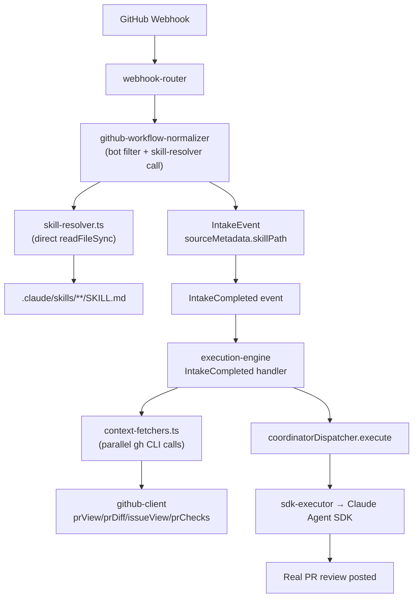
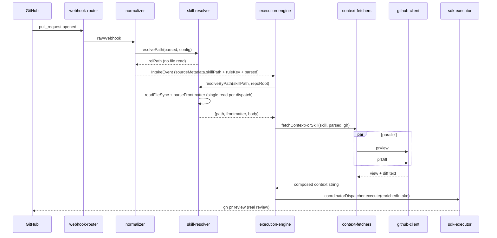

# SPARC Spec: P20 — Skill-Based Event Routing

**Phase:** P20 (High)
**Priority:** High
**Estimated Effort:** 1 day
**Dependencies:** PR #17 (mechanical refactor — must merge first), P6, P9, P11, P13
**Source Blueprint:** None — orch-agents-specific. Architecture mirrors route-table patterns from Kubernetes ingress, Nginx vhost, and Traefik: routing table in config, behavior in content files, clean separation of concerns.

---

## S — Specification

### 1. Problem Statement

After Option C (PRs #10–#13), orch-agents is coordinator-only. Every GitHub webhook currently flows through a single generic code path:

- `src/execution/orchestrator/execution-engine.ts` — the `IntakeCompleted` handler builds a generic coordinator plan for every event regardless of type and never fetches the triggering PR/issue content.
- Production trace on PR #16 open: the coordinator responded with `"I'm ready to help! What task would you like me to work on?"` because no PR diff/title/description was ever fetched before dispatch.
- `src/intake/github-workflow-normalizer.ts` — ~351 LOC total, of which ~200 LOC is vestigial `deriveIntent` + `templateToSeverity` + `matchGitHubEventRule` logic computing labels nobody consumes.
- `src/types.ts` — `WorkIntent` union type is a compile-time approximation of what should be editable runtime content.

The routing decision, the behavioral instructions, and the context-fetching logic are tangled together in TypeScript. Operators cannot change routing or agent behavior without a code deploy.

### 2. Solution

- `WORKFLOW.md` `github.events` map becomes the single source of truth for routing: each webhook event key maps to a **relative file path** pointing at a skill file.
- Each skill file is a markdown file with YAML frontmatter (`context-fetchers`, plus CC-native optional fields `description`, `when-to-use`, `allowed-tools`) and a prose body containing specific instructions for that kind of work.
- The coordinator reads the resolved skill's body and runs the skill's declared `context-fetchers` before dispatch, composing the enriched prompt inline.
- Explicit-only routing: events without an entry in `github.events` are silently skipped at the normalizer (no IntakeEvent, no worktree, no coordinator cycle). No default / catch-all by design — operators opt every event in by declaring it.
- Vestigial `deriveIntent` / `WorkIntent` enum / template-name strings all get deleted.

The design mirrors ingress route tables: routing in config (WORKFLOW.md), behavior in content (skill files), code stays dumb.

### 3. Functional Requirements

```yaml
functional_requirements:
  - id: "FR-P20-001"
    description: "WORKFLOW.md github.events values become relative file paths to skill files"
    priority: "critical"
    acceptance_criteria:
      - "Example: pull_request.opened: .claude/skills/github-ops/SKILL.md"
      - "workflow-parser already reads github.events as Record<string, string> — no parser shape change"
      - "Paths resolve relative to repo root, NOT to a fixed .claude/skills/ directory (differs from CC-native skill scanning, which is hardcoded to that location)"
      - "No github.default / catch-all field. Explicit-only routing by design — unmapped events are silently skipped at the normalizer, no IntakeEvent emitted"

  - id: "FR-P20-002"
    description: "New src/intake/skill-resolver.ts (~50 LOC) directly resolves a skill for a webhook event"
    priority: "critical"
    acceptance_criteria:
      - "Exports resolveSkillForEvent(parsed, config, repoRoot): ResolvedSkill | null — convenience composition of the two primitives below"
      - "Exports resolvePath(parsed, config): {relPath, ruleKey} | null — pure lookup. Returns the first matching entry from config.github.events in candidate priority order, or null if nothing matches. No default / fallback."
      - "Exports resolveByPath(relPath, repoRoot): ResolvedSkill | null — single readFileSync + parseFrontmatter, used by execution-engine"
      - "Returns {path, frontmatter, body} or null if path missing or file does not exist"
      - "NO registry. NO scanning. NO indexing. NO caching. NO default fallback."
      - "Normalizer calls resolvePath only (no I/O); execution-engine calls resolveByPath once per dispatch"

  - id: "FR-P20-003"
    description: "parseRuleKey ports from github-workflow-normalizer.ts to skill-resolver.ts with its tests"
    priority: "high"
    acceptance_criteria:
      - "parseRuleKey builds keys like pull_request.opened, issues.labeled.bug, push.default_branch"
      - "buildRuleKeyCandidates(parsed): string[] emits candidate keys in priority order — event.action.condition → event.action → event.condition → event. Conditions are derived implicitly from parsed state: `merged`, `changes_requested`, `failure`, `default_branch` / `other`, and every label. This preserves label-based routing (`issues.labeled.bug`) after the deletion of matchGitHubEventRule."
      - "resolvePath iterates candidates against config.github.events and returns the first hit, or null when nothing matches (explicit-only routing)"
      - "KNOWN_ACTION_EVENTS constant ports with it"
      - "Existing normalizer tests covering parseRuleKey move to skill-resolver.test.ts"
      - "No duplicate parseRuleKey export remains in github-workflow-normalizer.ts"

  - id: "FR-P20-004"
    description: "src/shared/frontmatter-parser.ts extends with skill-specific optional fields, all kebab-case per CC-native convention"
    priority: "high"
    acceptance_criteria:
      - "New optional field: context-fetchers: string[] (fetcher names) — P20 extension, not present in CC-native"
      - "New optional CC-native field: description: string (falls back to first H1 if absent)"
      - "New optional CC-native field: when-to-use: string (guidance for future model-driven selection)"
      - "New optional CC-native field: allowed-tools: string[] (per-skill tool restriction; aligns with P7 permissions)"
      - "Does NOT add triggers, severity, name, timeoutMs, arguments, model, or agent — out of scope for webhook-routed skills"
      - "Naming convention: frontmatter keys are kebab-case (CC-native); JS/TS identifiers exposed by the parser remain camelCase (e.g. frontmatter['context-fetchers'] → parsed.contextFetchers)"
      - "Backward compatible with existing frontmatter consumers"

  - id: "FR-P20-005"
    description: "New src/intake/context-fetchers.ts (~80 LOC code) composes per-skill context fetching"
    priority: "critical"
    acceptance_criteria:
      - "Exports CONTEXT_FETCHERS: Record<string, ContextFetcher>"
      - "Exports fetchContextForSkill(skill, parsed, ghClient, logger) => Promise<string>"
      - "Each fetcher: (parsed: ParsedGitHubEvent, gh: GitHubClient) => Promise<string>"
      - "Fetchers run in parallel via Promise.all, results joined with a separator"
      - "Individual fetcher failures log a warning and return empty string — never throw"
      - "Unknown fetcher name logs a warning and is skipped"

  - id: "FR-P20-006"
    description: "src/integration/github-client.ts gains four new read methods"
    priority: "high"
    acceptance_criteria:
      - "prView(repoFullName, prNumber): Promise<string> wraps `gh pr view`"
      - "prDiff(repoFullName, prNumber): Promise<string> wraps `gh pr diff`"
      - "issueView(repoFullName, issueNumber): Promise<string> wraps `gh issue view`"
      - "prChecks(repoFullName, prNumber): Promise<string> wraps `gh pr checks`"
      - "All four reuse existing validateRepo + validatePRNumber input validation"
      - "All four call the existing private run() helper"
      - "~40 LOC code + ~60 LOC tests"

  - id: "FR-P20-007"
    description: "src/intake/github-workflow-normalizer.ts shrinks from ~351 to ~120 LOC"
    priority: "high"
    acceptance_criteria:
      - "Deleted: deriveIntent() (~40 LOC)"
      - "Deleted: templateToSeverity() (~14 LOC)"
      - "Deleted: matchGitHubEventRule() + matchesCondition() (~80 LOC)"
      - "Moved: parseRuleKey → skill-resolver.ts"
      - "Kept: bot loop prevention, agent-commit filter"
      - "Emits IntakeEvent with sourceMetadata.{skillPath, ruleKey, parsed} stamped"
      - "Calls skillResolver.resolvePath only — never reads the skill file body (that's the execution-engine's job)"
      - "Factory signature gains a skillResolver dependency"

  - id: "FR-P20-008"
    description: "src/types.ts drops WorkIntent and IntakeEvent.intent; routing context moves to sourceMetadata"
    priority: "high"
    acceptance_criteria:
      - "WorkIntent union type removed from src/types.ts"
      - "IntakeEvent.intent field DELETED entirely — ruleKey + sourceMetadata already cover observability needs"
      - "IntakeEvent.sourceMetadata.skillPath?: string added"
      - "IntakeEvent.sourceMetadata.ruleKey?: string added (the resolved routing key, e.g. pull_request.opened)"
      - "src/integration/linear/linear-normalizer.ts drops WorkIntent import; string literals remain"
      - "grep of src/ shows zero WorkIntent references after the change"

  - id: "FR-P20-009"
    description: "execution-engine.ts IntakeCompleted handler composes skill body + fetched context"
    priority: "critical"
    acceptance_criteria:
      - "Reads intakeEvent.sourceMetadata.skillPath"
      - "Missing skillPath → log warning + skip dispatch (no crash)"
      - "Reads the skill file ONCE in this handler (single readFileSync per dispatch); the normalizer only stamps the path, never the body, to keep IntakeEvent payload small"
      - "Runs fetchContextForSkill in parallel before dispatch"
      - "Composes rawText as `${skill.body}\\n\\n## Trigger Context\\n\\n${fetchedContext}`"
      - "Passes enriched intake to coordinatorDispatcher.execute(plan, enrichedIntake)"
      - "Same pattern applied in runIssueWorkerLifecycle if IntakeCompleted path is used there"

  - id: "FR-P20-010"
    description: "One new skill file lands with this PR + WORKFLOW.md updated"
    priority: "high"
    acceptance_criteria:
      - ".claude/skills/github-ops/SKILL.md created (context-fetchers: [gh-pr-view, gh-pr-diff])"
      - "WORKFLOW.md github.events values updated from template names to relative paths for pull_request.opened / synchronize / ready_for_review"
      - "Unmapped events (push, issue_comment, workflow_run, etc) are silently skipped — no IntakeEvent emitted, no worktree, no coordinator cycle"
      - "No additional skill files created in this PR"
```

### 4. Non-Functional Requirements

```yaml
non_functional_requirements:
  - id: "NFR-P20-001"
    category: "backward-compatibility"
    description: "github.events shape (Record<string,string>) preserved; only value semantics change"
    measurement: "workflow-parser tests pass with no schema changes"

  - id: "NFR-P20-002"
    category: "isolation"
    description: "Zero behavior change for coordinator-internal mechanics"
    measurement: "No edits to P6 task lifecycle, P7 permissions, P10 compaction, P11 retry/abort, P13 LocalShellTask"

  - id: "NFR-P20-003"
    category: "isolation"
    description: "Linear AgentSessionEvent path is UNCHANGED in this PR"
    measurement: "Skill resolver is wired only for the GitHub IntakeCompleted path; AgentPrompted handler untouched"

  - id: "NFR-P20-004"
    category: "reliability"
    description: "Graceful degradation for missing skill files"
    measurement: "Unmapped events → null from resolver → normalizer returns null → no IntakeEvent emitted. Missing skill file (mapped but on disk absent) → execution-engine logs warning + skips dispatch, no crash"

  - id: "NFR-P20-005"
    category: "observability"
    description: "Every skill resolution logs routing decision metadata"
    measurement: "Log payload includes {skillPath, ruleKey, contextFetchers, bytesInBody, bytesInContext, durationMs}"
```

### 5. Constraints

```yaml
constraints:
  explicit_user_rejections:
    - "NO skill registry with name indexing"
    - "NO triggers / severity / name as load-bearing frontmatter fields"
    - "NO caching of skill file reads (add later if perf demands)"
    - "NO re-implementing parseRuleKey — port the existing one"

  scope:
    - "Do NOT touch workflow-parser.ts beyond the github.events parsing (no schema changes)"
    - "Do NOT touch any P6–P13 internal module"
    - "Do NOT migrate the Linear AgentSessionEvent path to skills (out of scope)"
    - "Do NOT create more than 1 skill file in this PR (github-ops only — additional skills ship as follow-up PRs)"
    - "Do NOT delete the github.events block from WORKFLOW.md — update in place"
    - "Total PR scope cap: ~800 LOC including tests + skill files"

  technical:
    - "Skill file reads happen on every dispatch (no cache)"
    - "Context fetchers run in parallel; per-fetcher failures are isolated"
    - "File path is the identifier — no name-based lookup"
```

### 6. Use Cases

```yaml
use_cases:
  - id: "UC-P20-001"
    title: "PR opened triggers real PR review with diff context"
    flow:
      - "pull_request.opened webhook → normalizer → skill-resolver reads .claude/skills/github-ops/SKILL.md"
      - "IntakeEvent.sourceMetadata.skillPath set; IntakeCompleted handler runs gh-pr-view + gh-pr-diff in parallel"
      - "rawText = skill.body + '\\n\\n## Trigger Context\\n\\n' + fetchedContext"
      - "coordinatorDispatcher dispatches enriched intake; real PR review posted via `gh pr review`"

  - id: "UC-P20-002"
    title: "Unmapped event is silently skipped — no coordinator noise"
    flow:
      - "push on a non-default branch arrives with no explicit rule in github.events"
      - "resolvePath returns null → normalizer returns null → no IntakeEvent emitted"
      - "No worktree created, no coordinator cycle, no PR comments. Event is observable only in the webhook-router debug log."
      - "Follow-up PR adds push.default_branch: .claude/skills/cicd-watch/SKILL.md + the skill file — zero code changes"

  - id: "UC-P20-003"
    title: "Operator edits skill prose without restart"
    flow:
      - "Edit .claude/skills/github-ops/SKILL.md; next webhook reads fresh (no cache) — new rule active immediately"
```

### 7. Acceptance Criteria (Gherkin)

```gherkin
Feature: Skill-Based Event Routing

  Scenario: PR opened resolves to github-ops skill and fetches diff
    Given WORKFLOW.md maps pull_request.opened to .claude/skills/github-ops/SKILL.md
    And the skill declares context-fetchers [gh-pr-view, gh-pr-diff]
    When a pull_request.opened webhook arrives
    Then skill-resolver returns the parsed skill
    And the IntakeEvent sourceMetadata.skillPath is set to that path
    And the IntakeCompleted handler composes skill body + PR view + PR diff into rawText
    And coordinator dispatch receives the enriched intake

  Scenario: Unmapped event is silently skipped
    Given WORKFLOW.md has no entry matching issues.labeled.security
    When an issues.labeled.security webhook arrives
    Then resolvePath returns null
    And the normalizer returns null
    And no IntakeEvent is published

  Scenario: Mapped path points at missing file
    Given WORKFLOW.md maps pull_request.opened to a nonexistent path
    When a pull_request.opened webhook arrives
    Then resolvePath returns the relPath
    And resolveByPath returns null
    And execution-engine logs a warning and skips dispatch

  Scenario: Context fetcher failure is isolated
    Given a skill declares context-fetchers [gh-pr-view, gh-pr-diff]
    When gh-pr-diff fails
    Then the composed context contains gh-pr-view output
    And the composed context contains an empty section for gh-pr-diff
    And dispatch still proceeds

```

---

## P — Pseudocode

### skill-resolver.ts

```
resolveSkillForEvent(parsed, config, repoRoot):
  ruleKey = parseRuleKey(parsed)                        // pull_request.opened, etc.
  // explicit-only: no default fallback
  for candidate in buildRuleKeyCandidates(parsed):
    relPath = config.github.events[candidate]
    IF relPath: RETURN { relPath, ruleKey: candidate }
  RETURN null
  IF !relPath: RETURN null
  absPath = path.resolve(repoRoot, relPath)
  IF !existsSync(absPath): RETURN null
  raw = readFileSync(absPath, 'utf8')
  { frontmatter, body } = parseFrontmatter(raw)
  RETURN { path: absPath, frontmatter, body }
```

### context-fetchers.ts

```
CONTEXT_FETCHERS = {
  'gh-pr-view':    (p, gh) => gh.prView(p.repoFullName, p.prNumber),
  'gh-pr-diff':    (p, gh) => gh.prDiff(p.repoFullName, p.prNumber),
  'gh-issue-view': (p, gh) => gh.issueView(p.repoFullName, p.issueNumber),
  'gh-pr-checks':  (p, gh) => gh.prChecks(p.repoFullName, p.prNumber),
}

fetchContextForSkill(skill, parsed, gh, logger):
  names = skill.frontmatter.contextFetchers ?? []   // parser maps 'context-fetchers' → contextFetchers
  results = await Promise.all(names.map(name =>
    (CONTEXT_FETCHERS[name] ?? warnAndEmpty)(parsed, gh)
      .catch(err => { logger.warn({name, err}); return '' })
  ))
  RETURN results.filter(Boolean).join('\n\n---\n\n')
```

### IntakeCompleted handler rewrite

```
// dependencies injected at handler construction: skillResolver, contextFetcher, ghClient, config, repoRoot, logger
onIntakeCompleted(intakeEvent):
  start    = Date.now()
  skillPath = intakeEvent.sourceMetadata?.skillPath
  ruleKey   = intakeEvent.sourceMetadata?.ruleKey
  parsed    = intakeEvent.sourceMetadata?.parsed         // ParsedGitHubEvent stamped by normalizer
  IF !skillPath:
    logger.warn({intakeEvent}, 'no skillPath, skipping dispatch')
    RETURN
  // single readFileSync per dispatch — normalizer stamped path only, never the body
  skill = skillResolver.resolveByPath(skillPath, repoRoot)
  IF !skill:
    logger.warn({skillPath}, 'skill file missing, skipping dispatch')
    RETURN
  fetchedContext = await contextFetcher.fetchContextForSkill(skill, parsed, ghClient, logger)
  enriched = { ...intakeEvent, rawText:
    `${skill.body}\n\n## Trigger Context\n\n${fetchedContext}` }
  logger.info({
    skillPath,
    ruleKey,
    contextFetchers: skill.frontmatter.contextFetchers ?? [],
    bytesInBody:    skill.body.length,
    bytesInContext: fetchedContext.length,
    durationMs:     Date.now() - start,
  })
  await coordinatorDispatcher.execute(plan, enriched)
```

### github-workflow-normalizer.ts (shrunk)

```
createGitHubNormalizer({ skillResolver, logger, config }):
  normalize(webhook):
    IF isBotLoop(webhook): RETURN null
    IF isAgentCommit(webhook): RETURN null
    parsed   = parseGitHubWebhook(webhook)
    ruleKey  = parseRuleKey(parsed)
    skillPath = skillResolver.resolvePath(parsed, config)     // pure lookup, no I/O
    RETURN {
      ...baseIntake(parsed),
      sourceMetadata: {
        ...parsed.meta,
        skillPath,                                             // string | undefined
        ruleKey,
        parsed,                                                // ParsedGitHubEvent for downstream fetchers
      }
    }                                                          // no `intent` field — deleted
```

---

## A — Architecture

### Routing Flow



### File Structure

```
src/intake/
  skill-resolver.ts              (NEW, ~50 LOC) — direct file read, no cache
  context-fetchers.ts            (NEW, ~80 LOC code) — gh-pr-view/diff/issue-view/checks
  github-workflow-normalizer.ts  (SHRINK from ~351 → ~120 LOC)

src/shared/
  frontmatter-parser.ts          (EXTEND, +20 LOC — context-fetchers + description + when-to-use + allowed-tools)

src/integration/
  github-client.ts               (EXTEND, +40 LOC — 4 new read methods)

src/types.ts                     (MODIFY — delete WorkIntent, delete IntakeEvent.intent, add sourceMetadata.skillPath + sourceMetadata.ruleKey)

src/execution/orchestrator/
  execution-engine.ts            (MODIFY — rewrite IntakeCompleted handler)

src/integration/linear/
  linear-normalizer.ts           (MODIFY — drop WorkIntent import)

.claude/skills/
  github-ops/SKILL.md            (NEW, ~80 LOC — real PR review instructions)

WORKFLOW.md                      (MODIFY — values → relative skill paths)
```

### Integration Sequence



---

## R — Refinement

### Test Plan

| FR | Test file | Key assertions |
|----|-----------|----------------|
| FR-P20-002 | `tests/intake/skill-resolver.test.ts` | map lookup hit → {relPath, ruleKey}; unmapped event → null (no default fallback); candidate priority order (event.action.condition → event.action → event.condition → event); nonexistent file → null; valid skill returns `{path, frontmatter, body}`; path resolution respects `repoRoot` |
| FR-P20-003 | `tests/intake/skill-resolver.test.ts` (ported) | `parseRuleKey` — `pull_request.opened`, `issues.labeled.bug`, `push.default_branch`; `KNOWN_ACTION_EVENTS` handling |
| FR-P20-004 | `tests/shared/frontmatter-parser.test.ts` | `context-fetchers` parsed as string array; `description` / `when-to-use` / `allowed-tools` parsed; absence of all still valid |
| FR-P20-005 | `tests/intake/context-fetchers.test.ts` | each fetcher happy path; each fetcher error path logs warning + returns ''; parallel execution; unknown fetcher name warns + skips; empty `context-fetchers` returns empty string |
| FR-P20-006 | `tests/integration/github-client.test.ts` | each new method mocked; validates repo + number; wraps `run()` correctly; error propagation |
| FR-P20-007 | `tests/intake/github-workflow-normalizer.test.ts` (rewritten) | bot loop prevention still works; agent-commit filter still works; `skillResolver.resolve` is called; IntakeEvent carries `sourceMetadata.skillPath`; no reference to deleted `deriveIntent`/`templateToSeverity` |
| FR-P20-008 | grep + `tests/types.test.ts` (if exists) | zero `WorkIntent` references in `src/`; zero `IntakeEvent.intent` references; `sourceMetadata.ruleKey` populated by normalizer |
| FR-P20-009 | `tests/execution/execution-engine.test.ts` | IntakeCompleted reads `sourceMetadata.skillPath`; calls resolver; runs fetchers; composes enriched rawText; dispatches enriched intake; missing skillPath → warn + skip |
| FR-P20-010 | manual smoke | `gh pr view 17 --repo espinozasenior/orch-agents` triggers `pull_request.synchronize` → real PR review comment posted (not "what task?") |

All tests use `node:test` + `node:assert/strict` with mock-first pattern per project conventions.

### Anti-Patterns to Enforce

```yaml
anti_patterns:
  - name: "Skill Registry With Name Indexing"
    bad: "Build a SkillRegistry that scans .claude/skills/ and indexes by frontmatter.name"
    good: "Direct readFileSync per dispatch using the path from WORKFLOW.md"
    enforcement: "User explicitly rejected the registry approach"

  - name: "Triggers Array In Frontmatter"
    bad: "triggers: [pull_request.opened] declared in each SKILL.md"
    good: "Routing is centralized in WORKFLOW.md github.events"
    enforcement: "Path in WORKFLOW.md is the only routing source"

  - name: "Caching Skill File Reads"
    bad: "LRU cache or module-level memo around skill reads"
    good: "Read fresh on every dispatch — add cache only when perf demands"
    enforcement: "User explicitly rejected speculative caching"

  - name: "Hardcoded Skill Paths In TypeScript"
    bad: "const GITHUB_OPS_PATH = '.claude/skills/github-ops/SKILL.md'"
    good: "Paths live in WORKFLOW.md only"
    enforcement: "TypeScript imports never reference skill file paths"

  - name: "Re-implementing parseRuleKey"
    bad: "New parseRuleKey written from scratch in skill-resolver.ts"
    good: "Port the existing implementation + tests from normalizer"
    enforcement: "git blame shows move, not rewrite"

  - name: "CC-Native Fields That Don't Apply To Webhook-Routed Skills"
    bad: "Adding arguments / argument-hint / user-invocable / disable-model-invocation / model / agent to SKILL.md frontmatter"
    good: "These CC-native fields exist for interactive slash-command skills (CLI argument substitution, user listing, model override). Webhook-routed skills have no user, no CLI args, and inherit the coordinator's model."
    enforcement: "frontmatter-parser MUST NOT recognize these as load-bearing; reviewers reject PRs that introduce them"
```

### Migration Strategy

```yaml
migration:
  phase_1: "frontmatter-parser: add context-fetchers + description + when-to-use + allowed-tools (tsc + tests)"
  phase_2: "github-client: add prView/prDiff/issueView/prChecks (tsc + tests)"
  phase_3: "skill-resolver.ts: create + port parseRuleKey from normalizer (tsc + tests)"
  phase_4: "context-fetchers.ts: registry + parallel + isolation (tsc + tests)"
  phase_5: "Shrink github-workflow-normalizer (delete deriveIntent/templateToSeverity/matchGitHubEventRule); wire skillResolver dep; LOC ≤130"
  phase_6: "Delete WorkIntent + IntakeEvent.intent from types.ts; add sourceMetadata.skillPath + sourceMetadata.ruleKey; drop Linear import"
  phase_7: "Rewrite execution-engine IntakeCompleted handler (resolve + fetch + compose + dispatch)"
  phase_8: "Author .claude/skills/github-ops/SKILL.md"
  phase_9: "Update WORKFLOW.md values to relative skill paths (explicit routes only, no default)"
  phase_10: "Full suite + manual PR smoke test (baseline ~1596 ± 15)"
```

---

## C — Completion

### Definition of Done

```yaml
completion:
  code_deliverables:
    - "src/intake/skill-resolver.ts — direct file read, no cache, no registry"
    - "src/intake/context-fetchers.ts — parallel gh CLI calls with per-fetcher isolation"
    - "src/integration/github-client.ts — prView / prDiff / issueView / prChecks"
    - "src/intake/github-workflow-normalizer.ts — shrunk from ~351 to ~120 LOC"
    - "src/shared/frontmatter-parser.ts — context-fetchers + description + when-to-use + allowed-tools optional fields (kebab-case per CC-native)"
    - "src/types.ts — WorkIntent + IntakeEvent.intent deleted; sourceMetadata.skillPath + sourceMetadata.ruleKey added"
    - "src/execution/orchestrator/execution-engine.ts — IntakeCompleted rewrite composes skill + context"
    - "src/integration/linear/linear-normalizer.ts — drop WorkIntent import"
    - ".claude/skills/github-ops/SKILL.md — real PR review instructions"
    - "WORKFLOW.md — github.events values are relative skill paths, explicit-only routing"

  test_deliverables:
    - "tests/intake/skill-resolver.test.ts (new, parseRuleKey ported in)"
    - "tests/intake/context-fetchers.test.ts (new)"
    - "tests/integration/github-client.test.ts (extended)"
    - "tests/shared/frontmatter-parser.test.ts (extended)"
    - "tests/intake/github-workflow-normalizer.test.ts (rewritten)"
    - "tests/execution/execution-engine.test.ts (extended)"

  verification_checklist:
    - "npm run build succeeds"
    - "npm test passes (baseline ~1596 from PR #17, target ~1596 ± 15)"
    - "npx tsc --noEmit clean"
    - "npm run lint passes"
    - "grep -r WorkIntent src/ returns zero hits"
    - "github-workflow-normalizer.ts LOC count ≤ 130"
    - "Manual smoke: open a real PR against the branch and verify the coordinator posts a real review instead of 'what task?'"

  success_metrics:
    - "Operators can route new events by editing WORKFLOW.md only (no TypeScript change)"
    - "Operators can change coordinator behavior by editing .claude/skills/*.md (no deploy)"
    - "Total PR scope stays under ~800 LOC including tests + skill files"
```

---

## Honest Scope Notes

- **This is deliberate UI surface design.** Operators edit `WORKFLOW.md` to route, edit `.claude/skills/*.md` to change behavior, and never touch TypeScript for either concern. That separation is the entire point of this PR.
- **No registry.** The user explicitly rejected a skill registry with name indexing. Routing is path-based; the path in `WORKFLOW.md` is the identifier.
- **No cache.** The no-cache decision is intentional. Webhook rate is low enough that `readFileSync` is cheap. Cache is speculative optimization and can be added later if a profile shows it matters.
- **No `triggers` / `severity` / `name` / `timeoutMs` frontmatter.** The user rejected these as load-bearing fields. Routing is centralized in `WORKFLOW.md`; skill files carry `context-fetchers` (P20 extension) plus the CC-native optional fields `description`, `when-to-use`, `allowed-tools`. `timeoutMs` deliberately omitted — rely on token budgets, add later only if profiling demands.
- **CC-native alignment.** P20 extends the CC-native skill format with two additions: (a) routing via `WORKFLOW.md github.events` paths (CC has no event routing — skills are model-driven via descriptions), and (b) `context-fetchers` for pre-dispatch parallel context loading. All other frontmatter fields use kebab-case per CC convention. File layout (`.claude/skills/<name>/SKILL.md`, capital exact) matches CC. Path resolution differs: P20 resolves relative to repo root (driven by `WORKFLOW.md`), while CC scans a fixed `.claude/skills/` directory.
- **One skill file is the MVP.** `github-ops/SKILL.md` handles real PR review. Additional skills — `security-audit`, `bug-fix`, `dependency-update`, `cicd-watch`, etc. — are explicit follow-up work, each a small standalone PR that adds one SKILL.md + one WORKFLOW.md entry.
- **Explicit-only routing — no default / catch-all by design.** Unmapped events are silently skipped at the normalizer (no IntakeEvent, no worktree, no coordinator cycle). This was validated in production during the phase 10 smoke test: the initial implementation had a `github.default` → `general-intake` fallback which routed every unmapped event (push, issue_comment, workflow_run) through a full worktree + SDK dispatch cycle producing ~10s of noise per event with no actionable output. Ripping the fallback out gives operators explicit control: if you want an event handled, add a route; otherwise it goes nowhere. This is CC-native: declarative, opt-in, no magic catch-alls.
- **Linear path is NOT migrated.** The Linear `AgentSessionEvent` path already has richer context (issue body + session `promptContext` XML). Migrating it to skills would be speculative. Out of scope.
- **Depends on PR #17.** The mechanical refactor (coordinator-dispatcher rename + agent-registry deletion + frontmatter-parser move to `src/shared/`) must merge first. This spec assumes that baseline.
- **Verified — single IntakeCompleted dispatch handler.** Grep on 2026-04-08 shows only `src/execution/orchestrator/execution-engine.ts:72` subscribes `IntakeCompleted` for dispatch. Other subscribers (`triage-engine.ts:103`, `workpad-reporter.ts:205`) are observability/mapping, not dispatch. `runIssueWorkerLifecycle` uses the `AgentPrompted` path (per CLAUDE.md Linear Agent Integration). Phase 7 rewrites a single handler. No duplication.
- **Verified — `ParsedGitHubEvent` shape sufficient.** `src/webhook-gateway/event-parser.ts:11` already exposes `eventType`, `action`, `repoFullName`, `prNumber`, `issueNumber`, `branch`, `labels`, `files`, `commentBody`, `reviewState`, `rawPayload`. **Naming note:** field is `repoFullName`, NOT `repo` — pseudocode and FR-P20-006 examples use `repoFullName` accordingly. No Phase 4 parser extension needed.
