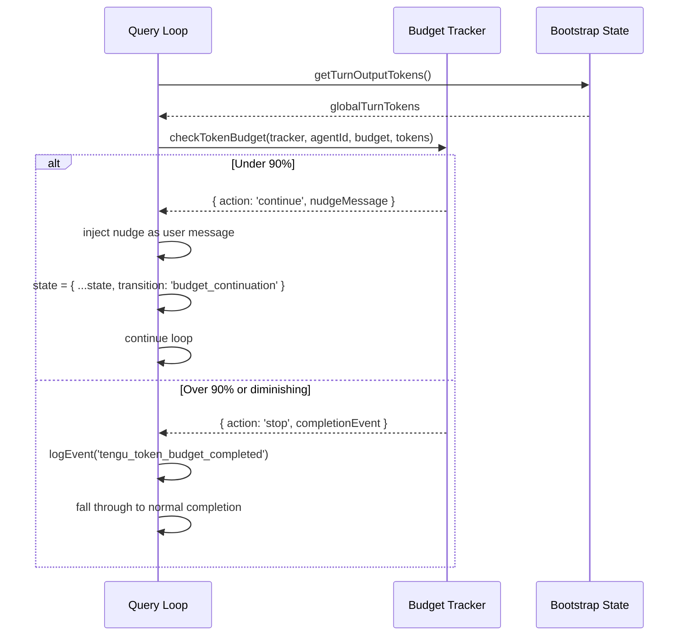

# SPARC Spec: P3 — Token Budget Auto-Continue

**Phase:** P3 (Medium)  
**Priority:** Medium  
**Estimated Effort:** 3 days  
**Source Blueprint:** Claude Code Original — `query/tokenBudget.ts` (95 LOC)

---

## S — Specification

### 1. Requirements

```yaml
specification:
  functional_requirements:
    - id: "FR-P3-001"
      description: "System shall auto-continue agent execution when under 90% of token budget"
      priority: "high"
      acceptance_criteria:
        - "Continue decision fires when turnTokens < budget * 0.9"
        - "Nudge message injected: '{pct}% of budget used ({tokens}/{budget}). Continue working.'"
        - "Continuation count tracked for analytics and diminishing returns detection"

    - id: "FR-P3-002"
      description: "System shall detect diminishing returns and stop early"
      priority: "high"
      acceptance_criteria:
        - "After 3+ continuations, if delta < 500 tokens per check for 2 consecutive checks: stop"
        - "Prevents wasting budget on agents that are stuck or producing trivial output"

    - id: "FR-P3-003"
      description: "Token budget shall not apply to subagents (they have their own budget)"
      priority: "medium"
      acceptance_criteria:
        - "Skip budget check when agentId is set"
        - "Skip when budget is null or <= 0"

    - id: "FR-P3-004"
      description: "Budget completion shall emit analytics event with metrics"
      priority: "low"
      acceptance_criteria:
        - "Event includes: continuationCount, pct, turnTokens, budget, diminishingReturns, durationMs"

  non_functional_requirements:
    - id: "NFR-P3-001"
      category: "performance"
      description: "Budget check must be O(1) — no token counting, just compare cached values"
      measurement: "checkTokenBudget reads globalTurnTokens from bootstrap state"
```

### 2. Acceptance Criteria (Gherkin)

```gherkin
Feature: Token Budget Auto-Continue

  Scenario: Continue when under 90% budget
    Given a token budget of 100,000
    And current turn output is 50,000 tokens (50%)
    When the budget check runs
    Then the decision should be "continue"
    And the nudge message should contain "50%"

  Scenario: Stop when over 90% budget
    Given a token budget of 100,000
    And current turn output is 95,000 tokens (95%)
    When the budget check runs
    Then the decision should be "stop"

  Scenario: Stop on diminishing returns
    Given a token budget of 100,000
    And continuation count is 4
    And last two deltas were 200 and 300 tokens
    When the budget check runs
    Then the decision should be "stop"
    And diminishingReturns should be true

  Scenario: Skip for subagents
    Given the current context has an agentId
    When the budget check runs
    Then the decision should be "stop" with null completionEvent
```

---

## P — Pseudocode

### Core Algorithm

```
CONSTANTS:
    COMPLETION_THRESHOLD = 0.9    // Stop at 90% of budget
    DIMINISHING_THRESHOLD = 500   // Minimum tokens per check to continue

TYPE BudgetTracker = {
    continuationCount: int
    lastDeltaTokens: int
    lastGlobalTurnTokens: int
    startedAt: timestamp
}

TYPE TokenBudgetDecision =
    | { action: 'continue', nudgeMessage: string, continuationCount: int, pct: int }
    | { action: 'stop', completionEvent: CompletionEvent | null }

ALGORITHM: CheckTokenBudget
INPUT:
    tracker (BudgetTracker),
    agentId (string | undefined),
    budget (int | null),
    globalTurnTokens (int)
OUTPUT: TokenBudgetDecision

BEGIN
    // Skip for subagents or no budget
    IF agentId OR budget IS null OR budget <= 0 THEN
        RETURN { action: 'stop', completionEvent: null }
    END IF

    turnTokens <- globalTurnTokens
    pct <- ROUND((turnTokens / budget) * 100)
    deltaSinceLastCheck <- globalTurnTokens - tracker.lastGlobalTurnTokens

    // Detect diminishing returns
    isDiminishing <-
        tracker.continuationCount >= 3 AND
        deltaSinceLastCheck < DIMINISHING_THRESHOLD AND
        tracker.lastDeltaTokens < DIMINISHING_THRESHOLD

    // Continue if under threshold and making progress
    IF NOT isDiminishing AND turnTokens < budget * COMPLETION_THRESHOLD THEN
        tracker.continuationCount <- tracker.continuationCount + 1
        tracker.lastDeltaTokens <- deltaSinceLastCheck
        tracker.lastGlobalTurnTokens <- globalTurnTokens

        nudge <- getBudgetContinuationMessage(pct, turnTokens, budget)
        RETURN {
            action: 'continue',
            nudgeMessage: nudge,
            continuationCount: tracker.continuationCount,
            pct: pct
        }
    END IF

    // Stop — emit completion event if we ever continued
    IF isDiminishing OR tracker.continuationCount > 0 THEN
        RETURN {
            action: 'stop',
            completionEvent: {
                continuationCount: tracker.continuationCount,
                pct, turnTokens, budget,
                diminishingReturns: isDiminishing,
                durationMs: NOW() - tracker.startedAt
            }
        }
    END IF

    RETURN { action: 'stop', completionEvent: null }
END

ALGORITHM: GetBudgetContinuationMessage
INPUT: pct (int), turnTokens (int), budget (int)
OUTPUT: string

BEGIN
    RETURN "You have used " + pct + "% of your token budget (" +
           formatNumber(turnTokens) + "/" + formatNumber(budget) +
           " tokens). Continue working on the task."
END
```

---

## A — Architecture

### Integration with Query Loop (P1)



### File Structure

```
src/query/
  tokenBudget.ts    — BudgetTracker, checkTokenBudget(), createBudgetTracker()
  
src/utils/
  tokenBudget.ts    — getBudgetContinuationMessage() (string formatting)
```

---

## R — Refinement

### Test Plan

```typescript
describe('TokenBudget', () => {
  it('should continue when under 90% threshold', () => {
    const tracker = createBudgetTracker();
    const decision = checkTokenBudget(tracker, undefined, 100_000, 50_000);
    expect(decision.action).toBe('continue');
    expect(decision.pct).toBe(50);
  });

  it('should stop when over 90% threshold', () => {
    const tracker = createBudgetTracker();
    const decision = checkTokenBudget(tracker, undefined, 100_000, 95_000);
    expect(decision.action).toBe('stop');
  });

  it('should detect diminishing returns after 3+ continuations', () => {
    const tracker = createBudgetTracker();
    tracker.continuationCount = 4;
    tracker.lastDeltaTokens = 200;
    tracker.lastGlobalTurnTokens = 49_800;

    const decision = checkTokenBudget(tracker, undefined, 100_000, 50_100);
    expect(decision.action).toBe('stop');
    expect(decision.completionEvent?.diminishingReturns).toBe(true);
  });

  it('should skip for subagents', () => {
    const tracker = createBudgetTracker();
    const decision = checkTokenBudget(tracker, 'agent-123', 100_000, 50_000);
    expect(decision.action).toBe('stop');
    expect(decision.completionEvent).toBeNull();
  });

  it('should increment continuationCount on each continue', () => {
    const tracker = createBudgetTracker();
    checkTokenBudget(tracker, undefined, 100_000, 30_000);
    expect(tracker.continuationCount).toBe(1);
    checkTokenBudget(tracker, undefined, 100_000, 50_000);
    expect(tracker.continuationCount).toBe(2);
  });
});
```
