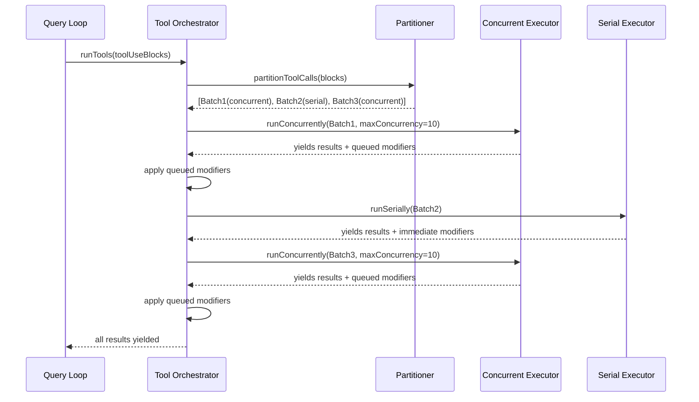

# SPARC Spec: P4 — Concurrency-Partitioned Tool Execution

**Phase:** P4 (Medium)  
**Priority:** Medium  
**Estimated Effort:** 3 days  
**Source Blueprint:** Claude Code Original — `services/tools/toolOrchestration.ts` (190 LOC), `StreamingToolExecutor.ts` (17K)

---

## S — Specification

### 1. Requirements

```yaml
specification:
  functional_requirements:
    - id: "FR-P4-001"
      description: "Tool calls shall be partitioned into concurrency-safe batches before execution"
      priority: "high"
      acceptance_criteria:
        - "Consecutive read-only tools grouped into one concurrent batch"
        - "Each write tool gets its own serial batch"
        - "Partitioning respects tool call order from assistant message"

    - id: "FR-P4-002"
      description: "Read-only tool batches shall execute concurrently with configurable max concurrency"
      priority: "high"
      acceptance_criteria:
        - "Default max concurrency: 10 (CLAUDE_CODE_MAX_TOOL_USE_CONCURRENCY env override)"
        - "All tools in batch start together, results collected as they complete"
        - "Context modifiers from concurrent tools queued and applied after batch completes"

    - id: "FR-P4-003"
      description: "Write tool batches shall execute serially with immediate context updates"
      priority: "high"
      acceptance_criteria:
        - "Each write tool runs alone in its own batch"
        - "Context modifiers applied immediately after each tool"
        - "Next tool sees updated context from previous tool"

    - id: "FR-P4-004"
      description: "Each tool shall declare whether it is concurrency-safe via isConcurrencySafe()"
      priority: "high"
      acceptance_criteria:
        - "Read, Glob, Grep, Search tools return true"
        - "Edit, Write, Bash tools return false"
        - "Tools with side effects (MCP, Agent) return false"
        - "Method receives parsed input for per-call decisions"

    - id: "FR-P4-005"
      description: "Tool execution shall support streaming mode (tools start during model stream)"
      priority: "medium"
      acceptance_criteria:
        - "StreamingToolExecutor adds tools as they arrive from stream"
        - "Concurrency-safe tools execute immediately"
        - "Write tools queued until stream completes"
        - "On abort: synthetic tool_result blocks generated for pending tools"

  non_functional_requirements:
    - id: "NFR-P4-001"
      category: "performance"
      description: "Concurrent batch of 5 Glob calls should complete in ~1x single call time, not 5x"
      measurement: "Wall-clock time for concurrent vs serial Glob execution"

    - id: "NFR-P4-002"
      category: "safety"
      description: "Write operations must never execute concurrently to prevent race conditions"
      measurement: "Serial execution guarantee for isConcurrencySafe()=false tools"
```

### 2. Acceptance Criteria (Gherkin)

```gherkin
Feature: Concurrency-Partitioned Tool Execution

  Scenario: Partition consecutive read-only tools
    Given the model returns: [Glob("*.ts"), Grep("TODO"), Read("/src/foo.ts")]
    When the tool calls are partitioned
    Then there should be 1 batch with 3 tools
    And the batch should be marked concurrency-safe

  Scenario: Partition mixed read/write tools
    Given the model returns: [Glob("*.ts"), Edit("/src/foo.ts", ...), Read("/src/bar.ts")]
    When the tool calls are partitioned
    Then there should be 3 batches:
      | Batch | Tools         | Concurrent |
      | 1     | Glob          | true       |
      | 2     | Edit          | false      |
      | 3     | Read          | true       |

  Scenario: Queue context modifiers during concurrent execution
    Given a concurrent batch of [Glob, Grep]
    And Glob produces a context modifier
    When the batch completes
    Then the context modifier should be applied AFTER both tools finish
    And the next batch should see the updated context

  Scenario: Abort generates synthetic tool_results
    Given tools [Read, Bash] are partitioned as [concurrent, serial]
    And Read is executing
    When the abort signal fires
    Then Read should complete (already running)
    And Bash should get a synthetic tool_result with "Interrupted by user"
```

---

## P — Pseudocode

### Tool Partitioning

```
TYPE Batch = {
    isConcurrencySafe: boolean
    blocks: ToolUseBlock[]
}

ALGORITHM: PartitionToolCalls
INPUT: toolUseBlocks (ToolUseBlock[]), toolUseContext (ToolUseContext)
OUTPUT: batches (Batch[])

BEGIN
    batches <- []

    FOR EACH toolUse IN toolUseBlocks DO
        tool <- findToolByName(toolUseContext.tools, toolUse.name)
        parsedInput <- tool.inputSchema.safeParse(toolUse.input)

        isSafe <- false
        IF parsedInput.success THEN
            TRY
                isSafe <- tool.isConcurrencySafe(parsedInput.data)
            CATCH
                isSafe <- false  // Conservative default
            END TRY
        END IF

        // Extend last batch if both are concurrent, else start new batch
        lastBatch <- batches.at(-1)
        IF isSafe AND lastBatch?.isConcurrencySafe THEN
            lastBatch.blocks.push(toolUse)
        ELSE
            batches.push({ isConcurrencySafe: isSafe, blocks: [toolUse] })
        END IF
    END FOR

    RETURN batches
END
```

### Execution Orchestrator

```
ALGORITHM: RunTools
INPUT:
    toolUseBlocks (ToolUseBlock[]),
    assistantMessages (AssistantMessage[]),
    canUseTool (CanUseToolFn),
    toolUseContext (ToolUseContext)
OUTPUT: yields MessageUpdate { message?: Message, newContext: ToolUseContext }

BEGIN
    currentContext <- toolUseContext

    FOR EACH batch IN partitionToolCalls(toolUseBlocks, currentContext) DO
        IF batch.isConcurrencySafe THEN
            // Run all tools in batch concurrently
            queuedModifiers <- {}

            FOR EACH update IN runConcurrently(batch.blocks, currentContext, MAX_CONCURRENCY) DO
                IF update.contextModifier THEN
                    queue(queuedModifiers, update.contextModifier)
                END IF
                yield { message: update.message, newContext: currentContext }
            END FOR

            // Apply queued modifiers after batch completes
            FOR EACH block IN batch.blocks DO
                FOR EACH modifier IN queuedModifiers[block.id] DO
                    currentContext <- modifier(currentContext)
                END FOR
            END FOR
            yield { newContext: currentContext }

        ELSE
            // Run each tool serially
            FOR EACH toolUse IN batch.blocks DO
                FOR EACH update IN runToolUse(toolUse, canUseTool, currentContext) DO
                    IF update.contextModifier THEN
                        currentContext <- update.contextModifier(currentContext)
                    END IF
                    yield { message: update.message, newContext: currentContext }
                END FOR
            END FOR
        END IF
    END FOR
END
```

### Concurrency-Safe Classification

```
ALGORITHM: ClassifyToolConcurrency
INPUT: tool (Tool), input (ParsedInput)
OUTPUT: boolean

BEGIN
    // Always safe (read-only)
    IF tool.name IN ['Read', 'Glob', 'Grep', 'WebSearch', 'WebFetch', 'ToolSearch'] THEN
        RETURN true
    END IF

    // Always unsafe (writes or side effects)
    IF tool.name IN ['Edit', 'Write', 'Bash', 'Agent', 'SendMessage'] THEN
        RETURN false
    END IF

    // Per-call decision (Bash with read-only commands could be safe)
    IF tool.name === 'Bash' AND isReadOnlyCommand(input.command) THEN
        RETURN true
    END IF

    RETURN false  // Conservative default
END
```

---

## A — Architecture

### Execution Flow



### File Structure

```
src/services/tools/
  toolOrchestration.ts        — partitionToolCalls(), runTools()
  toolExecution.ts            — runToolUse() for individual tool execution
  streamingToolExecutor.ts    — Tools during model stream (Phase 2)
  concurrencyClassifier.ts    — isConcurrencySafe() per tool type
  types.ts                    — Batch, MessageUpdate, etc.
```

---

## R — Refinement

### Test Plan

```typescript
describe('ToolOrchestration', () => {
  describe('partitionToolCalls', () => {
    it('should group consecutive read-only tools', () => {
      const tools = [glob('*.ts'), grep('TODO'), read('/foo')];
      const batches = partitionToolCalls(tools, context);
      expect(batches).toHaveLength(1);
      expect(batches[0].isConcurrencySafe).toBe(true);
      expect(batches[0].blocks).toHaveLength(3);
    });

    it('should isolate write tools', () => {
      const tools = [glob('*.ts'), edit('/foo', 'a', 'b'), read('/bar')];
      const batches = partitionToolCalls(tools, context);
      expect(batches).toHaveLength(3);
      expect(batches[0].isConcurrencySafe).toBe(true);
      expect(batches[1].isConcurrencySafe).toBe(false);
      expect(batches[2].isConcurrencySafe).toBe(true);
    });

    it('should treat unknown tools as unsafe', () => {
      const tools = [unknownTool('custom_mcp_tool')];
      const batches = partitionToolCalls(tools, context);
      expect(batches[0].isConcurrencySafe).toBe(false);
    });
  });

  describe('runTools', () => {
    it('should run concurrent batch faster than serial', async () => {
      const tools = Array(5).fill(slowReadTool(100)); // 100ms each
      const start = Date.now();
      await consumeGenerator(runTools(tools, canUseTool, context));
      const elapsed = Date.now() - start;
      expect(elapsed).toBeLessThan(300); // 5x100ms serial = 500ms; concurrent < 300ms
    });

    it('should apply context modifiers after concurrent batch', async () => {
      const tools = [globWithModifier(), grepWithModifier()];
      let finalContext;
      for await (const update of runTools(tools, canUseTool, context)) {
        finalContext = update.newContext;
      }
      expect(finalContext.modifierApplied).toBe(true);
    });
  });
});
```
