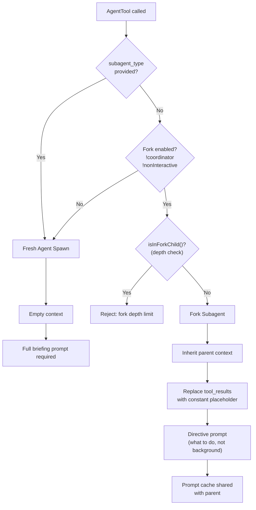

# SPARC Spec: P5 — Fork Subagent with Cache Sharing

**Phase:** P5 (Medium)  
**Priority:** Medium  
**Estimated Effort:** 4 days  
**Source Blueprint:** Claude Code Original — `tools/AgentTool/forkSubagent.ts` (6K), `tools/AgentTool/prompt.ts` (17K)

---

## S — Specification

### 1. Requirements

```yaml
specification:
  functional_requirements:
    - id: "FR-P5-001"
      description: "Fork subagent shall inherit parent's full conversation context and system prompt"
      priority: "high"
      acceptance_criteria:
        - "Fork child receives parent's rendered system prompt bytes (not re-generated)"
        - "Fork child receives parent's full message history"
        - "Fork child's tool_result blocks replaced with placeholder for cache sharing"
        - "All fork children produce byte-identical API request prefixes"

    - id: "FR-P5-002"
      description: "Fork subagent shall be triggered by omitting subagent_type on AgentTool"
      priority: "high"
      acceptance_criteria:
        - "subagent_type present -> spawn fresh agent (existing behavior)"
        - "subagent_type omitted -> fork (context inheritance)"
        - "Fork disabled in coordinator mode and non-interactive sessions"

    - id: "FR-P5-003"
      description: "Fork prompt shall be a directive, not a briefing"
      priority: "high"
      acceptance_criteria:
        - "Fork inherits context — prompt says WHAT to do, not background"
        - "Fresh agent (subagent_type) needs full briefing — context is empty"
        - "System prompt explains this distinction in prompt-writing guidance"

    - id: "FR-P5-004"
      description: "Fork subagent shall prevent recursive forking"
      priority: "high"
      acceptance_criteria:
        - "Fork children detect fork boilerplate tag in message history"
        - "isInForkChild() returns true -> reject fork attempt"
        - "Fork children keep Agent tool in pool (for cache) but block at call time"

    - id: "FR-P5-005"
      description: "Fork subagent shall run in background with task-notification delivery"
      priority: "high"
      acceptance_criteria:
        - "All agent spawns (fork and fresh) run async"
        - "Unified <task-notification> interaction model"
        - "Parent must NOT peek at fork output file during execution"

    - id: "FR-P5-006"
      description: "Fork subagent shall share parent's model for prompt cache reuse"
      priority: "medium"
      acceptance_criteria:
        - "model: 'inherit' — uses parent's model, not default"
        - "Different model busts cache — fork loses its primary advantage"
        - "Prompt instructs: 'Don't set model on a fork'"

  non_functional_requirements:
    - id: "NFR-P5-001"
      category: "performance"
      description: "Fork agent startup should be faster than fresh agent due to prompt cache hit"
      measurement: "First API call latency comparison: fork vs fresh agent"

    - id: "NFR-P5-002"
      category: "cost"
      description: "Fork should reduce cache_creation_input_tokens by reusing parent's cached prefix"
      measurement: "cache_read_input_tokens > 0 on fork's first API call"
```

### 2. Constraints

```yaml
constraints:
  technical:
    - "Byte-identical API prefixes required — placeholder text must be constant"
    - "FORK_PLACEHOLDER_RESULT = 'Fork started — processing in background'"
    - "Fork uses permissionMode: 'bubble' — permissions surface to parent"
    - "Fork maxTurns: 200 (high limit for autonomous work)"

  architectural:
    - "Mutually exclusive with coordinator mode"
    - "Disabled in non-interactive sessions"
    - "Fork children cannot fork again (depth = 1)"
    - "Fork inherits parent's exact tool pool for cache-identical definitions"
```

### 3. Use Cases

```yaml
use_cases:
  - id: "UC-P5-001"
    title: "Fork for Research (Open-Ended Question)"
    actor: "Agent"
    flow:
      1. "User asks: 'What's left on this branch before we can ship?'"
      2. "Agent: 'Forking this — it's a survey question'"
      3. "Agent spawns fork (no subagent_type):"
      4. "  prompt: 'Audit what's left before shipping. Check uncommitted changes, tests, CI.'"
      5. "Fork runs autonomously with parent's full context"
      6. "Fork completes, task-notification delivered"
      7. "Agent synthesizes: 'Three blockers found...'"

  - id: "UC-P5-002"
    title: "Fork vs Fresh Agent Decision"
    actor: "Agent"
    flow:
      1. "Research can be independent questions -> fork parallel forks in one message"
      2. "Need independent review -> use subagent_type for fresh eyes"
      3. "Want intermediate output in context -> DON'T fork, do it inline"
```

### 4. Acceptance Criteria (Gherkin)

```gherkin
Feature: Fork Subagent

  Scenario: Fork triggered by omitting subagent_type
    Given fork subagent feature is enabled
    And the session is interactive
    When AgentTool is called without subagent_type
    Then a fork subagent should be created
    And it should inherit the parent's conversation history

  Scenario: Fork blocked in coordinator mode
    Given coordinator mode is enabled
    When AgentTool is called without subagent_type
    Then a fresh agent should be spawned (fork disabled)

  Scenario: Fork child cannot re-fork
    Given the current agent is a fork child
    When AgentTool is called without subagent_type
    Then the call should be rejected
    And the rejection message should explain fork depth limit

  Scenario: Fork shares prompt cache
    Given a fork child inherits parent's system prompt bytes
    When the fork makes its first API call
    Then cache_read_input_tokens should be > 0
    And cache_creation_input_tokens should be minimal
```

---

## P — Pseudocode

### Fork Detection and Creation

```
CONSTANT FORK_BOILERPLATE_TAG = "fork-context"
CONSTANT FORK_PLACEHOLDER_RESULT = "Fork started — processing in background"
CONSTANT FORK_SUBAGENT_TYPE = "fork"

ALGORITHM: IsForkSubagentEnabled
OUTPUT: boolean

BEGIN
    IF NOT feature('FORK_SUBAGENT') THEN RETURN false
    IF isCoordinatorMode() THEN RETURN false
    IF isNonInteractiveSession() THEN RETURN false
    RETURN true
END

ALGORITHM: IsInForkChild
INPUT: messages (Message[])
OUTPUT: boolean

BEGIN
    FOR EACH message IN messages DO
        IF message.type === 'user' THEN
            FOR EACH block IN message.content DO
                IF block.type === 'text' AND
                   block.text.includes('<' + FORK_BOILERPLATE_TAG + '>') THEN
                    RETURN true
                END IF
            END FOR
        END IF
    END FOR
    RETURN false
END

ALGORITHM: BuildForkConversationMessages
INPUT: parentMessages (Message[]), directive (string)
OUTPUT: forkMessages (Message[])

NOTES:
    // All fork children must produce byte-identical API request prefixes
    // for prompt cache sharing. This means:
    // 1. Keep full parent assistant message (tool_use, thinking, text)
    // 2. Replace ALL tool_result blocks with constant placeholder
    // 3. Append directive as final user message with boilerplate tag

BEGIN
    forkMessages <- []

    FOR EACH message IN parentMessages DO
        IF message.type === 'user' THEN
            // Replace tool_result content with constant placeholder
            clonedContent <- []
            FOR EACH block IN message.content DO
                IF block.type === 'tool_result' THEN
                    clonedContent.push({
                        type: 'tool_result',
                        tool_use_id: block.tool_use_id,
                        content: FORK_PLACEHOLDER_RESULT
                    })
                ELSE
                    clonedContent.push(block)
                END IF
            END FOR
            forkMessages.push(createUserMessage(clonedContent))
        ELSE
            forkMessages.push(message)  // Assistant messages kept verbatim
        END IF
    END FOR

    // Append directive with boilerplate tag
    directiveMessage <- createUserMessage({
        content: [
            { type: 'text', text: '<' + FORK_BOILERPLATE_TAG + '>Context inherited from parent</' + FORK_BOILERPLATE_TAG + '>' },
            { type: 'text', text: directive }
        ]
    })
    forkMessages.push(directiveMessage)

    RETURN forkMessages
END
```

### Fork Agent Definition

```
CONSTANT FORK_AGENT = {
    agentType: 'fork',
    whenToUse: 'Implicit fork — context inheritance. Triggered by omitting subagent_type.',
    tools: ['*'],              // Same tools as parent (cache-identical)
    maxTurns: 200,             // High limit for autonomous work
    model: 'inherit',          // Same model (cache sharing)
    permissionMode: 'bubble',  // Permissions surface to parent
    source: 'built-in',
    getSystemPrompt: () => ''  // Unused — parent's rendered bytes used directly
}
```

---

## A — Architecture

### Fork vs Fresh Agent Flow



### File Structure

```
src/tools/AgentTool/
  forkSubagent.ts        — isForkSubagentEnabled(), buildForkMessages(), FORK_AGENT
  agentToolUtils.ts      — Shared utilities for fork and fresh paths
  prompt.ts              — Prompt writing guidance (fork directive vs fresh briefing)

src/constants/
  xml.ts                 — FORK_BOILERPLATE_TAG, FORK_DIRECTIVE_PREFIX
```

---

## R — Refinement

### Test Plan

```typescript
describe('ForkSubagent', () => {
  describe('isForkSubagentEnabled', () => {
    it('returns true in normal interactive mode', () => {
      expect(isForkSubagentEnabled()).toBe(true);
    });

    it('returns false in coordinator mode', () => {
      process.env.CLAUDE_CODE_COORDINATOR_MODE = '1';
      expect(isForkSubagentEnabled()).toBe(false);
    });

    it('returns false in non-interactive session', () => {
      setIsNonInteractiveSession(true);
      expect(isForkSubagentEnabled()).toBe(false);
    });
  });

  describe('isInForkChild', () => {
    it('detects fork boilerplate tag in messages', () => {
      const messages = [createUserMessage('<fork-context>...</fork-context>')];
      expect(isInForkChild(messages)).toBe(true);
    });

    it('returns false for normal messages', () => {
      const messages = [createUserMessage('Hello')];
      expect(isInForkChild(messages)).toBe(false);
    });
  });

  describe('buildForkConversationMessages', () => {
    it('replaces all tool_result content with constant placeholder', () => {
      const parent = [
        assistantMessage([toolUse('read_file', { path: '/foo' })]),
        userMessage([toolResult('tool-1', 'file contents here')]),
      ];
      const fork = buildForkConversationMessages(parent, 'Do X');
      const result = fork.find(m =>
        m.content.some(b => b.type === 'tool_result'));
      expect(result.content[0].content).toBe(FORK_PLACEHOLDER_RESULT);
    });

    it('produces identical prefixes for different forks', () => {
      const parent = [assistantMsg, toolResultMsg];
      const fork1 = buildForkConversationMessages(parent, 'Task A');
      const fork2 = buildForkConversationMessages(parent, 'Task B');
      // All messages except the last (directive) should be identical
      expect(fork1.slice(0, -1)).toEqual(fork2.slice(0, -1));
    });

    it('appends boilerplate tag and directive', () => {
      const fork = buildForkConversationMessages(parentMessages, 'Audit files');
      const lastMsg = fork.at(-1);
      expect(lastMsg.content[0].text).toContain(FORK_BOILERPLATE_TAG);
      expect(lastMsg.content[1].text).toBe('Audit files');
    });
  });
});
```

### Performance Validation

```yaml
performance_validation:
  cache_hit_rate:
    measurement: "cache_read_input_tokens / total_input_tokens on fork's first API call"
    target: "> 80%"
    rationale: "Fork inherits parent's prefix — most tokens should be cache reads"

  startup_latency:
    measurement: "Time from fork spawn to first API response"
    target: "< 50% of fresh agent startup"
    rationale: "Cache hit avoids re-processing cached prefix"

  cost_savings:
    measurement: "cache_creation_input_tokens for fork vs fresh agent"
    target: "Fork < 10% of fresh agent's cache creation"
    rationale: "Fork reuses existing cache, minimal new creation"
```
