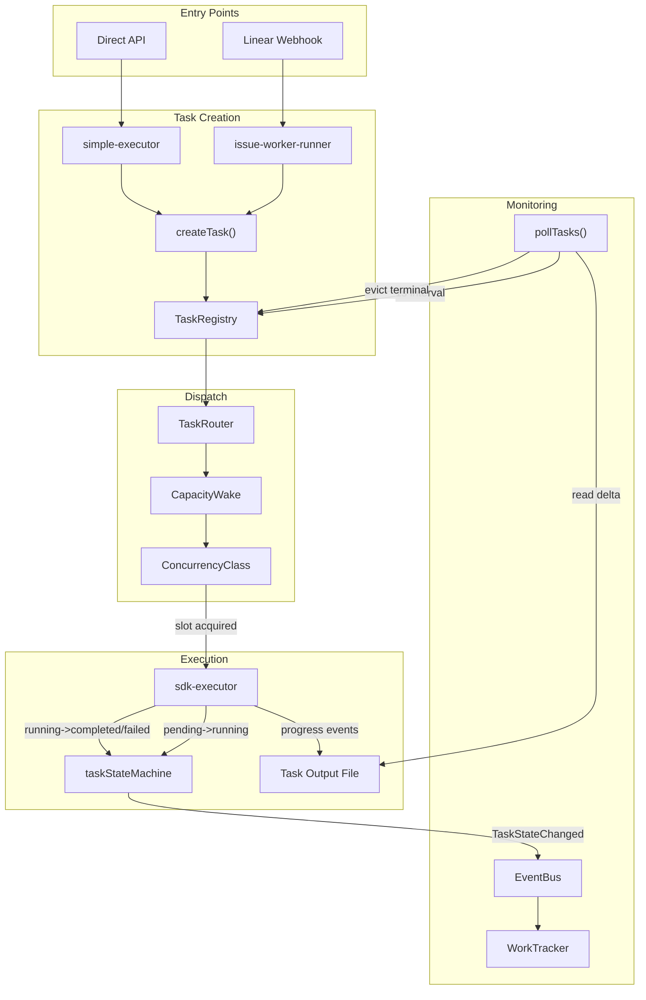
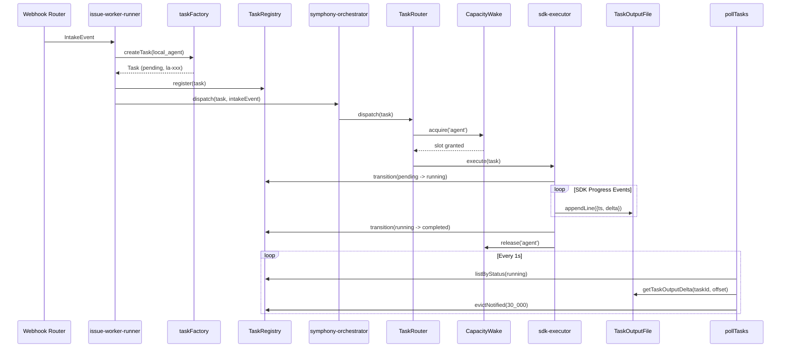

# SPARC Spec: P6 — Task Backbone Wiring

**Phase:** P6 (Critical)  
**Priority:** Critical  
**Estimated Effort:** 5 days  
**Source Blueprint:** Claude Code Original — `AppState.registerTask()`, `pollTasks()`, `getTaskOutputDelta()`, `generateTaskAttachments()`

---

## S — Specification

### 1. Requirements

```yaml
specification:
  functional_requirements:
    - id: "FR-P6-001"
      description: "simple-executor shall create a Task (type: local_agent) before each agent dispatch"
      priority: "critical"
      acceptance_criteria:
        - "createTask(TaskType.local_agent) called before interactiveExecutor.execute()"
        - "Task ID (la-{hex}) attached to execution request metadata"
        - "Task stored in TaskRegistry (new central Map<string, Task>)"
        - "AgentResult includes task.id for downstream correlation"

    - id: "FR-P6-002"
      description: "sdk-executor shall transition task state at session lifecycle boundaries"
      priority: "critical"
      acceptance_criteria:
        - "pending -> running on first SDK event received"
        - "running -> completed when session ends with output"
        - "running -> failed when session throws or times out"
        - "running -> cancelled when abort signal fires"
        - "All transitions go through taskStateMachine.transition()"
        - "TransitionListener emits domain events on EventBus"

    - id: "FR-P6-003"
      description: "symphony-orchestrator shall use TaskRouter for dispatch instead of direct worker creation"
      priority: "critical"
      acceptance_criteria:
        - "TaskRouter.dispatch() called instead of raw Worker constructor"
        - "Executor map wired: local_agent -> SdkExecutorAdapter, local_bash -> BashExecutorAdapter"
        - "RunningEntry in symphony-orchestrator stores task.id, not just worker reference"
        - "Worker lifecycle events (message, error, exit) update task state via transition()"

    - id: "FR-P6-004"
      description: "capacity-wake slot allocation shall consult ConcurrencyClass from task metadata"
      priority: "high"
      acceptance_criteria:
        - "CapacityWake.acquire() accepts ConcurrencyClass parameter"
        - "Separate slot pools per ConcurrencyClass (agent, shell, process, workflow, monitor, dream)"
        - "Dream tasks deferred when agent pool is at capacity (existing taskRouter behavior preserved)"
        - "Monitor tasks exempt from capacity limits (always admitted)"
        - "SlotChangedEvent includes concurrencyClass field"

    - id: "FR-P6-005"
      description: "WorkTracker shall adapt to use Task objects and TaskStatus enum"
      priority: "high"
      acceptance_criteria:
        - "WorkItemState.status replaced with TaskStatus enum values"
        - "WorkTracker.start() accepts optional Task reference for correlation"
        - "WorkTracker.getTask(planId) returns the associated Task object"
        - "listActive() returns items where task.status === TaskStatus.running"
        - "Backward-compatible: callers not passing Task still work (adapter creates one internally)"

    - id: "FR-P6-006"
      description: "Task output shall be written to disk for streaming delta reads"
      priority: "high"
      acceptance_criteria:
        - "Output file path: {dataDir}/task-output/{taskId}.jsonl"
        - "Each SDK progress event appends a JSON line with timestamp + delta text"
        - "getTaskOutputPath(taskId) returns the file path"
        - "getTaskOutputDelta(taskId, offset) returns new bytes since last read"
        - "Terminal tasks: output file retained for 60s grace period, then cleaned up"

    - id: "FR-P6-007"
      description: "pollTasks() loop shall be integrated into the orchestrator tick"
      priority: "high"
      acceptance_criteria:
        - "pollTasks() runs on ~1s interval within symphony-orchestrator's existing tick"
        - "Each poll: iterates TaskRegistry, generates attachments for running tasks"
        - "Terminal tasks with notified=true evicted after 30s grace period"
        - "Poll emits TaskPollCycle domain event with counts (running, completed, evicted)"

    - id: "FR-P6-008"
      description: "Linear webhook path shall create tasks into the backbone, not bypass it"
      priority: "critical"
      acceptance_criteria:
        - "issue-worker-runner creates a Task before dispatching to symphony-orchestrator"
        - "symphony-orchestrator receives pre-created Task, does not create its own"
        - "Task ID flows end-to-end: webhook -> intake -> task -> worker -> notification"
        - "Agent session events (AgentActivity) include task.id in metadata"

  non_functional_requirements:
    - id: "NFR-P6-001"
      category: "performance"
      description: "Task creation and state transitions must not add measurable latency to agent dispatch"
      measurement: "createTask() + transition() < 1ms combined (in-memory operations)"

    - id: "NFR-P6-002"
      category: "observability"
      description: "All task state transitions must be observable via EventBus"
      measurement: "Every transition() call emits TaskStateChanged domain event"

    - id: "NFR-P6-003"
      category: "reliability"
      description: "Task output files must survive process restart for in-flight tasks"
      measurement: "JSONL files fsynced after each append; path deterministic from taskId"

    - id: "NFR-P6-004"
      category: "backward-compatibility"
      description: "Existing callers of simple-executor and symphony-orchestrator must not break"
      measurement: "All existing tests pass without modification (new tests added separately)"
```

### 2. Constraints

```yaml
constraints:
  technical:
    - "Task module already exists at src/execution/task/ — wire it, do not rewrite it"
    - "TaskRouter already handles dream deferral and monitor auto-restart — preserve that logic"
    - "Task IDs are type-prefixed (la-, lb-, ra-, etc.) — no alternative ID schemes"
    - "Output files are JSONL (one JSON object per line) for append-only streaming"
    - "pollTasks() interval is configurable but defaults to 1000ms"

  architectural:
    - "TaskRegistry is a singleton Map<string, Task> in process memory (no external store)"
    - "Task state machine is pure-functional (transition returns new object) — side effects via listener"
    - "EventBus is the sole notification channel — no direct callback wiring between modules"
    - "CapacityWake remains the gatekeeper — TaskRouter calls acquire/release, not executors"
    - "WorkTracker remains the plan-level tracker — Task is the agent-level tracker"
```

### 3. Use Cases

```yaml
use_cases:
  - id: "UC-P6-001"
    title: "Linear Issue Triggers Agent with Task Backbone"
    actor: "Linear Webhook"
    flow:
      1. "Webhook receives issue assignment, creates IntakeEvent"
      2. "issue-worker-runner creates Task (type: local_agent, status: pending)"
      3. "Task stored in TaskRegistry, TaskStateChanged event emitted"
      4. "symphony-orchestrator receives Task + IntakeEvent"
      5. "TaskRouter.dispatch() transitions Task pending -> running"
      6. "sdk-executor starts Claude Code session, appends output to JSONL"
      7. "pollTasks() detects running task, generates attachment delta"
      8. "Session completes -> Task running -> completed"
      9. "pollTasks() marks Task notified, schedules 30s eviction"
      10. "WorkTracker.complete(planId) reflects terminal task state"

  - id: "UC-P6-002"
    title: "Capacity-Gated Dispatch with ConcurrencyClass"
    actor: "Orchestrator"
    flow:
      1. "3 local_agent tasks running (agent pool: 3/5 slots)"
      2. "New local_agent task arrives — acquire('agent') succeeds (4/5)"
      3. "Dream task arrives — acquire('dream') checks: agent pool full? defer"
      4. "Agent task completes — release('agent'), SlotChangedEvent fires"
      5. "Dream task retried on next poll — acquire('dream') succeeds"

  - id: "UC-P6-003"
    title: "Task Output Streaming"
    actor: "Notification System"
    flow:
      1. "sdk-executor receives progress event with textDelta"
      2. "Appends {timestamp, delta, sessionId} to task-output/la-abc123.jsonl"
      3. "pollTasks() calls getTaskOutputDelta('la-abc123', lastOffset)"
      4. "Returns new bytes since lastOffset"
      5. "Attachment generated from delta, delivered to coordinator/webhook"
```

### 4. Acceptance Criteria (Gherkin)

```gherkin
Feature: Task Backbone Wiring

  Scenario: Agent dispatch creates and tracks a Task
    Given a workflow plan with one local_agent
    When simple-executor dispatches the agent
    Then a Task with type local_agent is created in TaskRegistry
    And the Task ID starts with "la-"
    And the AgentResult contains the task ID

  Scenario: SDK session transitions task through lifecycle
    Given a pending Task in TaskRegistry
    When the SDK session starts
    Then the Task transitions to running
    When the SDK session completes successfully
    Then the Task transitions to completed
    And the completedAt timestamp is set

  Scenario: Task output written to disk as JSONL
    Given a running Task with ID "la-abc123"
    When the SDK emits 3 progress events
    Then task-output/la-abc123.jsonl contains 3 lines
    And each line is valid JSON with timestamp and delta fields

  Scenario: pollTasks evicts terminal tasks after grace period
    Given a completed Task with notified=true
    When 30 seconds have elapsed since completion
    Then pollTasks removes the Task from TaskRegistry
    And the output file is deleted

  Scenario: ConcurrencyClass routing in capacity-wake
    Given agent pool has 5 max slots and 5 used
    When a new local_agent task requests a slot
    Then the request blocks until a slot is released
    When a monitor_mcp task requests a slot
    Then the request succeeds immediately (monitors exempt)
```

---

## P — Pseudocode

### TaskRegistry (Central Store)

```
MODULE: TaskRegistry
STATE: tasks = Map<string, Task>, notifiedAt = Map<string, number>

  register(task)    -- throws on duplicate ID
  get(taskId)       -- returns Task | undefined
  update(id, task)  -- throws if not registered
  listByStatus(s)   -- filter by TaskStatus
  markNotified(id)  -- set notifiedAt timestamp
  evictNotified(graceMs = 30_000) -- delete tasks notified > graceMs ago, return evicted IDs
```

### Wiring simple-executor to Task Backbone

```
// Wraps the existing agent loop body. Task creation BEFORE execute().

task = createTask(TaskType.local_agent)
taskRegistry.register(task)                         // pending
prompt = buildAgentPrompt(...)                      // existing logic
result = interactiveExecutor.execute({
  ...request, metadata: { taskId: task.id }         // SDK executor reads this
})
task = transition(task, result.status === 'completed'
  ? TaskStatus.completed : TaskStatus.failed)
taskRegistry.update(task.id, task)
return { ...agentResult, taskId: task.id }
```

### SDK Executor Task State Transitions

```
// Inside SDK event loop:
//   On first event:  transition(pending -> running), open JSONL output
//   On progress:     appendLine({ ts, delta, sessionId }) to JSONL
//   On completion:   close JSONL, return result
// taskId comes from request.metadata.taskId
```

### pollTasks Integration (1s interval in orchestrator tick)

```
running = taskRegistry.listByStatus(running)
FOR EACH task IN running:
  delta = getTaskOutputDelta(task.id, task._lastReadOffset)
  IF delta.data.length > 0: emit('TaskOutputDelta', { taskId, delta })

terminal = listByStatus(completed) + listByStatus(failed) + listByStatus(cancelled)
FOR EACH task IN terminal WHERE NOT notifiedAt.has(task.id):
  markNotified(task.id)
  emit('TaskNotified', { taskId, status })

evictedIds = evictNotified(30_000)
FOR EACH id IN evictedIds: cleanupOutputFile(id)
```

### Capacity-Wake ConcurrencyClass Extension

```
acquire(concurrencyClass):
  IF class === 'monitor': RETURN true           // always admitted
  pool = slotPools.get(class) ?? { used: 0, max: default }
  IF pool.used >= pool.max: RETURN false
  pool.used++; RETURN true

release(concurrencyClass):
  IF class === 'monitor': RETURN
  pool.used--
```

---

## A — Architecture

### Task Backbone Data Flow



### File Structure

```
src/execution/task/
  types.ts                 -- (exists) TaskType, TaskStatus, Task, metadata
  taskFactory.ts           -- (exists) createTask(), createTaskId(), parseTaskType()
  taskStateMachine.ts      -- (exists) transition(), InvalidTransitionError
  taskRouter.ts            -- (exists) createTaskRouter(), TaskExecutor interface
  taskRegistry.ts          -- (NEW) Central Map<string, Task> + eviction logic
  taskOutputWriter.ts      -- (NEW) JSONL append writer + getTaskOutputDelta()
  taskPoller.ts            -- (NEW) pollTasks() + attachment generation
  index.ts                 -- (NEW) Public barrel: registry, factory, router, poller

src/execution/simple-executor.ts
  -- (MODIFY) Import createTask, register before dispatch, attach taskId to result

src/execution/runtime/sdk-executor.ts
  -- (MODIFY) Accept taskId in metadata, transition on lifecycle boundaries, write JSONL

src/execution/runtime/capacity-wake.ts
  -- (MODIFY) Add ConcurrencyClass-aware slot pools, monitor exemption

src/execution/orchestrator/symphony-orchestrator.ts
  -- (MODIFY) Use TaskRouter for dispatch, store task.id in RunningEntry

src/execution/orchestrator/work-tracker.ts
  -- (MODIFY) Accept optional Task, expose getTask(), use TaskStatus enum

src/execution/orchestrator/issue-worker-runner.ts
  -- (MODIFY) Create Task before dispatching to symphony-orchestrator
```

### Integration Sequence: Linear Webhook to Task Completion



---

## R — Refinement

### Test Plan

| Module | Test File | Key Assertions |
|--------|-----------|----------------|
| TaskRegistry | `taskRegistry.test.ts` | register/retrieve by ID; throw on duplicate; list by status; evict notified after grace period; cleanup output file on eviction |
| TaskOutputWriter | `taskOutputWriter.test.ts` | append JSONL lines; delta read from byte offset returns only new data; round-trip encode/decode |
| simple-executor wiring | `simple-executor.test.ts` (updated) | Task created before each agent dispatch; task type is `local_agent`; task transitions to failed on agent failure; AgentResult includes `taskId` |
| sdk-executor transitions | `sdk-executor.test.ts` (updated) | pending→running on first SDK event; running→completed on success; running→failed on error; `startedAt` set on transition |
| CapacityWake classes | `capacity-wake.test.ts` (updated) | per-class slot tracking (3 agent slots full → reject 4th); monitor tasks always admitted; release frees slot for class |
| pollTasks | `taskPoller.test.ts` | emits `TaskOutputDelta` for running tasks with new output; evicts terminal tasks after grace; logs warning for stuck tasks (>2x timeout) |
| WorkTracker correlation | `work-tracker.test.ts` (updated) | accepts optional Task on start; exposes via `getTask()`; backward-compatible without Task param |

All tests use `node:test` + `node:assert/strict` with mock-first pattern per project conventions.

### Anti-Patterns to Enforce

```yaml
anti_patterns:
  - name: "Bypass Task Registry"
    bad: "sdk-executor spawns session directly without task registration"
    good: "Every execution creates a Task first, stores in registry, then dispatches"
    enforcement: "TaskRouter.dispatch() throws if task not in registry"

  - name: "Direct Status Mutation"
    bad: "task.status = TaskStatus.completed"
    good: "task = transition(task, TaskStatus.completed, listener)"
    enforcement: "Task.status is readonly — only transition() produces new state"

  - name: "Polling Output Without Offset"
    bad: "Re-read entire output file on each poll cycle"
    good: "Track byte offset per task, only read new bytes"
    enforcement: "getTaskOutputDelta requires offset parameter"

  - name: "Ignoring ConcurrencyClass"
    bad: "CapacityWake treats all tasks as same pool"
    good: "Slot accounting respects ConcurrencyClass boundaries"
    enforcement: "acquire() requires ConcurrencyClass parameter (no default)"

  - name: "Orphaned Tasks"
    bad: "Task created but never transitioned to terminal state"
    good: "Every code path (success, error, timeout, abort) transitions to terminal"
    enforcement: "pollTasks() logs warning for tasks stuck in running > 2x defaultTimeout"
```

### Migration Strategy

```yaml
migration:
  phase_1_registry_and_factory:
    files: ["taskRegistry.ts", "taskOutputWriter.ts", "index.ts"]
    description: "Introduce TaskRegistry and output writer. No existing code modified yet."
    validation: "New unit tests pass. Existing tests unaffected."

  phase_2_simple_executor_wiring:
    files: ["simple-executor.ts"]
    description: "Wrap agent loop body with createTask + register + transition calls."
    validation: "Existing simple-executor tests pass. New tests verify task creation."

  phase_3_sdk_executor_transitions:
    files: ["sdk-executor.ts"]
    description: "Accept taskId in metadata. Transition on lifecycle. Write JSONL output."
    validation: "SDK executor tests pass. Task output files created in test tmpdir."

  phase_4_capacity_wake_classes:
    files: ["capacity-wake.ts"]
    description: "Add ConcurrencyClass parameter to acquire/release. Per-class pools."
    validation: "Existing capacity tests pass (default class). New class-aware tests pass."

  phase_5_orchestrator_integration:
    files: ["symphony-orchestrator.ts", "work-tracker.ts", "issue-worker-runner.ts"]
    description: "Route dispatch through TaskRouter. Store task.id in RunningEntry. Wire pollTasks."
    validation: "Full integration test: webhook -> task -> execution -> poll -> eviction."
```

---

## C — Completion

### Definition of Done

```yaml
completion:
  code_deliverables:
    - "src/execution/task/taskRegistry.ts — TaskRegistry with register/get/update/evict"
    - "src/execution/task/taskOutputWriter.ts — JSONL writer + delta reader"
    - "src/execution/task/taskPoller.ts — pollTasks() with attachment generation"
    - "src/execution/task/index.ts — barrel export for public API"
    - "Modified: simple-executor.ts — task creation before dispatch"
    - "Modified: sdk-executor.ts — lifecycle transitions + JSONL output"
    - "Modified: capacity-wake.ts — ConcurrencyClass-aware slot pools"
    - "Modified: symphony-orchestrator.ts — TaskRouter dispatch + pollTasks tick"
    - "Modified: work-tracker.ts — optional Task correlation"

  test_deliverables:
    - "tests/execution/task/taskRegistry.test.ts"
    - "tests/execution/task/taskOutputWriter.test.ts"
    - "tests/execution/task/taskPoller.test.ts"
    - "Updated: tests/execution/simple-executor.test.ts (task wiring assertions)"
    - "Updated: tests/execution/sdk-executor.test.ts (transition assertions)"
    - "Updated: tests/execution/capacity-wake.test.ts (concurrency class tests)"

  verification_checklist:
    - "npm run build succeeds"
    - "npm test passes (all existing + new tests)"
    - "npx tsc --noEmit passes"
    - "npm run lint passes"
    - "No imports from src/execution/task/ that bypass the barrel (index.ts)"
    - "Every TaskType used in production has a registered executor in TaskRouter"
    - "Task output files cleaned up after eviction (no disk leak)"
    - "EventBus receives TaskStateChanged for every transition"
    - "Backward compatibility: simple-executor works without taskRegistry (graceful degrade)"

  success_metrics:
    - "100% of agent dispatches go through Task backbone (grep for createTask in executor paths)"
    - "0 direct Worker() constructor calls in symphony-orchestrator (all via TaskRouter)"
    - "Task output delta latency < 10ms for 1MB output files"
    - "pollTasks cycle time < 5ms for 50 concurrent tasks"
```
