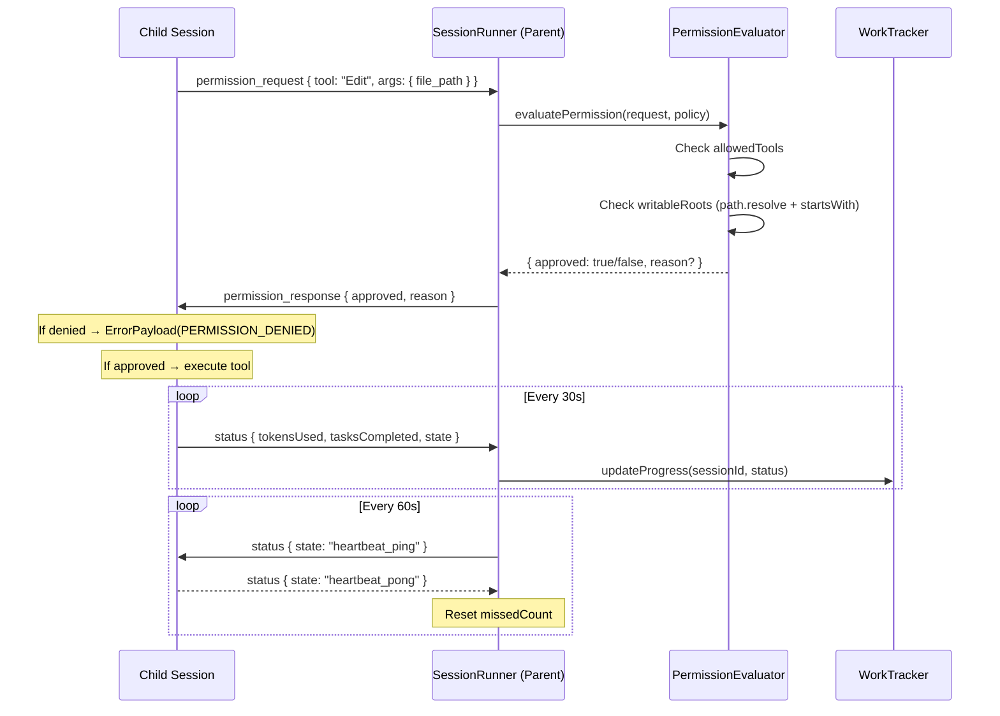

# SPARC Spec: P7 — NDJSON Permission Negotiation and Full Message Taxonomy

**Phase:** P7 (Medium)  
**Priority:** Medium  
**Estimated Effort:** 4 days  
**Source Blueprint:** Claude Code Original — `structuredIO.ts`, `remoteIO.ts`, `SessionPermissionPolicy`

---

## S — Specification

### 1. Requirements

```yaml
specification:
  functional_requirements:
    - id: "FR-P7-001"
      description: "Permission request/response flow shall gate tool execution when policy is restrictive"
      priority: "critical"
      acceptance_criteria:
        - "Child session sends permission_request before executing a tool not in allowedTools"
        - "Parent evaluates request against SessionPermissionPolicy"
        - "Parent sends permission_response with approved: true/false and reason"
        - "Child blocks until response received or timeout (30s default)"
        - "Denied requests produce a structured ErrorPayload to the child, not a crash"

    - id: "FR-P7-002"
      description: "SessionPermissionPolicy shall enforce writableRoots against worktree paths"
      priority: "critical"
      acceptance_criteria:
        - "Write/Edit/Bash-with-side-effects checked against writableRoots prefixes"
        - "Read-only tools (Read, Grep, Glob) always permitted regardless of writableRoots"
        - "writableRoots resolved to absolute paths before comparison"
        - "Path traversal attempts (../) normalized and rejected if outside roots"
        - "Policy constructed per-session from worktree path + agent role config"

    - id: "FR-P7-003"
      description: "SessionPermissionPolicy shall filter allowedTools per agent role"
      priority: "high"
      acceptance_criteria:
        - "Each agent role (researcher, implementer, verifier) has a tool whitelist"
        - "Researcher role: Read, Grep, Glob, Bash (read-only commands)"
        - "Implementer role: Read, Grep, Glob, Bash, Edit, Write"
        - "Verifier role: Read, Grep, Glob, Bash (test commands only)"
        - "Tool not in whitelist triggers permission_request to parent"
        - "Parent can override whitelist via permission_response"

    - id: "FR-P7-004"
      description: "Status messages shall be emitted at regular intervals during sessions"
      priority: "high"
      acceptance_criteria:
        - "StatusPayload includes tokensUsed, tasksCompleted, and state"
        - "Status emitted every 30 seconds during active session (configurable)"
        - "Status emitted on state transitions (idle -> active, active -> waiting)"
        - "session-runner.ts routes status messages to work-tracker for progress updates"
        - "Missing status for >90s triggers heartbeat timeout warning"

    - id: "FR-P7-005"
      description: "Error messages shall replace unstructured error strings with typed codes"
      priority: "high"
      acceptance_criteria:
        - "ErrorPayload carries code (string enum), message, and optional details"
        - "Error codes: PERMISSION_DENIED, TOOL_NOT_FOUND, TIMEOUT, PARSE_ERROR, INTERNAL"
        - "session-runner.ts maps ErrorMessage to SessionRunnerCallbacks appropriately"
        - "sdk-executor.ts uses ErrorPayload codes for structured failure reporting"
        - "Unstructured catch blocks wrapped with ErrorPayload construction"

    - id: "FR-P7-006"
      description: "session-runner.ts shall handle the full NDJSON message taxonomy"
      priority: "high"
      acceptance_criteria:
        - "Message dispatch handles all 6 types: task, result, permission_request, permission_response, status, error"
        - "Unknown message types logged and discarded (not crash)"
        - "Type guards from ndjson-protocol.ts used for discriminated dispatch"
        - "onStatus callback added to SessionRunnerCallbacks"
        - "onError callback added to SessionRunnerCallbacks (separate from onCrash)"

    - id: "FR-P7-007"
      description: "NDJSON safe stringify shall escape line-splitting Unicode in all outbound messages"
      priority: "high"
      acceptance_criteria:
        - "U+2028 (LINE SEPARATOR) escaped to \\u2028 in JSON output"
        - "U+2029 (PARAGRAPH SEPARATOR) escaped to \\u2029 in JSON output"
        - "encodeMessage() applies safe stringify instead of raw JSON.stringify"
        - "Decode path tolerates both escaped and raw forms"
        - "No message can split a JSON line when piped through NDJSON transport"

    - id: "FR-P7-008"
      description: "Keep-alive heartbeat shall detect hung child sessions"
      priority: "medium"
      acceptance_criteria:
        - "Parent sends heartbeat ping every 60s (configurable) to child stdin"
        - "Child responds with status message within 10s"
        - "Three consecutive missed heartbeats trigger session kill + onCrash callback"
        - "Heartbeat timer paused when session is in idle/stopped state"
        - "Heartbeat message uses status type with state: 'heartbeat_ping'"

  non_functional_requirements:
    - id: "NFR-P7-001"
      category: "latency"
      description: "Permission negotiation round-trip should add <100ms to tool execution"
      measurement: "Time from permission_request send to permission_response receive"

    - id: "NFR-P7-002"
      category: "reliability"
      description: "Hung session detection should fire within 3 heartbeat intervals"
      measurement: "Time from last child activity to onCrash callback"

    - id: "NFR-P7-003"
      category: "backward_compatibility"
      description: "Existing sessions running with permissive policy should see zero behavioral change"
      measurement: "All existing tests pass without modification"
```

### 2. Constraints

```yaml
constraints:
  technical:
    - "ndjson-protocol.ts types are frozen — extend, don't modify existing interfaces"
    - "encodeMessage/decodeMessage signatures backward-compatible (safe stringify is internal)"
    - "Permission timeout default 30s — configurable via SessionRunnerConfig"
    - "Heartbeat interval default 60s — configurable via SessionRunnerConfig"
    - "Error codes are string literals, not numeric — matches CC original pattern"

  architectural:
    - "Permission evaluation runs in parent process, not in child"
    - "No new dependencies — pure TypeScript, node:crypto for IDs"
    - "Status messages are fire-and-forget — no acknowledgment required"
    - "Error messages are informational — session lifecycle managed by state machine"
    - "writableRoots validation uses path.resolve + startsWith — no regex"
```

### 3. Use Cases

```yaml
use_cases:
  - id: "UC-P7-001"
    title: "Researcher Agent Denied Write Access"
    actor: "Session Runner (parent)"
    flow:
      1. "Researcher agent session starts with role: 'researcher'"
      2. "Policy constructed: allowedTools = [Read, Grep, Glob, Bash], writableRoots = []"
      3. "Agent attempts Edit tool on a file"
      4. "Child sends permission_request: { tool: 'Edit', args: { file_path: '/tmp/worktree/src/foo.ts' } }"
      5. "Parent evaluates: Edit not in allowedTools for researcher role"
      6. "Parent sends permission_response: { approved: false, reason: 'Tool Edit not permitted for researcher role' }"
      7. "Child receives denial, emits ErrorPayload with code PERMISSION_DENIED"
      8. "Agent adjusts strategy — reports findings without editing"

  - id: "UC-P7-002"
    title: "Implementer Agent Writes Outside Worktree"
    actor: "Session Runner (parent)"
    flow:
      1. "Implementer session starts with writableRoots = ['/tmp/worktree-abc']"
      2. "Agent attempts Write to '/tmp/worktree-xyz/config.json'"
      3. "Child sends permission_request: { tool: 'Write', args: { file_path: '/tmp/worktree-xyz/config.json' } }"
      4. "Parent evaluates: path not under any writableRoot"
      5. "Parent sends permission_response: { approved: false, reason: 'Path outside writable roots' }"
      6. "Child receives denial, reports error to agent loop"

  - id: "UC-P7-003"
    title: "Hung Session Detected via Heartbeat"
    actor: "Session Runner (parent)"
    flow:
      1. "Session active, last status received 90s ago"
      2. "Parent sends heartbeat ping (status message with state: 'heartbeat_ping')"
      3. "No response within 10s — missedHeartbeats incremented to 1"
      4. "60s later, second ping — no response — missedHeartbeats = 2"
      5. "60s later, third ping — no response — missedHeartbeats = 3"
      6. "Parent kills child process, calls onCrash callback"
      7. "Crash recovery (existing P9B logic) handles restart with backoff"
```

### 4. Acceptance Criteria (Gherkin)

```gherkin
Feature: NDJSON Permission Negotiation

  Scenario: Tool denied by allowedTools policy
    Given a session with allowedTools ["Read", "Grep", "Glob"]
    When the child sends a permission_request for tool "Edit"
    Then the parent sends permission_response with approved false
    And the reason contains "not permitted"

  Scenario: Write denied by writableRoots policy
    Given a session with writableRoots ["/tmp/worktree-abc"]
    When the child requests Write to "/tmp/worktree-xyz/file.ts"
    Then the parent sends permission_response with approved false
    And the reason contains "outside writable roots"

  Scenario: Path traversal blocked
    Given a session with writableRoots ["/tmp/worktree-abc"]
    When the child requests Write to "/tmp/worktree-abc/../../etc/passwd"
    Then the resolved path "/etc/passwd" is outside writable roots
    And the parent sends permission_response with approved false

  Scenario: Read-only tools always permitted
    Given a session with writableRoots [] and allowedTools ["Read"]
    When the child sends a permission_request for tool "Read"
    Then the parent sends permission_response with approved true
    And no writableRoots check is performed

  Scenario: Status messages routed to work tracker
    Given a running session emitting status messages
    When a StatusMessage arrives with tokensUsed 5000
    Then work-tracker receives the token count update
    And the session's last-activity timestamp is refreshed

  Scenario: Heartbeat detects hung session
    Given a session with heartbeat interval 60s and max missed 3
    When 3 consecutive heartbeat pings receive no response
    Then the session is killed
    And onCrash callback is invoked

  Scenario: Safe stringify prevents line splitting
    Given a message payload containing U+2028 character
    When encodeMessage is called
    Then the output contains \u2028 escaped sequence
    And the output is exactly one line (single newline at end)
```

---

## P — Pseudocode

### Permission Policy Evaluation

```
evaluatePermission(request, policy):
  IF tool IN READ_ONLY_TOOLS ('Read','Grep','Glob'): RETURN approved
  IF tool NOT IN policy.allowedTools: RETURN denied("not permitted")
  IF isWriteTool(tool) AND request.args.file_path:
    resolved = path.resolve(file_path)
    IF NOT any(resolved.startsWith(root+'/') for root in writableRoots):
      RETURN denied("outside writable roots")
  IF tool === 'Bash' AND has side effects: approve + log warning
  RETURN approved

ERROR_CODES: PERMISSION_DENIED | TOOL_NOT_FOUND | TIMEOUT | PARSE_ERROR | INTERNAL
```

### NDJSON Safe Stringify

```
ndjsonSafeStringify(obj):
  raw = JSON.stringify(obj)
  safe = raw.replace(/\u2028/g, '\\u2028').replace(/\u2029/g, '\\u2029')
  return safe + '\n'
```

### Heartbeat Loop

```
HeartbeatLoop(session, { intervalMs=60s, timeoutMs=10s, maxMissed=3 }):
  LOOP EVERY intervalMs:
    IF session.state IN [idle, stopped, crashed]: SKIP
    send heartbeat_ping status message to child
    IF child responds within timeoutMs: missedCount = 0
    ELSE: missedCount++
    IF missedCount >= maxMissed: kill(SIGTERM), onCrash(), BREAK
```

### Full Message Dispatch in SessionRunner

```
dispatchMessage(msg, session):
  task:                warn("unexpected from child")    // outbound only
  result:              onResult(msg); refreshActivity()
  permission_request:  onPermission(msg); refreshActivity()
  permission_response: warn("unexpected from child")    // outbound only
  status:              onStatus(msg); refreshActivity(); heartbeat.reset()
  error:               onError(msg); refreshActivity()
  default:             warn("unknown type — discarding")
```

### Role-Based Policy Factory

```
buildSessionPolicy(agentRole, worktreePath):
  ROLE_TOOLS = {
    researcher:  [Read, Grep, Glob, Bash]
    implementer: [Read, Grep, Glob, Bash, Edit, Write]
    verifier:    [Read, Grep, Glob, Bash]
    default:     [Read, Grep, Glob, Bash, Edit, Write]
  }
  return { allowedTools: ROLE_TOOLS[role], writableRoots: [resolve(worktreePath)] }
```

---

## A — Architecture

### Permission Negotiation Flow



### Component Structure

```
src/execution/runtime/
  ndjson-protocol.ts          — Types + encode/decode (existing, extended with safe stringify)
  ndjson-safe-stringify.ts    — ndjsonSafeStringify() — U+2028/U+2029 defense
  permission-evaluator.ts     — evaluatePermission(), buildSessionPolicy(), role configs
  heartbeat-monitor.ts        — HeartbeatMonitor class, ping/pong, kill on timeout
  session-runner.ts           — Extended: full message dispatch, onStatus/onError callbacks

src/execution/runtime/
  sdk-executor.ts             — Extended: construct policy from agent role, pass to session

src/shared/
  error-codes.ts              — ERROR_CODES constant, ErrorPayload helpers
```

### Data Flow

```
┌─────────────────────────────────────┐
│           sdk-executor.ts           │
│  ┌───────────────────────────────┐  │
│  │  buildSessionPolicy(role, cwd)│  │
│  └──────────────┬────────────────┘  │
│                 │ policy             │
│  ┌──────────────▼────────────────┐  │
│  │    session-runner.ts          │  │
│  │  ┌─────────────────────────┐  │  │
│  │  │  NDJSON line parser     │  │  │
│  │  │  (existing readline)    │  │  │
│  │  └──────────┬──────────────┘  │  │
│  │             │ AnyMessage      │  │
│  │  ┌──────────▼──────────────┐  │  │
│  │  │  dispatchMessage()      │  │  │
│  │  │  - task (warn)          │  │  │
│  │  │  - result → onResult    │  │  │
│  │  │  - perm_req → evaluate  │  │  │
│  │  │  - status → onStatus    │  │  │
│  │  │  - error → onError      │  │  │
│  │  └──────────┬──────────────┘  │  │
│  │             │                 │  │
│  │  ┌──────────▼──────────────┐  │  │
│  │  │  permission-evaluator   │  │  │
│  │  │  - allowedTools check   │  │  │
│  │  │  - writableRoots check  │  │  │
│  │  │  - path normalization   │  │  │
│  │  └──────────┬──────────────┘  │  │
│  │             │ response        │  │
│  │  ┌──────────▼──────────────┐  │  │
│  │  │  encodeMessage()        │  │  │
│  │  │  (ndjsonSafeStringify)  │  │  │
│  │  └─────────────────────────┘  │  │
│  └───────────────────────────────┘  │
└─────────────────────────────────────┘
```

---

## R — Refinement

### Test Plan

| Module | Test File | Key Assertions |
|--------|-----------|----------------|
| PermissionEvaluator | `permission-evaluator.test.ts` | approve read-only tools regardless of policy; deny tool not in allowedTools; deny write outside writableRoots; deny path traversal (`../../etc/passwd`); approve write within writableRoots |
| buildSessionPolicy | `permission-evaluator.test.ts` | researcher role → read-only tools (Read, Grep, Glob, Bash); implementer role → includes Edit, Write; unknown role → fallback default |
| ndjsonSafeStringify | `ndjson-protocol.test.ts` (updated) | escapes U+2028 LINE SEPARATOR; escapes U+2029 PARAGRAPH SEPARATOR; produces exactly one line; round-trips through decode |
| HeartbeatMonitor | `heartbeat-monitor.test.ts` | resets missed count on activity; triggers kill after max missed pings; skips ping when session idle |
| SessionRunner dispatch | `session-runner.test.ts` (updated) | routes status messages to onStatus callback; routes error messages to onError callback; logs warning for unexpected message types |

All tests use `node:test` + `node:assert/strict` with mock-first pattern per project conventions.

### Error Code Catalog

```yaml
error_codes:
  PERMISSION_DENIED:
    when: "Tool or path blocked by SessionPermissionPolicy"
    details: "Includes tool name, path (if applicable), and policy rule that blocked it"
    recoverable: true

  TOOL_NOT_FOUND:
    when: "Permission request references a tool that doesn't exist"
    details: "Includes requested tool name"
    recoverable: false

  TIMEOUT:
    when: "Permission response not received within deadline"
    details: "Includes deadline duration, request ID"
    recoverable: true

  PARSE_ERROR:
    when: "Malformed NDJSON line received"
    details: "Includes first 100 chars of raw line"
    recoverable: true

  INTERNAL:
    when: "Unexpected error in message handling"
    details: "Includes original error message and stack (truncated)"
    recoverable: false
```

### Migration Path

```yaml
migration:
  phase_1_safe_stringify:
    description: "Replace JSON.stringify in encodeMessage with ndjsonSafeStringify"
    risk: "None — strictly additive escaping, decode tolerates both forms"
    rollback: "Revert encodeMessage to JSON.stringify"

  phase_2_full_dispatch:
    description: "Extend session-runner message handler to dispatch all 6 types"
    risk: "Low — existing task/result/permission_request paths unchanged"
    rollback: "Revert to switch on type with only 3 cases"

  phase_3_permission_evaluator:
    description: "Add permission-evaluator.ts, wire into session-runner onPermission"
    risk: "Medium — new gate on tool execution"
    rollback: "evaluatePermission returns { approved: true } unconditionally"
    gate: "All existing tests pass with evaluator wired in (permissive default)"

  phase_4_role_policies:
    description: "Construct restrictive policies per agent role"
    risk: "Medium — changes runtime behavior for researcher/verifier roles"
    rollback: "buildSessionPolicy returns default (all tools allowed) for all roles"
    gate: "Researcher agent tests verify read-only enforcement"

  phase_5_heartbeat:
    description: "Add HeartbeatMonitor, wire into session-runner"
    risk: "Low — additive monitoring, kill only after 3 misses"
    rollback: "Disable heartbeat timer (monitor.stop())"
```

---

## C — Completion

### Definition of Done

```yaml
completion:
  code_deliverables:
    - "src/execution/runtime/ndjson-safe-stringify.ts — ndjsonSafeStringify() function"
    - "src/execution/runtime/permission-evaluator.ts — evaluatePermission(), buildSessionPolicy()"
    - "src/execution/runtime/heartbeat-monitor.ts — HeartbeatMonitor class"
    - "src/shared/error-codes.ts — ERROR_CODES constant and ErrorPayload helpers"
    - "src/execution/runtime/session-runner.ts — extended with full dispatch + new callbacks"
    - "src/execution/runtime/ndjson-protocol.ts — encodeMessage uses safe stringify"
    - "src/execution/runtime/sdk-executor.ts — constructs role-based policy"

  test_deliverables:
    - "tests/execution/permission-evaluator.test.ts"
    - "tests/execution/ndjson-safe-stringify.test.ts"
    - "tests/execution/heartbeat-monitor.test.ts"
    - "tests/execution/session-runner-dispatch.test.ts"
    - "All existing tests pass without modification"

  quality_gates:
    - "npm run build succeeds"
    - "npm test passes (all existing + new tests)"
    - "npm run lint passes"
    - "npx tsc --noEmit passes"
    - "No new dependencies added to package.json"

  verification:
    - "Researcher role cannot use Edit/Write tools (permission denied)"
    - "Implementer role can write only within assigned worktree"
    - "Path traversal attempts are normalized and rejected"
    - "U+2028/U+2029 in payloads do not split NDJSON lines"
    - "Hung session killed after 3 missed heartbeats"
    - "Permissive policy (existing behavior) sees zero behavioral change"
```
