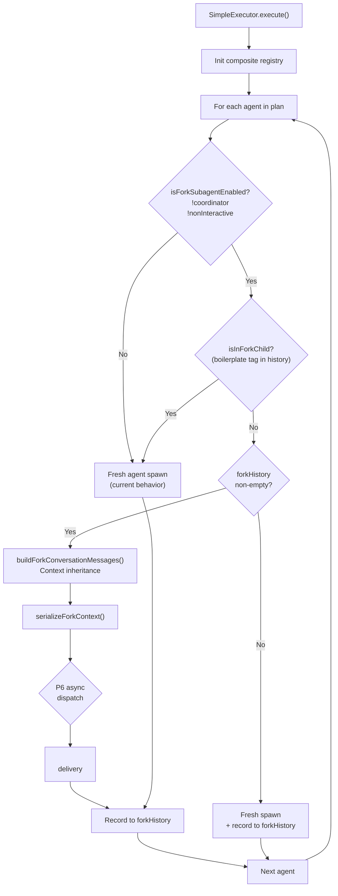

# SPARC Spec: P8 — Fork Runtime Wiring

**Phase:** P8 (Medium)  
**Priority:** Medium  
**Estimated Effort:** 3 days  
**Source Blueprint:** Claude Code Original — `tools/AgentTool/forkSubagent.ts` (6K), `AgentTool.tsx` (lines 495-512)  
**Depends On:** P6 (task backbone) for async dispatch and task-notification delivery

---

## S — Specification

### 1. Requirements

```yaml
specification:
  functional_requirements:
    - id: "FR-P8-001"
      description: "simple-executor shall gate the fork path using isForkSubagentEnabled()"
      priority: "critical"
      acceptance_criteria:
        - "isForkSubagentEnabled(isCoordinator, isNonInteractive) called before any fork logic"
        - "When false, executor falls through to fresh-agent spawn path"
        - "Coordinator mode always returns false (coordinator has its own delegation model)"
        - "Non-interactive sessions always return false (no task-notification delivery)"

    - id: "FR-P8-002"
      description: "simple-executor shall call isInForkChild() before attempting fork to prevent recursive forking"
      priority: "critical"
      acceptance_criteria:
        - "isInForkChild(forkHistory) checked after isForkSubagentEnabled() passes"
        - "When true, fork is skipped and agent runs as fresh spawn"
        - "Detection works by scanning forkHistory for FORK_BOILERPLATE_TAG"
        - "Fork depth is limited to 1 (fork children cannot fork again)"

    - id: "FR-P8-003"
      description: "Fork children shall receive parent context via buildForkConversationMessages()"
      priority: "high"
      acceptance_criteria:
        - "buildForkConversationMessages(parentMessages, directive) used for context inheritance"
        - "All tool_result blocks in parent history replaced with FORK_PLACEHOLDER_RESULT"
        - "Directive appended as final user message with <fork-context> boilerplate tag"
        - "All fork children from the same parent produce byte-identical message prefixes"
        - "buildForkMessages() convenience wrapper remains available but context inheritance uses the full function"

    - id: "FR-P8-004"
      description: "FORK_AGENT synthetic definition shall be used when agent's subagent_type is omitted"
      priority: "high"
      acceptance_criteria:
        - "FORK_AGENT definition used for fork spawns (agentType='fork', maxTurns=200)"
        - "FORK_AGENT is never added to the agent registry — it is implicit-only"
        - "When subagent_type is present on PlannedAgent, fresh agent spawn used"
        - "When subagent_type is omitted and fork is eligible, FORK_AGENT definition applied"
        - "FORK_AGENT.model = 'inherit' signals parent model reuse"

    - id: "FR-P8-005"
      description: "createCompositeAgentRegistry() shall merge disk agents with fork agent at executor initialization"
      priority: "high"
      acceptance_criteria:
        - "createCompositeAgentRegistry(diskAgents, programmaticAgents) called during SimpleExecutor construction"
        - "getDefaultProgrammaticAgents() provides FORK_AGENT as built-in programmatic agent"
        - "Programmatic agents override disk agents with the same agentType"
        - "Composite registry used for all agent lookups within the executor"
        - "agentRegistry.getByPath() calls route through composite registry"

    - id: "FR-P8-006"
      description: "All agent dispatches shall become async when fork is enabled (forced async)"
      priority: "high"
      acceptance_criteria:
        - "When isForkSubagentEnabled() returns true, all agent spawns (fork and fresh) run async"
        - "Async dispatch uses unified <task-notification> interaction model"
        - "Parent executor does NOT block on fork child completion"
        - "Parent must NOT peek at fork output file during execution"
        - "Depends on P6 task backbone for async dispatch infrastructure"

    - id: "FR-P8-007"
      description: "Fork children shall share parent model for prompt cache reuse"
      priority: "medium"
      acceptance_criteria:
        - "Fork child inherits parent's model (FORK_AGENT.model = 'inherit')"
        - "Model inheritance resolved at spawn time — not stored in messages"
        - "Different model busts cache — fork loses its primary advantage"
        - "Executor passes parent model reference to fork child configuration"

  non_functional_requirements:
    - id: "NFR-P8-001"
      category: "performance"
      description: "Fork context serialization should add < 10ms overhead per agent dispatch"
      measurement: "Benchmark serializeForkContext() with 50-message history"

    - id: "NFR-P8-002"
      category: "correctness"
      description: "No fork-related code paths shall execute when fork is disabled"
      measurement: "Coverage report shows zero fork branch hits in coordinator mode tests"

    - id: "NFR-P8-003"
      category: "observability"
      description: "Fork eligibility decisions shall be logged with rationale"
      measurement: "Logger emits fork-eligible/fork-blocked with reason for every agent dispatch"
```

### 2. Constraints

```yaml
constraints:
  technical:
    - "FORK_AGENT is implicit-only — never appears in registry listings or agent discovery"
    - "Byte-identical API prefixes required for cache sharing — FORK_PLACEHOLDER_RESULT must be constant"
    - "Fork uses permissionMode: 'bubble' — permission prompts surface to parent"
    - "Fork maxTurns: 200 (high limit for autonomous work)"
    - "isInForkChild() detection relies on string scanning for FORK_BOILERPLATE_TAG in user messages"

  architectural:
    - "Fork mutually exclusive with coordinator mode (P2)"
    - "Fork disabled in non-interactive sessions"
    - "Fork depth limited to 1 (children cannot re-fork)"
    - "Async dispatch depends on P6 task backbone — P6 must be wired first"
    - "Composite registry is additive — existing AgentRegistry interface unchanged"

  migration:
    - "Current imports (shouldUseFork, buildForkMessages, ForkMessage) remain valid"
    - "New imports (isForkSubagentEnabled, isInForkChild, buildForkConversationMessages, FORK_AGENT, createCompositeAgentRegistry) added incrementally"
    - "No breaking changes to SimpleExecutorDeps interface"
    - "forkHistory array already exists in simple-executor — wiring extends its usage"
```

### 3. Use Cases

```yaml
use_cases:
  - id: "UC-P8-001"
    title: "Fork-Eligible Agent Dispatch"
    actor: "SimpleExecutor"
    flow:
      1. "Executor receives plan with 3 sequential agents"
      2. "Agent 1 runs fresh (no fork history yet)"
      3. "Agent 1 completes — prompt/response recorded in forkHistory"
      4. "Agent 2: isForkSubagentEnabled(false, false) -> true"
      5. "Agent 2: isInForkChild(forkHistory) -> false (no boilerplate tag)"
      6. "Agent 2: buildForkConversationMessages(forkHistory, prompt) -> fork messages"
      7. "Agent 2 runs with inherited context, prompt cache shared with parent"
      8. "Agent 2 completes — added to forkHistory"
      9. "Agent 3 follows same fork path with richer context"

  - id: "UC-P8-002"
    title: "Fork Blocked in Coordinator Mode"
    actor: "SimpleExecutor"
    flow:
      1. "Plan has methodology='coordinator'"
      2. "isCoordinator resolves to true"
      3. "isForkSubagentEnabled(true, false) -> false"
      4. "All agents run as fresh spawns — no fork context applied"
      5. "Logger emits: 'Fork blocked: coordinator mode'"

  - id: "UC-P8-003"
    title: "Composite Registry Initialization"
    actor: "SimpleExecutor"
    flow:
      1. "createSimpleExecutor(deps) called"
      2. "getDefaultProgrammaticAgents() returns Map with FORK_AGENT"
      3. "createCompositeAgentRegistry(deps.agentRegistry.asMap(), programmaticAgents)"
      4. "Composite registry used for agent lookups"
      5. "FORK_AGENT available for implicit fork spawns"
      6. "Disk agents still resolved by path for explicit subagent_type"

  - id: "UC-P8-004"
    title: "Recursion Guard — Fork Child Cannot Re-Fork"
    actor: "SimpleExecutor (running inside fork child)"
    flow:
      1. "Fork child's forkHistory contains <fork-context> boilerplate tag"
      2. "Child attempts to dispatch a sub-agent"
      3. "isInForkChild(forkHistory) -> true"
      4. "Fork path skipped — sub-agent runs as fresh spawn"
      5. "Logger emits: 'Fork blocked: already in fork child (depth limit)'"
```

---

## P — Pseudocode

### Fork Feature Gate in Executor

```
ALGORITHM: GateForkPath
INPUT: isCoordinator (boolean), isNonInteractive (boolean),
       forkHistory (ForkMessage[]), prompt (string)
OUTPUT: forkContextPrefix (string | undefined)

BEGIN
    // Gate 1: Feature enabled?
    IF NOT isForkSubagentEnabled(isCoordinator, isNonInteractive) THEN
        logger.debug('Fork blocked: feature disabled',
            { isCoordinator, isNonInteractive })
        RETURN undefined
    END IF

    // Gate 2: Already in fork child?
    IF isInForkChild(forkHistory) THEN
        logger.debug('Fork blocked: already in fork child (depth limit)')
        RETURN undefined
    END IF

    // Gate 3: First agent has no history to inherit
    IF forkHistory.length === 0 THEN
        logger.debug('Fork skipped: no prior history to inherit')
        RETURN undefined
    END IF

    // All gates passed — build fork context
    forkedMessages <- buildForkConversationMessages(forkHistory, prompt)
    forkContextPrefix <- serializeForkContext(forkedMessages)

    logger.info('Fork context applied', {
        forkHistoryLength: forkHistory.length,
        prefixBytes: forkContextPrefix.length,
    })

    RETURN forkContextPrefix
END
```

### Composite Registry Initialization

```
ALGORITHM: InitCompositeRegistry
INPUT: agentRegistry (AgentRegistry)
OUTPUT: compositeRegistry (Map<string, AgentEntry>)

BEGIN
    // Get disk-loaded agents from existing registry
    diskAgents <- agentRegistry.listAll()
    diskMap <- new Map()
    FOR EACH agent IN diskAgents DO
        diskMap.set(agent.agentType, agent)
    END FOR

    // Get programmatic agents (includes FORK_AGENT)
    programmaticAgents <- getDefaultProgrammaticAgents()

    // Merge: programmatic overrides disk
    compositeRegistry <- createCompositeAgentRegistry(diskMap, programmaticAgents)

    RETURN compositeRegistry
END
```

### Fork Agent Resolution

```
ALGORITHM: ResolveAgentDefinition
INPUT: agent (PlannedAgent), compositeRegistry (Map<string, AgentEntry>)
OUTPUT: agentDef (AgentEntry), isForkPath (boolean)

BEGIN
    IF agent.subagentType IS DEFINED THEN
        // Explicit subagent_type -> fresh agent, look up by type
        agentDef <- compositeRegistry.get(agent.subagentType)
            ?? compositeRegistry.get(agent.type)
        isForkPath <- false
    ELSE
        // No subagent_type -> implicit fork candidate
        // FORK_AGENT definition used for spawn configuration
        agentDef <- getForkAgentDefinition()
        isForkPath <- true
    END IF

    RETURN (agentDef, isForkPath)
END
```

### Forced Async Dispatch

```
ALGORITHM: DispatchAgent
INPUT: agent (PlannedAgent), prompt (string),
       forkEnabled (boolean), isForkPath (boolean),
       forkContextPrefix (string | undefined)
OUTPUT: execResult (TaskExecutionResult)

NOTES:
    // When fork is enabled, ALL agent spawns become async.
    // This is the "forceAsync = isForkSubagentEnabled()" pattern
    // from AgentTool.tsx line ~512. Unified task-notification model.
    // DEPENDS ON P6 task backbone for async infrastructure.

BEGIN
    forceAsync <- forkEnabled  // All spawns async when fork is on

    IF forceAsync THEN
        // P6 async dispatch — non-blocking, task-notification delivery
        taskId <- taskBackbone.dispatch({
            prompt,
            forkContextPrefix,
            model: isForkPath ? 'inherit' : agent.model,
            maxTurns: isForkPath ? 200 : agent.maxTurns,
            async: true,
        })
        // Wait for task-notification (P6 handles delivery)
        execResult <- AWAIT taskBackbone.waitForCompletion(taskId)
    ELSE
        // Synchronous execution (fork disabled — current behavior)
        execResult <- AWAIT interactiveExecutor.execute({
            prompt,
            forkContextPrefix,
            // ... existing params
        })
    END IF

    RETURN execResult
END
```

---

## A — Architecture

### Fork Runtime Flow



### Wiring Points in simple-executor.ts

```
src/execution/simple-executor.ts — Changes required:

Line 30-31 (imports):
  + import { isForkSubagentEnabled, isInForkChild,
  +          buildForkConversationMessages, FORK_AGENT } from '../agents/fork/index';
  + import { createCompositeAgentRegistry,
  +          getDefaultProgrammaticAgents } from '../agents/fork/index';
  (shouldUseFork, buildForkMessages remain — shouldUseFork is replaced
   by explicit gate calls; buildForkMessages kept for backward compat)

Line 98 (createSimpleExecutor):
  + Initialize composite registry:
  +   const programmaticAgents = getDefaultProgrammaticAgents();
  +   // compositeRegistry merges disk + programmatic (FORK_AGENT)

Line 127-128 (fork flags):
  Existing isCoordinator/isNonInteractive flags already present.
  Replace shouldUseFork() call with explicit 3-gate pattern:
    1. isForkSubagentEnabled(isCoordinator, isNonInteractive)
    2. isInForkChild(forkHistory)
    3. forkHistory.length > 0

Line 208-217 (fork eligibility block):
  Replace current block with GateForkPath algorithm.
  Use buildForkConversationMessages() instead of buildForkMessages()
  for full context inheritance.

Line 231-241 (execution):
  When fork is enabled and P6 is available, dispatch async.
  Pass FORK_AGENT.model = 'inherit' for model resolution.
```

### File Structure (no new files)

```
src/agents/fork/
  index.ts              — Already exports all 16 symbols (no changes)
  forkSubagent.ts       — Already implemented (no changes)
  forkRegistry.ts       — Already implemented (no changes)
  types.ts              — Already implemented (no changes)

src/execution/
  simple-executor.ts    — WIRING TARGET: consume remaining 13 exports
  fork-context.ts       — Already implemented (no changes)
```

---

## R — Refinement

### Test Plan

| FR | Test Description | Key Assertions |
|----|-----------------|----------------|
| FR-P8-001 | Feature gate blocks fork in coordinator mode | `isCoordinator: true` → fork skipped, log "Fork blocked: feature disabled" |
| FR-P8-001 | Feature gate blocks fork in non-interactive | `isNonInteractive: true` → fork skipped |
| FR-P8-001 | Feature gate allows fork when both flags false | Second agent gets fork context applied |
| FR-P8-002 | Recursion guard detects boilerplate tag | `isInForkChild(messagesWithTag)` → true |
| FR-P8-002 | Recursion guard passes normal messages | `isInForkChild(normalMessages)` → false |
| FR-P8-003 | Context inheritance replaces tool_result | `buildForkConversationMessages` replaces content with `FORK_PLACEHOLDER_RESULT` |
| FR-P8-003 | Identical prefixes for different directives | `fork1.slice(0,-1)` equals `fork2.slice(0,-1)` (cache sharing) |
| FR-P8-004 | FORK_AGENT synthetic definition | type: 'fork', model: 'inherit', maxTurns: 200, source: 'built-in' |
| FR-P8-005 | Composite registry merges disk + programmatic | Both 'coder' (disk) and 'fork' (programmatic) present |
| FR-P8-005 | Programmatic overrides disk | `composite.get('fork')?.source === 'built-in'` |
| FR-P8-007 | Model inheritance resolution | `FORK_AGENT.model === 'inherit'` → resolves to parent model |

All tests use `node:test` + `node:assert/strict` with mock-first pattern.

### Anti-Patterns to Enforce

```yaml
anti_patterns:
  - name: "Fork Without Gate"
    bad: "if (forkHistory.length > 0) { buildForkConversationMessages(...) }"
    good: "if (isForkSubagentEnabled(...) && !isInForkChild(...) && forkHistory.length > 0) { ... }"
    enforcement: "All three gates must be checked in order before fork path"

  - name: "shouldUseFork as Single Check"
    bad: "Using shouldUseFork() alone without isForkSubagentEnabled() for forced-async decision"
    good: "isForkSubagentEnabled() for async gating, shouldUseFork() combines both checks"
    enforcement: "Forced-async requires feature gate only — recursion guard is separate concern"

  - name: "Fork Agent in Registry Listings"
    bad: "FORK_AGENT appears in agent discovery or registry.listAll()"
    good: "FORK_AGENT is implicit — only used when subagent_type is omitted"
    enforcement: "Composite registry includes it but agent listing filters source='built-in'"

  - name: "Synchronous Fork Dispatch"
    bad: "await interactiveExecutor.execute({ forkContextPrefix }) // blocking"
    good: "await taskBackbone.dispatch({ async: true, forkContextPrefix }) // P6 async"
    enforcement: "When fork enabled, forceAsync=true for ALL dispatches (fork and fresh)"

  - name: "Model Override on Fork"
    bad: "fork child uses default model instead of parent's model"
    good: "fork child resolves FORK_AGENT.model='inherit' to parent's actual model"
    enforcement: "Model mismatch busts prompt cache — defeats fork's purpose"
```

### Migration Checklist

```yaml
migration:
  phase_1_gate_wiring:
    - "Add isForkSubagentEnabled import to simple-executor"
    - "Add isInForkChild import to simple-executor"
    - "Replace shouldUseFork() block with explicit 3-gate pattern"
    - "Add logging for fork eligibility decisions"
    - "Run tests: npm test"

  phase_2_context_inheritance:
    - "Replace buildForkMessages() with buildForkConversationMessages() in fork path"
    - "Verify byte-identical prefix invariant with test"
    - "Run tests: npm test"

  phase_3_composite_registry:
    - "Add createCompositeAgentRegistry and getDefaultProgrammaticAgents imports"
    - "Initialize composite registry in createSimpleExecutor()"
    - "Route agent lookups through composite registry"
    - "Run tests: npm test"

  phase_4_fork_agent_resolution:
    - "Add FORK_AGENT import to simple-executor"
    - "Implement subagent_type omission detection"
    - "Apply FORK_AGENT definition for implicit fork spawns"
    - "Run tests: npm test"

  phase_5_async_dispatch:
    - "BLOCKED ON P6 — task backbone must exist first"
    - "Add forceAsync = isForkSubagentEnabled() pattern"
    - "All agent dispatches async when fork is enabled"
    - "Model inheritance resolution at spawn time"
    - "Run tests: npm test && npm run build"
```

---

## C — Completion

### Definition of Done

```yaml
completion:
  criteria:
    - "All 16 exports from agents/fork/ are consumed in the execution path"
    - "isForkSubagentEnabled() gates fork path — zero fork code runs in coordinator mode"
    - "isInForkChild() prevents recursive forking (depth = 1)"
    - "buildForkConversationMessages() used for context inheritance (not just buildForkMessages)"
    - "FORK_AGENT definition used for implicit fork spawns"
    - "createCompositeAgentRegistry() merges disk + programmatic agents at init"
    - "Forced async dispatch wired (P6 dependency — may be stubbed initially)"
    - "Fork children inherit parent model for cache reuse"
    - "All tests pass: npm test"
    - "Build succeeds: npm run build"
    - "Type check passes: npx tsc --noEmit"

  verification:
    - "Run tests with coordinator mode enabled — zero fork branches hit"
    - "Run tests with isNonInteractive=true — zero fork branches hit"
    - "Run tests with 2+ sequential agents — second agent has fork context"
    - "Verify byte-identical prefix: two forks from same parent produce equal prefixes"
    - "Verify FORK_AGENT not in registry.listAll() output"

  out_of_scope:
    - "P6 task backbone implementation (separate spec)"
    - "P2 coordinator mode changes (orthogonal)"
    - "P5 fork subagent core implementation (already complete)"
    - "Fork performance benchmarking (NFR-P8-001 validated post-wiring)"
```

### Current Export Consumption Audit

```yaml
export_audit:
  consumed_before_P8:
    - "shouldUseFork — simple-executor.ts line 30"
    - "buildForkMessages — simple-executor.ts line 30"
    - "ForkMessage (type) — simple-executor.ts line 31"

  consumed_after_P8:
    - "isForkSubagentEnabled — fork feature gate (FR-P8-001)"
    - "isInForkChild — recursion guard (FR-P8-002)"
    - "buildForkConversationMessages — context inheritance (FR-P8-003)"
    - "FORK_AGENT — synthetic agent definition (FR-P8-004)"
    - "FORK_BOILERPLATE_TAG — (transitive via isInForkChild)"
    - "FORK_PLACEHOLDER_RESULT — (transitive via buildForkConversationMessages)"
    - "createCompositeAgentRegistry — registry merge (FR-P8-005)"
    - "getDefaultProgrammaticAgents — programmatic agents (FR-P8-005)"
    - "getForkAgentDefinition — direct FORK_AGENT access (FR-P8-004)"
    - "AgentEntry (type) — composite registry typing (FR-P8-005)"
    - "ForkContentBlock (type) — message block typing"
    - "ForkTextBlock (type) — text block typing"
    - "ForkToolUseBlock (type) — tool use block typing"
    - "ForkToolResultBlock (type) — tool result block typing"
    - "ForkAgentDefinition (type) — agent definition typing"
    - "shouldUseFork — kept for backward compat / convenience"
    - "buildForkMessages — kept for backward compat / convenience"
    - "ForkMessage (type) — already consumed"

  total: "16 exports from index.ts + 2 types already consumed = all wired"
```
