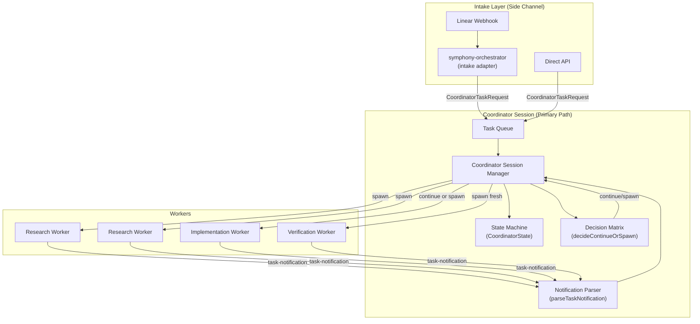

# SPARC Spec: P9 — Coordinator Promotion to Primary Execution Model

**Phase:** P9 (High)  
**Priority:** High  
**Estimated Effort:** 6 days  
**Dependencies:** P6 (task backbone — required), P7 (NDJSON structured communication — recommended)  
**Source Blueprint:** Claude Code Original — `coordinator/coordinatorMode.ts` (19K), `Task.ts`, `utils/task/framework.ts`

---

## S — Specification

### 1. Problem Statement

The coordinator module (`src/coordinator/`) exports 13 items but only 3 are consumed:
`getCoordinatorSystemPrompt()`, `getCoordinatorUserContext()`, and `isCoordinatorMode()`.
The decision matrix (`decideContinueOrSpawn`), notification parser
(`parseTaskNotification`, `isTaskNotification`), and full type system
(`WorkerPhase`, `WorkerState`, `CoordinatorState`, `TaskSpec`) are all implemented
but unused.

This gap exists because orch-agents currently uses a webhook-driven orchestration
model (`symphony-orchestrator` + Linear state machine) that bypasses the coordinator
pattern entirely. The symphony-orchestrator dispatches worker_threads directly,
manages retry/backoff itself, and never consults the coordinator's decision matrix
or notification handling.

The architectural direction: promote the coordinator from an opt-in prompt wrapper
to the **primary execution model**. Linear webhooks become a **side channel** that
feeds tasks into the coordinator's queue rather than directly dispatching workers.

### 2. Requirements

```yaml
specification:
  functional_requirements:
    - id: "FR-P9-001"
      description: "Coordinator session shall evolve from prompt wrapper to full session manager with message processing loop"
      priority: "critical"
      acceptance_criteria:
        - "coordinator-session.ts manages a CoordinatorState instance across turns"
        - "Incoming user-role messages scanned for <task-notification> XML via isTaskNotification()"
        - "Detected notifications parsed via parseTaskNotification() and routed to state handler"
        - "CoordinatorState.workers map updated on every notification receipt"
        - "CoordinatorState.currentPhase transitions: research -> synthesis -> implementation -> verification"

    - id: "FR-P9-002"
      description: "Coordinator shall use decideContinueOrSpawn() for all worker dispatch decisions"
      priority: "critical"
      acceptance_criteria:
        - "After research completion, coordinator consults decision matrix before next dispatch"
        - "WorkerState.filesExplored populated from task-notification result content"
        - "Context overlap calculation drives continue vs spawn for implementation phase"
        - "Verification tasks always spawn fresh (rule enforced by decision matrix)"
        - "Failure corrections always continue existing worker (error context preserved)"

    - id: "FR-P9-003"
      description: "Symphony-orchestrator shall be refactored to webhook ingestion layer only"
      priority: "critical"
      acceptance_criteria:
        - "Orchestration logic (retry, backoff, worker lifecycle) removed from symphony-orchestrator"
        - "symphony-orchestrator creates CoordinatorTaskRequest objects from Linear issues"
        - "Task requests enqueued to coordinator's task queue (not dispatched directly)"
        - "Worker thread spawning delegated to coordinator session"
        - "symphony-orchestrator retains: webhook event reception, issue fetching, state filtering"

    - id: "FR-P9-004"
      description: "Coordinator mode shall be the default execution mode"
      priority: "high"
      acceptance_criteria:
        - "isCoordinatorMode() returns true by default (not gated behind env var)"
        - "Opt-out via CLAUDE_CODE_COORDINATOR_MODE=0 for direct execution fallback"
        - "All Linear issue dispatches route through coordinator session"
        - "Direct API task submissions also route through coordinator session"

    - id: "FR-P9-005"
      description: "WorkerPhase tracking shall enforce 4-phase workflow across all task sources"
      priority: "high"
      acceptance_criteria:
        - "Every task entering coordinator tagged with initial phase (research)"
        - "Phase transitions recorded: research -> synthesis -> implementation -> verification"
        - "Coordinator blocks implementation dispatch until synthesis completes"
        - "Findings map populated during research, consumed during synthesis"
        - "Phase state visible via coordinator state queries"

    - id: "FR-P9-006"
      description: "Side channel path shall feed Linear webhook events into coordinator task queue"
      priority: "high"
      acceptance_criteria:
        - "Linear webhook intake emits CoordinatorTaskRequest (not direct worker spawn)"
        - "Task request includes: issue ID, issue data, resolved repo config, priority"
        - "Coordinator decides scheduling order based on its current worker inventory"
        - "Webhook-sourced and API-sourced tasks share the same coordinator dispatch path"

    - id: "FR-P9-007"
      description: "Coordinator shall maintain active worker inventory with lifecycle tracking"
      priority: "high"
      acceptance_criteria:
        - "CoordinatorState.workers tracks all active workers by task ID"
        - "Worker entries include: phase, status, description, filesExplored, startTime"
        - "Workers removed from inventory on terminal status (completed, failed, killed)"
        - "Concurrency limits enforced: parallel research, serial implementation per file set"

    - id: "FR-P9-008"
      description: "Task notification delivery shall be wired into coordinator message loop"
      priority: "high"
      acceptance_criteria:
        - "P6 task backbone delivers <task-notification> XML as user-role messages"
        - "Coordinator session intercepts notifications before passing to LLM"
        - "Parsed notifications update CoordinatorState and trigger phase transitions"
        - "Notification handler returns CoordinatorAction (wait, continue, spawn, report)"

  non_functional_requirements:
    - id: "NFR-P9-001"
      category: "migration"
      description: "Refactoring must be incremental — symphony-orchestrator keeps working during transition"
      measurement: "Existing tests pass at each migration step"

    - id: "NFR-P9-002"
      category: "observability"
      description: "Coordinator state transitions emit structured log events"
      measurement: "Phase transitions, worker spawns, and dispatch decisions logged with context"

    - id: "NFR-P9-003"
      category: "latency"
      description: "Coordinator dispatch overhead adds < 50ms to task start time"
      measurement: "Time from task queue insertion to worker spawn"

    - id: "NFR-P9-004"
      category: "backward_compatibility"
      description: "Direct execution fallback available via CLAUDE_CODE_COORDINATOR_MODE=0"
      measurement: "Setting env var restores pre-P9 symphony-orchestrator direct dispatch"
```

### 3. Constraints

```yaml
constraints:
  technical:
    - "P6 task backbone required for <task-notification> delivery mechanism"
    - "P7 NDJSON recommended for structured worker-to-coordinator communication"
    - "CoordinatorState must be serializable for persistence across restarts"
    - "Worker thread communication uses existing postMessage/on('message') interface"

  architectural:
    - "Coordinator session is the single dispatch authority — no bypass paths in normal mode"
    - "Symphony-orchestrator becomes a pure intake adapter (no orchestration logic)"
    - "isCoordinatorMode() default flip must be feature-flagged during rollout"
    - "Coordinator pattern mutually exclusive with fork subagent (P5 constraint preserved)"
```

### 4. Use Cases

```yaml
use_cases:
  - id: "UC-P9-001"
    title: "Linear Issue Routed Through Coordinator"
    actor: "Linear Webhook"
    flow:
      1. "Linear webhook fires: issue moved to 'In Progress'"
      2. "symphony-orchestrator receives event, fetches issue data"
      3. "symphony-orchestrator creates CoordinatorTaskRequest with issue context"
      4. "Coordinator session receives task, spawns research worker"
      5. "Research worker reports via <task-notification> XML"
      6. "Coordinator parses notification, records findings"
      7. "Coordinator synthesizes findings, consults decideContinueOrSpawn()"
      8. "Decision: continue worker (high file overlap) for implementation"
      9. "Implementation worker completes, coordinator spawns fresh verifier"
      10. "Verification passes, coordinator reports completion"

  - id: "UC-P9-002"
    title: "Direct API Task Through Coordinator"
    actor: "API Client"
    flow:
      1. "API receives task submission (no Linear issue involved)"
      2. "Task converted to CoordinatorTaskRequest"
      3. "Same coordinator dispatch path as webhook-sourced tasks"
      4. "4-phase workflow executes identically"

  - id: "UC-P9-003"
    title: "Coordinator Handles Worker Failure"
    actor: "Coordinator"
    flow:
      1. "Implementation worker fails, sends <task-notification status='failed'>"
      2. "Coordinator parses failure, checks decideContinueOrSpawn()"
      3. "Decision: continue (error context is valuable for correction)"
      4. "Coordinator sends correction directive to same worker"
      5. "Worker retries with full error context preserved"
```

### 5. Acceptance Criteria (Gherkin)

```gherkin
Feature: Coordinator Promotion

  Scenario: Coordinator mode is default
    Given no CLAUDE_CODE_COORDINATOR_MODE environment variable is set
    When isCoordinatorMode() is called
    Then it returns true

  Scenario: Coordinator mode opt-out
    Given CLAUDE_CODE_COORDINATOR_MODE is set to "0"
    When isCoordinatorMode() is called
    Then it returns false

  Scenario: Task notification parsed and routed
    Given a worker sends a <task-notification> with status "completed"
    When the coordinator session processes the message
    Then parseTaskNotification() extracts taskId, status, summary, result
    And CoordinatorState.workers is updated for that taskId
    And the coordinator decides the next action

  Scenario: Decision matrix consulted for dispatch
    Given a research worker completed with filesExplored ["src/a.ts", "src/b.ts"]
    And the next task targets ["src/a.ts", "src/b.ts", "src/c.ts"]
    When decideContinueOrSpawn() is called
    Then it returns "continue" (overlap > 0.7)

  Scenario: Symphony-orchestrator creates task request
    Given a Linear webhook fires for issue LIN-42
    When symphony-orchestrator processes the event
    Then it creates a CoordinatorTaskRequest (not a worker thread directly)
    And the task request is enqueued to the coordinator

  Scenario: Phase transitions enforced
    Given coordinator is in "research" phase with 2 active workers
    When both workers complete
    Then coordinator transitions to synthesis
    And implementation dispatch is blocked until synthesis completes
```

---

## P — Pseudocode

### Core Types

```
CoordinatorTaskRequest = { id, source: 'linear-webhook'|'api'|'direct',
  issueId?, issueData?, repoConfig?, description, priority }

CoordinatorAction =
  | { type: 'wait' }
  | { type: 'spawn', phase: WorkerPhase, spec: TaskSpec }
  | { type: 'continue', workerId, message }
  | { type: 'report', summary }
```

### Coordinator Session Manager

```
createCoordinatorSession(deps):
  state = { workers: Map, findings: Map, currentPhase: 'research', taskQueue: [] }

  processMessage(msg):
    IF msg contains <task-notification>:
      n = parseTaskNotification(msg.text)
      worker = state.workers.get(n.taskId)
      IF n.status === 'completed':
        state.findings.set(n.taskId, n.result)
        IF worker.phase === 'research' AND allResearchComplete:
          state.currentPhase = 'synthesis'; return { type: 'wait' }
        IF worker.phase === 'implementation':
          return { type: 'spawn', phase: 'verification', spec: ... }
        IF worker.phase === 'verification':
          return { type: 'report', summary: ... }
      IF n.status === 'failed':
        decision = decideContinueOrSpawn(worker, correctionTask)
        return decision === 'continue' ? { type: 'continue' } : { type: 'spawn' }
    ELSE: return { type: 'wait' }  // pass through to LLM
```

### Symphony-Orchestrator Intake Adapter

```
// Retains: webhook reception, issue fetching, state filtering
// Loses: worker spawning, retry/backoff, lifecycle management
symphonyIntakeAdapter(webhookEvent):
  issue = linearClient.fetchIssue(event.issueId)
  IF NOT isValidStateTransition(issue): return null
  return CoordinatorTaskRequest { source: 'linear-webhook', issueId, ... }
```

### Default Mode Flip + Task Queue Dispatch

```
isCoordinatorMode():  return env !== '0'  // P9: default ON, opt-out via "0"

dispatchFromQueue(state, queue):
  research tasks → spawn in parallel (no file conflicts)
  implementation tasks → serialize on overlapping file sets
```

---

## A — Architecture

### Execution Flow: Before and After

```
BEFORE (current):
  Linear Webhook -> symphony-orchestrator -> worker_threads (direct)
                    ^^^^^^^^^^^^^^^^^^^^^^^^^^^^^^^^^^^^^^^^^
                    Orchestration + dispatch + retry + lifecycle

AFTER (P9):
  Linear Webhook -> symphony-orchestrator -> CoordinatorTaskRequest -> coordinator-session
  API Request    -> task-endpoint          -> CoordinatorTaskRequest -> coordinator-session
                    ^^^^^^^^^^^^^^^^^^^      ^^^^^^^^^^^^^^^^^^^^^^^^   ^^^^^^^^^^^^^^^^^
                    Intake only              Shared queue               Full orchestration
```

### Component Diagram



### File Changes

```
MODIFIED:
  src/coordinator/index.ts
    - isCoordinatorMode() default flipped: true unless env "0"
    - New export: CoordinatorTaskRequest type

  src/execution/runtime/coordinator-session.ts
    - Evolves from prompt wrapper to full session manager
    - Manages CoordinatorState across turns
    - Message processing loop with notification interception
    - Task queue with dispatch logic
    - Phase transition enforcement

  src/execution/orchestrator/symphony-orchestrator.ts
    - Strips: worker spawning, retry/backoff, lifecycle management
    - Keeps: webhook reception, issue fetching, state filtering
    - New: creates CoordinatorTaskRequest, enqueues to coordinator
    - LOC reduction: ~815 -> ~250 (orchestration logic removed)

  src/coordinator/types.ts
    - Add: CoordinatorTaskRequest interface
    - Add: CoordinatorAction union type
    - Add: 'synthesis' to WorkerPhase union (research | synthesis | implementation | verification)

NEW (if needed):
  src/coordinator/taskQueue.ts
    - Priority queue for CoordinatorTaskRequest objects
    - Concurrency-aware dispatch (parallel read, serial write)
    - File-set conflict detection for implementation serialization
```

### Migration Strategy

```yaml
migration:
  phase_1_parallel_path:
    description: "Wire coordinator session alongside symphony-orchestrator"
    steps:
      - "Add CoordinatorTaskRequest type to coordinator/types.ts"
      - "Extend coordinator-session.ts with state management and notification handling"
      - "symphony-orchestrator creates task requests AND dispatches directly (dual path)"
      - "Feature flag: COORDINATOR_DISPATCH=1 routes through coordinator instead"
    validation: "Existing tests pass, new coordinator path exercised via flag"

  phase_2_default_flip:
    description: "Make coordinator the default path"
    steps:
      - "Flip isCoordinatorMode() default to true"
      - "symphony-orchestrator stops direct worker dispatch by default"
      - "Opt-out via CLAUDE_CODE_COORDINATOR_MODE=0"
    validation: "Integration tests confirm coordinator handles all dispatch"

  phase_3_cleanup:
    description: "Remove orchestration logic from symphony-orchestrator"
    steps:
      - "Strip retry/backoff/lifecycle from symphony-orchestrator"
      - "Remove dead code paths for direct worker dispatch"
      - "symphony-orchestrator is pure intake adapter (~250 LOC)"
    validation: "symphony-orchestrator tests updated, coordinator tests comprehensive"
```

---

## R — Refinement

### Test Plan

| Module | Test File | Key Assertions |
|--------|-----------|----------------|
| CoordinatorSession state | `coordinator-session.test.ts` | init with empty state (phase: research); track spawned workers; worker count matches enqueued tasks |
| Notification processing | `coordinator-session.test.ts` | detect `<task-notification>` XML; update worker status on notification; record findings from completed research; transition to synthesis when all research workers complete |
| Decision matrix | `coordinator-session.test.ts` | consult `decideContinueOrSpawn` on failures; continue worker on correction; spawn fresh verifier after implementation |
| isCoordinatorMode | `coordinator-mode.test.ts` | true by default (no env var); false when `CLAUDE_CODE_COORDINATOR_MODE=0`; true when `=1` |
| SymphonyIntakeAdapter | `symphony-intake.test.ts` | create `CoordinatorTaskRequest` from Linear issue; filter invalid state transitions; does NOT spawn worker threads directly (zero Worker() calls) |
| TaskQueue | `task-queue.test.ts` | dispatch research tasks in parallel; serialize implementation tasks with overlapping file sets |

All tests use `node:test` + `node:assert/strict` with mock-first pattern.

### Anti-Patterns to Enforce

```yaml
anti_patterns:
  - name: "Bypass Coordinator"
    bad: "symphony-orchestrator spawns worker_threads directly"
    good: "symphony-orchestrator creates CoordinatorTaskRequest, coordinator dispatches"
    enforcement: "No Worker() constructor calls in symphony-orchestrator (post-P9)"

  - name: "Duplicate Orchestration"
    bad: "Retry/backoff logic in both symphony-orchestrator and coordinator"
    good: "Retry/backoff lives only in coordinator session"
    enforcement: "symphony-orchestrator LOC check: must be < 300 after cleanup"

  - name: "Ignored Decision Matrix"
    bad: "Always spawning fresh workers without consulting decideContinueOrSpawn()"
    good: "Every post-research dispatch goes through decision matrix"
    enforcement: "Test verifies decideContinueOrSpawn called on every phase transition"

  - name: "Untracked Workers"
    bad: "Worker spawned but not added to CoordinatorState.workers"
    good: "Every spawn updates state.workers atomically before dispatch"
    enforcement: "Invariant check: spawned worker IDs always exist in state.workers"
```

### Performance Validation

```yaml
performance_validation:
  dispatch_overhead:
    measurement: "Time from CoordinatorTaskRequest creation to worker spawn"
    target: "< 50ms"
    rationale: "Coordinator dispatch is in-process decision, not network hop"

  state_management:
    measurement: "CoordinatorState serialization/deserialization time"
    target: "< 10ms for 50 workers"
    rationale: "State must be persistable for crash recovery"

  phase_transition:
    measurement: "Time from last research notification to synthesis start"
    target: "< 100ms"
    rationale: "Coordinator should react immediately when all research completes"
```

---

## C — Completion

### Definition of Done

```yaml
completion:
  code_deliverables:
    - "coordinator-session.ts: full session manager with state, notifications, dispatch"
    - "coordinator/types.ts: CoordinatorTaskRequest, CoordinatorAction, synthesis phase added"
    - "coordinator/index.ts: isCoordinatorMode() defaults to true"
    - "coordinator/taskQueue.ts: priority queue with concurrency-aware dispatch"
    - "symphony-orchestrator.ts: stripped to intake adapter (~250 LOC)"

  test_deliverables:
    - "Coordinator session state management tests"
    - "Notification processing and phase transition tests"
    - "Decision matrix integration tests"
    - "Symphony intake adapter tests (no direct worker spawning)"
    - "Task queue concurrency tests"
    - "isCoordinatorMode default flip tests"

  validation_gate:
    - "npm run build succeeds"
    - "npm test passes (all existing + new tests)"
    - "npx tsc --noEmit clean"
    - "No direct Worker() calls in symphony-orchestrator"
    - "All 13 coordinator exports consumed (zero unused exports)"
    - "Backward compatibility: CLAUDE_CODE_COORDINATOR_MODE=0 restores pre-P9 behavior"

  rollout:
    - "Phase 1: parallel path (feature flag) — 2 days"
    - "Phase 2: default flip — 2 days"
    - "Phase 3: cleanup dead orchestration code — 2 days"
```
