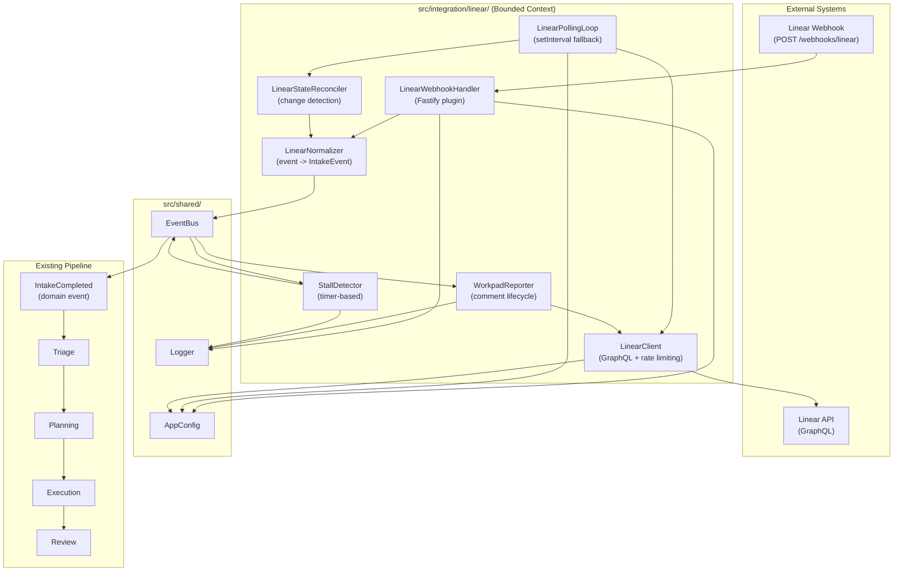
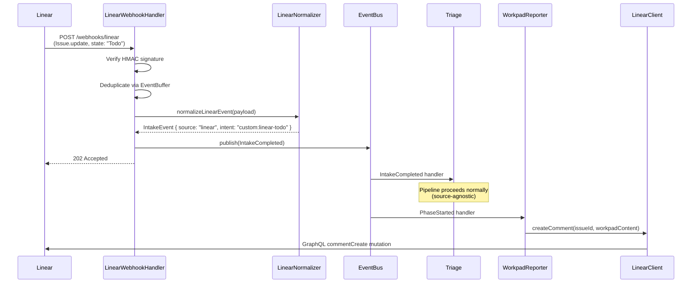
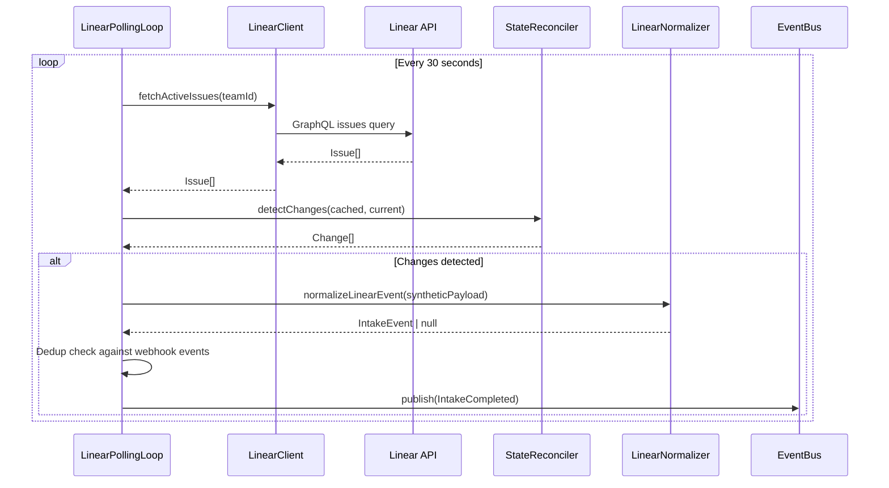

# GAP-14: Linear Integration (Dual-Trigger Model)

| Field | Value |
|-------|-------|
| **Gap ID** | GAP-14 |
| **Title** | Linear Integration for Dual-Trigger Agent Orchestration |
| **Priority** | P1-high |
| **Complexity** | High (65%) |
| **Methodology** | SPARC (Specification, Pseudocode, Architecture, Refinement, Completion) |
| **Date** | 2026-03-26 |
| **Status** | v2 — WORKFLOW.md Refactor (Symphony-inspired simplification) |
| **Depends On** | Existing IntakeEvent pipeline, EventBus, GitHubNormalizer pattern |
| **Informed By** | OpenAI Symphony research (docs/research_openai-symphony_20260326.md) |

---

## 1. Specification

### 1.1 Problem Statement

orch-agents currently supports only GitHub webhooks as a trigger source. The `IntakeEvent.source` type is defined as `'github' | 'client' | 'schedule' | 'system'` but only `'github'` has a concrete implementation with webhook handler, event parser, normalizer, and routing table.

The system needs a second trigger channel -- Linear project management -- to enable a dual-trigger model where:

- **Linear (hands-on)**: Humans move kanban cards, change labels, assign issues, and update priorities. These deliberate actions trigger agent workflows.
- **GitHub (autonomous)**: Push, PR, issue, and CI events trigger agents automatically without human intervention.

Both channels feed into the same 6-phase pipeline (Gateway, Intake, Triage, Planning, Execution, Review). The pipeline is already source-agnostic by design; only the trigger and normalization layers differ.

This pattern is validated by OpenAI's Symphony project, which implements the Linear-to-agent bridge in Elixir/OTP. We adopt Symphony's proven patterns (Workpad comments, stall detection, exponential backoff) while preserving orch-agents' structural advantages (multi-agent swarms, event sourcing, composable review gates, GitHub-native automation).

### 1.2 Requirements

**R1. Linear Webhook Listener**
Register a `POST /webhooks/linear` route on the existing Fastify server. Accept Linear webhook payloads for issue state changes (`Issue.update`), label changes, assignment changes, and priority changes. Verify the webhook signature using Linear's HMAC-SHA256 signing secret.

**R2. Linear GraphQL Client**
Provide a typed client for the Linear GraphQL API. Required operations: fetch issue by ID, fetch issue state, update issue state, create comment, update comment, fetch team workflow states. Respect Linear API rate limits (1800 requests/hour). Use exponential backoff on rate limit responses.

**R3. Kanban State to Pipeline Phase Mapping**
Define a configurable mapping from Linear issue states (Backlog, Todo, In Progress, Done, Cancelled) and labels (bug, feature, security, etc.) to IntakeEvent properties (intent, priority, template). Default mapping provided in `config/linear-routing.json`. Override per-team via TEAM.md or environment variables.

**R4. Task Properties to Workflow Template Routing**
Route Linear issues to workflow templates based on task properties:
- Label `bug` -> template `tdd-workflow`
- Label `feature` -> template `feature-build`
- Label `security` -> template `security-audit`
- Label `refactor` -> template `sparc-full`
- No matching label -> template `adhoc`

**R5. Polling Mode Fallback**
When webhooks are unavailable or unreliable, fall back to polling the Linear API every N seconds (configurable, default 30s, matching Symphony). Detect state changes by comparing current state against last-known state stored in memory. Deduplicate events that arrive via both webhook and polling.

**R6. Bidirectional Sync**
As agents progress through pipeline phases, update the Linear issue:
- Move issue state to match pipeline phase (e.g., Planning -> "In Progress")
- Post/update a Workpad comment with structured progress
- On completion, move issue to "Done" and post final summary

**R7. Workpad Comment Pattern**
Create a structured Markdown comment on the Linear issue that serves as a persistent progress scratchpad. The Workpad includes: current phase, agent roster, elapsed time, findings, and next steps. Identified by an HTML marker (`<!-- orch-agents-workpad -->`). Updated in-place via the Linear `commentUpdate` mutation.

**R8. Stall Detection and Auto-Recovery**
Monitor agent execution timestamps (`AgentExecState.lastActivity`). If no activity within a configurable timeout (scaled by complexity: trivial=60s, small=300s, medium=600s, large=1200s), emit a `WorkPaused` event, update the Workpad, and optionally restart the stalled agent.

**R9. GitHub Webhook Trigger Preserved**
All existing GitHub webhook functionality remains unchanged. The Linear integration is additive. Both triggers coexist and can operate on the same repository simultaneously. Feature-flagged via `LINEAR_ENABLED` environment variable (default: `false`).

**R10. IntakeEvent.source Extension**
Add `'linear'` to the `IntakeEvent.source` union type. No other type changes required. The pipeline is already source-agnostic downstream of IntakeEvent creation.

### 1.3 Acceptance Criteria

**AC1**: `POST /webhooks/linear` returns 202 Accepted for valid payloads with correct HMAC signature.

**AC2**: `POST /webhooks/linear` returns 401 Unauthorized for payloads with invalid or missing signatures.

**AC3**: A Linear issue moved from Backlog to Todo produces an IntakeEvent with `source: 'linear'`, `intent: 'custom:linear-todo'`, and `priority: 'P2-standard'`.

**AC4**: A Linear issue labeled `bug` produces an IntakeEvent with `sourceMetadata.template: 'tdd-workflow'`.

**AC5**: When polling mode is active and webhooks are disabled, state changes detected within 30s of the Linear API reflecting the change.

**AC6**: Events arriving via both webhook and polling are deduplicated (only one IntakeEvent produced).

**AC7**: Upon pipeline phase transitions, the Workpad comment on the Linear issue is updated with current status within 5 seconds.

**AC8**: When an agent stalls (no activity for the configured timeout), a `WorkPaused` event is emitted and the Workpad is updated with stall notification.

**AC9**: All existing GitHub webhook tests continue to pass without modification.

**AC10**: Setting `LINEAR_ENABLED=false` completely disables the Linear webhook route and polling loop. No Linear API calls are made.

**AC11**: Linear API rate limit responses (429) trigger exponential backoff, and the system does not exceed 1800 requests/hour under normal operation.

**AC12**: The LinearNormalizer produces `null` for events from the bot's own actions (loop prevention), matching the GitHubNormalizer behavior.

### 1.4 Constraints

- No Elixir, no OTP. Stays TypeScript/Node.js.
- Reuse existing pipeline infrastructure: EventBus, DomainEvent envelope, IntakeCompleted event flow.
- Follow the GitHubNormalizer and WebhookRouter patterns for consistency.
- No new npm dependencies for HTTP/GraphQL unless `graphql-request` or equivalent is already in the dependency tree. Prefer `fetch` with typed wrappers.
- All new code under `src/integration/linear/` bounded context.
- Configuration under `config/linear-routing.json`.
- Tests under `tests/integration/linear/`.

---

## 2. Pseudocode

### 2.1 Linear Webhook Handler

```
FUNCTION linearWebhookRoute(fastify, deps):
  config = deps.config
  logger = deps.logger
  eventBus = deps.eventBus
  buffer = deps.eventBuffer OR createEventBuffer()

  REGISTER POST /webhooks/linear:
    REQUEST (request, reply):
      IF NOT config.linearEnabled:
        RETURN reply.status(404).send({ error: "Linear integration disabled" })

      // Step 1: Extract and verify signature
      rawBody = request.rawBodyString
      signature = request.headers["linear-signature"]
      deliveryId = request.headers["linear-delivery"] OR generateUUID()

      IF NOT verifyLinearSignature(rawBody, signature, config.linearWebhookSecret):
        THROW AuthenticationError("Invalid Linear webhook signature")

      // Step 2: Parse Linear event payload
      payload = request.body
      eventType = payload.type          // e.g., "Issue"
      action = payload.action           // e.g., "update"
      updatedFrom = payload.updatedFrom // previous field values

      IF eventType != "Issue":
        RETURN reply.status(202).send({ status: "skipped", reason: "non-issue event" })

      // Step 3: Deduplication
      eventKey = `linear-${payload.data.id}-${payload.createdAt}`
      buffer.check(eventKey, payload.data.team?.key OR "unknown")

      // Step 4: Normalize to IntakeEvent
      intakeEvent = normalizeLinearEvent(payload, updatedFrom, config)

      IF intakeEvent == null:
        logger.info("Linear event skipped (bot sender or no matching rule)")
        RETURN reply.status(202).send({ status: "skipped" })

      // Step 5: Publish IntakeCompleted
      domainEvent = createDomainEvent("IntakeCompleted", { intakeEvent }, deliveryId)
      eventBus.publish(domainEvent)

      // Step 6: Return 202
      RETURN reply.status(202).send({ id: deliveryId, status: "queued" })
```

### 2.2 Linear Polling Loop (Fallback)

```
FUNCTION createLinearPollingLoop(deps):
  client = deps.linearClient
  logger = deps.logger
  eventBus = deps.eventBus
  interval = deps.config.linearPollIntervalMs OR 30_000
  stateCache = new Map<issueId, { state, labels, assignee, priority, updatedAt }>()

  timer = null

  FUNCTION start():
    IF NOT deps.config.linearPollingEnabled:
      RETURN
    poll()  // Initial poll
    timer = setInterval(poll, interval)

  FUNCTION stop():
    IF timer:
      clearInterval(timer)
      timer = null

  FUNCTION poll():
    TRY:
      issues = await client.fetchActiveIssues(deps.config.linearTeamId)

      FOR EACH issue IN issues:
        cached = stateCache.get(issue.id)

        IF cached == null:
          // First seen, cache without emitting
          stateCache.set(issue.id, snapshotIssue(issue))
          CONTINUE

        changes = detectChanges(cached, issue)

        IF changes.length == 0:
          CONTINUE

        // Generate synthetic webhook payload for each change
        FOR EACH change IN changes:
          syntheticPayload = buildSyntheticPayload(issue, change, cached)
          intakeEvent = normalizeLinearEvent(syntheticPayload, change.updatedFrom)

          IF intakeEvent != null:
            // Check dedup against webhook-delivered events
            eventKey = `linear-${issue.id}-${change.field}-${issue.updatedAt}`
            IF NOT buffer.isDuplicate(eventKey):
              domainEvent = createDomainEvent("IntakeCompleted", { intakeEvent })
              eventBus.publish(domainEvent)

        stateCache.set(issue.id, snapshotIssue(issue))

    CATCH error:
      IF error.status == 429:
        logger.warn("Linear rate limited, backing off", { retryAfter: error.retryAfter })
        await sleep(retryAfterWithBackoff(error.retryAfter))
      ELSE:
        logger.error("Linear polling error", { error })

  RETURN { start, stop, poll }
```

### 2.3 State Reconciliation Algorithm

```
FUNCTION detectChanges(cached, current):
  changes = []

  IF cached.state != current.state.name:
    changes.push({
      field: "state",
      from: cached.state,
      to: current.state.name,
      updatedFrom: { state: { id: cached.stateId } }
    })

  IF setDifference(cached.labels, currentLabelNames(current)) is non-empty:
    changes.push({
      field: "labels",
      from: cached.labels,
      to: currentLabelNames(current),
      updatedFrom: { labelIds: cached.labelIds }
    })

  IF cached.assigneeId != current.assignee?.id:
    changes.push({
      field: "assignee",
      from: cached.assigneeId,
      to: current.assignee?.id,
      updatedFrom: { assigneeId: cached.assigneeId }
    })

  IF cached.priority != current.priority:
    changes.push({
      field: "priority",
      from: cached.priority,
      to: current.priority,
      updatedFrom: { priority: cached.priority }
    })

  RETURN changes
```

### 2.4 Kanban State to IntakeEvent Mapping

```
FUNCTION normalizeLinearEvent(payload, updatedFrom, config):
  issue = payload.data
  action = payload.action

  // Bot loop prevention
  IF issue.creator?.id == config.linearBotUserId:
    IF action == "update" AND payload.actor?.id == config.linearBotUserId:
      RETURN null

  // Load routing table
  routingTable = getLinearRoutingTable()

  // Determine what changed
  stateChanged = updatedFrom?.state != null
  labelsChanged = updatedFrom?.labelIds != null
  assigneeChanged = updatedFrom?.assigneeId != null
  priorityChanged = updatedFrom?.priority != null

  // Find matching routing rule
  rule = null
  IF stateChanged:
    newStateName = issue.state.name.toLowerCase()
    rule = routingTable.find(r => r.trigger == "state" AND r.value == newStateName)
  ELSE IF labelsChanged:
    FOR label IN issue.labels:
      rule = routingTable.find(r => r.trigger == "label" AND r.value == label.name.toLowerCase())
      IF rule: BREAK
  ELSE IF assigneeChanged:
    rule = routingTable.find(r => r.trigger == "assigned")
  ELSE IF priorityChanged AND issue.priority <= 1:  // Urgent or No priority
    rule = routingTable.find(r => r.trigger == "priority_urgent")

  IF rule == null:
    RETURN null

  // Build IntakeEvent
  RETURN {
    id: generateUUID(),
    timestamp: new Date().toISOString(),
    source: "linear",
    sourceMetadata: {
      linearIssueId: issue.id,
      linearTeamKey: issue.team?.key,
      linearIdentifier: issue.identifier,
      linearUrl: issue.url,
      trigger: rule.trigger,
      triggerValue: rule.value,
      template: rule.template,
      phases: rule.phases,
      skipTriage: rule.skipTriage,
      previousState: updatedFrom
    },
    intent: rule.intent,
    entities: {
      repo: issue.attachments?.find(a => a.sourceType == "github")?.url OR config.defaultRepo,
      labels: issue.labels.map(l => l.name),
      author: issue.creator?.name,
      severity: linearPriorityToSeverity(issue.priority),
      requirementId: issue.identifier,
      projectId: issue.project?.id
    },
    rawText: issue.description
  }
```

### 2.5 Workpad Comment Builder

```
FUNCTION buildWorkpadComment(state):
  sections = []

  // Header
  sections.push("## Agent Workpad")
  sections.push(`<!-- orch-agents-workpad -->`)
  sections.push("")

  // Status
  statusEmoji = PHASE_STATUS_MAP[state.currentPhase] OR "hourglass"
  sections.push(`**Status**: ${state.currentPhase} (${state.status})`)
  sections.push(`**Elapsed**: ${formatDuration(state.elapsedMs)}`)
  sections.push(`**Plan ID**: \`${state.planId}\``)
  sections.push("")

  // Agent Roster
  IF state.agents.length > 0:
    sections.push("### Agent Roster")
    sections.push("| Role | Type | Status | Duration |")
    sections.push("|------|------|--------|----------|")
    FOR agent IN state.agents:
      sections.push(`| ${agent.role} | ${agent.type} | ${agent.status} | ${formatDuration(agent.durationMs)} |`)
    sections.push("")

  // Phase Progress
  sections.push("### Phase Progress")
  FOR phase IN state.phases:
    checkmark = phase.status == "completed" ? "[x]" : "[ ]"
    sections.push(`- ${checkmark} **${phase.type}**: ${phase.summary OR "pending"}`)
  sections.push("")

  // Findings (if any)
  IF state.findings.length > 0:
    sections.push("### Findings")
    FOR finding IN state.findings:
      sections.push(`- **${finding.severity}**: ${finding.message}`)
    sections.push("")

  // Footer
  sections.push("---")
  sections.push(`*Last updated: ${new Date().toISOString()}*`)

  RETURN sections.join("\n")


FUNCTION postOrUpdateWorkpad(linearClient, issueId, workpadContent):
  // Find existing workpad comment
  comments = await linearClient.fetchComments(issueId)
  existing = comments.find(c => c.body.includes("<!-- orch-agents-workpad -->"))

  IF existing:
    await linearClient.updateComment(existing.id, workpadContent)
  ELSE:
    await linearClient.createComment(issueId, workpadContent)
```

### 2.6 Stall Detection Timer

```
FUNCTION createStallDetector(deps):
  config = deps.config
  logger = deps.logger
  eventBus = deps.eventBus
  timers = new Map<execId, { timer, threshold }>()

  TIMEOUT_BY_EFFORT = {
    trivial: 60_000,
    small: 300_000,
    medium: 600_000,
    large: 1_200_000,
    epic: 1_800_000
  }

  FUNCTION startTracking(execState, estimatedEffort):
    threshold = TIMEOUT_BY_EFFORT[estimatedEffort] OR TIMEOUT_BY_EFFORT.medium

    timer = setInterval(() => {
      elapsed = Date.now() - Date.parse(execState.lastActivity)
      IF elapsed > threshold:
        logger.warn("Agent stall detected", {
          execId: execState.execId,
          planId: execState.planId,
          agentRole: execState.agentRole,
          stalledFor: elapsed
        })
        eventBus.publish(createDomainEvent("WorkPaused", {
          workItemId: execState.planId,
          pauseReason: `Agent ${execState.agentRole} stalled for ${formatDuration(elapsed)}`,
          resumable: true
        }))
        clearInterval(timer)
        timers.delete(execState.execId)
    }, threshold / 4)  // Check 4x per threshold period

    timers.set(execState.execId, { timer, threshold })

  FUNCTION stopTracking(execId):
    entry = timers.get(execId)
    IF entry:
      clearInterval(entry.timer)
      timers.delete(execId)

  FUNCTION refreshActivity(execId):
    // Called on AgentChunk events to reset the stall clock
    entry = timers.get(execId)
    IF entry:
      // lastActivity is updated on the AgentExecState externally
      // Stall check uses the live lastActivity timestamp
      PASS

  FUNCTION stopAll():
    FOR [execId, entry] OF timers:
      clearInterval(entry.timer)
    timers.clear()

  // Wire up event subscriptions
  eventBus.subscribe("AgentSpawned", (event) => {
    // Stall tracking starts when agent is spawned
    // estimatedEffort comes from the WorkflowPlan
  })

  eventBus.subscribe("AgentCompleted", (event) => stopTracking(event.payload.execId))
  eventBus.subscribe("AgentFailed", (event) => stopTracking(event.payload.execId))
  eventBus.subscribe("AgentCancelled", (event) => stopTracking(event.payload.execId))

  RETURN { startTracking, stopTracking, refreshActivity, stopAll }
```

---

## 3. Architecture

### 3.1 Bounded Context

All Linear integration code resides in a new bounded context: `src/integration/linear/`.

```
src/integration/linear/
  index.ts                    -- Public API barrel export
  linear-client.ts            -- Linear GraphQL client (R2)
  linear-normalizer.ts        -- Linear event -> IntakeEvent (R3, R4)
  linear-webhook-handler.ts   -- Fastify route plugin (R1)
  linear-polling-loop.ts      -- Fallback polling (R5)
  linear-state-reconciler.ts  -- Change detection for polling (R5)
  workpad-reporter.ts         -- Workpad comment lifecycle (R6, R7)
  stall-detector.ts           -- Agent stall detection (R8)
  types.ts                    -- Linear-specific type definitions

config/
  linear-routing.json         -- Kanban state -> IntakeEvent mapping (R3, R4)

tests/integration/linear/
  linear-client.test.ts
  linear-normalizer.test.ts
  linear-webhook-handler.test.ts
  linear-polling-loop.test.ts
  linear-state-reconciler.test.ts
  workpad-reporter.test.ts
  stall-detector.test.ts
```

### 3.2 Component Diagram



### 3.3 Data Flow: Linear Webhook Path



### 3.4 Data Flow: Polling Fallback Path



### 3.5 Integration with Existing Pipeline

The integration point is the `IntakeCompleted` domain event, the same event that the GitHub webhook handler publishes. This is the contract boundary between the trigger layer and the pipeline.

Key integration touchpoints:

| Touchpoint | File | Change Required |
|-----------|------|-----------------|
| IntakeEvent.source type | `src/types.ts:47` | Add `'linear'` to union |
| AppConfig | `src/shared/config.ts` | Add `linearEnabled`, `linearWebhookSecret`, `linearApiKey`, `linearTeamId`, `linearPollIntervalMs`, `linearBotUserId` |
| Server route registration | `src/server.ts` (or equivalent) | Conditionally register `/webhooks/linear` when `LINEAR_ENABLED=true` |
| EventBus subscriptions | `src/server.ts` | Wire WorkpadReporter and StallDetector subscriptions |

No changes required to: Triage, Planning, Execution, Review, FixItLoop, Dorothy, GitHubNormalizer, WebhookRouter, or any existing domain event types.

### 3.6 Configuration: linear-routing.json

```json
[
  {
    "trigger": "state",
    "value": "todo",
    "intent": "custom:linear-todo",
    "template": "adhoc",
    "phases": ["specification", "pseudocode", "architecture", "refinement", "completion"],
    "priority": "P2-standard",
    "skipTriage": false
  },
  {
    "trigger": "state",
    "value": "in progress",
    "intent": "custom:linear-start",
    "template": "adhoc",
    "phases": ["refinement", "completion"],
    "priority": "P1-high",
    "skipTriage": false
  },
  {
    "trigger": "label",
    "value": "bug",
    "intent": "custom:linear-bug",
    "template": "tdd-workflow",
    "phases": ["specification", "pseudocode", "refinement", "completion"],
    "priority": "P1-high",
    "skipTriage": false
  },
  {
    "trigger": "label",
    "value": "feature",
    "intent": "custom:linear-feature",
    "template": "feature-build",
    "phases": ["specification", "pseudocode", "architecture", "refinement", "completion"],
    "priority": "P2-standard",
    "skipTriage": false
  },
  {
    "trigger": "label",
    "value": "security",
    "intent": "custom:linear-security",
    "template": "security-audit",
    "phases": ["specification", "architecture", "refinement", "completion"],
    "priority": "P0-immediate",
    "skipTriage": true
  },
  {
    "trigger": "label",
    "value": "refactor",
    "intent": "custom:linear-refactor",
    "template": "sparc-full",
    "phases": ["specification", "pseudocode", "architecture", "refinement", "completion"],
    "priority": "P2-standard",
    "skipTriage": false
  },
  {
    "trigger": "assigned",
    "value": null,
    "intent": "custom:linear-assigned",
    "template": "adhoc",
    "phases": ["specification", "refinement", "completion"],
    "priority": "P2-standard",
    "skipTriage": false
  },
  {
    "trigger": "priority_urgent",
    "value": null,
    "intent": "custom:linear-urgent",
    "template": "adhoc",
    "phases": ["refinement", "completion"],
    "priority": "P0-immediate",
    "skipTriage": true
  }
]
```

---

## 4. Refinement

### 4.1 TDD Implementation Order (London School)

Implementation proceeds outside-in, mocking dependencies at each layer. Each step produces a passing test suite before moving to the next.

**Step 1: Type Foundation**
- Add `'linear'` to `IntakeEvent.source` union in `src/types.ts`
- Define `LinearRoutingRule`, `LinearWebhookPayload`, `LinearIssueSnapshot` types in `src/integration/linear/types.ts`
- Add Linear config fields to `AppConfig` interface and `loadConfig()` function
- Tests: type compilation checks, config parsing tests with LINEAR_* env vars

**Step 2: LinearNormalizer (pure function, no I/O)**
- Implement `normalizeLinearEvent()` following the GitHubNormalizer pattern
- Load routing table from `config/linear-routing.json`
- Bot loop prevention via `linearBotUserId` config
- Tests: one test per routing rule, bot loop prevention, null return for unmatched events, label priority (first match wins)

**Step 3: LinearClient (I/O boundary, injectable executor)**
- Implement GraphQL client with injectable `fetch` for testing
- Operations: `fetchIssue`, `fetchActiveIssues`, `fetchComments`, `createComment`, `updateComment`, `updateIssueState`
- Rate limit handling with exponential backoff
- Tests: mock fetch responses for each operation, rate limit retry behavior, error handling

**Step 4: LinearWebhookHandler (Fastify route)**
- Implement `POST /webhooks/linear` route plugin following WebhookRouter pattern
- HMAC signature verification
- Deduplication via EventBuffer
- Normalization and IntakeCompleted publication
- Tests: valid payload -> 202, invalid signature -> 401, duplicate -> 409, disabled -> 404, bot event -> 202 skipped

**Step 5: LinearStateReconciler (pure function)**
- Implement `detectChanges(cached, current)` for polling mode
- Snapshot creation and comparison
- Tests: state change detection, label diff, assignee change, priority change, no-change scenario

**Step 6: LinearPollingLoop (integration)**
- Implement polling loop with configurable interval
- Wire LinearClient + StateReconciler + LinearNormalizer
- Deduplication against webhook-delivered events
- Tests: mock LinearClient, verify IntakeCompleted events emitted on state changes, verify dedup, verify backoff on rate limit

**Step 7: WorkpadReporter (event subscriber)**
- Implement Workpad comment builder
- Subscribe to `PhaseStarted`, `PhaseCompleted`, `AgentSpawned`, `AgentCompleted`, `WorkCompleted`, `WorkFailed`
- Create or update comment via LinearClient
- Tests: mock EventBus + LinearClient, verify comment creation on first phase, update on subsequent phases, final summary on completion

**Step 8: StallDetector (timer-based)**
- Implement stall detection with configurable thresholds
- Subscribe to `AgentSpawned`, `AgentCompleted`, `AgentFailed`, `AgentCancelled`
- Emit `WorkPaused` on stall
- Tests: mock timers (fake timers), verify stall detection fires after threshold, verify cleanup on agent completion, verify threshold scaling by effort

### 4.2 Edge Cases

**Linear API Rate Limits (1800 req/hr)**
- Track request count per sliding window
- Exponential backoff on 429: base 2s, max 120s, jitter +/- 25%
- In polling mode, increase interval when approaching limit (>80% budget consumed)
- WorkpadReporter batches updates (debounce 5s) to reduce API calls

**Webhook Replay / Out-of-Order Delivery**
- Linear may redeliver webhooks on timeout
- EventBuffer deduplication handles exact replays
- For out-of-order: state reconciliation uses `updatedAt` timestamp; stale updates are discarded
- Polling loop acts as eventual-consistency backstop

**Concurrent State Changes (Human + Agent)**
- Human moves card while agent is updating state
- Last-write-wins at the Linear API level (Linear's own conflict resolution)
- WorkpadReporter uses optimistic concurrency: if `updateComment` fails with conflict, re-fetch and retry once
- Log conflicts for debugging; do not fail the pipeline

**Disconnected Mode**
- If Linear API is unreachable, polling loop backs off exponentially
- Webhook handler still accepts and queues events (they are published to EventBus regardless of sync-back ability)
- WorkpadReporter queues updates and flushes when connectivity resumes (in-memory queue, max 100 entries)
- Pipeline continues to execute; sync-back is eventually consistent

**Feature Flag Transitions**
- Toggling `LINEAR_ENABLED` from `true` to `false` at runtime: polling loop stops, webhook route returns 404, WorkpadReporter stops subscribing
- Toggling from `false` to `true`: requires server restart (hot toggle is a future enhancement)
- In-flight work items from Linear continue through the pipeline even after disable (the IntakeEvent is already published)

---

## 5. Completion

### 5.1 Verification Checklist

| # | Check | Method | Pass Criteria |
|---|-------|--------|---------------|
| 1 | All new types compile | `npm run build` | Zero type errors |
| 2 | LinearNormalizer unit tests | `npm test -- --grep linear-normalizer` | All AC3, AC4, AC12 tests pass |
| 3 | LinearClient unit tests | `npm test -- --grep linear-client` | All AC11 tests pass |
| 4 | LinearWebhookHandler unit tests | `npm test -- --grep linear-webhook` | AC1, AC2, AC10 tests pass |
| 5 | LinearPollingLoop unit tests | `npm test -- --grep linear-polling` | AC5, AC6 tests pass |
| 6 | WorkpadReporter unit tests | `npm test -- --grep workpad` | AC7 tests pass |
| 7 | StallDetector unit tests | `npm test -- --grep stall` | AC8 tests pass |
| 8 | Existing GitHub tests unchanged | `npm test -- --grep github` | AC9: all pre-existing tests pass |
| 9 | Full test suite | `npm test` | 864+ existing tests pass, new tests pass |
| 10 | Build succeeds | `npm run build` | Clean build, no warnings |
| 11 | Lint passes | `npm run lint` | Zero lint errors |
| 12 | Feature flag disabled by default | Verify `LINEAR_ENABLED` defaults to `false` in `loadConfig()` | No Linear routes registered without explicit opt-in |
| 13 | Integration test with mock Linear server | Manual or CI | End-to-end: webhook -> IntakeEvent -> pipeline -> Workpad update |

### 5.2 Deployment Steps

1. **Merge feature branch** with all Linear integration code under `src/integration/linear/`.

2. **Add environment variables** to deployment environment (do NOT commit to .env):
   ```
   LINEAR_ENABLED=true
   LINEAR_API_KEY=lin_api_*****
   LINEAR_WEBHOOK_SECRET=whsec_*****
   LINEAR_TEAM_ID=<team-uuid>
   LINEAR_BOT_USER_ID=<bot-user-uuid>
   LINEAR_POLL_INTERVAL_MS=30000
   LINEAR_POLLING_ENABLED=false
   ```

3. **Configure Linear webhook** in Linear Settings > API > Webhooks:
   - URL: `https://<host>/webhooks/linear`
   - Events: Issue updates
   - Copy signing secret to `LINEAR_WEBHOOK_SECRET`

4. **Deploy** with `LINEAR_ENABLED=true`.

5. **Verify** by moving a Linear issue from Backlog to Todo. Confirm:
   - Server logs show webhook received and IntakeEvent published
   - Pipeline processes the event
   - Workpad comment appears on the Linear issue

6. **Enable polling fallback** (optional) by setting `LINEAR_POLLING_ENABLED=true` if webhook reliability is a concern.

### 5.3 Rollback Plan

**Immediate rollback**: Set `LINEAR_ENABLED=false` in environment and restart. This:
- Disables the `/webhooks/linear` route (returns 404)
- Stops the polling loop
- Stops WorkpadReporter from subscribing to events
- Does NOT affect in-flight work items (they complete normally)
- Does NOT affect GitHub webhook processing (completely independent)

**Full rollback**: Revert the feature branch merge. The only change to existing code is the `'linear'` addition to the `IntakeEvent.source` union type, which is backward-compatible (no existing code checks for `source === 'linear'`).

**Data cleanup**: No persistent state is created by the Linear integration beyond event log entries. Workpad comments on Linear issues are informational and can be deleted manually if needed.

### 5.4 Future Enhancements (Out of Scope for GAP-14)

- **TEAM.md configuration**: Per-repository team-level configuration for kanban mapping overrides
- **Hot feature flag toggle**: Toggle `LINEAR_ENABLED` without server restart via admin API
- **Jira/Asana abstraction**: `ProjectManagementNormalizer` interface for multi-PM-tool support
- **Skills system**: `.codex/skills/*.md` reusable agent capability definitions (adopted from Symphony)
- **Token cost dashboard**: Aggregate per-work-item cost reporting via API endpoint
- **Hot config reload**: File watcher on `linear-routing.json` for zero-downtime mapping changes
