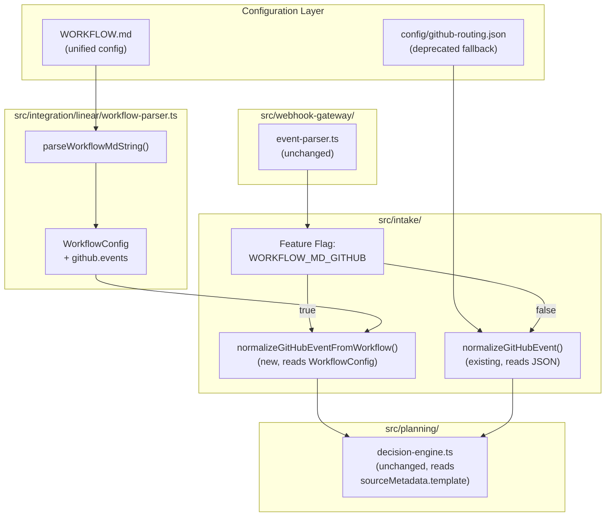
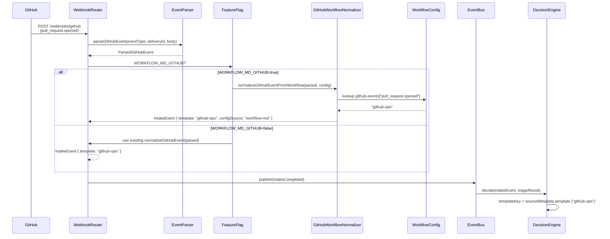

# GAP-15: Unified WORKFLOW.md for GitHub + Linear Routing

> **SUPERSEDED by P20** (2026-04-08). The skill-based event routing implemented
> in `docs/sparc/P20-skill-based-event-routing-spec.md` and shipped in PR #18
> replaces this gap entirely. `config/github-routing.json` and the
> `deriveIntent` / `templateToSeverity` / `matchGitHubEventRule` /
> `matchesCondition` functions referenced below have all been deleted.
> Routing now lives in `WORKFLOW.md` `github.events` as relative paths to
> `.claude/skills/**/SKILL.md` files; behavior lives in the skill bodies.
> Kept for historical context.

| Field | Value |
|-------|-------|
| **Gap ID** | GAP-15 |
| **Title** | Unified WORKFLOW.md Configuration for GitHub and Linear Event Routing |
| **Priority** | P1-high |
| **Complexity** | Medium (45%) |
| **Methodology** | SPARC (Specification, Pseudocode, Architecture, Refinement, Completion) |
| **Date** | 2026-03-26 |
| **Status** | Superseded by P20 (2026-04-08) |
| **Depends On** | GAP-14 (Linear Integration), existing GitHubNormalizer, WorkflowConfig parser |
| **Replaces** | `config/github-routing.json` (14-rule JSON routing table) |
| **Superseded By** | `docs/sparc/P20-skill-based-event-routing-spec.md` |

---

## 1. Specification

### 1.1 Problem Statement

The orch-agents system currently maintains TWO separate configuration systems for event routing:

1. **`config/github-routing.json`** -- a 14-rule JSON array that maps GitHub webhook events (event/action/condition) to intent/template/priority/skipTriage. Loaded by `src/intake/github-normalizer.ts` via `readFileSync` and cached in a module-level variable.

2. **`WORKFLOW.md`** -- a YAML-frontmatter Markdown file that configures Linear integration with `tracker`, `agents.routing` (label-to-template), `polling`, and `stall` sections. Parsed by `src/integration/linear/workflow-parser.ts` into a `WorkflowConfig` object.

This split creates three problems:

- **Configuration drift**: GitHub routing rules live in a JSON file under `config/` while Linear routing lives in WORKFLOW.md at the project root. Operators must update two files to change the routing for the same label (e.g., "bug" should route to `tdd-workflow` regardless of whether it came from a GitHub issue or a Linear issue).

- **Inconsistent format**: The JSON routing table uses a verbose 8-field-per-rule structure. WORKFLOW.md uses concise `key: value` YAML. Neither references the other, making it hard to see the full routing picture.

- **Redundant label routing**: The `agents.routing` section in WORKFLOW.md already maps labels to templates (`bug: tdd-workflow`). The JSON routing table duplicates this for GitHub issues (`issues.labeled` with condition `bug`). A unified config eliminates this duplication.

The solution: extend WORKFLOW.md with a `github.events` section that replaces `config/github-routing.json`. One file, one format, full routing visibility. A feature flag (`WORKFLOW_MD_GITHUB=true`) controls the transition. Existing deployments fall back to the JSON file.

### 1.2 Requirements

**R1. Extend workflow-parser.ts with `github.events` parsing**
Add a `github` section to the `WorkflowConfig` type. Parse the `github.events` sub-section from WORKFLOW.md frontmatter. Each entry has the format `event.action[.condition]: template`, parsed into a structured `GitHubEventRule` object containing `event`, `action`, `condition`, and `template`. The existing `parseFlatYaml()` function handles nested keys (`github.events.pull_request_opened: github-ops`), but the dotted key format in the YAML values requires special handling: keys like `pull_request.opened` use dots as separators inside the YAML key namespace. The parser must distinguish `github.events` sub-keys from other dotted paths.

**R2. Create GitHubWorkflowNormalizer**
A new normalizer function, `normalizeGitHubEventFromWorkflow()`, that reads the `github.events` section of `WorkflowConfig` instead of `config/github-routing.json`. It follows the pattern established by the existing `normalizeGitHubEvent()` in `src/intake/github-normalizer.ts`:
- Accepts a `ParsedGitHubEvent` (from `event-parser.ts`)
- Matches against `github.events` rules using the same condition resolution logic (default_branch, merged, mentions_bot, failure, label names)
- Returns an `IntakeEvent` with the matched template in `sourceMetadata.template`
- Falls back to `agents.routing.default` template when no `github.events` rule matches
- Preserves bot loop prevention (same `setBotUserId`/`setBotUsername` pattern)

**R3. Backward Compatibility**
If WORKFLOW.md does not contain a `github:` section, the system falls back to loading `config/github-routing.json` (existing behavior). The `WorkflowConfig.github` field is optional. The `normalizeGitHubEvent()` function in `github-normalizer.ts` continues to work unchanged. The new normalizer is an alternative, not a replacement.

**R4. Decision Engine Update**
The decision engine (`src/planning/decision-engine.ts`) already prefers `sourceMetadata.template` when present (line 107: `typeof meta.template === 'string' ? meta.template : routerResult.template`). This requirement is already satisfied. No code change needed, but the spec documents this dependency to ensure it is not regressed.

**R5. Deprecate config/github-routing.json**
Mark `config/github-routing.json` as deprecated in a comment header. New deployments should use WORKFLOW.md's `github.events` section. The JSON file remains loadable for backward compatibility. Add a startup log warning when the JSON fallback is used and `WORKFLOW_MD_GITHUB` is not set.

**R6. Shared Label Routing**
The `agents.routing` section in WORKFLOW.md works for both Linear and GitHub. When a GitHub issue is labeled "bug" and there is no specific `issues.labeled.bug` entry in `github.events`, the normalizer falls through to `agents.routing.bug` to find the template. This eliminates the need to duplicate label-to-template mappings in both sections.

**R7. Feature Flag**
`WORKFLOW_MD_GITHUB=true` (environment variable) enables GitHub routing via WORKFLOW.md. Default: `false`. When `false`, the existing `github-normalizer.ts` with `config/github-routing.json` is used. When `true`, the new `GitHubWorkflowNormalizer` is used. The flag is read at startup and wired in `src/index.ts` (or server initialization).

### 1.3 Acceptance Criteria

**AC1**: `WorkflowConfig` type includes an optional `github` field with `events: Record<string, string>` mapping rule keys to template names.

**AC2**: `parseWorkflowMdString()` correctly parses a WORKFLOW.md containing a `github.events` section and returns a `WorkflowConfig` with populated `github.events` map.

**AC3**: `parseWorkflowMdString()` returns a `WorkflowConfig` with `github` as `undefined` when WORKFLOW.md has no `github:` section. Existing Linear-only WORKFLOW.md files parse without error.

**AC4**: `normalizeGitHubEventFromWorkflow()` matches a `pull_request.opened` event and returns an IntakeEvent with `sourceMetadata.template: 'github-ops'`.

**AC5**: `normalizeGitHubEventFromWorkflow()` matches a `push.default_branch` event (where `parsed.branch === parsed.defaultBranch`) and returns template `cicd-pipeline`.

**AC6**: `normalizeGitHubEventFromWorkflow()` matches a `pull_request.closed.merged` event (where `parsed.merged === true`) and returns template `release-pipeline`.

**AC7**: `normalizeGitHubEventFromWorkflow()` matches `issues.labeled.bug` when the issue has a "bug" label and returns template `tdd-workflow`.

**AC8**: When no `github.events` rule matches but the issue has a label in `agents.routing`, the normalizer uses the `agents.routing` template as fallback (shared label routing).

**AC9**: When no rule matches at all, the normalizer uses `agents.routing.default` (i.e., `quick-fix`) as the final fallback.

**AC10**: Bot loop prevention works identically to the existing normalizer: events from the bot's own user ID or username return `null`.

**AC11**: Setting `WORKFLOW_MD_GITHUB=false` (or unset) uses the existing `github-normalizer.ts` with JSON routing. All existing GitHub tests pass without modification.

**AC12**: The decision engine continues to prefer `sourceMetadata.template` when present, regardless of which normalizer produced the IntakeEvent. Existing decision engine tests pass unchanged.

### 1.4 Constraints

- No new npm dependencies. The existing hand-written YAML parser in `workflow-parser.ts` must be extended, not replaced.
- No changes to the `IntakeEvent`, `WorkIntent`, or `ParsedGitHubEvent` types.
- No changes to `event-parser.ts` -- it remains source-agnostic.
- The existing `normalizeGitHubEvent()` function must not be modified. The new normalizer is a separate function.
- The `matchesCondition()` logic (default_branch, merged, mentions_bot, changes_requested, failure, label matching) must be reused or replicated exactly.
- All new code under `src/intake/` (the GitHub workflow normalizer) and `src/integration/linear/` (the parser extension).
- Tests under `tests/intake/` for the new normalizer and `tests/integration/linear/` for the parser extension.
- `config/github-routing.json` must not be deleted. It is marked deprecated but remains functional.

### 1.5 Edge Cases

**Ambiguous key parsing**: The YAML key `pull_request.opened` contains a dot, which the existing `parseFlatYaml()` treats as a nesting separator. The `github.events` section requires special handling where keys under `github.events` are treated as literal event-rule keys, not further nesting levels. For example, `github.events.pull_request.opened` should produce the flat key `github.events.pull_request.opened` (the full dotted path IS the rule key), not nest `opened` under `pull_request`.

**Multiple label matches**: A GitHub issue with labels `["bug", "security"]` could match both `issues.labeled.bug: tdd-workflow` and `issues.labeled.security: security-audit`. Resolution: first match in the `github.events` key order wins, matching the existing JSON array behavior.

**Push to non-default branch**: The key `push.other` must match when the push branch is NOT the default branch. The condition resolver maps `other` to "not default_branch".

**Condition-less rules**: `issues.opened: github-ops` has no condition -- it matches any `issues` event with action `opened` regardless of labels or other properties.

**Missing WORKFLOW.md**: If WORKFLOW.md does not exist at all, the system falls back to `config/github-routing.json` regardless of the `WORKFLOW_MD_GITHUB` flag. A warning is logged.

**Inline array syntax**: The existing parser supports `[Todo, In Progress]` bracket-style arrays in YAML values. The `github.events` section uses simple `key: value` strings, so no array parsing is needed for event rules.

**Comment mentions_bot without bot username set**: If `_botUsername` is empty and the condition is `mentions_bot`, the rule matches any `issue_comment.created` event (same as current behavior in `matchesCondition()`).

---

## 2. Pseudocode

### 2.1 WORKFLOW.md Key Format Specification

```
RULE KEY FORMAT:
  event.action             -> { event, action, condition: null }
  event.action.condition   -> { event, action, condition }
  event.condition          -> { event, action: null, condition }

EXAMPLES:
  pull_request.opened          -> { event: "pull_request", action: "opened", condition: null }
  pull_request.closed.merged   -> { event: "pull_request", action: "closed", condition: "merged" }
  push.default_branch          -> { event: "push", action: null, condition: "default_branch" }
  issues.labeled.bug           -> { event: "issues", action: "labeled", condition: "bug" }
  issue_comment.mentions_bot   -> { event: "issue_comment", action: null, condition: "mentions_bot" }

KNOWN EVENTS WITH ACTIONS:
  pull_request: opened, synchronize, closed, ready_for_review
  issues: opened, labeled
  issue_comment: created
  pull_request_review: submitted
  workflow_run: completed
  release: published

KNOWN EVENTS WITHOUT ACTIONS (action is inferred from payload):
  push: (no action field from GitHub)
  deployment_status: (no action field from GitHub)

DISAMBIGUATION RULES:
  - If the first segment matches a known event type AND the second segment
    matches a known action for that event, treat the third segment as condition.
  - If the first segment matches a known event type AND the second segment
    does NOT match a known action, treat the second segment as condition.
  - Events with no known actions (push, deployment_status) always treat
    the second segment as condition.
```

### 2.2 Parsing github.events from Flat YAML

```
FUNCTION parseGitHubEvents(flat: FlatMap): Map<string, string> | undefined
  PREFIX = "github.events."
  result = new Map()

  FOR key IN Object.keys(flat):
    IF key.startsWith(PREFIX):
      ruleKey = key.slice(PREFIX.length)    // e.g., "pull_request.opened"
      value = flat[key]
      IF typeof value === "string":
        result.set(ruleKey, value)

  IF result.size === 0:
    RETURN undefined

  RETURN result
```

### 2.3 Rule Key to Structured Rule Parsing

```
KNOWN_ACTION_EVENTS = {
  "pull_request": ["opened", "synchronize", "closed", "ready_for_review"],
  "issues": ["opened", "labeled"],
  "issue_comment": ["created"],
  "pull_request_review": ["submitted"],
  "workflow_run": ["completed"],
  "release": ["published"]
}

NO_ACTION_EVENTS = ["push", "deployment_status"]

FUNCTION parseRuleKey(ruleKey: string): { event, action, condition }
  parts = ruleKey.split(".")

  IF parts.length === 1:
    RETURN { event: parts[0], action: null, condition: null }

  event = parts[0]

  // Handle underscore-separated event names like "pull_request", "issue_comment"
  // Check if event_part2 is a known event name
  IF parts.length >= 2:
    twoPartEvent = parts[0] + "_" + parts[1]
    IF twoPartEvent IN KNOWN_ACTION_EVENTS OR twoPartEvent IN NO_ACTION_EVENTS:
      event = twoPartEvent
      remaining = parts.slice(2)
    ELSE:
      remaining = parts.slice(1)

  IF remaining.length === 0:
    RETURN { event, action: null, condition: null }

  IF remaining.length === 1:
    segment = remaining[0]
    IF event IN KNOWN_ACTION_EVENTS AND segment IN KNOWN_ACTION_EVENTS[event]:
      RETURN { event, action: segment, condition: null }
    ELSE:
      RETURN { event, action: null, condition: segment }

  IF remaining.length === 2:
    RETURN { event, action: remaining[0], condition: remaining[1] }

  // Fallback: treat everything after event as action.condition
  RETURN { event, action: remaining[0], condition: remaining.slice(1).join(".") }
```

**Parser limitation note**: The existing `parseFlatYaml()` uses indentation to determine nesting depth. Keys like `pull_request.opened: github-ops` under the `events:` sub-section will be parsed as flat key `github.events.pull_request.opened` with value `github-ops` because the parser treats indented `key: value` pairs under a parent as `parent.key`. However, dots within the YAML key itself (e.g., `pull_request.opened`) are NOT nesting -- they are literal key characters. The parser must be updated to handle this: when the parent context is `github.events`, treat the indented key as a literal suffix appended to the prefix, not as a further nested path.

**Revised parser approach**: Instead of modifying `parseFlatYaml()` (which would break other sections), use underscore-separated keys in the YAML and convert to dot-separated internally. The YAML format uses indented keys under `events:`:

```yaml
github:
  events:
    pull_request.opened: github-ops
```

The `parseFlatYaml()` function sees `pull_request.opened` as the key at indent level 2 under `github` > `events`. Because the parser only supports ONE level of nesting, `github` is the parent, `events` is the nested key. But `pull_request.opened: github-ops` at indent level 3 is a THIRD level, which the current parser does not support.

**Solution**: Extend `parseFlatYaml()` to support two levels of nesting for the `github.events` section specifically, OR use a simpler YAML layout where `events` keys are flattened:

```yaml
github:
  events:
    pull_request.opened: github-ops
    pull_request.synchronize: github-ops
```

The simplest approach: extend the parser to track a second level of nesting. When inside a nested section (e.g., `events` under `github`), any further indented key-value pairs are stored with the full dotted path `github.events.<key>`.

### 2.4 Extended parseFlatYaml (2-level nesting)

```
FUNCTION parseFlatYaml(yaml: string): FlatMap
  result = {}
  lines = yaml.split("\n")
  parentKey = null        // top-level section (indent 0)
  subParentKey = null     // second-level section (indent 2)
  currentKey = null
  currentArray = null

  FOR line IN lines:
    IF line is blank or comment: CONTINUE

    // Array item
    arrayMatch = line.match(/^\s+-\s+(.+)$/)
    IF arrayMatch AND currentKey:
      IF currentArray is null: currentArray = []
      currentArray.push(unquote(arrayMatch[1].trim()))
      CONTINUE

    // Flush previous array
    IF currentKey AND currentArray:
      result[currentKey] = currentArray
      currentArray = null
      currentKey = null

    indent = countLeadingSpaces(line)

    // Third-level key-value (indent 4+): "    key.with.dots: value"
    IF indent >= 4 AND subParentKey:
      match = line.match(/^\s{4,}(\S[\S]*)\s*:\s*(.*)$/)
      IF match:
        key = match[1].trim()
        value = match[2].trim()
        fullKey = subParentKey + "." + key
        IF value === "" OR value === "|":
          currentKey = fullKey
          currentArray = []
        ELSE:
          result[fullKey] = unquote(value)
          currentKey = fullKey
        CONTINUE

    // Second-level key-value or section (indent 2-3): "  key: value"
    nestedMatch = line.match(/^(\s{2,3})(\w[\w_-]*)\s*:\s*(.*)$/)
    IF nestedMatch AND parentKey:
      key = nestedMatch[2]
      value = nestedMatch[3].trim()
      fullKey = parentKey + "." + key

      IF value === "" OR value === "|" OR value === ">":
        // This is a sub-section header
        subParentKey = fullKey
        currentKey = null
        currentArray = null
      ELSE:
        result[fullKey] = unquote(value)
        currentKey = fullKey
        subParentKey = null
      CONTINUE

    // Top-level key (indent 0): "key: value"
    topMatch = line.match(/^(\w[\w_-]*)\s*:\s*(.*)$/)
    IF topMatch:
      key = topMatch[1]
      value = topMatch[2].trim()

      IF value === "" OR value === "|" OR value === ">":
        parentKey = key
        subParentKey = null
        currentKey = null
        currentArray = null
      ELSE:
        parentKey = null
        subParentKey = null
        result[key] = unquote(value)
        currentKey = key
      CONTINUE

  // Flush final array
  IF currentKey AND currentArray:
    result[currentKey] = currentArray

  RETURN result
```

### 2.5 GitHubWorkflowNormalizer: Event Matching

```
FUNCTION normalizeGitHubEventFromWorkflow(
  parsed: ParsedGitHubEvent,
  config: WorkflowConfig
): IntakeEvent | null

  // Bot loop prevention (identical to existing normalizer)
  IF botUsername AND parsed.sender === botUsername: RETURN null
  IF botUserId > 0 AND parsed.senderId === botUserId: RETURN null
  IF parsed.senderIsBot AND botUserId === 0: RETURN null

  githubEvents = config.github?.events
  IF NOT githubEvents OR githubEvents.size === 0:
    RETURN null   // No github events configured, caller should fall back

  // Try to match event rules
  template = matchGitHubEventRule(parsed, githubEvents)

  // Fallback 1: shared label routing via agents.routing
  IF template is null AND parsed.labels.length > 0:
    FOR label IN parsed.labels:
      IF config.agents.routing[label.toLowerCase()]:
        template = config.agents.routing[label.toLowerCase()]
        BREAK

  // Fallback 2: default template
  IF template is null:
    template = config.agents.defaultTemplate

  // Build intent from event context
  intent = deriveIntent(parsed, template)

  RETURN {
    id: parsed.deliveryId,
    timestamp: new Date().toISOString(),
    source: "github",
    sourceMetadata: {
      eventType: parsed.eventType,
      action: parsed.action,
      deliveryId: parsed.deliveryId,
      repoFullName: parsed.repoFullName,
      sender: parsed.sender,
      template: template,
      configSource: "workflow-md"
    },
    intent: intent,
    entities: {
      repo: parsed.repoFullName,
      branch: parsed.branch,
      prNumber: parsed.prNumber,
      issueNumber: parsed.issueNumber,
      files: parsed.files.length > 0 ? parsed.files : undefined,
      labels: parsed.labels.length > 0 ? parsed.labels : undefined,
      author: parsed.sender,
      severity: templateToSeverity(template)
    },
    rawText: parsed.commentBody ? sanitize(parsed.commentBody) : undefined
  }
```

### 2.6 Event Rule Matching

```
FUNCTION matchGitHubEventRule(
  parsed: ParsedGitHubEvent,
  events: Map<string, string>
): string | null

  FOR [ruleKey, template] IN events:
    rule = parseRuleKey(ruleKey)

    // Event type must match
    IF rule.event !== parsed.eventType: CONTINUE

    // Action match (if rule specifies one)
    IF rule.action !== null AND rule.action !== parsed.action: CONTINUE

    // Condition match (if rule specifies one)
    IF rule.condition !== null:
      IF NOT matchesCondition(rule.condition, parsed): CONTINUE

    // All filters passed
    RETURN template

  RETURN null


FUNCTION matchesCondition(condition: string, parsed: ParsedGitHubEvent): boolean
  SWITCH condition:
    CASE "default_branch":
      RETURN parsed.branch === parsed.defaultBranch

    CASE "other":
      RETURN parsed.branch !== null AND parsed.branch !== parsed.defaultBranch

    CASE "merged":
      RETURN parsed.merged === true

    CASE "mentions_bot":
      IF NOT parsed.commentBody: RETURN false
      IF botUsername: RETURN parsed.commentBody.includes("@" + botUsername)
      RETURN true

    CASE "changes_requested":
      RETURN parsed.reviewState === "changes_requested"

    CASE "failure":
      RETURN parsed.conclusion === "failure"

    DEFAULT:
      // Treat condition as a label name (for issues.labeled.<label>)
      RETURN parsed.labels.includes(condition)
```

### 2.7 Feature Flag Wiring

```
FUNCTION createGitHubNormalizer(config: AppConfig, workflowConfig?: WorkflowConfig):
  IF config.workflowMdGithub AND workflowConfig?.github?.events:
    RETURN (parsed) => normalizeGitHubEventFromWorkflow(parsed, workflowConfig)
  ELSE:
    IF config.workflowMdGithub AND NOT workflowConfig?.github?.events:
      logger.warn("WORKFLOW_MD_GITHUB=true but WORKFLOW.md has no github.events section, falling back to github-routing.json")
    RETURN (parsed) => normalizeGitHubEvent(parsed)  // existing normalizer
```

---

## 3. Architecture

### 3.1 Component Diagram



### 3.2 Files Affected

| File | Change Type | Description |
|------|-------------|-------------|
| `src/integration/linear/workflow-parser.ts` | **Modify** | Extend `WorkflowConfig` type with optional `github` field. Extend `parseFlatYaml()` to support 2-level nesting for `github.events`. Update `buildConfig()` to extract `github.events`. |
| `src/intake/github-workflow-normalizer.ts` | **New** | `normalizeGitHubEventFromWorkflow()` function. Rule key parser. Condition matcher (reused logic). |
| `src/intake/github-normalizer.ts` | **No change** | Existing normalizer remains unchanged. |
| `src/webhook-gateway/event-parser.ts` | **No change** | Event parsing is source-agnostic. |
| `src/planning/decision-engine.ts` | **No change** | Already prefers `sourceMetadata.template` (line 107). |
| `src/types.ts` | **No change** | `IntakeEvent`, `WorkIntent` types are sufficient. |
| `src/index.ts` | **Modify** | Wire feature flag. Select normalizer based on `WORKFLOW_MD_GITHUB`. |
| `src/shared/config.ts` | **Modify** | Add `workflowMdGithub: boolean` to `AppConfig`. Read from `WORKFLOW_MD_GITHUB` env var, default `false`. |
| `config/github-routing.json` | **Modify** | Add deprecation comment (JSON does not support comments, so add a `_deprecated` field at the top of the array or a wrapper object). |
| `WORKFLOW.md` | **Modify** | Add `github.events` section with all 14 rules from the JSON routing table. |
| `tests/intake/github-workflow-normalizer.test.ts` | **New** | Unit tests for the new normalizer. |
| `tests/integration/linear/workflow-parser-github.test.ts` | **New** | Unit tests for parsing the `github.events` section. |

### 3.3 WorkflowConfig Type Extension

```typescript
export interface WorkflowConfig {
  tracker: {
    kind: 'linear';
    apiKey: string;
    team: string;
    activeStates: string[];
    terminalStates: string[];
  };
  github?: {
    events: Record<string, string>;  // ruleKey -> template
  };
  agents: {
    maxConcurrent: number;
    routing: Record<string, string>;
    defaultTemplate: string;
  };
  polling: {
    intervalMs: number;
    enabled: boolean;
  };
  stall: {
    timeoutMs: number;
  };
  promptTemplate: string;
}
```

### 3.4 Unified WORKFLOW.md Format

```yaml
---
tracker:
  kind: linear
  api_key: $LINEAR_API_KEY
  team: $LINEAR_TEAM_ID
  active_types:
    - unstarted
    - started
  terminal_types:
    - completed
    - canceled

github:
  events:
    pull_request.opened: github-ops
    pull_request.synchronize: github-ops
    pull_request.closed.merged: release-pipeline
    pull_request.ready_for_review: github-ops
    push.default_branch: cicd-pipeline
    push.other: quick-fix
    issues.opened: github-ops
    issues.labeled.bug: tdd-workflow
    issues.labeled.enhancement: feature-build
    issues.labeled.security: security-audit
    issue_comment.mentions_bot: quick-fix
    pull_request_review.changes_requested: quick-fix
    workflow_run.failure: quick-fix
    release.published: release-pipeline
    deployment_status.failure: quick-fix

agents:
  max_concurrent: 8
  routing:
    bug: tdd-workflow
    feature: feature-build
    security: security-audit
    refactor: sparc-full
    default: quick-fix

polling:
  interval_ms: 30000
  enabled: false

stall:
  timeout_ms: 300000
---

You are an autonomous development agent...
```

### 3.5 Data Flow: GitHub Event with WORKFLOW.md Routing



### 3.6 Mapping from JSON Rules to WORKFLOW.md Keys

| JSON Rule | Event | Action | Condition | WORKFLOW.md Key | Template |
|-----------|-------|--------|-----------|-----------------|----------|
| 1 | push | null | default_branch | `push.default_branch` | cicd-pipeline |
| 2 | push | null | other_branch | `push.other` | quick-fix |
| 3 | pull_request | opened | null | `pull_request.opened` | github-ops |
| 4 | pull_request | synchronize | null | `pull_request.synchronize` | github-ops |
| 5 | pull_request | closed | merged | `pull_request.closed.merged` | release-pipeline |
| 6 | pull_request | ready_for_review | null | `pull_request.ready_for_review` | github-ops |
| 7 | issues | opened | null | `issues.opened` | github-ops |
| 8 | issues | labeled | bug | `issues.labeled.bug` | tdd-workflow |
| 9 | issues | labeled | enhancement | `issues.labeled.enhancement` | feature-build |
| 10 | issue_comment | created | mentions_bot | `issue_comment.mentions_bot` | quick-fix |
| 11 | pull_request_review | submitted | changes_requested | `pull_request_review.changes_requested` | quick-fix |
| 12 | workflow_run | completed | failure | `workflow_run.failure` | quick-fix |
| 13 | release | published | null | `release.published` | release-pipeline |
| 14 | deployment_status | null | failure | `deployment_status.failure` | quick-fix |

**Fields dropped from WORKFLOW.md**: `intent`, `phases`, `priority`, `skipTriage`. These are derivable:
- `intent`: derived from event context by `deriveIntent()` (same as Linear normalizer pattern)
- `phases`: determined by the decision engine based on template + complexity
- `priority`: determined by triage engine
- `skipTriage`: a routing optimization; the new normalizer sets `skipTriage: true` for events that map to `quick-fix` template, `false` otherwise

### 3.7 Intent Derivation

Without explicit `intent` in the config, the normalizer derives intent from the event type and action:

| Event Pattern | Derived Intent |
|---------------|---------------|
| `push.default_branch` | `validate-main` |
| `push.other` | `validate-branch` |
| `pull_request.opened` | `review-pr` |
| `pull_request.synchronize` | `re-review-pr` |
| `pull_request.closed.merged` | `post-merge` |
| `pull_request.ready_for_review` | `review-pr` |
| `issues.opened` | `triage-issue` |
| `issues.labeled.*` | `custom:fix-bug`, `custom:build-feature`, or `custom:${label}` |
| `issue_comment.mentions_bot` | `respond-comment` |
| `pull_request_review.changes_requested` | `custom:address-review` |
| `workflow_run.failure` | `debug-ci` |
| `release.published` | `deploy-release` |
| `deployment_status.failure` | `incident-response` |

---

## 4. Refinement

### 4.1 TDD Implementation Order (London School)

Implementation proceeds outside-in, mocking dependencies at each layer.

**Step 1: WorkflowConfig Type Extension**
- Add optional `github?: { events: Record<string, string> }` to `WorkflowConfig` in `workflow-parser.ts`
- Update `buildConfig()` to extract `github.events` from the flat map
- Tests: parse a WORKFLOW.md with `github.events` section, verify the `github.events` map is populated. Parse a WORKFLOW.md WITHOUT `github.events`, verify `github` is `undefined`. Existing parser tests pass unchanged.

**Step 2: parseFlatYaml 2-Level Nesting**
- Extend `parseFlatYaml()` to handle 3rd-level indented key-value pairs (4+ spaces)
- Store as `parent.subParent.key` in the flat map
- Tests: input with `github:\n  events:\n    pull_request.opened: github-ops` produces flat key `github.events.pull_request.opened` with value `github-ops`. Existing 1-level and 2-level nesting tests unchanged.

**Step 3: Rule Key Parser**
- Create `parseRuleKey(key: string): GitHubEventRule` in `github-workflow-normalizer.ts`
- Parse `event.action.condition` format into structured `{ event, action, condition }`
- Tests: all 14 rule keys from the mapping table parse correctly. Edge cases: single-segment key, unknown event type.

**Step 4: Condition Matcher**
- Implement `matchesWorkflowCondition(condition, parsed)` replicating the logic from `github-normalizer.ts`
- Tests: `default_branch` matches when `branch === defaultBranch`. `other` matches when branch differs. `merged` matches when `parsed.merged === true`. `mentions_bot` checks comment body. Label conditions check `parsed.labels`. `failure` checks `parsed.conclusion`.

**Step 5: normalizeGitHubEventFromWorkflow (core function)**
- Implement the full normalizer: event matching, fallback to `agents.routing`, fallback to default template
- Bot loop prevention
- Intent derivation
- Tests: one test per AC (AC4-AC10). Bot returns null. Fallback chain exercises.

**Step 6: Feature Flag Wiring**
- Add `workflowMdGithub` to `AppConfig` in `src/shared/config.ts`
- Wire in `src/index.ts`: when `WORKFLOW_MD_GITHUB=true`, parse WORKFLOW.md and use `normalizeGitHubEventFromWorkflow`. Otherwise use existing `normalizeGitHubEvent`.
- Tests: with flag off, existing normalizer used (AC11). With flag on but no github section in WORKFLOW.md, log warning and fall back (AC3).

**Step 7: WORKFLOW.md Update**
- Add `github.events` section to `WORKFLOW.md` with all 14 rules
- Add deprecation marker to `config/github-routing.json`
- Tests: parse the actual `WORKFLOW.md` file, verify all 14 rules are present in `github.events`.

**Step 8: Integration Smoke Test**
- End-to-end test: create a `ParsedGitHubEvent` for each of the 14 event types, run through `normalizeGitHubEventFromWorkflow()`, verify each produces the correct IntakeEvent with the expected template
- Verify existing `normalizeGitHubEvent()` tests still pass (AC11)
- Verify decision engine tests still pass (AC12)

### 4.2 Edge Cases

**Parser ambiguity with dots in keys**
The YAML key `pull_request.opened` at indent level 3 (under `github` > `events`) is stored as flat key `github.events.pull_request.opened`. The `extractGitHubEvents()` function strips the `github.events.` prefix to get `pull_request.opened` as the rule key. No ambiguity because the parser uses indentation to determine nesting, not dots.

**Rule ordering and first-match semantics**
JavaScript `Record<string, string>` (from `Object.keys()`) preserves insertion order for string keys. The parser reads WORKFLOW.md top-to-bottom, so `github.events` rules maintain YAML file order. The first matching rule wins, identical to the JSON array's sequential scan.

**Condition `other_branch` vs `other`**
The JSON routing table uses `other_branch` as the condition value. The WORKFLOW.md key format uses `push.other` for brevity. The condition matcher must recognize both `other` and `other_branch` as equivalent.

**GitHub `issues.labeled` with multiple labels**
When a GitHub issue has multiple labels and the event action is `labeled`, GitHub sends the specific label that triggered the event in `payload.label.name`. However, `ParsedGitHubEvent.labels` contains ALL labels on the issue. The existing condition matcher checks `parsed.labels.includes(condition)`. This means `issues.labeled.bug` matches if ANY label on the issue is "bug", not just the label that was just added. This matches current JSON behavior.

**Template names with special characters**
Template names in WORKFLOW.md are simple strings (e.g., `github-ops`, `tdd-workflow`). No special character handling needed.

**Empty `github.events` section**
If the YAML has `github:\n  events:\n` with no entries, `github.events` is an empty map. The normalizer returns `null` for the event-match step, triggering the `agents.routing` fallback.

**Feature flag race condition**
The flag is read at startup. No runtime toggle support. In-flight events use whichever normalizer was configured at startup.

---

## 5. Completion

### 5.1 Verification Checklist

| # | Check | Method | Pass Criteria |
|---|-------|--------|---------------|
| 1 | `WorkflowConfig` type compiles with optional `github` field | `npm run build` | Zero type errors |
| 2 | `parseFlatYaml()` handles 2-level nesting | Unit test | `github.events.pull_request.opened` extracted correctly |
| 3 | `parseWorkflowMdString()` parses github.events | Unit test | AC2: `github.events` map has 14+ entries |
| 4 | Existing WORKFLOW.md (no github section) parses | Unit test | AC3: `github` is `undefined`, no errors |
| 5 | Rule key parser handles all 14 formats | Unit test | Each key decomposes to correct `{event, action, condition}` |
| 6 | Condition matcher replicates existing logic | Unit test | All 8 condition types match correctly |
| 7 | `normalizeGitHubEventFromWorkflow()` matches events | Unit test | AC4-AC7: correct templates returned |
| 8 | Shared label routing fallback works | Unit test | AC8: `agents.routing` used when no event rule matches |
| 9 | Default template fallback works | Unit test | AC9: `quick-fix` returned when nothing matches |
| 10 | Bot loop prevention works | Unit test | AC10: bot events return `null` |
| 11 | Feature flag wiring correct | Unit test | AC11: existing normalizer used when flag is off |
| 12 | Decision engine unchanged | Existing tests | AC12: all decision engine tests pass |
| 13 | Existing GitHub normalizer tests pass | `npm test` | No regressions in `github-normalizer.test.ts` |
| 14 | Full test suite passes | `npm test` | All existing + new tests pass |
| 15 | Build succeeds | `npm run build` | Clean build |
| 16 | Lint passes | `npm run lint` | Zero lint errors |

### 5.2 Deployment Steps

1. **Merge feature branch** with parser extension, new normalizer, updated WORKFLOW.md, and feature flag wiring.

2. **No environment changes needed for initial deploy**. `WORKFLOW_MD_GITHUB` defaults to `false`, so existing behavior is preserved.

3. **Test in staging** by setting `WORKFLOW_MD_GITHUB=true`. Verify all 14 GitHub event types route correctly by examining server logs for `configSource: "workflow-md"` in IntakeEvent metadata.

4. **Enable in production** by setting `WORKFLOW_MD_GITHUB=true` in the deployment environment.

5. **Monitor** for 48 hours. Compare routing decisions against the previous JSON-based routing to ensure parity.

6. **Remove JSON fallback** (future GAP) once all deployments have migrated. This is out of scope for GAP-15.

### 5.3 Rollback Plan

**Immediate rollback**: Set `WORKFLOW_MD_GITHUB=false` (or unset) and restart. The system reverts to `config/github-routing.json` routing. No data loss. No configuration changes needed.

**Full rollback**: Revert the feature branch. The only changes to existing files are:
- `WorkflowConfig` type gains an optional field (backward compatible)
- `parseFlatYaml()` gains 2-level nesting support (backward compatible, existing keys unaffected)
- `src/shared/config.ts` gains a new boolean field with `false` default (backward compatible)
- `src/index.ts` gains a conditional branch that defaults to existing path (backward compatible)

None of these changes affect behavior when `WORKFLOW_MD_GITHUB` is unset or `false`.

**Data cleanup**: No persistent state is created. The feature flag is purely a startup configuration toggle.

### 5.4 Future Enhancements (Out of Scope for GAP-15)

- **Custom intent mapping in WORKFLOW.md**: Allow `event.action.condition: template:intent` format for explicit intent override.
- **Priority and skipTriage in WORKFLOW.md**: Add optional `github.priorities` and `github.skip_triage` sections for fine-grained control.
- **Hot config reload**: File watcher on WORKFLOW.md for zero-downtime routing changes.
- **Delete `config/github-routing.json`**: Once all deployments use WORKFLOW.md, remove the JSON fallback entirely.
- **Validation CLI**: `npx @claude-flow/cli@latest workflow validate` to check WORKFLOW.md syntax and rule coverage.
- **GitHub-only WORKFLOW.md**: Allow WORKFLOW.md without the `tracker:` section for GitHub-only deployments (currently `tracker.kind: linear` is required).
