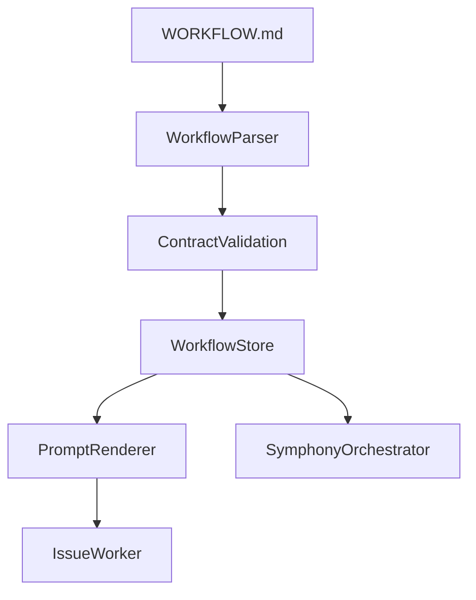

# Phase 1: Workflow Contract

## Goal
Harden `WORKFLOW.md` into the repo-owned contract for Symphony-style Claude execution. This phase establishes the authoritative config surface, prompt body semantics, reload behavior, and validation rules that every later phase depends on.

## Specification
### Problem Statement
The current `WORKFLOW.md` handling is close to a bootstrap contract, but it is still narrower and more fragile than the Symphony model. The parser is hand-rolled, required fields are slightly off, prompt rendering is permissive, and reload semantics are not yet first-class.

### Functional Requirements
- Parse Symphony-style frontmatter groups:
  - `tracker`
  - `polling`
  - `workspace`
  - `hooks`
  - `agent`
  - Claude-specific executor settings replacing Codex-specific runtime settings
- Support repo-owned prompt body loading after frontmatter.
- Render prompt variables explicitly from issue and attempt context.
- Validate all referenced templates, routes, and required keys before execution starts.
- Expose a workflow store abstraction so config changes can reload without process restart.
- Preserve last-known-good config behavior when a reload is invalid.

### Non-Functional Requirements
- Parsing must be deterministic and fail with actionable error messages.
- Multiline hooks and nested config must not be fragile.
- Reload behavior must never partially apply a broken config.
- Prompt rendering must reject unsupported variables instead of silently dropping them.

### Acceptance Criteria
- A valid `WORKFLOW.md` with nested sections and multiline hooks parses successfully.
- Invalid frontmatter prevents new work from being dispatched.
- Invalid prompt variables fail validation before execution.
- Reloading a valid file replaces the active config without restart.
- Reloading an invalid file preserves the last-known-good config and surfaces the error.

## Pseudocode
```text
LOAD workflow file from configured path
PARSE YAML frontmatter with a real YAML parser
EXTRACT markdown body as prompt template

VALIDATE:
  tracker config present
  routing.default present
  all routed templates exist
  supported prompt variables only
  workspace / hook / executor settings are structurally valid

IF valid on startup:
  store as active workflow config
ELSE:
  fail startup

ON file change:
  parse candidate config
  IF candidate valid:
    replace active config
    update prompt template
  ELSE:
    keep last-known-good config
    record validation error

WHEN issue execution starts:
  read active workflow config
  render prompt template with issue, attempt, repo, and tracker context
  pass rendered prompt to issue worker / executor
```

## Architecture
### Primary Components
- `src/integration/linear/workflow-parser.ts`
  - Parses and validates the canonical contract.
- `src/integration/linear/workflow-config-store.ts`
  - Owns active config, reload behavior, and error visibility.
- `src/integration/linear/workflow-prompt.ts`
  - Renders the markdown body against supported variables.
- `src/index.ts`
  - Wires the workflow store into the app startup path.
- `src/execution/orchestrator/issue-worker.ts`
  - Consumes rendered prompt output for issue execution.

### Data Flow


### Design Decisions
- Use a real YAML parser instead of extending the current flat parser further.
- Keep prompt rendering in a dedicated module so executor code stays runtime-focused.
- Treat `WORKFLOW.md` as a product contract, not just a convenience config file.
- Make reload semantics explicit and testable through a store abstraction.

## Refinement
### Implementation Notes
- Start by replacing fragile parsing behavior in `src/integration/linear/workflow-parser.ts`.
- Add strict prompt variable validation before rendering.
- Introduce a workflow store with:
  - current config
  - last-known-good config
  - last validation error
  - reload timestamp
- Keep the variable surface intentionally small at first:
  - `issue`
  - `attempt`
  - `repository`
  - `tracker`
  - `agent`

### File Targets
- `src/integration/linear/workflow-parser.ts`
- `src/integration/linear/workflow-config-store.ts`
- `src/integration/linear/workflow-prompt.ts`
- `src/index.ts`
- `src/execution/orchestrator/issue-worker.ts`

### Exact Tests
- `tests/integration/linear/workflow-parser.test.ts`
  - Parses nested frontmatter groups including hooks and executor settings.
  - Rejects unknown route targets.
  - Rejects unsupported prompt variables.
- `tests/integration/linear/workflow-prompt.test.ts`
  - Renders issue and attempt variables correctly.
  - Fails on unsupported placeholders.
- `tests/execution/symphony-orchestrator.test.ts`
  - Uses the active workflow config from the store.
  - Keeps dispatch working after an invalid reload because last-known-good remains active.

### Risks
- Changing the parser too aggressively can break existing tests and fixtures.
- Prompt variables can sprawl unless the renderer contract stays narrow.
- Reload semantics can become ambiguous unless the store owns the state centrally.
