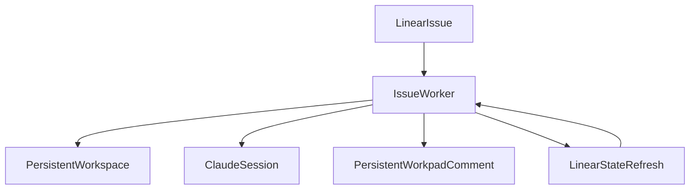

# Phase 2: Issue Worker Lifecycle

## Goal
Refactor the issue worker into a true issue-owned lifecycle runner. One worker should own one Linear issue, one persistent workspace, and one persistent workpad comment until the issue leaves active execution states.

## Specification
### Problem Statement
`src/execution/orchestrator/issue-worker.ts` still delegates issue execution into the older `SimpleExecutor` template-team worldview. That produces runs, not durable issue lifecycles. Symphony instead treats the issue itself as the unit of runtime ownership.

### Functional Requirements
- Turn the worker into a loop around one issue:
  - prepare workspace
  - run hooks
  - create or update workpad
  - run Claude session
  - re-check issue state
  - continue, pause, or finish
- Reuse the same workspace across continuation turns.
- Keep exactly one persistent workpad comment per issue.
- Encode explicit issue state behavior for:
  - `Todo`
  - `In Progress`
  - `Human Review`
  - `Merging`
  - `Rework`
  - `Done`
- Continue after a clean Claude exit if the ticket is still active.

### Non-Functional Requirements
- Worker lifecycle must be resumable after retries.
- Workpad updates must be deterministic and idempotent.
- Workspace cleanup must only occur when the issue is terminal or abandoned.

### Acceptance Criteria
- A still-active issue continues from the same workspace after a clean run.
- A second workpad update edits the original comment rather than creating a new one.
- A terminal issue causes the worker to stop and report completion.

## Pseudocode
```text
START worker for issue
LOAD issue metadata and workflow config
RESOLVE or CREATE workspace for issue
RESOLVE or CREATE persistent workpad comment

LOOP while issue remains active:
  run before hooks
  render current prompt context
  execute Claude session in issue workspace
  update workpad with milestone / notes / status
  refresh issue state from Linear

  IF issue entered terminal state:
    mark worker complete
    EXIT loop

  IF session ended cleanly AND issue still active:
    continue from same workspace and session boundary

  IF session failed:
    emit worker failure and allow orchestrator retry logic

ON terminal completion:
  finalize workpad
  report completion payload
```

## Architecture
### Primary Components
- `src/execution/orchestrator/issue-worker.ts`
  - Source of truth for issue progress and continuation.
- `src/integration/linear/workpad-reporter.ts`
  - Persistent comment management, not generic event aggregation.
- `src/execution/simple-executor.ts`
  - Reduced to reusable single-run helpers where needed.

### Data Flow


### Design Decisions
- Make the worker issue-owned, not plan-owned.
- Collapse generic post-run reporting into worker-driven milestones.
- Keep workspace identity tied to issue id so continuation is obvious.

## Refinement
### Implementation Notes
- Replace one-shot execution in `src/execution/orchestrator/issue-worker.ts` with a stateful loop.
- Track worker-local runtime state:
  - current attempt
  - continuation count
  - workspace path
  - workpad comment id
  - last issue state
- Move workpad lifecycle decisions closer to the worker and Linear client.
- Leave `SimpleExecutor` as a helper boundary only if it cleanly serves single-run execution.

### File Targets
- `src/execution/orchestrator/issue-worker.ts`
- `src/integration/linear/workpad-reporter.ts`
- `src/execution/simple-executor.ts`
- `src/integration/linear/linear-client.ts`

### Exact Tests
- `tests/execution/issue-worker.test.ts`
  - Reuses the same workspace across continuation turns.
  - Continues after a clean exit while the issue is still active.
  - Stops when the issue transitions to a terminal state.
- `tests/integration/linear/workpad-reporter.test.ts`
  - Reuses a marked comment if one already exists.
  - Updates the original comment in place on later milestones.
  - Produces one persistent workpad record per issue.

### Risks
- Continuation logic can accidentally duplicate workpad creation.
- If worker state leaks into orchestrator state, responsibilities will blur again.
- Workspace reuse needs careful cleanup rules to avoid stale residue.
