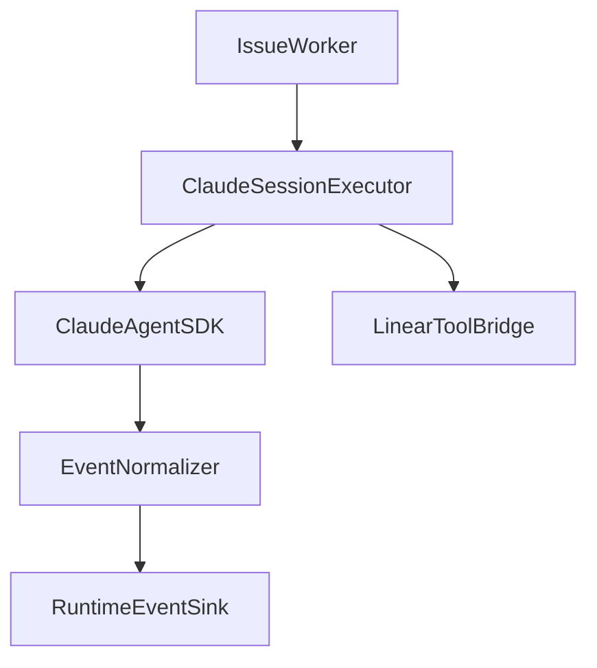

# Phase 3: Claude Session Executor

## Goal
Turn `src/execution/runtime/sdk-executor.ts` into a Symphony-grade Claude session boundary. The executor should hide Claude-specific runtime differences while exposing durable session progress, token accounting, and tracker-side affordances to the worker and orchestrator.

## Specification
### Problem Statement
The current SDK executor is a useful one-shot stream adapter, but it does not yet model durable session semantics, structured progress, approval/input policies, or tracker-aware tool affordances. Symphony’s Codex layer is session-rich; the Claude port must match the behavior, not the protocol.

### Functional Requirements
- Define a Claude session abstraction that reports:
  - session id
  - progress events
  - token usage
  - last activity timestamp
  - final result status
  - continuation capability
- Normalize Claude SDK event variants into one internal runtime format.
- Replace broad approval defaults with a deliberate repo/workspace safety policy.
- Add a Linear tool bridge so workers can update comments, state, or attachments during execution.
- Hide the continuation model behind this executor boundary so the orchestrator does not care whether it is one long session or repeated resumed turns.

### Non-Functional Requirements
- Event normalization must be deterministic and cheap.
- Token accounting must be visible quickly enough for a responsive operator surface.
- Permission policy must be explicit rather than inferred from bypass defaults.

### Acceptance Criteria
- Multi-event Claude streams produce a stable internal event sequence.
- Token usage is normalized across alternate SDK payload shapes.
- The worker receives enough metadata to decide whether to continue.
- Linear-affordance calls can be represented without leaking SDK details into worker code.

## Pseudocode
```text
CREATE Claude session with prompt, cwd, policy, and tool bridge
FOR each SDK event in stream:
  normalize event type
  append assistant text if present
  update token usage if present
  update last activity timestamp
  emit structured runtime event to sink

WHEN result event arrives:
  determine completed / failed / resumable
  attach normalized usage and session metadata
  return structured executor result

IF SDK emits tool-affordance requests:
  route supported tracker operations through Linear bridge
```

## Architecture
### Primary Components
- `src/execution/runtime/sdk-executor.ts`
  - Runtime adapter and event normalizer.
- `src/execution/orchestrator/issue-worker.ts`
  - Consumes normalized executor output.
- `src/integration/linear/linear-client.ts`
  - Backing client for tracker-side tool operations.

### Data Flow


### Design Decisions
- Keep all SDK quirks inside the executor.
- Treat tool permissions as product policy, not transient runtime flags.
- Normalize event types once so status/UI work from stable data.

## Refinement
### Implementation Notes
- Expand `TaskExecutionResult` or an adjacent result type with:
  - `sessionId`
  - `lastActivityAt`
  - `continuationState`
  - `tokenUsage`
- Introduce internal event categories:
  - `progress`
  - `toolCall`
  - `tokenUsage`
  - `result`
  - `error`
- Design the Linear bridge as executor-owned capabilities, not direct GraphQL exposure in prompts.

### File Targets
- `src/execution/runtime/sdk-executor.ts`
- `tests/execution/sdk-executor.test.ts`
- `src/integration/linear/linear-client.ts`
- `src/types.ts`

### Exact Tests
- `tests/execution/sdk-executor.test.ts`
  - Combines multiple assistant text events into one final output.
  - Normalizes token usage from alternate SDK key names.
  - Returns failure when the SDK emits an error result.
  - Returns resumable continuation metadata when the session ends cleanly but is not terminal.

### Risks
- Overfitting to current SDK event shapes can make upgrades brittle.
- Too much policy in the worker would undermine the executor boundary.
- Tool bridging can become unsafe if permission scopes remain too broad.
