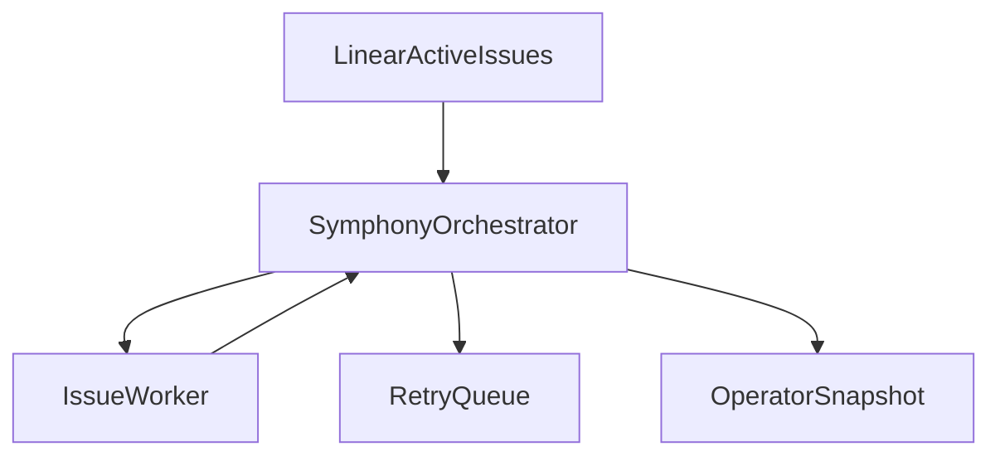

# Phase 4: Authoritative Orchestrator

## Goal
Upgrade `src/execution/orchestrator/symphony-orchestrator.ts` from a polling-and-spawn loop into the authoritative scheduler for claims, retries, reconciliation, continuation, cleanup, and runtime snapshots.

## Specification
### Problem Statement
The current orchestrator already has the correct skeleton, but it still behaves too much like a bounded polling loop. It marks issues completed too aggressively, lacks startup cleanup, and does not yet expose the richer runtime state that makes Symphony feel responsive and durable.

### Functional Requirements
- Perform startup terminal workspace cleanup.
- Revalidate issue eligibility before dispatch.
- Continue after clean worker exits when the issue is still active.
- Support retry token de-staling and coalesced poll ticks.
- Enforce per-state concurrency caps and blocker-aware `Todo` gating.
- Track richer runtime metadata:
  - session id
  - last event
  - token totals
  - workspace path
  - worker host
  - turn count
- Expose snapshot/state access for operators and future dashboard use.

### Non-Functional Requirements
- Claim state must be single-authority and deterministic.
- Reconciliation must be safe on restart.
- Snapshot data must be cheap to read and easy to serialize.

### Acceptance Criteria
- A clean worker exit does not permanently suppress redispatch if the issue is still active.
- Terminal issues are cleaned up on startup and reconciliation.
- Blocked issues do not consume dispatch capacity meant for runnable work.
- Operator snapshot includes live running and retry metadata.

## Pseudocode
```text
ON orchestrator start:
  clean stale terminal workspaces
  load current active claims
  schedule first tick

ON tick:
  reconcile running issues against tracker state
  refresh retries due now
  fetch candidate issues
  filter by blocker rules and per-state caps
  dispatch available issues
  record next refresh

ON worker message:
  update running entry metadata
  store last event, tokens, session id, and turn count

ON worker exit:
  IF terminal issue:
    mark completed and cleanup
  ELSE IF clean exit and issue still active:
    queue continuation
  ELSE:
    schedule retry with bounded backoff
```

## Architecture
### Primary Components
- `src/execution/orchestrator/symphony-orchestrator.ts`
  - Claim state, dispatch, reconciliation, retries, snapshots.
- `src/execution/orchestrator/issue-worker.ts`
  - Worker runtime owned by orchestrator but lifecycle-owned by issue.
- `src/integration/linear/linear-client.ts`
  - Active issue refresh and terminal-state reconciliation.

### Data Flow


### Design Decisions
- Remove the idea that `completed` means permanently finished unless the tracker agrees.
- Make snapshot state part of the orchestrator surface, not an afterthought.
- Keep worker execution isolated while the orchestrator owns scheduling truth.

## Refinement
### Implementation Notes
- Replace coarse `completed` suppression with state-based redispatch logic.
- Add startup cleanup before first dispatch.
- Track per-issue runtime fields in `running` entries.
- Add a serializable snapshot getter to feed future HTTP status routes.

### File Targets
- `src/execution/orchestrator/symphony-orchestrator.ts`
- `tests/execution/symphony-orchestrator.test.ts`
- `src/execution/orchestrator/issue-worker.ts`

### Exact Tests
- `tests/execution/symphony-orchestrator.test.ts`
  - Retries failed workers with bounded backoff.
  - Queues continuation after a clean worker exit when the issue remains active.
  - Cleans up terminal issues during reconciliation.
  - Enforces blocker and per-state dispatch gating.
  - Returns a snapshot containing running entries, token totals, retry due times, and last event timestamps.

### Risks
- Claim leakage can block work indefinitely if cleanup is not authoritative.
- Too much snapshot detail can couple operator surfaces to internal state too early.
- Redispatch rules can cause duplicate execution if tracker refresh timing is weak.
