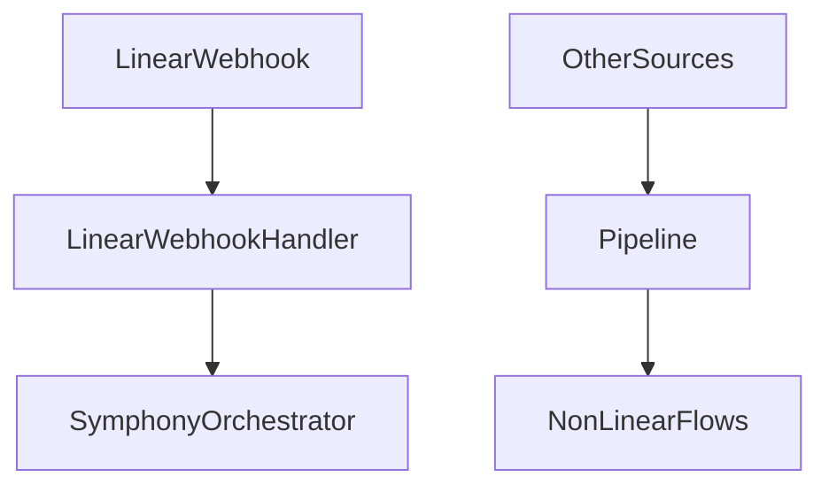

# Phase 5: Pipeline Simplification

## Goal
Make Symphony orchestration the primary execution path for Linear work by trimming the older generic intake -> plan -> execute -> review worldview where it overlaps with the issue-runner model.

## Specification
### Problem Statement
The repository still preserves a broader generic pipeline in `src/execution/orchestrator/execution-engine.ts` and `src/pipeline.ts`. That makes Linear execution look like one more execution branch instead of the primary runtime loop Symphony expects.

### Functional Requirements
- Route Linear work directly into Symphony orchestration.
- Reduce duplicate ownership between:
  - `execution-engine`
  - `pipeline`
  - `Linear webhook handler`
  - `Symphony orchestrator`
- Keep only the minimal integration surface needed for non-Linear entry points that still matter.
- Ensure the workpad and issue lifecycle stay issue-owned rather than pipeline-owned.

### Non-Functional Requirements
- Simplification must reduce conceptual overlap, not just rename call paths.
- Remaining non-Linear flows must remain explicit and small.

### Acceptance Criteria
- Linear issue execution does not invoke the old generic execution path.
- Linear webhook intake normalizes and hands off to Symphony quickly.
- Pipeline remains useful for cross-source intake, but not as duplicate Linear execution authority.

## Pseudocode
```text
ON Linear webhook or polling intake:
  normalize issue payload
  publish or hand off to Symphony orchestration

IN pipeline:
  keep intake and routing responsibilities
  avoid constructing duplicate Linear execution plans

IN execution engine:
  remove or shrink Linear-specific execution logic
  defer issue runtime ownership to Symphony orchestrator
```

## Architecture
### Primary Components
- `src/pipeline.ts`
  - Intake normalization and non-Linear routing only.
- `src/execution/orchestrator/execution-engine.ts`
  - Reduced generic engine responsibilities.
- `src/integration/linear/linear-webhook-handler.ts`
  - Lightweight handoff into Symphony-owned execution.
- `src/index.ts`
  - Startup wiring that makes Symphony first-class.

### Data Flow


### Design Decisions
- Keep the generic pipeline for intake and cross-source needs, not for duplicate Linear ownership.
- Prefer removing Linear branches instead of layering more flags around them.
- Preserve clean seams for GitHub and other sources if they still have different execution models.

## Refinement
### Implementation Notes
- Audit every place Linear execution is initiated.
- Collapse duplicate plan/execution creation for Linear issues.
- Make `src/index.ts` wire Symphony as the primary Linear runtime.
- Keep the final architecture easy to explain:
  - Linear issues -> Symphony
  - other sources -> pipeline as needed

### File Targets
- `src/execution/orchestrator/execution-engine.ts`
- `src/pipeline.ts`
- `src/integration/linear/linear-webhook-handler.ts`
- `src/index.ts`

### Exact Tests
- `tests/execution-engine.test.ts`
  - Verifies Linear execution no longer uses the old generic path when Symphony is enabled.
- `tests/integration/linear/linear-webhook-handler.test.ts`
  - Verifies a valid Linear webhook is normalized and handed off to Symphony.
- `tests/integration/pipeline-e2e.test.ts`
  - Verifies Linear intake creates Symphony-owned execution rather than the older plan/execute branch.

### Risks
- Partial simplification can leave two authorities alive and make debugging worse.
- If intake and execution boundaries blur, future source-specific flows will regress.
- Over-pruning can accidentally break non-Linear workflows that still rely on the pipeline.
