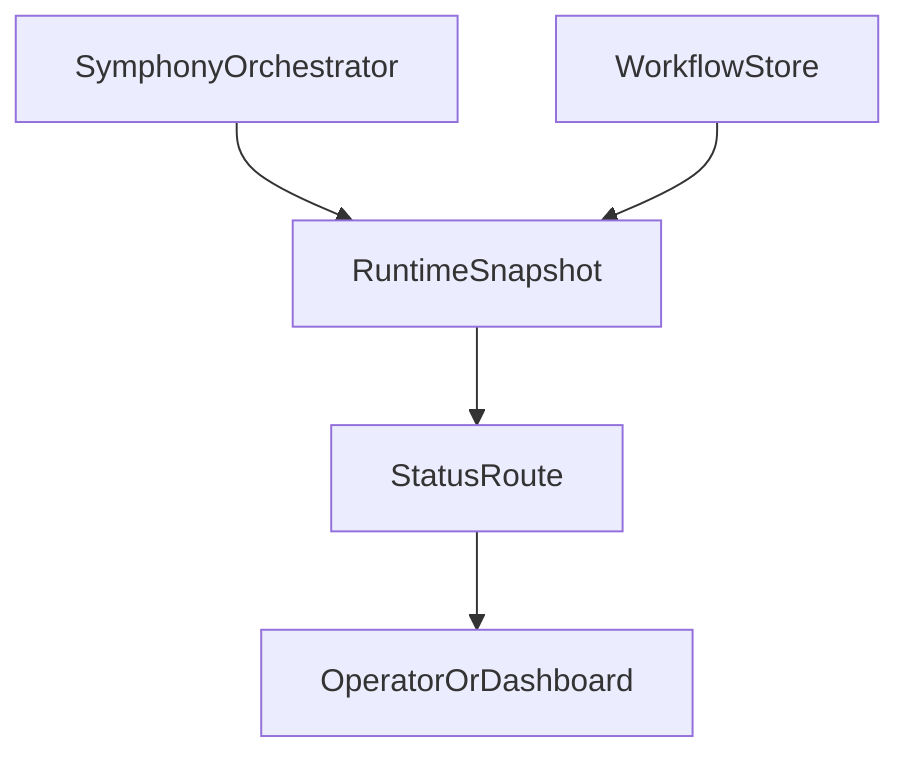

# Phase 6: Status Surface

## Goal
Preserve responsiveness as a product feature by exposing a lightweight operator status surface that makes running work, retries, token burn, last event, and next refresh immediately visible.

## Specification
### Problem Statement
Symphony feels responsive because operators can tell what is happening right now. The current codebase has partial runtime state, but it does not yet expose that state as a deliberate product surface.

### Functional Requirements
- Expose a lightweight status surface showing:
  - running issues
  - queued retries with due time
  - latest Claude event per issue
  - runtime duration
  - token usage
  - next poll / refresh timing
  - optional dashboard URL or terminal snapshot hook
- Read from orchestrator snapshot/state rather than reconstructing status ad hoc.
- Be safe to call frequently by operators or dashboards.

### Non-Functional Requirements
- Response shape must be stable and JSON-serializable.
- Endpoint must be read-only.
- Data should be current enough to reinforce a responsive product feel.

### Acceptance Criteria
- Operators can see active issues and retry queues immediately.
- Token usage and last event are visible per running issue.
- Idle state returns a well-formed empty snapshot.

## Pseudocode
```text
GET current orchestrator snapshot
GET current workflow status and refresh timing
BUILD response object:
  workflow validity
  active issues
  retries
  latest events
  token totals
  next poll time

RETURN JSON response
```

## Architecture
### Primary Components
- `src/execution/orchestrator/symphony-orchestrator.ts`
  - Source of serializable runtime snapshot data.
- `src/webhook-gateway/webhook-router.ts`
  - Host for a status endpoint or route registration.
- `src/index.ts`
  - Wires the status dependencies into the server.

### Data Flow


### Design Decisions
- Prefer one concise status payload over many partial endpoints.
- Keep the status surface read-only and projection-based.
- Treat operator visibility as part of the core product, not polish.

## Refinement
### Implementation Notes
- Add a serializable snapshot method if the orchestrator still exposes raw maps only.
- Include workflow validity and next refresh timing beside issue runtime data.
- Keep route logic thin; orchestration state should stay in the orchestrator and workflow store.

### File Targets
- `src/execution/orchestrator/symphony-orchestrator.ts`
- `src/webhook-gateway/webhook-router.ts`
- `src/index.ts`

### Exact Tests
- `tests/webhook-gateway/webhook-router.test.ts`
  - Returns workflow validity, active issue count, retry entries, latest error details, and next refresh timing.
  - Returns HTTP 200 with a well-formed empty snapshot when idle.
- `tests/execution/symphony-orchestrator.test.ts`
  - Verifies snapshot serialization includes last event, token totals, and retry due times.

### Risks
- If the snapshot is too tied to internal mutable state, the API will become brittle.
- Missing refresh timing will make the surface feel less responsive even if data is correct.
- Overly verbose payloads will make operator scanning slower rather than faster.
